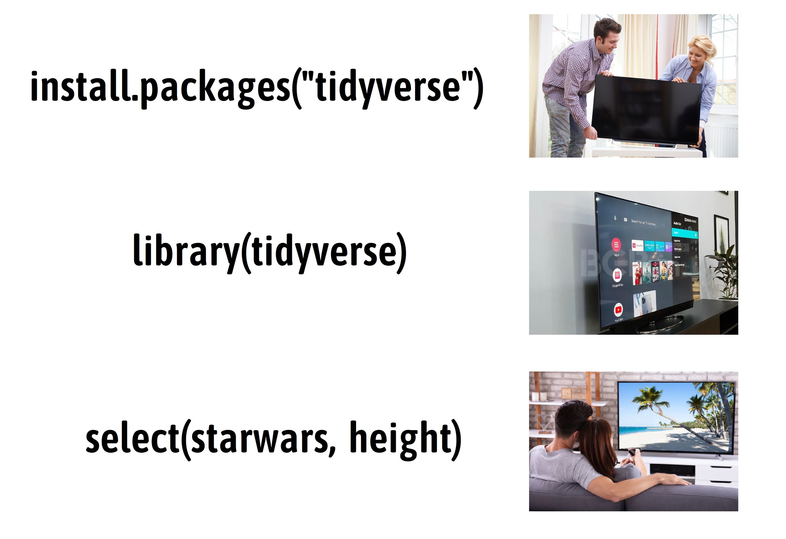

# 函数 {#baseR-functions}

上一节课我们认识了向量操作符，体会到了向量化操作的强大，事实上，向量操作符是一种函数。R 语言的强大就在于它拥有丰富的函数，这里的函数和我们高中数学中的函数 `y = f(x)` 没什么区别。

## 基础函数

R 语言内置了很多统计函数，比如对于向量`x`

```r
x <- c(2, 7, 8, 9, 3)
```

打印向量`x`

```r
print(x)
```

```
## [1] 2 7 8 9 3
```

求开方

```r
sqrt(x)
```

```
## [1] 1.414214 2.645751 2.828427 3.000000 1.732051
```

求自然对数

```r
log(x)
```

```
## [1] 0.6931472 1.9459101 2.0794415 2.1972246 1.0986123
```


求向量元素之和

```r
sum(x)
```

```
## [1] 29
```

求向量元素的均值

```r
mean(x)
```

```
## [1] 5.8
```

求向量元素的标准差

```r
sd(x)
```

```
## [1] 3.114482
```

找出向量元素中的最小值

```r
min(x)
```

```
## [1] 2
```

找出向量元素中的最大值

```r
max(x)
```

```
## [1] 9
```

计算向量元素的个数

```r
length(x)
```

```
## [1] 5
```

对向量元素大小排序

```r
sort(x)
```

```
## [1] 2 3 7 8 9
```

找出向量元素的唯一值，就是给出**去重后**的数据

```r
a <- c("a", "b", "b", "c", "d", "a", "g", "c", "d")
unique(a)
```

```
## [1] "a" "b" "c" "d" "g"
```

给出向量的分位数

```r
quantile(x)
```

```
##   0%  25%  50%  75% 100% 
##    2    3    7    8    9
```

判断是否为数值型/字符串型

```r
is.numeric(x)
```

```
## [1] TRUE
```

```r
is.character(x)
```

```
## [1] FALSE
```

转化成字符串型

```r
as.character(x)
```

```
## [1] "2" "7" "8" "9" "3"
```

```r
# as.logical(x)
# as.numeric(x)
```

判断向量元素是否大于5

```r
x <- c(2, 7, 8, 9, 3)
x > 5
```

```
## [1] FALSE  TRUE  TRUE  TRUE FALSE
```


```r
ifelse(x > 5, "big", "small")
```

```
## [1] "small" "big"   "big"   "big"   "small"
```

## 向量的函数

用在向量上的函数，可以分为向量化函数(vectorized function)和汇总类函数(summary function)，

<div class="figure" style="text-align: center">

<p class="caption">(\#fig:unnamed-chunk-18)这两类函数在 Tidyverse 框架中，应用非常广泛。</p>
</div>

当然，也会有例外，比如`unique()`函数，它返回的向量通常不会与输入的向量等长，既不属于向量化函数，也不属于汇总类函数。


## 课堂练习

- 向量`x <- c(2, 7, 8, 9, 3)`的平方，加上5

```r
x <- c(2, 7, 8, 9, 3)
x^2 + 5
```

```
## [1]  9 54 69 86 14
```

- 向量的元素减去其均值

```r
x <- c(2, 7, 8, 9, 3)
x - mean(x)
```

```
## [1] -3.8  1.2  2.2  3.2 -2.8
```


- 向量标准化（向量减去其均值之后，除以标准差）

```r
x <- c(2, 7, 8, 9, 3)
(x - mean(x)) / sd(x)
```

```
## [1] -1.2201065  0.3852968  0.7063774  1.0274581 -0.8990258
```


- 如果想对更多的向量，也做标准化处理呢？


```r
y <- c(1, 5, 7, 8, 9, 3)
(y - mean(y)) / sd(y)
```

```
## [1] -1.4599928 -0.1622214  0.4866643  0.8111071  1.1355499 -0.8111071
```


```r
z <- c(4, 7, 7, 8, 9, 3, 9, 6)
(z - mean(z)) / sd(z)
```

```
## [1] -1.1932699  0.1704671  0.1704671  0.6250461  1.0796251 -1.6478489  1.0796251
## [8] -0.2841119
```


简单重复比较累，有没有一劳永逸的方法？


## 自定义函数


```r
my_std <- function(x) {
   res <- (x - mean(x)) / sd(x)
   return(res)
 }
```


```r
my_std <- function(x) {
   ...
}
```


- 创建，由`function(...)`创建一个函数
- 参数，由`(...)` 里指定参数，比如`function(x)`中的参数为 `x` 
- 函数主体，一般情况下，在`function(...)`后跟随一对大括号`{ }`，在大括号里声明具体函数功能，在代码最后一行，可以用`return`返回计算后的值。当然，如果函数的目的只是返回最后一行代码计算的值，这个`return`可以省略。
- 函数名，`function() { }` 赋值给新对象，比如这里的`my_std`，相当于给函数取一名字，方便以后使用。
- 函数调用，现在这个函数名字叫`my_std`，需要用这个函数的时候，就调用它的名字`my_std()`。


```r
my_std(x = c(1, 5, 7, 8, 9, 3)) # 或者
my_std(c(1, 5, 7, 8, 9, 3))     # 或者

input <- c(1, 5, 7, 8, 9, 3)
my_std(input)
```


## 使用宏包的函数

### 安装宏包与使用宏包

安装宏包 `install.packages("dplyr")` 相当于你买了一台电视机，安装一次就够了; 加载 `library("dplyr")`相当于你每次要看电视，就需要插上电、打开电视的动作，运行`library("dplyr")`才能用里面的函数。



各种宏包也为我们准备了不同的函数，我们在使用前一般会先加载该宏包，比如后面章节我们会用的`dplyr`宏包中的`select()`函数，它用于选取数据框的某列

```r
library(dplyr)

select(starwars, height)
```

### 指定函数的所属宏包

但是，其它宏包可能也有`select()`函数，比如`MASS`和`skimr`，如果同时加载了`dplyr`，`MASS`和`skimr`三个宏包，在程序中使用`select()`函数，就会造成混淆和报错。这个时候就需要给每个函数指定是来源哪个宏包，具体方法就是在宏包和函数之间添加`::`，比如`dplyr::select()`，`skimr::select()` 或者`MASS::select()`。


至此，我们接触到了三类函数

- **内置的函数**
- **自定义的函数**
- **宏包的函数**


## 如何获取帮助


- 记住和学习所有的函数几乎是不可能的
- 打开函数的帮助页面(`Rstudio`右下面板的`Help`选项卡)


```r
?sqrt
?gather
?ggplot2
```

比如：


## 习题

1. 根据方差的数学表达式，写出**方差**的计算函数，并与基础函数`var()`的结果对比

$$
\mathrm{Var}(x) = \frac{1}{n - 1} \sum_{i=1}^n (x_i - \bar{x}) ^2 
$$


2. 自定义函数，它的作用是将输入的身高height(cm)与体重weight(kg)计算之后的BMI结果返回，BMI的计算公式为：

$$
\mathrm{BMI} = \frac{weight(kg)}{height(m)^2}  
$$

```r
get_bmi <- function(height, weight) {
  # ...
}
get_bmi(175, 65)
```


3. 对于给定的向量 `vector`和阈值`threshold`，求出`vector`中所有大于该阈值的元素的均值


```r
mean_above_threshod <- function(vector, threshold) {
  
}
```


## 阅读

- 推荐您阅读(https://r4ds.had.co.nz/functions.html)
