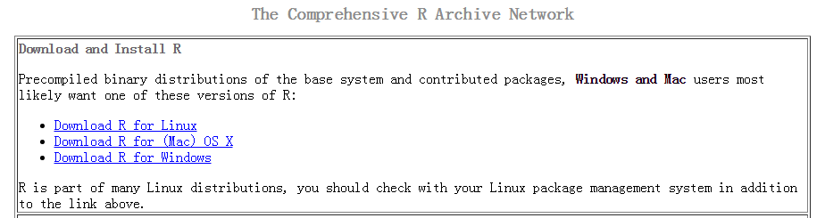
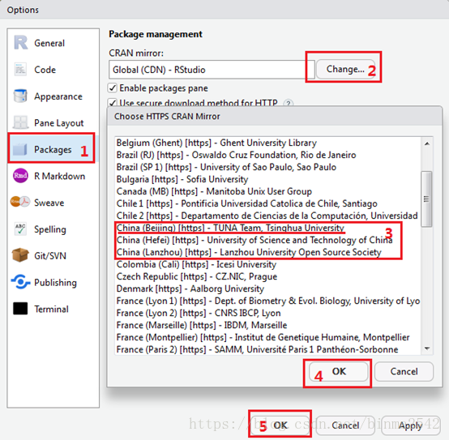
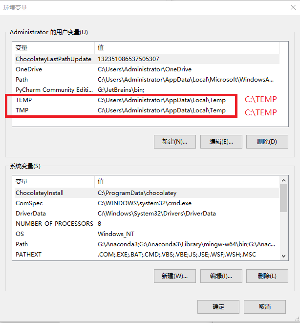
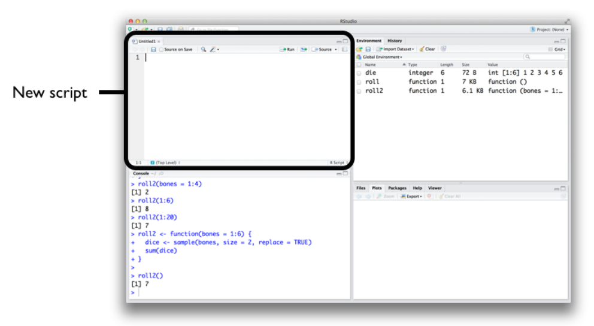

# 安装与环境配置 {#baseR-install}

R 软件是一个自由、开源软件平台，具有统计分析、可视化和编程的强大功能。
你可以从这里免费[下载](https://cloud.r-project.org)。 为了更好的使用 R 软件，我推荐大家使用 [RStudio](https://www.rstudio.com/products/rstudio)这个 IDE。这里有个[在线教程](https://www.rstudio.com/online-learning/)帮助我们熟悉 R 和 RStudio。


## 安装 R 和 Rstudio

R 软件是一个自由、开源软件平台，具有统计分析、可视化和编程的强大功能。


### 第一步安装 R

我们从官方网站[http://cran.r-project.org](https://cloud.r-project.org)免费下载。



以MS Windows操作系统为例。R的主网站在https://www.r-project.org/。 从CRAN的镜像网站下载软件，其中一个镜像如http://mirror.bjtu.edu.cn/cran/。 选“Download R for Windows-base-Download R 4.3.2 for windows” (4.3.2是版本号，应下载网站上给出的最新版本）链接进行下载。

### 第二步安装 R 编译工具
安装 R 编译工具用于在R中调用C、C++和Fortran程序代码时需要用的编译工具。

#### Windows
在“Download R for Windows”链接的页面， 除了base为R的安装程序，还有Rtools链接，需要安装。

#### macOS (compile R for macOS <https://mac.R-project.org/tools>)
This release uses Xcode 14.2/14.3 and GNU Fortran 12.2. If you wish to compile R packages which contain Fortran code, you may need to download the corresponding GNU Fortran compiler from https://mac.R-project.org/tools. 

最好能够详细查看编译工具的说明（<https://mac.R-project.org/tools>），主要包含下面三个：

 - Xcode： the use of X11 (including tcltk) requires XQuartz (version 2.8.5 or later). Always re-install XQuartz when upgrading your macOS to a new major version
 
 - GNU Fortran compiler
 
 - OpenMP page （并行）


### 第三步安装 RStudio

为了更好的使用 R 软件，我推荐大家使用 [RStudio](https://www.rstudio.com/products/rstudio) IDE。因此，安装完 R 后，还需要安装 [RStudio](https://www.rstudio.com/products/rstudio)。
同样，我们从官方网站[https://www.rstudio.com/download](https://www.rstudio.com/download)下载`RStudio Desktop`版并安装，如果你是苹果系统的用户，选择苹果系统对应的rstudio版本即可。


::: {.rmdnote}
这里**重要提示**：

- 电脑开机时的用户名不要用中文，否则Rstudio会杠上中文用户名
- 尽量安装在非系统盘，比如，可以选择安装在D盘
- 安装路径不要有中文和空格。比如，这样就比较好
   - `D:/R`
   - `D:/Rstudio`

:::

### 配置`~/.R/Makevars`以及`~/.zshrc` (可选；单细胞数据分析时可能需要，至少在MacOS系统是需要的)
#### 配置`~/.R/Makevars`使得R可以调用clang和openmp（请根据自己的系统来配置）
以下是我本人在MacOS系统中的配置：

LDFLAGS += -L/opt/homebrew/opt/libomp/lib -lomp

CPPFLAGS += -I/opt/homebrew/opt/libomp/include -Xpreprocessor -fopenmp

#### 配置.zshrc使得R可以调用python module
配置anaconda，使得R可以调用python module。需要通过修改.zshrc 文件。

MacOS可以通过在terminal中输入`open ~/.zshrc ` 来打开。

参考：https://superuser.com/questions/886132/where-is-the-zshrc-file-on-mac


### 必要的配置(可选)

为了让R和Rstudio 的运行更顺畅，可以做以下必要的设置

- 宏包安装设置成国内镜像`Tools > Global options`



- 如果打开代码是乱码，可以试试修改如下设置`Tools > Global options`


- Windows系统中文用户名的问题

::: {.rmdnote}

当前Rstudio对中文支持不太好，如果windows系统用户名为中文，Rstudio安装完成后可能无法正常使用。这里有一个解决办法

- 右键`**我的电脑** -> 属性 -> 高级系统设置 -> 高级 -> 环境变量`
- 把TEMP 和TMP都修改为，`C:\TEMP`
- 在C盘目录下创建文件夹TEMP
- 重启Rstudio 

:::



最好的办法是，用英文注册一个新用户，在新用户名下，重新安装R和Rstudio

### 包的安装与加载

R 语言的强大还在于各种宏包，一般在[The Comprehensive R Archive Network (CRAN)](https://cran.r-project.org)、[Bioconductor](https://bioconductor.org/install/)和Github下载安装。

可以用如下命令安装宏包:

- 从CRAN安装和加载单个包

```r
install.packages("tidyverse")
library(tidyverse)
```

- 从Bioconductor安装单个包

```r
install.packages("BiocManager")
BiocManager::install("clusterProfiler")
```

- 从Github安装单个包

```r
install.packages("devtools")
devtools::install_github("jinworks/CellChat")
```

- 从source codes安装单个包

下载源代码（需要是.tar.gz文件），然后在Rstudio中输入

```r
install.packages(path_to_file, type = 'source', rep = NULL) # The path_to_file would represent the full path and file name
```

请参考[R建包网页](https://kbroman.org/pkg_primer/pages/build.html)从source codes编译、安装 单个包.

- 安装多个包

```r
my_packages <- c("tidyvers", "patchwork", "readxl", "devtools", "knitr")
install.packages(my_packages)
```


## 开始 

安装完毕后，从windows`开始菜单`，点开`rstudio`图标，就打开了rstudio的窗口，界面效果如下


RStudio 的用户界面十分友好，

- 左上角是`Editor`窗口，负责编写代码
- 左下角是`Console`窗口，可以键入命令
- 右上角是`Environment`和`History`窗口，保存当前存储的数据和历史命令记录等
- 右下角是`Plot`和`Help`窗口，用于显示绘制图片和帮助文档

想要运行一段R代码，可以在Console内键入 R 代码，然后回车即可。比如我们键入`1 + 1` 并按回车后，将显示如下结果

```r
1 + 1
```

```
## [1] 2
```


## 脚本

运行代码最好的方法是，通过Rstudio菜单栏依此点击`File > New File > R Script` 来创建一个新的脚本。**脚本**文件通常以`.R`作为文件的后缀名。脚本文件的好处在于我们可以在其它时间修改和重新运行它。养成用脚本写代码的习惯后，今后所有的工作都有案可查，并且具有可重复性。




如何运行脚本呢？方法有很多

  


- 按住`Ctrl`键，然后按回车键`Enter`，可以运行**光标所在行**的代码
- 点击 `Run`, 运行**光标所在行**的代码
- 点击 `Source`，从头到尾运行当前脚本**全部**代码
- 鼠标选中多行代码，然后点击 `Run`或者`Ctrl + Enter`


## 注释

可以让阅读者更易理解代码，一般会在脚本中添加注释，R 语言注释符号为 `#`。 注释会被编译器忽略掉，不会影响代码的执行。


```r
1 + 3 # this is my comment
```
