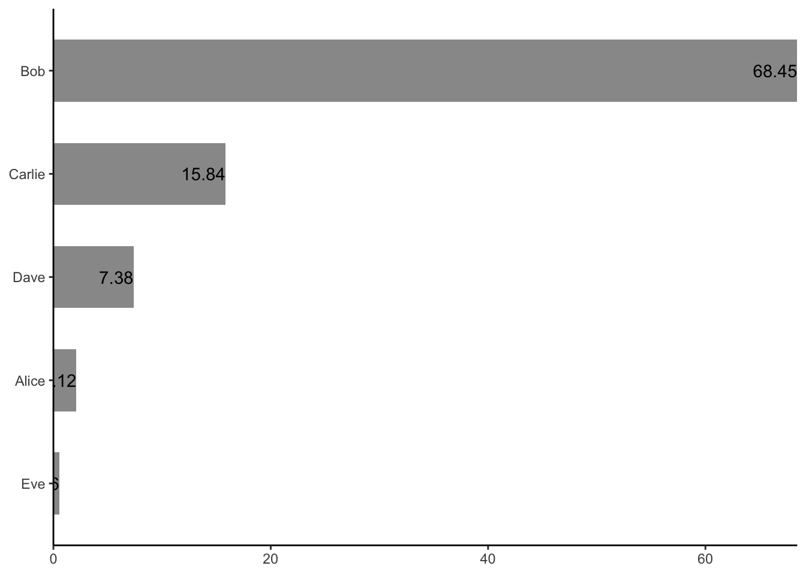
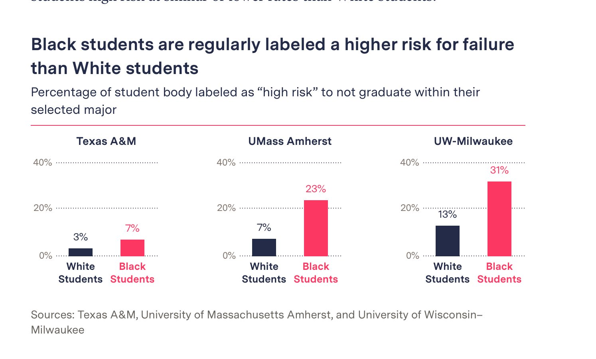
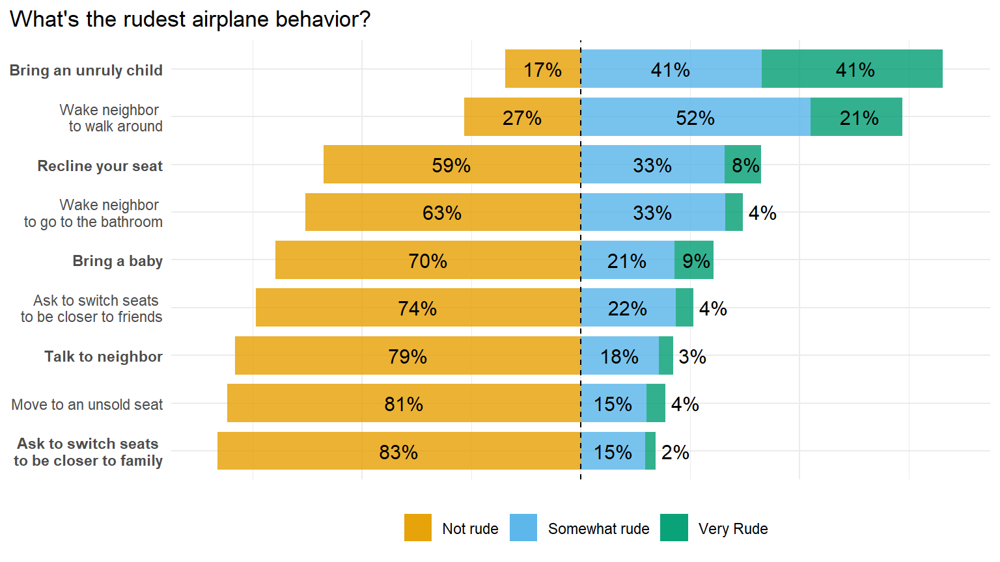
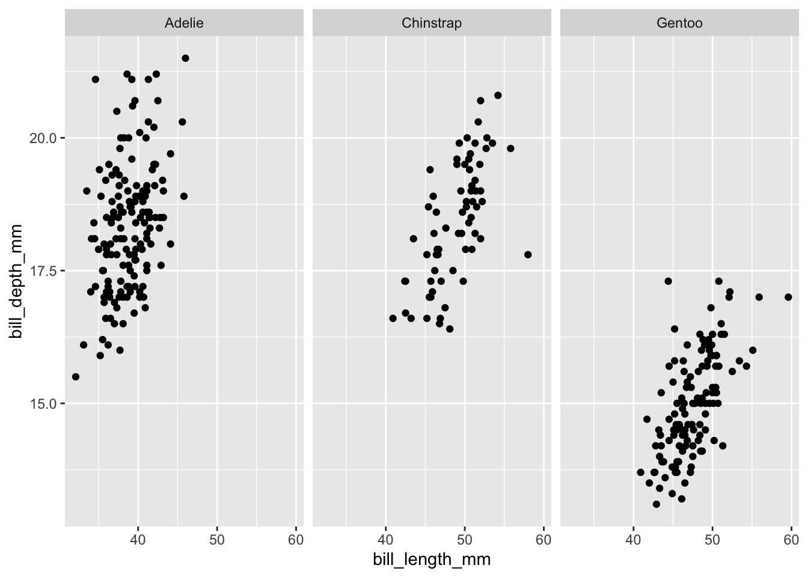
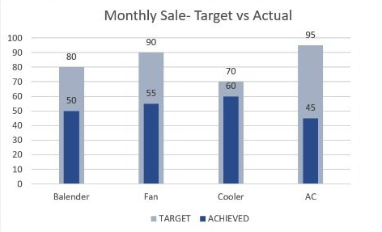
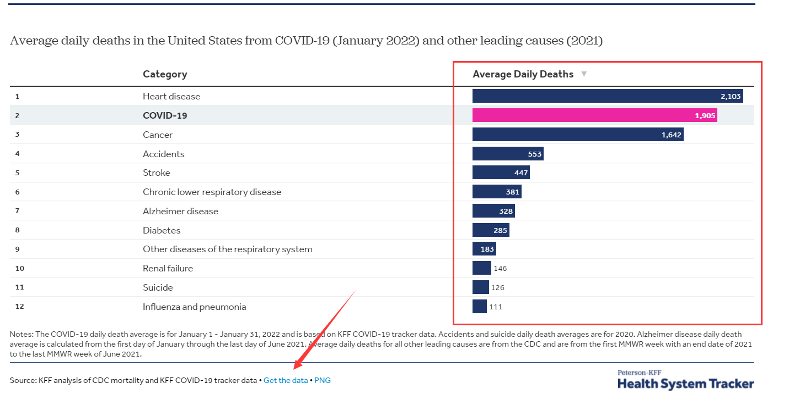
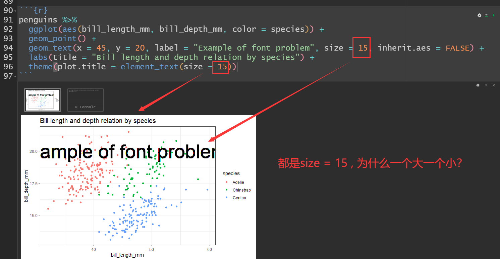

# 一天一练 {#eda-practice}

> “表达我自己比被人喜欢更重要。” 加油

尽可能的在tidyverse的框架下完成

```r
library(tidyverse)
```

```
## ── Attaching core tidyverse packages ──────────────────────── tidyverse 2.0.0 ──
## ✔ dplyr     1.1.3     ✔ readr     2.1.4
## ✔ forcats   1.0.0     ✔ stringr   1.5.0
## ✔ ggplot2   3.4.3     ✔ tibble    3.2.1
## ✔ lubridate 1.9.2     ✔ tidyr     1.3.0
## ✔ purrr     1.0.2     
## ── Conflicts ────────────────────────────────────────── tidyverse_conflicts() ──
## ✖ dplyr::filter() masks stats::filter()
## ✖ dplyr::lag()    masks stats::lag()
## ℹ Use the conflicted package (<http://conflicted.r-lib.org/>) to force all conflicts to become errors
```

## day01

旋转数据框，要求

```r
d <- tibble::tribble(
    ~name, ~chinese, ~math, ~physics, ~english, ~music, ~sport,
  "Alice",      88L,   63L,      98L,      89L,    85L,    72L,
    "Bob",      85L,   75L,      85L,      82L,    73L,    83L,
  "Carlo",      95L,   98L,      75L,      75L,    68L,    84L
  )
d
```

```
## # A tibble: 3 × 7
##   name  chinese  math physics english music sport
##   <chr>   <int> <int>   <int>   <int> <int> <int>
## 1 Alice      88    63      98      89    85    72
## 2 Bob        85    75      85      82    73    83
## 3 Carlo      95    98      75      75    68    84
```

变成

```
## # A tibble: 6 × 4
##   discipline Alice   Bob Carlo
##   <chr>      <int> <int> <int>
## 1 chinese       88    85    95
## 2 math          63    75    98
## 3 physics       98    85    75
## 4 english       89    82    75
## 5 music         85    73    68
## 6 sport         72    83    84
```


## day02

排序，要求按照score从大往小排，但希望all是最下面一行。

```r
d <- 
  tibble::tribble(
  ~name, ~score,
   "a1",     2,
   "a2",     5,
   "a3",     3,
   "a4",     7,
   "a5",     6,
  "all",    23
  )
```


变成

```
## # A tibble: 6 × 2
##   name  score
##   <chr> <dbl>
## 1 a4        7
## 2 a5        6
## 3 a2        5
## 4 a3        3
## 5 a1        2
## 6 all      23
```


## day03

统计每位同学，成绩高于各科均值的个数，

```r
d <- tibble::tribble(
  ~name, ~chinese, ~engish, ~physics, ~sport, ~music,
  "Aice", 85, 56, 56, 54, 78,
  "Bob", 75, 78, 77, 56, 69,
  "Cake", 69, 41, 88, 89, 59,
  "Dave", 90, 66, 74, 82, 60,
  "Eve", 68, 85, 75, 69, 21,
  "Fod", 77, 74, 62, 74, 88,
  "Gimme", 56, 88, 75, 69, 34
)
d
```

```
## # A tibble: 7 × 6
##   name  chinese engish physics sport music
##   <chr>   <dbl>  <dbl>   <dbl> <dbl> <dbl>
## 1 Aice       85     56      56    54    78
## 2 Bob        75     78      77    56    69
## 3 Cake       69     41      88    89    59
## 4 Dave       90     66      74    82    60
## 5 Eve        68     85      75    69    21
## 6 Fod        77     74      62    74    88
## 7 Gimme      56     88      75    69    34
```


变成

```
## # A tibble: 7 × 7
##   name  chinese engish physics sport music num_above_mean
##   <chr>   <dbl>  <dbl>   <dbl> <dbl> <dbl>          <int>
## 1 Aice       85     56      56    54    78              2
## 2 Bob        75     78      77    56    69              4
## 3 Cake       69     41      88    89    59              3
## 4 Dave       90     66      74    82    60              4
## 5 Eve        68     85      75    69    21              2
## 6 Fod        77     74      62    74    88              4
## 7 Gimme      56     88      75    69    34              2
```


## day04

```r
data <- tribble(
  ~id, ~corr, ~period,
  1, 0, "a",
  1, 0, "b",
  2, 0, "a",
  2, 1, "b",
  3, 1, "a",
  3, 0, "b",
  4, 1, "a",
  4, 1, "b"
)
data
```

```
## # A tibble: 8 × 3
##      id  corr period
##   <dbl> <dbl> <chr> 
## 1     1     0 a     
## 2     1     0 b     
## 3     2     0 a     
## 4     2     1 b     
## 5     3     1 a     
## 6     3     0 b     
## 7     4     1 a     
## 8     4     1 b
```

先按id分组，

- 如果corr中都是0  就"none"
- 如果corr中都是1  就"both"
- 如果corr中只有一个1，就输出1对应period


```
## # A tibble: 4 × 2
##      id resp_period
##   <dbl> <chr>      
## 1     1 none       
## 2     2 b          
## 3     3 a          
## 4     4 both
```

## day05

图中柱子上的字体没有显示完整，请改进。

```r
d <- tibble::tribble(
     ~name, ~value,
   "Alice",    2.12,
     "Bob",   68.45,
  "Carlie",   15.84,
    "Dave",    7.38,
     "Eve",    0.56
  )


d %>% 
  ggplot(aes(x = value, y = fct_reorder(name, value)) ) +
  geom_col(width = 0.6, fill = "gray60") +
  geom_text(aes(label = value, hjust =1))  +
  theme_classic() +
  scale_x_continuous(expand = c(0, 0)) +
  labs(x = NULL, y = NULL)
```




## day06

我看到新闻有[一张图](https://themarkup.org/news/2021/03/02/major-universities-are-using-race-as-a-high-impact-predictor-of-student-success)很漂亮，您能重复出来？




数据在下面


```r
d <- tibble::tribble(
            ~area,           ~group, ~value,
      "Texas A&M", "white Students",   0.03,
      "Texas A&M", "Black Students",   0.07,
  "Umass Amherst", "white Students",   0.07,
  "Umass Amherst", "Black Students",   0.23,
   "UW-Milwaukee", "white Students",   0.13,
   "UW-Milwaukee", "Black Students",   0.31
  )
d
```

```
## # A tibble: 6 × 3
##   area          group          value
##   <chr>         <chr>          <dbl>
## 1 Texas A&M     white Students  0.03
## 2 Texas A&M     Black Students  0.07
## 3 Umass Amherst white Students  0.07
## 4 Umass Amherst Black Students  0.23
## 5 UW-Milwaukee  white Students  0.13
## 6 UW-Milwaukee  Black Students  0.31
```

提示，可以把图片拉到https://color.adobe.com/zh/create/image-gradient 获取颜色值，比如

```r
colorspace::swatchplot(c("#F42F5D","#252A4A"))
```


## day07

告诉你一个你可能不知道的事情，`summarise()`一定要输出数据框吗？


```r
iris %>%
  nest_by(Species) %>%
  rowwise() %>%
  summarise(
    write_csv(data, glue("{Species}.cvs"))
    )
```


## day08

运行以下两个代码，结果和你期望的一样？为什么？


```r
mtcars %>%
  group_by(cyl) %>%
  summarise(
    broom::tidy(lm(mpg ~ wt, data = .))
  )

mtcars %>%
  group_by(cyl) %>%
  summarise(
    broom::tidy(lm(mpg ~ wt))
  )
```


## day09

缺失值替换，数值型的缺失值用0替换，字符串型的用""

```r
df <- tibble(
  x = c(NA, 1, 2),
  y = c("a", NA, NA),
)
```


## day10

六年级的年级主任让学生提交自己所在的班级号，看到结果后，他很苦恼，你能帮忙他规整下？

```r
d <- tibble::tribble(
               ~id,
               "2",
              "03",
       "小学2015级2班",
       "小学2015级3班",
            "0601",
            "0602",
          "201502",
          "201604",
            "6.10",
            "6.11",
             "6.5",
             "6.8",
              "06"
       )
d
```

```
## # A tibble: 13 × 1
##    id           
##    <chr>        
##  1 2            
##  2 03           
##  3 小学2015级2班
##  4 小学2015级3班
##  5 0601         
##  6 0602         
##  7 201502       
##  8 201604       
##  9 6.10         
## 10 6.11         
## 11 6.5          
## 12 6.8          
## 13 06
```


## day11

每行以x为均值生成一个随机数, 以下哪个是正确的？


```r
# A
tibble(x = 1:5) %>% 
  mutate(normal_mean = rnorm(1, mean = x))     

# B
tibble(x = 1:5) %>% 
  mutate(normal_mean = rnorm(n(), mean = x))

# C
tibble(x = 1:5) %>% 
  mutate(normal_mean = map_dbl(x, ~rnorm(1, mean = .)))

# D
tibble(x = 1:5) %>% 
  mutate(normal_mean = map_dbl(x, ~rnorm(1), mean = .))

# E
tibble(x = 1:5) %>% 
  rowwise() %>% 
  mutate(normal_mean = rnorm(1, mean = x))
```


## day12


`purrr::map()`的辅助参数放里面和放外面，有什么区别？


```r
x <- rep(0, 3)
plus <- function(x, y) x + y

map_dbl(x, plus, runif(1))
map_dbl(x, ~plus(.x, runif(1)) )
```


## day13

计算每天水分和食物的所占比例， 比如第一天water和food都是10.0，那么各自比例都是50%.

```r
d <- tibble::tribble(
  ~water, ~food,
  10.0,   10.0,
  12.1,   10.3,
  13.5,   19.1,
  17.4,   16.0,
  25.8,   15.6,
  27.4,   19.8
)
d
```

```
## # A tibble: 6 × 2
##   water  food
##   <dbl> <dbl>
## 1  10    10  
## 2  12.1  10.3
## 3  13.5  19.1
## 4  17.4  16  
## 5  25.8  15.6
## 6  27.4  19.8
```


## day14

以下代码哪些会给出相同的图形?


```r
tb <- tibble(
     x = rep(c(1,2,3), 2),
     y = c(1:6),
    group = c(rep("group1", 3),  rep("group2", 3) )

)
```


1. `ggplot(tb, aes(x,y)) + geom_line()`
2. `ggplot(tb, aes(x,y,group=group)) + geom_line()` 
3. `ggplot(tb, aes(x,y,fill=group)) + geom_line()` 
4. `ggplot(tb, aes(x,y,color=group)) + geom_line()` 


## day15

重复这张图



数据在下面


```r
library(tidyverse)
raw_df <- read_rds(here::here("demo_data", "rude_behavior_in_airplane.rds")) 
raw_df
```

```
## # A tibble: 27 × 3
##    type                                           judgment          n
##    <chr>                                          <chr>         <dbl>
##  1 "Bring a baby"                                 Not rude        592
##  2 "Bring a baby"                                 Very Rude        75
##  3 "Bring a baby"                                 Somewhat rude   182
##  4 "Bring an unruly child"                        Not rude        147
##  5 "Bring an unruly child"                        Very Rude       351
##  6 "Bring an unruly child"                        Somewhat rude   351
##  7 "Recline your seat"                            Not rude        502
##  8 "Recline your seat"                            Very Rude        71
##  9 "Recline your seat"                            Somewhat rude   281
## 10 "Ask to switch seats \nto be closer to family" Not rude        705
## # ℹ 17 more rows
```


## day16


```r
library(tidyverse)

genes <- paste0("gene", 1:5) %>% set_names(.)
genes
```

```
##   gene1   gene2   gene3   gene4   gene5 
## "gene1" "gene2" "gene3" "gene4" "gene5"
```

这里有一个列表，其元素`list1, list2, list3`是3个长度不等的向量

```r
big_list <- list(  
  list1 = paste0("gene", c(1:2, 6:7)), 
  list2 = paste0("gene", c(6:7)), 
  list3 = paste0("gene", c(1, 4:7))
  )
big_list
```

```
## $list1
## [1] "gene1" "gene2" "gene6" "gene7"
## 
## $list2
## [1] "gene6" "gene7"
## 
## $list3
## [1] "gene1" "gene4" "gene5" "gene6" "gene7"
```

需求：想看下 gene1, gene2, gene3, gene4, gene5 是否出现在 `list1, list2, list3`中，并统计成下表


```
## # A tibble: 5 × 4
##   name  list1 list2 list3
##   <chr> <int> <int> <int>
## 1 gene1     1     0     1
## 2 gene2     1     0     0
## 3 gene3     0     0     0
## 4 gene4     0     0     1
## 5 gene5     0     0     1
```


## day17

统计每支球队，比赛次数以及赢得比赛的分数之和

```r
games <- tibble::tribble(
  ~team, ~outcome, ~points,
    "A",    "Win",      3,
    "A",   "Lose",      1,
    "A",    "Win",      1,
    "A",    "Win",      2,
    "B",    "Win",      1,
    "B",    "Win",      1,
    "B",   "Lose",      3,
    "B",   "Lose",      1
  )
games
```

```
## # A tibble: 8 × 3
##   team  outcome points
##   <chr> <chr>    <dbl>
## 1 A     Win          3
## 2 A     Lose         1
## 3 A     Win          1
## 4 A     Win          2
## 5 B     Win          1
## 6 B     Win          1
## 7 B     Lose         3
## 8 B     Lose         1
```


## day18

只让gentoo这个分面，背景色高亮

```r
library(tidyverse)
library(palmerpenguins)

penguins %>%
  ggplot(aes(x = bill_length_mm, y = bill_depth_mm)) +
  geom_point() +
  facet_wrap(vars(species), ncol = 3)
```




## day19

用下面的数据，画出柱中柱效果

```r
tb <- tibble::tribble(
      ~group,   ~product, ~sale,
    "Target", "Balender",   80,
    "Target",      "Fan",   90,
    "Target",   "Cooler",   70,
    "Target",       "AC",   95,
  "Achieved", "Balender",   50,
  "Achieved",      "Fan",   55,
  "Achieved",   "Cooler",   60,
  "Achieved",       "AC",   45
  )

tb
```

```
## # A tibble: 8 × 3
##   group    product   sale
##   <chr>    <chr>    <dbl>
## 1 Target   Balender    80
## 2 Target   Fan         90
## 3 Target   Cooler      70
## 4 Target   AC          95
## 5 Achieved Balender    50
## 6 Achieved Fan         55
## 7 Achieved Cooler      60
## 8 Achieved AC          45
```




## day20

修改列名，在m或者f的后面加下划线

```r
tb <- tibble::tribble(
  ~id, ~new_ep_m014, ~newrel_f1524, ~new_sp_f65, ~new_ep_m3544,
   1L,           3L,            2L,          4L,            1L,
   2L,           4L,            4L,          5L,            2L,
   3L,           5L,            5L,          6L,            6L,
   4L,           6L,            6L,          7L,            8L
  )
tb
```

```
## # A tibble: 4 × 5
##      id new_ep_m014 newrel_f1524 new_sp_f65 new_ep_m3544
##   <int>       <int>        <int>      <int>        <int>
## 1     1           3            2          4            1
## 2     2           4            4          5            2
## 3     3           5            5          6            6
## 4     4           6            6          7            8
```


## day21


```r
library(tidyverse)

df <- tibble(
  x = 1:10,
  y = sample(c("a", "b"), size = 10, replace = TRUE)
)
df
```

```
## # A tibble: 10 × 2
##        x y    
##    <int> <chr>
##  1     1 a    
##  2     2 a    
##  3     3 a    
##  4     4 a    
##  5     5 a    
##  6     6 a    
##  7     7 b    
##  8     8 b    
##  9     9 b    
## 10    10 a
```

说出这里三行代码分别的含义

```r
df %>%
  summarise(
    y1 = sum(x),              
    y2 = sum(y == "a"),       
    y3 = sum(x[y == "a"])     
  )
```


## day22

看中这个张图<https://www.healthsystemtracker.org/brief/covid-19-leading-cause-of-death-ranking/>，数据也是可以下载的




## day23

问题，这两张图一样吗？


```r
library(dplyr)
library(ggplot2)

df <- data.frame(
  x = rnorm(n = 2 * 500),
  group = rep(c("1", "2"), each = 500)
)

ggplot(df) +
  geom_line(
    mapping = aes(x = x, group = group),
    stat = "density",
    alpha = 0.5
  )

ggplot(df) +
  stat_density(
    mapping = aes(x = x, group = group),
    geom = "line",
    alpha = 0.5
  )
```


## day24


```r
1 == "1"
```

结果会是什么？

1. TRUE 
2. FALSE 
3. Error 
4. NULL


## day25

如何让连续在一起的类别，分为一组。比如这里的x变量，分为4组


```r
df <- tibble::tribble(
  ~x,   ~y,
  "a",   2,
  "a",   3,
  "b",   4,
  "b",   5,
  "a",   1,
  "a",   3,
  "a",   2,
  "b",   3
  )

df
```

```
## # A tibble: 8 × 2
##   x         y
##   <chr> <dbl>
## 1 a         2
## 2 a         3
## 3 b         4
## 4 b         5
## 5 a         1
## 6 a         3
## 7 a         2
## 8 b         3
```


## day26

都是size = 15 为什么一个大一个小呢？




<!-- 因为在theme里 size 的单位是pts，而在geom_text()里size 的单位是mm, 所以一个大一个小。 -->


<!-- 两者的关系是1 pt = 0.35 mm，ggplot2还很贴心地提供了彼此转换关系的量 -->
<!-- ```{r} -->
<!-- ggplot2::.pt -->
<!-- ``` -->

<!-- 所以 -->

<!-- - from pt to mm : mm = pt / .pt ， 比如 15 / 2.845276 = 5.27 -->
<!-- - from mm to pt : pt = mm * .pt ， 比如 5.27 * 2.845276 = 15 -->

<!-- 上面的代码可以改写为 -->
<!-- ```{r, eval=FALSE, include=FALSE} -->
<!-- penguins %>% -->
<!--   ggplot(aes(bill_length_mm, bill_depth_mm, color = species)) + -->
<!--   geom_point() + -->
<!--   geom_text(x = 45, y = 20, label = "Example of font problem", size = 15/.pt, inherit.aes = FALSE) + -->
<!--   labs(title = "Bill length and depth relation by species") + -->
<!--   theme(plot.title = element_text(size = 15)) -->
<!-- ``` -->

<!-- ```{r, eval=FALSE, include=FALSE} -->
<!-- penguins %>% -->
<!--   ggplot(aes(bill_length_mm, bill_depth_mm, color = species)) + -->
<!--   geom_point() + -->
<!--   geom_text(x = 45, y = 20, label = "Example of font problem", size = 15, inherit.aes = FALSE) + -->
<!--   labs(title = "Bill length and depth relation by species") + -->
<!--   theme(plot.title = element_text(size = 15 * .pt)) -->
<!-- ``` -->


## day27


```r
ww <- c("ab1", "vf2", "aaba2", "ddb76", "d8p")
ww
```

```
## [1] "ab1"   "vf2"   "aaba2" "ddb76" "d8p"
```

- 找出数值
- 找出b后紧跟的数值
- 找出b后面出现的数值


```
## Warning in rm(d, data, df, my_function, text_subtitle, genes, big_list, :
## object 'text_subtitle' not found
```


