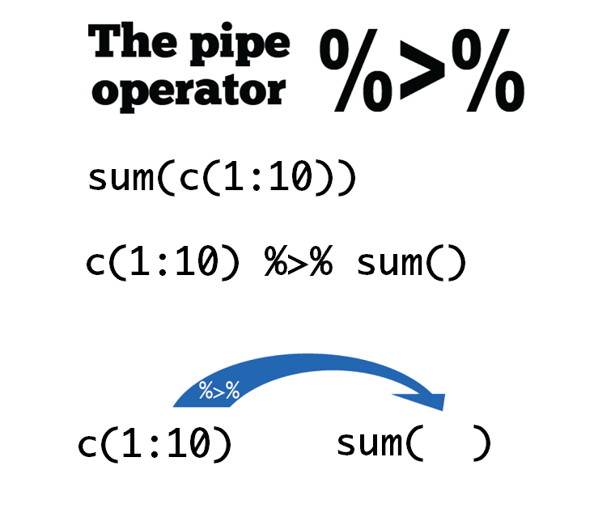

# 数据处理 {#tidyverse-dplyr}

我们用一个应用场景，复习上两章讲的数据类型和数据结构等概念。比如，这里有一个表格

- 如果构建学生们的成绩，需要用到是**向量**，一列就可以了。
- 如果构建学生的各科成绩，需要用到是**矩阵**，因为此时需要多列，不同的列对应不同的科目。
- 如果构建学生综合信息（性别，年龄，各科成绩，是否喜欢R），需要用到的是**列表**，因为除了各科成绩列，还需要其它数据类型的列。
- 当然，构建学生综合信息的表格，最好还是用**数据框**，因为这些信息是等长的，而且符合人的理解习惯, 所以，我们会经常和数据框打交道。


数据框的特性很丰富，在于：

- 第一，它是列表的特殊形式，可以存储不同类型的数据。
- 第二，它要求每个元素长度必须一致，因此长的像矩阵。
- 第三，它的每个元素就是一个是向量，而R语言有个优良特性，就是向量化操作，因此，使用函数非常方便。


本章我们介绍tidyverse里被誉为“瑞士军刀”的数据处理的工具dplyr宏包。首先，我们加载该宏包

```r
library(dplyr)
```


dplyr 定义了数据处理的规范语法，其中主要包含以下10个主要的函数。


* `mutate()`, `select()`, `rename()` , `filter()` 
* `summarise()`, `group_by()`, `arrange()`
* `left_join()`, `right_join()`， `full_join()`


我们用一个案例依次讲解这些函数的功能。假定这里有三位同学的英语和数学成绩


```r
df <- readr::read_csv(here::here("demo_data", "score.csv"))
df
```

```
## # A tibble: 6 × 3
##   name  type    score
##   <chr> <chr>   <dbl>
## 1 Alice english    80
## 2 Alice math       60
## 3 Bob   english    70
## 4 Bob   math       69
## 5 Carol english    80
## 6 Carol math       90
```


## 新增一列 `mutate()` 

同学们表现不错，分别得到额外的奖励分 `c(2, 5, 9, 8, 5, 6)`


```r
reward <- c(2, 5, 9, 8, 5, 6)
```


那么，如何把奖励分加到表中呢？用`mutate()`函数可以这样写\index{mutate()} 
第一次觉得这个单词很陌生，可以理解为modify


```r
mutate(.data = df, extra = reward) 
```

```
## # A tibble: 6 × 4
##   name  type    score extra
##   <chr> <chr>   <dbl> <dbl>
## 1 Alice english    80     2
## 2 Alice math       60     5
## 3 Bob   english    70     9
## 4 Bob   math       69     8
## 5 Carol english    80     5
## 6 Carol math       90     6
```


`mutate()`函数的功能是给数据框新增一列，使用语法为 `mutate(.data = df, name = value)`：


- 第一个参数`.data`，接受要处理的数据框，比如这里的`df`。
- 第二个参数是`Name-value`对, 比如`extra = reward`，
   - 等号左边，是我们为新增的一列取的名字，比如这里的`extra`，因为数据框每一列都是要有名字的；
   - 等号右边，是打算并入数据框的向量，比如这里的`reward`，它是装着学生成绩的**向量**。注意，向量的长度，
      - 要么与数据框的行数等长，比如这里向量长度为6；
      - 要么长度为1，即，新增的这一列所有的值都是一样的(循环补齐机制)。
     
<!-- 如果向量的长度与数据框的行数相等，那么刚好与数据框的行对齐，相当于给每行增加了一个新值。 -->


因为`mutate()`函数处理的是数据框，并且固定放置在第一位置上（**几乎所有dplyr的函数都是这样要求的**），所以这个`.data`可以偷懒不写，直接写`mutate(df, extra = reward)`。另外，如果想同时新增多个列，只需要提供多个`Name-value`对即可，比如

```r
mutate(df, 
       extra1 = c(2, 5, 9, 8, 5, 6),
       extra2 = c(1, 2, 3, 3, 2, 1),
       extra3 = c(8)
       ) 
```

## 管道 `%>%`

实际运用中，我们经常要使用函数，比如计算向量`c(1:10)`所有元素值的和


```r
sum(c(1:10))
```

```
## [1] 55
```


现在有个与上面的等价的写法，就是使用管道操作符[ `%>%` ](https://magrittr.tidyverse.org/)。\index{\%>\%} 

```r
c(1:10) %>% sum()
```

```
## [1] 55
```

这条语句的意思是`f(x)` 写成 `x %>% f()`，这里向量 `c(1:10)` 通过管道操作符 `%>%` ，传递到函数`sum()`的第一个参数位置，即`sum(c(1:10))`， 这个 `%>%` 管道操作符还是很形象的。在Windows系统中可以通过`Ctrl + Shift + M` 快捷键产生 `%>%`，苹果系统对应的快捷键是`Cmd + Shift + M`。


通过下图图示可以看到管道操作符就像生产线上的传送带一样，将数据运入函数中。



当执行多个函数操作的时候，管道操作符 `%>%` 就显得格外方便，代码可读性也更强。比如


```r
sqrt(sum(abs(c(-10:10))))
```

```
## [1] 10.48809
```

使用管道操作符

```r
c(-10:10) %>% abs() %>% sum() %>% sqrt()
```

```
## [1] 10.48809
```


那么，之前增加学生奖励分成绩的语句 `mutate(df, extra = reward)`，也可以使用管道


```r
# using `%>%`
df %>% mutate(extra = reward) 
```

```
## # A tibble: 6 × 4
##   name  type    score extra
##   <chr> <chr>   <dbl> <dbl>
## 1 Alice english    80     2
## 2 Alice math       60     5
## 3 Bob   english    70     9
## 4 Bob   math       69     8
## 5 Carol english    80     5
## 6 Carol math       90     6
```

是不是很赞^[从R4.1开始，支持 `|>` 作为管道符号，但大家似乎已经习惯与 `%>% `]。


## 向量函数与mutate()

`mutate()`函数的本质还是第 \@ref(baseR-operators) 章介绍向量函数和向量化操作，只不过是换作在数据框中完成，这样更能形成“据框进、数据框出”的思维，方便快捷地构思并统计任务^[https://dcl-prog.stanford.edu/data-structure-basics.html ]。

比如，我们想计算每位同学分数的平方，然后构建数据框新的一列，我们可以用第 \@ref(baseR-functions) 章函数的方法，自定义`calc_square()`函数


```r
calc_square <- function(x) {
  x^2
}

df %>% 
  mutate(new_col = calc_square(score))
```

```
## # A tibble: 6 × 4
##   name  type    score new_col
##   <chr> <chr>   <dbl>   <dbl>
## 1 Alice english    80    6400
## 2 Alice math       60    3600
## 3 Bob   english    70    4900
## 4 Bob   math       69    4761
## 5 Carol english    80    6400
## 6 Carol math       90    8100
```


在`mutate()`中引用数据框的某一**列名**，实际上是引用了列名对应的**整个向量**, 所以，这里我们传递`score`到`calc_square()`，就是把整个`score`向量传递给`calc_square()`.


几何算符（这里是平方）是向量化的，因此`calc_square()`会对输入的`score`向量，返回一个等长的向量。


`mutate()` 拿到这个新的向量后，就在原有数据框中添加新的一列`new_col`


## 保存为新的数据框

现在有个问题，此时 `df` 有没发生变化？是否包含额外的奖励分呢？
事实上，此时`df`并没有发生改变，还是原来的状态。如果需要保存计算结果，就需要把计算的结果重新赋值给新的对象，当然，也可以赋值给`df`本身，这样`df`存储的数据就**更新**为计算后的结果。


好，现在我们把添加奖励分、计算总成绩和保存结果这三个步骤一气呵成的完成

```r
df_new <- df %>% 
  mutate(extra = reward) %>% 
  mutate(total = score + extra)
```


```r
df_new
```

```
## # A tibble: 6 × 5
##   name  type    score extra total
##   <chr> <chr>   <dbl> <dbl> <dbl>
## 1 Alice english    80     2    82
## 2 Alice math       60     5    65
## 3 Bob   english    70     9    79
## 4 Bob   math       69     8    77
## 5 Carol english    80     5    85
## 6 Carol math       90     6    96
```


## 选取列 `select()`

`select() `顾名思义选择，就是选择数据框的某一列，或者某几列。


我们以上面学生成绩的数据框为例，这里选择`name`列 \index{select()} 


```r
df_new %>% select(name)
```

```
## # A tibble: 6 × 1
##   name 
##   <chr>
## 1 Alice
## 2 Alice
## 3 Bob  
## 4 Bob  
## 5 Carol
## 6 Carol
```

注意，结果是只有一列的数据框（仍然数据框喔，**数据框进数据框出是dplyr函数的第二个特点**）。如果要选取多列，就再多写几个列名就行了

```r
df_new %>% select(name, extra)
```

```
## # A tibble: 6 × 2
##   name  extra
##   <chr> <dbl>
## 1 Alice     2
## 2 Alice     5
## 3 Bob       9
## 4 Bob       8
## 5 Carol     5
## 6 Carol     6
```

```r
df_new %>% select(name, score, extra, total)
```

```
## # A tibble: 6 × 4
##   name  score extra total
##   <chr> <dbl> <dbl> <dbl>
## 1 Alice    80     2    82
## 2 Alice    60     5    65
## 3 Bob      70     9    79
## 4 Bob      69     8    77
## 5 Carol    80     5    85
## 6 Carol    90     6    96
```


如果不想要某列，可以在变量前面加 `-` 或者 `!`，两者的结果是一样的。

```r
df_new %>% select(-type)
```

```
## # A tibble: 6 × 4
##   name  score extra total
##   <chr> <dbl> <dbl> <dbl>
## 1 Alice    80     2    82
## 2 Alice    60     5    65
## 3 Bob      70     9    79
## 4 Bob      69     8    77
## 5 Carol    80     5    85
## 6 Carol    90     6    96
```

```r
df_new %>% select(!type)
```

```
## # A tibble: 6 × 4
##   name  score extra total
##   <chr> <dbl> <dbl> <dbl>
## 1 Alice    80     2    82
## 2 Alice    60     5    65
## 3 Bob      70     9    79
## 4 Bob      69     8    77
## 5 Carol    80     5    85
## 6 Carol    90     6    96
```


也可以通过位置索引进行选取，比如选取头三列

```r
df_new %>% select(1, 2, 3)
```

```
## # A tibble: 6 × 3
##   name  type    score
##   <chr> <chr>   <dbl>
## 1 Alice english    80
## 2 Alice math       60
## 3 Bob   english    70
## 4 Bob   math       69
## 5 Carol english    80
## 6 Carol math       90
```

```r
df_new %>% select(2:3)
```

```
## # A tibble: 6 × 2
##   type    score
##   <chr>   <dbl>
## 1 english    80
## 2 math       60
## 3 english    70
## 4 math       69
## 5 english    80
## 6 math       90
```


如果要选取数据框的列很多，我们也可以先观察列名的特征，用特定的函数进行选取，比如选取以"s"开头的列

```r
df_new %>% select(starts_with("s"))
```

```
## # A tibble: 6 × 1
##   score
##   <dbl>
## 1    80
## 2    60
## 3    70
## 4    69
## 5    80
## 6    90
```

选取以"e"结尾的列

```r
df_new %>% select(ends_with("e"))
```

```
## # A tibble: 6 × 3
##   name  type    score
##   <chr> <chr>   <dbl>
## 1 Alice english    80
## 2 Alice math       60
## 3 Bob   english    70
## 4 Bob   math       69
## 5 Carol english    80
## 6 Carol math       90
```

选取含有以"score"的列

```r
df_new %>% select(contains("score"))
```

```
## # A tibble: 6 × 1
##   score
##   <dbl>
## 1    80
## 2    60
## 3    70
## 4    69
## 5    80
## 6    90
```

当然，也可以通过变量的类型来选取，比如选取所有字符串类型的列

```r
df_new %>% select(where(is.character))
```

```
## # A tibble: 6 × 2
##   name  type   
##   <chr> <chr>  
## 1 Alice english
## 2 Alice math   
## 3 Bob   english
## 4 Bob   math   
## 5 Carol english
## 6 Carol math
```

选取所有数值类型的列

```r
df_new %>% select(where(is.numeric))
```

```
## # A tibble: 6 × 3
##   score extra total
##   <dbl> <dbl> <dbl>
## 1    80     2    82
## 2    60     5    65
## 3    70     9    79
## 4    69     8    77
## 5    80     5    85
## 6    90     6    96
```


选取所有数值类型的并且以"s"开头的列

```r
df_new %>% select(where(is.numeric) & starts_with("t"))
```

```
## # A tibble: 6 × 1
##   total
##   <dbl>
## 1    82
## 2    65
## 3    79
## 4    77
## 5    85
## 6    96
```

选取以"s"开头或者以"e"结尾的列

```r
df_new %>% select(starts_with("s") | ends_with("e"))
```

```
## # A tibble: 6 × 3
##   score name  type   
##   <dbl> <chr> <chr>  
## 1    80 Alice english
## 2    60 Alice math   
## 3    70 Bob   english
## 4    69 Bob   math   
## 5    80 Carol english
## 6    90 Carol math
```


```r
df_new %>% select(!starts_with("s"))
```

```
## # A tibble: 6 × 4
##   name  type    extra total
##   <chr> <chr>   <dbl> <dbl>
## 1 Alice english     2    82
## 2 Alice math        5    65
## 3 Bob   english     9    79
## 4 Bob   math        8    77
## 5 Carol english     5    85
## 6 Carol math        6    96
```


## 修改列名 `rename()`

用`rename()`修改列的名字, 具体方法是`rename(.data, new_name = old_name)`，和`mutate()`一样，等号左边是新的变量名，右边是已经存在的变量名（这是dplyr函数的第三个特征^[有一个例外是recode函数]）。比如，我们这里将`total`修改为`total_score`
\index{rename()} 


```r
df_new %>% 
  select(name, type, total) %>% 
  rename(total_score = total)
```

```
## # A tibble: 6 × 3
##   name  type    total_score
##   <chr> <chr>         <dbl>
## 1 Alice english          82
## 2 Alice math             65
## 3 Bob   english          79
## 4 Bob   math             77
## 5 Carol english          85
## 6 Carol math             96
```


## 筛选 `filter()`


前面`select()`是列方向的选择，而用`filter()`函数，我们可以对数据框**行方向**进行筛选，选出符合特定条件的某些行。


注意，这里filter()函数不是字面上“过滤掉”的意思，而是保留符合条件的行，也就说keep，不是drop的意思。 第一次会有一点点迷惑，我相信习惯就好了。

比如这里把**成绩等于90分的**同学筛选出来 \index{filter()} 。

```r
df_new %>% filter(score = 90)
```

```
## Error in `filter()`:
## ! We detected a named input.
## ℹ This usually means that you've used `=` instead of `==`.
## ℹ Did you mean `score == 90`?
```

注意，这里判断是否相等要使用 `==` 而不是 `=`

```r
df_new %>% filter(score == 90)
```

```
## # A tibble: 1 × 5
##   name  type  score extra total
##   <chr> <chr> <dbl> <dbl> <dbl>
## 1 Carol math     90     6    96
```

R提供了其他比较关系的算符: `<`, `>`, `<=`, `>=`, `==` (equal), `!=` (not equal), `%in%`, `is.na()` 和 `!is.na()` . 

比如把**成绩大于等于80分的**同学筛选出来

```r
df_new %>% filter(score >= 80)
```

```
## # A tibble: 3 × 5
##   name  type    score extra total
##   <chr> <chr>   <dbl> <dbl> <dbl>
## 1 Alice english    80     2    82
## 2 Carol english    80     5    85
## 3 Carol math       90     6    96
```


也可以限定多个条件进行筛选, 比如，限定英语学科，同时要求成绩高于75分的所有条目筛选出来


```r
df_new %>% filter(type == "english", score >= 75)
```

```
## # A tibble: 2 × 5
##   name  type    score extra total
##   <chr> <chr>   <dbl> <dbl> <dbl>
## 1 Alice english    80     2    82
## 2 Carol english    80     5    85
```

也就说，逗号分隔的两个条件都要满足。

### 常见的错误
`filter()`函数两个常见的错误:

- 把 "=" 误认为 "=="

```r
df_new %>% filter(type = "english")   # error
df_new %>% filter(type == "english")
```

- 忘记引号

```r
df_new %>% filter(type == english)   # error
df_new %>% filter(type == "english")
```


### 逻辑算符

多个参数的情形，本质上是逻辑与的关系，每个条件都返回TRUE


```r
df_new %>% filter(type == "english" & score >= 75)
```

```
## # A tibble: 2 × 5
##   name  type    score extra total
##   <chr> <chr>   <dbl> <dbl> <dbl>
## 1 Alice english    80     2    82
## 2 Carol english    80     5    85
```
当然也可以使用其他的布尔算符 (& is “and,” | is “or,” and ! is “not.”).

比如，以下代码找出成绩等于70**或者**等于90的行

```r
df_new %>% filter(score == 70 | score == 90)
```

```
## # A tibble: 2 × 5
##   name  type    score extra total
##   <chr> <chr>   <dbl> <dbl> <dbl>
## 1 Bob   english    70     9    79
## 2 Carol math       90     6    96
```
在filter()中有一个非常有效的等价方法，即使用 `x %in% y`，意思是**如果当前x的值是向量y的一员，那么就选出当前行**，因此，我们可以重写上面代码:


```r
df_new %>% filter(score %in% c(70, 90))
```

```
## # A tibble: 2 × 5
##   name  type    score extra total
##   <chr> <chr>   <dbl> <dbl> <dbl>
## 1 Bob   english    70     9    79
## 2 Carol math       90     6    96
```

当然还可以配合一些函数使用，比如把最高分的同学找出来

```r
df_new %>% filter(score == max(score))
```

```
## # A tibble: 1 × 5
##   name  type  score extra total
##   <chr> <chr> <dbl> <dbl> <dbl>
## 1 Carol math     90     6    96
```

把成绩高于均值的找出来

```r
df_new %>% filter(score > mean(score))
```

```
## # A tibble: 3 × 5
##   name  type    score extra total
##   <chr> <chr>   <dbl> <dbl> <dbl>
## 1 Alice english    80     2    82
## 2 Carol english    80     5    85
## 3 Carol math       90     6    96
```


## 统计汇总 `summarise()`


`summarise() `函数非常强大，主要用于统计汇总，往往与其他函数配合使用，比如计算所有同学考试成绩的均值 \index{summarise()} 


```r
df_new %>% summarise(mean_score = mean(score))
```

```
## # A tibble: 1 × 1
##   mean_score
##        <dbl>
## 1       74.8
```


计算所有同学的考试成绩的标准差

```r
df_new %>% summarise( sd_score = sd(score))
```

```
## # A tibble: 1 × 1
##   sd_score
##      <dbl>
## 1     10.6
```


还可以同时完成多个统计

```r
df_new %>% summarise(
  mean_score   = mean(score),
  median_score = median(score),
  n            = n(),
  sum          = sum(score)
)
```

```
## # A tibble: 1 × 4
##   mean_score median_score     n   sum
##        <dbl>        <dbl> <int> <dbl>
## 1       74.8           75     6   449
```

`summarise()` 与 `mutate()` 一样，也是创建新的变量（新的一列），仍然遵循**等号左边是新的列名，等号右边是基于原变量的统计**。
区别在于，`mutate()`是在原数据框的基础上增加新的一列；而`summarise()`在成立的新的数据框中创建一列。


## 分组统计 `group_by()` 

实际运用中，`summarise() `函数往往配合`group_by()`一起使用，即，先分组再统计。


比如，我们想统计每个学生的平均成绩，那么就需要先按照学生`name`分组，然后每组求平均 \index{group\_by()} 


```r
df_new %>%
  group_by(name) %>%
  summarise(
    mean_score = mean(total),
    sd_score   = sd(total)
  )
```

```
## # A tibble: 3 × 3
##   name  mean_score sd_score
##   <chr>      <dbl>    <dbl>
## 1 Alice       73.5    12.0 
## 2 Bob         78       1.41
## 3 Carol       90.5     7.78
```


## 排序 `arrange()`


`arrange()`这个很好理解的，就是按照某个变量排序。


比如我们按照考试总成绩从低到高排序，然后输出 \index{arrange()} 


```r
df_new %>% arrange(total)
```

```
## # A tibble: 6 × 5
##   name  type    score extra total
##   <chr> <chr>   <dbl> <dbl> <dbl>
## 1 Alice math       60     5    65
## 2 Bob   math       69     8    77
## 3 Bob   english    70     9    79
## 4 Alice english    80     2    82
## 5 Carol english    80     5    85
## 6 Carol math       90     6    96
```


默认情况是从小到大排序，如果从高到低降序排序呢，有两种方法，第一种方法是在用于排序的变量前面加 `-` 号，

```r
df_new %>% arrange(-total)
```

```
## # A tibble: 6 × 5
##   name  type    score extra total
##   <chr> <chr>   <dbl> <dbl> <dbl>
## 1 Carol math       90     6    96
## 2 Carol english    80     5    85
## 3 Alice english    80     2    82
## 4 Bob   english    70     9    79
## 5 Bob   math       69     8    77
## 6 Alice math       60     5    65
```


第二种方法可读性更强些，需要使用`desc()`函数

```r
df_new %>% arrange(desc(total))
```

```
## # A tibble: 6 × 5
##   name  type    score extra total
##   <chr> <chr>   <dbl> <dbl> <dbl>
## 1 Carol math       90     6    96
## 2 Carol english    80     5    85
## 3 Alice english    80     2    82
## 4 Bob   english    70     9    79
## 5 Bob   math       69     8    77
## 6 Alice math       60     5    65
```


也可对多个变量依次排序。比如，我们先按学科类型排序，然后按照成绩从高到底降序排列

```r
df_new %>% 
  arrange(type, desc(total))
```

```
## # A tibble: 6 × 5
##   name  type    score extra total
##   <chr> <chr>   <dbl> <dbl> <dbl>
## 1 Carol english    80     5    85
## 2 Alice english    80     2    82
## 3 Bob   english    70     9    79
## 4 Carol math       90     6    96
## 5 Bob   math       69     8    77
## 6 Alice math       60     5    65
```


## 左联结 `left_join()` 

实际操作中，也会遇到数据框合并的情形。假定我们已经统计了每个同学的平均成绩，存放在`df1`

\index{left\_join()}


```r
df1 <- df_new %>% 
  group_by(name) %>% 
  summarise( 
    mean_score = mean(total) 
  )
df1
```

```
## # A tibble: 3 × 2
##   name  mean_score
##   <chr>      <dbl>
## 1 Alice       73.5
## 2 Bob         78  
## 3 Carol       90.5
```


现在我们又有新一个数据框`df2`，它包含一些同学的年龄信息

```r
df2 <- tibble(
      name = c("Alice", "Bob", "Dave"),
      age =  c(12, 13, 14)
)
df2
```

```
## # A tibble: 3 × 2
##   name    age
##   <chr> <dbl>
## 1 Alice    12
## 2 Bob      13
## 3 Dave     14
```


可以使用 `left_join()`函数 把两个数据框`df1`和`df2`合并连接在一起。这两个数据框是通过姓名`name`连接的，因此需要指定`by = "name"`，代码如下


```r
left_join(df1, df2, by = "name")
```

```
## # A tibble: 3 × 3
##   name  mean_score   age
##   <chr>      <dbl> <dbl>
## 1 Alice       73.5    12
## 2 Bob         78      13
## 3 Carol       90.5    NA
```


用管道 `%>%`写，可读性更强


```r
# using %>%
df1 %>% left_join(df2, by = "name")
```

```
## # A tibble: 3 × 3
##   name  mean_score   age
##   <chr>      <dbl> <dbl>
## 1 Alice       73.5    12
## 2 Bob         78      13
## 3 Carol       90.5    NA
```

大家注意到最后一行Carol的年龄是`NA`， 大家想想为什么呢？


## 右联结 `right_join()`


我们再试试`right_join()`  \index{right\_join()}


```r
df1 %>% dplyr::right_join(df2, by = "name")
```

```
## # A tibble: 3 × 3
##   name  mean_score   age
##   <chr>      <dbl> <dbl>
## 1 Alice       73.5    12
## 2 Bob         78      13
## 3 Dave        NA      14
```

Carol同学的信息没有显示？ Dave 同学显示了但没有考试成绩？大家想想又为什么呢？


事实上，答案就在函数的名字上，`left_join()`是左联结，即以左边数据框`df1`中的学生姓名`name`为准，在右边数据框`df2`里，有`Alice`和`Bob`的年龄，那么就对应联结过来，没有`Carol`的年龄，自然就为缺失值`NA`。

`right_join()`是右联结，要以右边数据框`df2`中的学生姓名`name`为准，即`Alice`，`Bob`和`Dave`，而`df1`只有`Alice`和`Bob`的信息，没有`Dave`的信息，因此`Dave`对应的成绩为`NA`。

## 满联结 `full_join()`

有时候，我们不想丢失项，可以使用`full_join()`，该函数确保条目是完整的，信息缺失的地方为`NA`。 \index{full\_join()} 


```r
df1 %>% full_join(df2, by = "name")
```

```
## # A tibble: 4 × 3
##   name  mean_score   age
##   <chr>      <dbl> <dbl>
## 1 Alice       73.5    12
## 2 Bob         78      13
## 3 Carol       90.5    NA
## 4 Dave        NA      14
```


## 内联结`inner_join()`

只保留name条目相同地记录

```r
df1 %>% inner_join(df2, by = "name")
```

```
## # A tibble: 2 × 3
##   name  mean_score   age
##   <chr>      <dbl> <dbl>
## 1 Alice       73.5    12
## 2 Bob         78      13
```

## 筛选联结

筛选联结，有两个`semi_join(x, y)`和`anti_join(x, y)`，函数不改变数据框`x`的变量的数量，主要影响的是`x`的观测，也就说会剔除一些行，其功能类似`filter()`

- 半联结`semi_join(x, y)`，保留name与df2的name相一致的所有行

```r
df1 %>% semi_join(df2, by = "name")
```

```
## # A tibble: 2 × 2
##   name  mean_score
##   <chr>      <dbl>
## 1 Alice       73.5
## 2 Bob         78
```

可以看作对`df1`做筛选

```r
df1 %>% filter(
  name %in% df2$name
)
```

```
## # A tibble: 2 × 2
##   name  mean_score
##   <chr>      <dbl>
## 1 Alice       73.5
## 2 Bob         78
```


- 反联结`anti_join(x, y)`，丢弃name与df2的name相一致的所有行

```r
df1 %>% anti_join(df2, by = "name")
```

```
## # A tibble: 1 × 2
##   name  mean_score
##   <chr>      <dbl>
## 1 Carol       90.5
```

仍然可以看作对`df1`做筛选

```r
df1 %>% filter(
 ! name %in% df2$name
)
```

```
## # A tibble: 1 × 2
##   name  mean_score
##   <chr>      <dbl>
## 1 Carol       90.5
```

## 习题

1、总结 dplyr 系列函数的三个特征。

2、用本章中的数据框`df`运行以下代码，然后理解代码含义。


```r
df %>% 
  filter(score > mean(score))
```

3、 统计每位同学成绩高于75分的科目数


4、运行以下代码，比较差异在什么地方。

```r
df %>%
  group_by(name) %>%
  summarise(mean_score = mean(score))
```


```r
df %>%
  group_by(name) %>%
  mutate(mean_score = mean(score))
```

5、排序，要求按照score从大往小排，但希望all是最下面一行。

```
## # A tibble: 6 × 2
##   name  score
##   <chr> <dbl>
## 1 a1        2
## 2 a2        5
## 3 a3        3
## 4 a4        7
## 5 a5        6
## 6 all      23
```


## 延伸阅读

- 推荐[https://dplyr.tidyverse.org/](https://dplyr.tidyverse.org/).
- [cheatsheet](https://github.com/rstudio/cheatsheets/raw/master/data-transformation.pdf)
- <https://tidydatatutor.com/vis.html>
- 作业：读懂并运行下面的代码


```{=html}
<a href="data:text/x-markdown;base64,LS0tCnRpdGxlOiAnR29pbmcgZGVlcGVyIHdpdGggZHBseXInCmF1dGhvcjogIueOi+Wwj+S6jCAyMDE5MDAwMSIKZGF0ZTogImByIFN5cy5EYXRlKClgIgpvdXRwdXQ6CiAgcGRmX2RvY3VtZW50OiAKICAgIGxhdGV4X2VuZ2luZTogeGVsYXRleAogICAgZXh0cmFfZGVwZW5kZW5jaWVzOgogICAgICBjdGV4OiBVVEY4CiAgICBudW1iZXJfc2VjdGlvbnM6IHllcwpjbGFzc29wdGlvbnM6ICJoeXBlcnJlZiwgMTJwdCwgYTRwYXBlciIKLS0tCgoKIyBMb2FkaW5nIGRwbHlyIGFuZCB0aGUgbnljZmxpZ2h0czEzIGRhdGFzZXQKCmBgYHtyLCBtZXNzYWdlPUZBTFNFLCB3YXJuaW5nPUZBTFNFfQojIGxvYWQgcGFja2FnZXMKbGlicmFyeShkcGx5cikKbGlicmFyeShueWNmbGlnaHRzMTMpCgojIHByaW50IHRoZSBmbGlnaHRzIGRhdGFzZXQgZnJvbSBueWNmbGlnaHRzMTMKZmxpZ2h0cwpgYGAKCgoKIyBDaG9vc2luZyBjb2x1bW5zOiBzZWxlY3QsIHJlbmFtZQoKYGBge3J9CiMgYmVzaWRlcyBqdXN0IHVzaW5nIHNlbGVjdCgpIHRvIHBpY2sgY29sdW1ucy4uLgpmbGlnaHRzICU+JSBzZWxlY3QoY2FycmllciwgZmxpZ2h0KQoKIyAuLi55b3UgY2FuIHVzZSB0aGUgbWludXMgc2lnbiB0byBoaWRlIGNvbHVtbnMKZmxpZ2h0cyAlPiUgc2VsZWN0KC1tb250aCwgLWRheSkKYGBgCgpgYGB7ciByZXN1bHRzPSdoaWRlJ30KIyBoaWRlIGEgcmFuZ2Ugb2YgY29sdW1ucwpmbGlnaHRzICU+JSBzZWxlY3QoLShkZXBfdGltZTphcnJfZGVsYXkpKQoKIyBoaWRlIGFueSBjb2x1bW4gd2l0aCBhIG1hdGNoaW5nIG5hbWUKZmxpZ2h0cyAlPiUgc2VsZWN0KC1jb250YWlucygidGltZSIpKQpgYGAKCmBgYHtyfQojIHBpY2sgY29sdW1ucyB1c2luZyBhIGNoYXJhY3RlciB2ZWN0b3Igb2YgY29sdW1uIG5hbWVzCmNvbHMgPC0gYygiY2FycmllciIsICJmbGlnaHQiLCAidGFpbG51bSIpCmZsaWdodHMgJT4lIHNlbGVjdChhbGxfb2YoY29scykpCmBgYAoKCmBgYHtyfQojIGFsbF9vZigpICB2cyBhbnlfb2YoKQpjb2xzIDwtIGMoImNhcnJpZXIiLCAiZmxpZ2h0IiwgInRhaWxudW1fdHR0IikKZmxpZ2h0cyAlPiUgc2VsZWN0KGFueV9vZihjb2xzKSkKYGBgCgoKCmBgYHtyfQojIHNlbGVjdCgpIGNhbiBiZSB1c2VkIHRvIHJlbmFtZSBjb2x1bW5zLCB0aG91Z2ggYWxsIGNvbHVtbnMgbm90IG1lbnRpb25lZCBhcmUgZHJvcHBlZApmbGlnaHRzICU+JSBzZWxlY3QodGFpbCA9IHRhaWxudW0pCgojIHJlbmFtZSgpIGRvZXMgdGhlIHNhbWUgdGhpbmcsIGV4Y2VwdCBhbGwgY29sdW1ucyBub3QgbWVudGlvbmVkIGFyZSBrZXB0CmZsaWdodHMgJT4lIHJlbmFtZSh0YWlsID0gdGFpbG51bSkKYGBgCgoKIyBDaG9vc2luZyByb3dzOiBmaWx0ZXIsIGJldHdlZW4sIHNsaWNlLCBzbGljZV9zYW1wbGUsIHNsaWNlX21heCwgZGlzdGluY3QKCmBgYHtyfQojIGZpbHRlcigpIHN1cHBvcnRzIHRoZSB1c2Ugb2YgbXVsdGlwbGUgY29uZGl0aW9ucwpmbGlnaHRzICU+JSBmaWx0ZXIoZGVwX3RpbWUgPj0gNjAwLCBkZXBfdGltZSA8PSA2MDUpCmBgYAoKYGBge3IgcmVzdWx0cz0naGlkZSd9CiMgYmV0d2VlbigpIGlzIGEgY29uY2lzZSBhbHRlcm5hdGl2ZSBmb3IgZGV0ZXJtaW5nIGlmIG51bWVyaWMgdmFsdWVzIGZhbGwgaW4gYSByYW5nZQpmbGlnaHRzICU+JSBmaWx0ZXIoYmV0d2VlbihkZXBfdGltZSwgNjAwLCA2MDUpKQoKIyBzaWRlIG5vdGU6IGlzLm5hKCkgY2FuIGFsc28gYmUgdXNlZnVsIHdoZW4gZmlsdGVyaW5nCmZsaWdodHMgJT4lIGZpbHRlcighaXMubmEoZGVwX3RpbWUpKQpgYGAKCgpgYGB7cn0KIyBzbGljZSgpIGZpbHRlcnMgcm93cyBieSBwb3NpdGlvbgpmbGlnaHRzICU+JSBzbGljZSgxMDAwOjEwMDUpCgojIGtlZXAgdGhlIGZpcnN0IHRocmVlIHJvd3Mgd2l0aGluIGVhY2ggZ3JvdXAKZmxpZ2h0cyAlPiUKICBncm91cF9ieShtb250aCwgZGF5KSAlPiUKICBzbGljZSgxOjMpCgojIHNhbXBsZSB0aHJlZSByb3dzIGZyb20gZWFjaCBncm91cApmbGlnaHRzICU+JQogIGdyb3VwX2J5KG1vbnRoLCBkYXkpICU+JQogIHNsaWNlX3NhbXBsZShuID0gMykKCiMga2VlcCB0aHJlZSByb3dzIGZyb20gZWFjaCBncm91cCB3aXRoIHRoZSB0b3AgZGVwX2RlbGF5CmZsaWdodHMgJT4lCiAgZ3JvdXBfYnkobW9udGgsIGRheSkgJT4lCiAgc2xpY2VfbWF4KGRlcF9kZWxheSwgbiA9IDMpCgojIGFsc28gc29ydCBieSBkZXBfZGVsYXkgd2l0aGluIGVhY2ggZ3JvdXAKZmxpZ2h0cyAlPiUKICBncm91cF9ieShtb250aCwgZGF5KSAlPiUKICBzbGljZV9tYXgoZGVwX2RlbGF5LCBuID0gMykgJT4lCiAgYXJyYW5nZShkZXNjKGRlcF9kZWxheSkpCmBgYAoKCmBgYHtyfQojIHVuaXF1ZSByb3dzIGNhbiBiZSBpZGVudGlmaWVkIHVzaW5nIHVuaXF1ZSgpIGZyb20gYmFzZSBSCmZsaWdodHMgJT4lCiAgc2VsZWN0KG9yaWdpbiwgZGVzdCkgJT4lCiAgdW5pcXVlKCkKYGBgCgpgYGB7ciByZXN1bHRzPSdoaWRlJ30KIyBkcGx5ciBwcm92aWRlcyBhbiBhbHRlcm5hdGl2ZSB0aGF0IGlzIG1vcmUgImVmZmljaWVudCIKZmxpZ2h0cyAlPiUKICBzZWxlY3Qob3JpZ2luLCBkZXN0KSAlPiUKICBkaXN0aW5jdCgpCgojIHNpZGUgbm90ZTogd2hlbiBjaGFpbmluZywgeW91IGRvbid0IGhhdmUgdG8gaW5jbHVkZSB0aGUgcGFyZW50aGVzZXMgaWYgdGhlcmUgYXJlIG5vIGFyZ3VtZW50cwpmbGlnaHRzICU+JQogIHNlbGVjdChvcmlnaW4sIGRlc3QpICU+JQogIGRpc3RpbmN0KCkKYGBgCgoKIyBBZGRpbmcgbmV3IHZhcmlhYmxlczogbXV0YXRlLCB0cmFuc211dGUsIGFkZF9yb3duYW1lcwoKYGBge3J9CiMgbXV0YXRlKCkgY3JlYXRlcyBhIG5ldyB2YXJpYWJsZSAoYW5kIGtlZXBzIGFsbCBleGlzdGluZyB2YXJpYWJsZXMpCmZsaWdodHMgJT4lIG11dGF0ZShzcGVlZCA9IGRpc3RhbmNlIC8gYWlyX3RpbWUgKiA2MCkKCiMgdHJhbnNtdXRlKCkgb25seSBrZWVwcyB0aGUgbmV3IHZhcmlhYmxlcwpmbGlnaHRzICU+JSB0cmFuc211dGUoc3BlZWQgPSBkaXN0YW5jZSAvIGFpcl90aW1lICogNjApCmBgYAoKCmBgYHtyfQojIGV4YW1wbGUgZGF0YSBmcmFtZSB3aXRoIHJvdyBuYW1lcwptdGNhcnMgJT4lIGhlYWQoKQoKIyBhZGRfcm93bmFtZXMoKSB0dXJucyByb3cgbmFtZXMgaW50byBhbiBleHBsaWNpdCB2YXJpYWJsZQptdGNhcnMgJT4lCiAgYWRkX3Jvd25hbWVzKCJtb2RlbCIpICU+JQogIGhlYWQoKQoKIyBzaWRlIG5vdGU6IGRwbHlyIG5vIGxvbmdlciBwcmludHMgcm93IG5hbWVzIChldmVyKSBmb3IgbG9jYWwgZGF0YSBmcmFtZXMKbXRjYXJzICU+JSBhc190aWJibGUoKQpgYGAKCgojIEdyb3VwaW5nIGFuZCBjb3VudGluZzogc3VtbWFyaXNlLCB0YWxseSwgY291bnQsIGdyb3VwX3NpemUsIG5fZ3JvdXBzLCB1bmdyb3VwCgpgYGB7cn0KIyBzdW1tYXJpc2UoKSBjYW4gYmUgdXNlZCB0byBjb3VudCB0aGUgbnVtYmVyIG9mIHJvd3MgaW4gZWFjaCBncm91cApmbGlnaHRzICU+JQogIGdyb3VwX2J5KG1vbnRoKSAlPiUKICBzdW1tYXJpc2UoY250ID0gbigpKQpgYGAKCmBgYHtyIHJlc3VsdHM9J2hpZGUnfQojIHRhbGx5KCkgYW5kIGNvdW50KCkgY2FuIGRvIHRoaXMgbW9yZSBjb25jaXNlbHkKZmxpZ2h0cyAlPiUKICBncm91cF9ieShtb250aCkgJT4lCiAgdGFsbHkoKQoKZmxpZ2h0cyAlPiUgY291bnQobW9udGgpCmBgYAoKYGBge3J9CiMgeW91IGNhbiBzb3J0IGJ5IHRoZSBjb3VudApmbGlnaHRzICU+JQogIGdyb3VwX2J5KG1vbnRoKSAlPiUKICBzdW1tYXJpc2UoY250ID0gbigpKSAlPiUKICBhcnJhbmdlKGRlc2MoY250KSkKYGBgCgpgYGB7ciByZXN1bHRzPSdoaWRlJ30KIyB0YWxseSgpIGFuZCBjb3VudCgpIGhhdmUgYSBzb3J0IHBhcmFtZXRlciBmb3IgdGhpcyBwdXJwb3NlCmZsaWdodHMgJT4lCiAgZ3JvdXBfYnkobW9udGgpICU+JQogIHRhbGx5KHNvcnQgPSBUUlVFKQoKZmxpZ2h0cyAlPiUgY291bnQobW9udGgsIHNvcnQgPSBUUlVFKQpgYGAKCmBgYHtyfQojIHlvdSBjYW4gc3VtIG92ZXIgYSBzcGVjaWZpYyB2YXJpYWJsZSBpbnN0ZWFkIG9mIHNpbXBseSBjb3VudGluZyByb3dzCmZsaWdodHMgJT4lCiAgZ3JvdXBfYnkobW9udGgpICU+JQogIHN1bW1hcmlzZShkaXN0ID0gc3VtKGRpc3RhbmNlKSkKYGBgCgpgYGB7ciByZXN1bHRzPSdoaWRlJ30KIyB0YWxseSgpIGFuZCBjb3VudCgpIGhhdmUgYSB3dCBwYXJhbWV0ZXIgZm9yIHRoaXMgcHVycG9zZQpmbGlnaHRzICU+JQogIGdyb3VwX2J5KG1vbnRoKSAlPiUKICB0YWxseSh3dCA9IGRpc3RhbmNlKQoKZmxpZ2h0cyAlPiUgY291bnQobW9udGgsIHd0ID0gZGlzdGFuY2UpCmBgYAoKYGBge3J9CiMgZ3JvdXBfc2l6ZSgpIHJldHVybnMgdGhlIGNvdW50cyBhcyBhIHZlY3RvcgpmbGlnaHRzICU+JQogIGdyb3VwX2J5KG1vbnRoKSAlPiUKICBncm91cF9zaXplKCkKCiMgbl9ncm91cHMoKSBzaW1wbHkgcmVwb3J0cyB0aGUgbnVtYmVyIG9mIGdyb3VwcwpmbGlnaHRzICU+JQogIGdyb3VwX2J5KG1vbnRoKSAlPiUKICBuX2dyb3VwcygpCmBgYAoKYGBge3J9CiMgZ3JvdXAgYnkgdHdvIHZhcmlhYmxlcywgc3VtbWFyaXNlLCBhcnJhbmdlIChvdXRwdXQgaXMgcG9zc2libHkgY29uZnVzaW5nKQpmbGlnaHRzICU+JQogIGdyb3VwX2J5KG1vbnRoLCBkYXkpICU+JQogIHN1bW1hcmlzZShjbnQgPSBuKCkpICU+JQogIGFycmFuZ2UoZGVzYyhjbnQpKSAlPiUKICBwcmludChuID0gMTApCgojIHVuZ3JvdXAoKSBiZWZvcmUgYXJyYW5naW5nIHRvIGFycmFuZ2UgYWNyb3NzIGFsbCBncm91cHMKZmxpZ2h0cyAlPiUKICBncm91cF9ieShtb250aCwgZGF5KSAlPiUKICBzdW1tYXJpc2UoY250ID0gbigpKSAlPiUKICB1bmdyb3VwKCkgJT4lCiAgYXJyYW5nZShkZXNjKGNudCkpCmBgYAoKCiMgQ3JlYXRpbmcgZGF0YSBmcmFtZXM6IHRpYmJsZSgpCgpgdGliYmxlKClgIGlzIGEgYmV0dGVyIHdheSB0aGFuIGBkYXRhLmZyYW1lKClgIGZvciBjcmVhdGluZyBkYXRhIGZyYW1lcy4gQmVuZWZpdHMgb2YgYHRpYmJsZSgpYDoKCiogWW91IGNhbiB1c2UgcHJldmlvdXNseSBkZWZpbmVkIGNvbHVtbnMgdG8gY29tcHV0ZSBuZXcgY29sdW1ucy4KKiBJdCBuZXZlciBjb2VyY2VzIGNvbHVtbiB0eXBlcy4KKiBJdCBuZXZlciBtdW5nZXMgY29sdW1uIG5hbWVzLgoqIEl0IG5ldmVyIGFkZHMgcm93IG5hbWVzLiAKKiBJdCBvbmx5IHJlY3ljbGVzIGxlbmd0aCAxIGlucHV0LgoqIEl0IHJldHVybnMgYSBsb2NhbCBkYXRhIGZyYW1lIChhIHRibF9kZikuCgpgYGB7cn0KIyB0aWJibGUoKSBleGFtcGxlCnRpYmJsZShhID0gMTo2LCBiID0gYSAqIDIsIGMgPSAic3RyaW5nIiwgImQrZSIgPSAxKSAlPiUgZ2xpbXBzZSgpCgojIGRhdGEuZnJhbWUoKSBleGFtcGxlCmRhdGEuZnJhbWUoYSA9IDE6NiwgYyA9ICJzdHJpbmciLCAiZCtlIiA9IDEpICU+JSBnbGltcHNlKCkKYGBgCgoKIyBWaWV3aW5nIG1vcmUgb3V0cHV0OiBwcmludCwgVmlldwoKYGBge3J9CiMgc3BlY2lmeSB0aGF0IHlvdSB3YW50IHRvIHNlZSBtb3JlIHJvd3MKZmxpZ2h0cyAlPiUgcHJpbnQobiA9IDE1KQpgYGAKCmBgYHtyIGV2YWw9RkFMU0V9CiMgc3BlY2lmeSB0aGF0IHlvdSB3YW50IHRvIHNlZSBBTEwgcm93cyAoZG9uJ3QgcnVuIHRoaXMhKQpmbGlnaHRzICU+JSBwcmludChuID0gSW5mKQpgYGAKCmBgYHtyfQojIHNwZWNpZnkgdGhhdCB5b3Ugd2FudCB0byBzZWUgYWxsIGNvbHVtbnMKZmxpZ2h0cyAlPiUgcHJpbnQod2lkdGggPSBJbmYpCmBgYAoKYGBge3IgZXZhbD1GQUxTRX0KIyBzaG93IHVwIHRvIDEwMDAgcm93cyBhbmQgYWxsIGNvbHVtbnMKZmxpZ2h0cyAlPiUgVmlldygpCgojIHNldCBvcHRpb24gdG8gc2VlIGFsbCBjb2x1bW5zIGFuZCBmZXdlciByb3dzCm9wdGlvbnMoZHBseXIud2lkdGggPSBJbmYsIGRwbHlyLnByaW50X21pbiA9IDYpCgojIHJlc2V0IG9wdGlvbnMgKG9yIGp1c3QgY2xvc2UgUikKb3B0aW9ucyhkcGx5ci53aWR0aCA9IE5VTEwsIGRwbHlyLnByaW50X21pbiA9IDEwKQpgYGAKCgojIHBsb3QKCmBgYHtyfQpsaWJyYXJ5KGdncGxvdDIpCgpmbGlnaHRzICU+JQogIGdyb3VwX2J5KGRlc3QpICU+JQogIHN1bW1hcml6ZSgKICAgIGNvdW50ID0gbigpLAogICAgZGlzdCA9IG1lYW4oZGlzdGFuY2UsIG5hLnJtID0gVFJVRSksCiAgICBkZWxheSA9IG1lYW4oYXJyX2RlbGF5LCBuYS5ybSA9IFRSVUUpCiAgKSAlPiUKICBmaWx0ZXIoZGVsYXkgPiAwLCBjb3VudCA+IDIwLCBkZXN0ICE9ICJITkwiKSAlPiUKICBnZ3Bsb3QobWFwcGluZyA9IGFlcyh4ID0gZGlzdCwgeSA9IGRlbGF5KSkgKwogIGdlb21fcG9pbnQoYWVzKHNpemUgPSBjb3VudCksIGFscGhhID0gMSAvIDMpICsKICBnZW9tX3Ntb290aChzZSA9IEZBTFNFKQpgYGAKCgoK" download="nycflights.Rmd">Download nycflights.Rmd</a>
```
