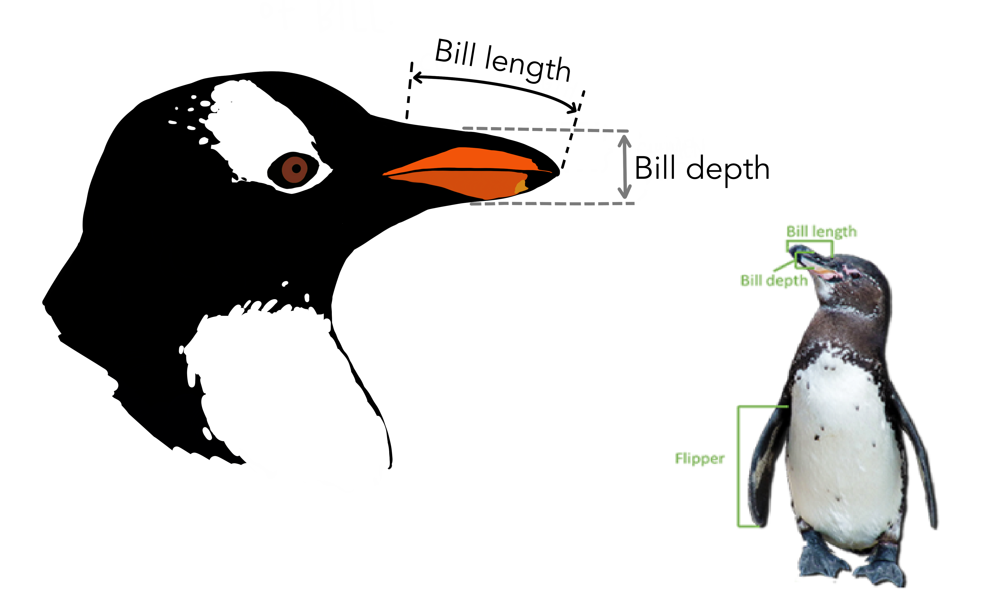

# dplyr进阶 {#tidyverse-dplyr-apply}


本章主要关注dplyr的一些应用。


## 导入数据

今天讲一个关于企鹅的数据故事。


```r
library(tidyverse)
library(palmerpenguins)

penguins <- penguins %>% drop_na()
```


## 变量含义

|variable          |class     |description |
|:-----------------|:---------|:-----------|
|species           |character | 企鹅种类 (Adelie, Gentoo, Chinstrap) |
|island            |character | 所在岛屿 (Biscoe, Dream, Torgersen) |
|bill_length_mm    |double    | 嘴峰长度 (单位毫米) |
|bill_depth_mm     |double    | 嘴峰深度 (单位毫米)|
|flipper_length_mm |integer   | 鰭肢长度 (单位毫米) |
|body_mass_g       |integer   | 体重 (单位克) |
|sex               |character | 性别 |
|year              |integer   | 记录年份 |





## 简单回顾 
### 选择"bill_"开始的列


```r
penguins %>% select(bill_length_mm, bill_depth_mm)
```


```r
penguins %>% select(starts_with("bill_"))
```

```
## # A tibble: 333 × 2
##    bill_length_mm bill_depth_mm
##             <dbl>         <dbl>
##  1           39.1          18.7
##  2           39.5          17.4
##  3           40.3          18  
##  4           36.7          19.3
##  5           39.3          20.6
##  6           38.9          17.8
##  7           39.2          19.6
##  8           41.1          17.6
##  9           38.6          21.2
## 10           34.6          21.1
## # ℹ 323 more rows
```


### 选择"_mm"结尾的列


```r
penguins %>% select(bill_length_mm, bill_depth_mm, flipper_length_mm)
```


```r
penguins %>% select(ends_with("_mm"))
```

```
## # A tibble: 333 × 3
##    bill_length_mm bill_depth_mm flipper_length_mm
##             <dbl>         <dbl>             <int>
##  1           39.1          18.7               181
##  2           39.5          17.4               186
##  3           40.3          18                 195
##  4           36.7          19.3               193
##  5           39.3          20.6               190
##  6           38.9          17.8               181
##  7           39.2          19.6               195
##  8           41.1          17.6               182
##  9           38.6          21.2               191
## 10           34.6          21.1               198
## # ℹ 323 more rows
```


### 选择含有"length"的列

```r
penguins %>% select(bill_length_mm, flipper_length_mm)
```


```r
penguins %>% select(contains("length"))
```

```
## # A tibble: 333 × 2
##    bill_length_mm flipper_length_mm
##             <dbl>             <int>
##  1           39.1               181
##  2           39.5               186
##  3           40.3               195
##  4           36.7               193
##  5           39.3               190
##  6           38.9               181
##  7           39.2               195
##  8           41.1               182
##  9           38.6               191
## 10           34.6               198
## # ℹ 323 more rows
```


### 选择数值型的列


```r
penguins %>% select(where(is.numeric))
```

```
## # A tibble: 333 × 5
##    bill_length_mm bill_depth_mm flipper_length_mm body_mass_g  year
##             <dbl>         <dbl>             <int>       <int> <int>
##  1           39.1          18.7               181        3750  2007
##  2           39.5          17.4               186        3800  2007
##  3           40.3          18                 195        3250  2007
##  4           36.7          19.3               193        3450  2007
##  5           39.3          20.6               190        3650  2007
##  6           38.9          17.8               181        3625  2007
##  7           39.2          19.6               195        4675  2007
##  8           41.1          17.6               182        3200  2007
##  9           38.6          21.2               191        3800  2007
## 10           34.6          21.1               198        4400  2007
## # ℹ 323 more rows
```


### 选择字符串类型的列


```r
penguins %>% select(where(is.character))
```

```
## # A tibble: 333 × 0
```


### 选择字符串类型以外的列


```r
penguins %>% select(!where(is.character))
```

```
## # A tibble: 333 × 8
##    species island    bill_length_mm bill_depth_mm flipper_length_mm body_mass_g
##    <fct>   <fct>              <dbl>         <dbl>             <int>       <int>
##  1 Adelie  Torgersen           39.1          18.7               181        3750
##  2 Adelie  Torgersen           39.5          17.4               186        3800
##  3 Adelie  Torgersen           40.3          18                 195        3250
##  4 Adelie  Torgersen           36.7          19.3               193        3450
##  5 Adelie  Torgersen           39.3          20.6               190        3650
##  6 Adelie  Torgersen           38.9          17.8               181        3625
##  7 Adelie  Torgersen           39.2          19.6               195        4675
##  8 Adelie  Torgersen           41.1          17.6               182        3200
##  9 Adelie  Torgersen           38.6          21.2               191        3800
## 10 Adelie  Torgersen           34.6          21.1               198        4400
## # ℹ 323 more rows
## # ℹ 2 more variables: sex <fct>, year <int>
```

### 可以用多种组合来选择


```r
penguins %>% select(species, starts_with("bill_"))
```

```
## # A tibble: 333 × 3
##    species bill_length_mm bill_depth_mm
##    <fct>            <dbl>         <dbl>
##  1 Adelie            39.1          18.7
##  2 Adelie            39.5          17.4
##  3 Adelie            40.3          18  
##  4 Adelie            36.7          19.3
##  5 Adelie            39.3          20.6
##  6 Adelie            38.9          17.8
##  7 Adelie            39.2          19.6
##  8 Adelie            41.1          17.6
##  9 Adelie            38.6          21.2
## 10 Adelie            34.6          21.1
## # ℹ 323 more rows
```


### 返回向量还是数据框

对应数据框`my_tibble`， 注意返回向量还是数据框的区别

- 返回向量

```r
my_tibble[["x"]] 

my_tibble$x 

my_tibble %>% 
  pull(x)
```


- 返回数据框

```r
my_tibble["x"]

my_tibble %>% 
  select(x)
```


### 选择全部为0的列

```r
tb <- tibble(
  x = 1:5,
  y = 0,
  z = 5:1,
  w = 0
)
tb
```

```
## # A tibble: 5 × 4
##       x     y     z     w
##   <int> <dbl> <int> <dbl>
## 1     1     0     5     0
## 2     2     0     4     0
## 3     3     0     3     0
## 4     4     0     2     0
## 5     5     0     1     0
```

```r
myfun <- function(x) sum(x) == 0
tb %>%
  select(where(myfun))
```

```
## # A tibble: 5 × 2
##       y     w
##   <dbl> <dbl>
## 1     0     0
## 2     0     0
## 3     0     0
## 4     0     0
## 5     0     0
```

```r
# or
tb %>%
  select(where(~sum(.x) == 0))
```

```
## # A tibble: 5 × 2
##       y     w
##   <dbl> <dbl>
## 1     0     0
## 2     0     0
## 3     0     0
## 4     0     0
## 5     0     0
```

**课堂练习**：剔除全部为NA的列

```r
df <- tibble(
  x = c(NA, NA, NA),
  y = c(2, 3, NA),
  z = c(NA, 5, NA)
)


df %>%
  select(where(~ !all(is.na(.x))))
```

```
## # A tibble: 3 × 2
##       y     z
##   <dbl> <dbl>
## 1     2    NA
## 2     3     5
## 3    NA    NA
```

```r
# or
df %>%
  filter(
    if_any(everything(), ~ !is.na(.x))
  )
```

```
## # A tibble: 2 × 3
##   x         y     z
##   <lgl> <dbl> <dbl>
## 1 NA        2    NA
## 2 NA        3     5
```


### 寻找男企鹅

函数 `filter()` 中的逻辑运算符

Operator  | Meaning
----------|--------
`==`      | Equal to
`>`       | Greater than
`<`       | Less than
`>=`      | Greater than or equal to
`<=`      | Less than or equal to
`!=`      | Not equal to
`%in%`    | in 
`is.na`   | is a missing value (NA)
`!is.na`  | is not a missing value
`&`       | and
`|`       | or


```r
penguins %>% filter(sex == "male")
```

```
## # A tibble: 168 × 8
##    species island    bill_length_mm bill_depth_mm flipper_length_mm body_mass_g
##    <fct>   <fct>              <dbl>         <dbl>             <int>       <int>
##  1 Adelie  Torgersen           39.1          18.7               181        3750
##  2 Adelie  Torgersen           39.3          20.6               190        3650
##  3 Adelie  Torgersen           39.2          19.6               195        4675
##  4 Adelie  Torgersen           38.6          21.2               191        3800
##  5 Adelie  Torgersen           34.6          21.1               198        4400
##  6 Adelie  Torgersen           42.5          20.7               197        4500
##  7 Adelie  Torgersen           46            21.5               194        4200
##  8 Adelie  Biscoe              37.7          18.7               180        3600
##  9 Adelie  Biscoe              38.2          18.1               185        3950
## 10 Adelie  Biscoe              38.8          17.2               180        3800
## # ℹ 158 more rows
## # ℹ 2 more variables: sex <fct>, year <int>
```


```r
penguins %>% filter(species %in% c("Adelie", "Gentoo"))
```

```
## # A tibble: 265 × 8
##    species island    bill_length_mm bill_depth_mm flipper_length_mm body_mass_g
##    <fct>   <fct>              <dbl>         <dbl>             <int>       <int>
##  1 Adelie  Torgersen           39.1          18.7               181        3750
##  2 Adelie  Torgersen           39.5          17.4               186        3800
##  3 Adelie  Torgersen           40.3          18                 195        3250
##  4 Adelie  Torgersen           36.7          19.3               193        3450
##  5 Adelie  Torgersen           39.3          20.6               190        3650
##  6 Adelie  Torgersen           38.9          17.8               181        3625
##  7 Adelie  Torgersen           39.2          19.6               195        4675
##  8 Adelie  Torgersen           41.1          17.6               182        3200
##  9 Adelie  Torgersen           38.6          21.2               191        3800
## 10 Adelie  Torgersen           34.6          21.1               198        4400
## # ℹ 255 more rows
## # ℹ 2 more variables: sex <fct>, year <int>
```


```r
penguins %>%
  filter(species == "Adelie" &  bill_length_mm > 40)
```

```
## # A tibble: 50 × 8
##    species island    bill_length_mm bill_depth_mm flipper_length_mm body_mass_g
##    <fct>   <fct>              <dbl>         <dbl>             <int>       <int>
##  1 Adelie  Torgersen           40.3          18                 195        3250
##  2 Adelie  Torgersen           41.1          17.6               182        3200
##  3 Adelie  Torgersen           42.5          20.7               197        4500
##  4 Adelie  Torgersen           46            21.5               194        4200
##  5 Adelie  Biscoe              40.6          18.6               183        3550
##  6 Adelie  Biscoe              40.5          17.9               187        3200
##  7 Adelie  Biscoe              40.5          18.9               180        3950
##  8 Adelie  Dream               40.9          18.9               184        3900
##  9 Adelie  Dream               42.2          18.5               180        3550
## 10 Adelie  Dream               40.8          18.4               195        3900
## # ℹ 40 more rows
## # ℹ 2 more variables: sex <fct>, year <int>
```

```r
penguins %>%
  filter(species == "Adelie", bill_length_mm > 40)
```

```
## # A tibble: 50 × 8
##    species island    bill_length_mm bill_depth_mm flipper_length_mm body_mass_g
##    <fct>   <fct>              <dbl>         <dbl>             <int>       <int>
##  1 Adelie  Torgersen           40.3          18                 195        3250
##  2 Adelie  Torgersen           41.1          17.6               182        3200
##  3 Adelie  Torgersen           42.5          20.7               197        4500
##  4 Adelie  Torgersen           46            21.5               194        4200
##  5 Adelie  Biscoe              40.6          18.6               183        3550
##  6 Adelie  Biscoe              40.5          17.9               187        3200
##  7 Adelie  Biscoe              40.5          18.9               180        3950
##  8 Adelie  Dream               40.9          18.9               184        3900
##  9 Adelie  Dream               42.2          18.5               180        3550
## 10 Adelie  Dream               40.8          18.4               195        3900
## # ℹ 40 more rows
## # ℹ 2 more variables: sex <fct>, year <int>
```


**课堂练习**，说出以下代码的含义

```r
penguins %>%
  filter(species == "Adelie", bill_length_mm == max(bill_length_mm) )
```


## 更多应用

希望介绍一个技术，对应一个应用场景


### 弱水三千，只取一瓢

```r
penguins %>% 
  head()
```

```
## # A tibble: 6 × 8
##   species island    bill_length_mm bill_depth_mm flipper_length_mm body_mass_g
##   <fct>   <fct>              <dbl>         <dbl>             <int>       <int>
## 1 Adelie  Torgersen           39.1          18.7               181        3750
## 2 Adelie  Torgersen           39.5          17.4               186        3800
## 3 Adelie  Torgersen           40.3          18                 195        3250
## 4 Adelie  Torgersen           36.7          19.3               193        3450
## 5 Adelie  Torgersen           39.3          20.6               190        3650
## 6 Adelie  Torgersen           38.9          17.8               181        3625
## # ℹ 2 more variables: sex <fct>, year <int>
```

```r
penguins %>% 
  tail()
```

```
## # A tibble: 6 × 8
##   species   island bill_length_mm bill_depth_mm flipper_length_mm body_mass_g
##   <fct>     <fct>           <dbl>         <dbl>             <int>       <int>
## 1 Chinstrap Dream            45.7          17                 195        3650
## 2 Chinstrap Dream            55.8          19.8               207        4000
## 3 Chinstrap Dream            43.5          18.1               202        3400
## 4 Chinstrap Dream            49.6          18.2               193        3775
## 5 Chinstrap Dream            50.8          19                 210        4100
## 6 Chinstrap Dream            50.2          18.7               198        3775
## # ℹ 2 more variables: sex <fct>, year <int>
```


```r
penguins %>% 
  slice(1)
```

```
## # A tibble: 1 × 8
##   species island    bill_length_mm bill_depth_mm flipper_length_mm body_mass_g
##   <fct>   <fct>              <dbl>         <dbl>             <int>       <int>
## 1 Adelie  Torgersen           39.1          18.7               181        3750
## # ℹ 2 more variables: sex <fct>, year <int>
```


```r
penguins %>% 
  group_by(species) %>% 
  slice(1)
```

```
## # A tibble: 3 × 8
## # Groups:   species [3]
##   species   island    bill_length_mm bill_depth_mm flipper_length_mm body_mass_g
##   <fct>     <fct>              <dbl>         <dbl>             <int>       <int>
## 1 Adelie    Torgersen           39.1          18.7               181        3750
## 2 Chinstrap Dream               46.5          17.9               192        3500
## 3 Gentoo    Biscoe              46.1          13.2               211        4500
## # ℹ 2 more variables: sex <fct>, year <int>
```


### 嘴峰长度最大那一行

三种方法


```r
penguins %>%
  filter(bill_length_mm == max(bill_length_mm) )
```

```
## # A tibble: 1 × 8
##   species island bill_length_mm bill_depth_mm flipper_length_mm body_mass_g
##   <fct>   <fct>           <dbl>         <dbl>             <int>       <int>
## 1 Gentoo  Biscoe           59.6            17               230        6050
## # ℹ 2 more variables: sex <fct>, year <int>
```


```r
penguins %>% 
  arrange(desc(bill_length_mm)) %>% 
  slice(1)
```

```
## # A tibble: 1 × 8
##   species island bill_length_mm bill_depth_mm flipper_length_mm body_mass_g
##   <fct>   <fct>           <dbl>         <dbl>             <int>       <int>
## 1 Gentoo  Biscoe           59.6            17               230        6050
## # ℹ 2 more variables: sex <fct>, year <int>
```


```r
penguins %>% 
  slice_max(bill_length_mm)
```

```
## # A tibble: 1 × 8
##   species island bill_length_mm bill_depth_mm flipper_length_mm body_mass_g
##   <fct>   <fct>           <dbl>         <dbl>             <int>       <int>
## 1 Gentoo  Biscoe           59.6            17               230        6050
## # ℹ 2 more variables: sex <fct>, year <int>
```


### separate

```r
tb <- tibble::tribble(
  ~day, ~price,
  1,   "30-45",
  2,   "40-95",
  3,   "89-65",
  4,   "45-63",
  5,   "52-42"
)
```


```r
tb1 <- tb %>% 
  separate(price, into = c("low", "high"), sep = "-")
tb1
```

```
## # A tibble: 5 × 3
##     day low   high 
##   <dbl> <chr> <chr>
## 1     1 30    45   
## 2     2 40    95   
## 3     3 89    65   
## 4     4 45    63   
## 5     5 52    42
```

### unite

```r
tb1 %>% 
  unite(col = "price", c(low, high), sep = ":", remove = FALSE)
```

```
## # A tibble: 5 × 4
##     day price low   high 
##   <dbl> <chr> <chr> <chr>
## 1     1 30:45 30    45   
## 2     2 40:95 40    95   
## 3     3 89:65 89    65   
## 4     4 45:63 45    63   
## 5     5 52:42 52    42
```


### distinct

`distinct()`处理的对象是data.frame；功能是**筛选不重复的row**；返回data.frame


```r
df <- tibble::tribble(
  ~x, ~y, ~z,
  1, 1, 1,
  1, 1, 2,
  1, 1, 1,
  2, 1, 2,
  2, 2, 3,
  3, 3, 1
)
df
```

```
## # A tibble: 6 × 3
##       x     y     z
##   <dbl> <dbl> <dbl>
## 1     1     1     1
## 2     1     1     2
## 3     1     1     1
## 4     2     1     2
## 5     2     2     3
## 6     3     3     1
```


```r
df %>%
  distinct()
```

```
## # A tibble: 5 × 3
##       x     y     z
##   <dbl> <dbl> <dbl>
## 1     1     1     1
## 2     1     1     2
## 3     2     1     2
## 4     2     2     3
## 5     3     3     1
```


```r
df %>%
  distinct(x)
```

```
## # A tibble: 3 × 1
##       x
##   <dbl>
## 1     1
## 2     2
## 3     3
```

```r
df %>%
  distinct(x, y)
```

```
## # A tibble: 4 × 2
##       x     y
##   <dbl> <dbl>
## 1     1     1
## 2     2     1
## 3     2     2
## 4     3     3
```


```r
df %>%
  distinct(x, y, .keep_all = TRUE) # 只保留最先出现的row
```

```
## # A tibble: 4 × 3
##       x     y     z
##   <dbl> <dbl> <dbl>
## 1     1     1     1
## 2     2     1     2
## 3     2     2     3
## 4     3     3     1
```


```r
df %>%
  distinct(
    across(c(x, y)),
    .keep_all = TRUE
  )
```


```r
df %>%
  group_by(x) %>%
  distinct(y, .keep_all = TRUE)
```

```
## # A tibble: 4 × 3
## # Groups:   x [3]
##       x     y     z
##   <dbl> <dbl> <dbl>
## 1     1     1     1
## 2     2     1     2
## 3     2     2     3
## 4     3     3     1
```


`n_distinct()`处理的对象是vector；功能是**统计不同的元素有多少个**；返回一个数值


```r
c(1, 1, 1, 2, 2, 1, 3, 3) %>% n_distinct()
```

```
## [1] 3
```


```r
df$z %>% n_distinct()
```

```
## [1] 3
```


```r
df %>%
  group_by(x) %>%
  summarise(
    n = n_distinct(z)
  )
```

```
## # A tibble: 3 × 2
##       x     n
##   <dbl> <int>
## 1     1     2
## 2     2     2
## 3     3     1
```


### 有关NA的计算

`NA`很讨厌，凡是它参与的四则运算，结果都是`NA`，


```r
sum(c(1, 2, NA, 4))
```

```
## [1] NA
```

所以需要事先把它删除，增加参数说明 `na.rm = TRUE`

```r
sum(c(1, 2, NA, 4), na.rm = TRUE)
```

```
## [1] 7
```


```r
mean(c(1, 2, NA, 4), na.rm = TRUE)
```

```
## [1] 2.333333
```


### 寻找企鹅中的胖子


```r
penguins %>% 
  mutate(
    body = if_else(body_mass_g > 4200, "you are fat", "you are fine")
)
```

```
## # A tibble: 333 × 9
##    species island    bill_length_mm bill_depth_mm flipper_length_mm body_mass_g
##    <fct>   <fct>              <dbl>         <dbl>             <int>       <int>
##  1 Adelie  Torgersen           39.1          18.7               181        3750
##  2 Adelie  Torgersen           39.5          17.4               186        3800
##  3 Adelie  Torgersen           40.3          18                 195        3250
##  4 Adelie  Torgersen           36.7          19.3               193        3450
##  5 Adelie  Torgersen           39.3          20.6               190        3650
##  6 Adelie  Torgersen           38.9          17.8               181        3625
##  7 Adelie  Torgersen           39.2          19.6               195        4675
##  8 Adelie  Torgersen           41.1          17.6               182        3200
##  9 Adelie  Torgersen           38.6          21.2               191        3800
## 10 Adelie  Torgersen           34.6          21.1               198        4400
## # ℹ 323 more rows
## # ℹ 3 more variables: sex <fct>, year <int>, body <chr>
```

**随堂练习**：用考试成绩的均值代替缺失值


```r
df <- tibble::tribble(
    ~name,     ~type, ~score,
  "Alice", "english",    80,
  "Alice",    "math",    NA,
    "Bob", "english",    70,
    "Bob",    "math",    69,
  "Carol", "english",    NA,
  "Carol",    "math",    90
  )
df
```

```
## # A tibble: 6 × 3
##   name  type    score
##   <chr> <chr>   <dbl>
## 1 Alice english    80
## 2 Alice math       NA
## 3 Bob   english    70
## 4 Bob   math       69
## 5 Carol english    NA
## 6 Carol math       90
```


```r
df %>% 
  group_by(type) %>% 
  mutate(mean_score = mean(score, na.rm = TRUE)) %>% 
  mutate(newscore = if_else(is.na(score), mean_score, score))
```

```
## # A tibble: 6 × 5
## # Groups:   type [2]
##   name  type    score mean_score newscore
##   <chr> <chr>   <dbl>      <dbl>    <dbl>
## 1 Alice english    80       75       80  
## 2 Alice math       NA       79.5     79.5
## 3 Bob   english    70       75       70  
## 4 Bob   math       69       79.5     69  
## 5 Carol english    NA       75       75  
## 6 Carol math       90       79.5     90
```


### 给企鹅身材分类


```r
penguins %>% 
  mutate(
   body = case_when(
     body_mass_g < 3500                       ~ "best",
     body_mass_g >= 3500 & body_mass_g < 4500 ~ "good",
     body_mass_g >= 4500 & body_mass_g < 5500 ~ "general",
     TRUE                                     ~ "other"
  )
)
```

```
## # A tibble: 333 × 9
##    species island    bill_length_mm bill_depth_mm flipper_length_mm body_mass_g
##    <fct>   <fct>              <dbl>         <dbl>             <int>       <int>
##  1 Adelie  Torgersen           39.1          18.7               181        3750
##  2 Adelie  Torgersen           39.5          17.4               186        3800
##  3 Adelie  Torgersen           40.3          18                 195        3250
##  4 Adelie  Torgersen           36.7          19.3               193        3450
##  5 Adelie  Torgersen           39.3          20.6               190        3650
##  6 Adelie  Torgersen           38.9          17.8               181        3625
##  7 Adelie  Torgersen           39.2          19.6               195        4675
##  8 Adelie  Torgersen           41.1          17.6               182        3200
##  9 Adelie  Torgersen           38.6          21.2               191        3800
## 10 Adelie  Torgersen           34.6          21.1               198        4400
## # ℹ 323 more rows
## # ℹ 3 more variables: sex <fct>, year <int>, body <chr>
```


**随堂练习**：按嘴峰长度分成A, B, C, D 4个等级


```r
penguins %>% 
  mutate(
    degree = case_when(
      bill_length_mm < 35                        ~ "A",
      bill_length_mm >= 35 & bill_length_mm < 45 ~ "B",
      bill_length_mm >= 45 & bill_length_mm < 55 ~ "C",
      TRUE                                       ~ "D"
  )
)
```

```
## # A tibble: 333 × 9
##    species island    bill_length_mm bill_depth_mm flipper_length_mm body_mass_g
##    <fct>   <fct>              <dbl>         <dbl>             <int>       <int>
##  1 Adelie  Torgersen           39.1          18.7               181        3750
##  2 Adelie  Torgersen           39.5          17.4               186        3800
##  3 Adelie  Torgersen           40.3          18                 195        3250
##  4 Adelie  Torgersen           36.7          19.3               193        3450
##  5 Adelie  Torgersen           39.3          20.6               190        3650
##  6 Adelie  Torgersen           38.9          17.8               181        3625
##  7 Adelie  Torgersen           39.2          19.6               195        4675
##  8 Adelie  Torgersen           41.1          17.6               182        3200
##  9 Adelie  Torgersen           38.6          21.2               191        3800
## 10 Adelie  Torgersen           34.6          21.1               198        4400
## # ℹ 323 more rows
## # ℹ 3 more variables: sex <fct>, year <int>, degree <chr>
```


### 每种类型企鹅有多少只？

知识点：`n()`函数，统计当前分组数据框的行数


```r
penguins %>%
  summarise(
    n = n()
  ) 
```

```
## # A tibble: 1 × 1
##       n
##   <int>
## 1   333
```


```r
penguins %>%
  group_by(species) %>%
  summarise(
    n = n()
  )
```

```
## # A tibble: 3 × 2
##   species       n
##   <fct>     <int>
## 1 Adelie      146
## 2 Chinstrap    68
## 3 Gentoo      119
```


统计某个变量中**各组**出现的次数，可以使用`count()`函数


```r
penguins %>% count(species)
```

```
## # A tibble: 3 × 2
##   species       n
##   <fct>     <int>
## 1 Adelie      146
## 2 Chinstrap    68
## 3 Gentoo      119
```


不同性别的企鹅各有多少

```r
penguins %>% count(sex, sort = TRUE)
```

```
## # A tibble: 2 × 2
##   sex        n
##   <fct>  <int>
## 1 male     168
## 2 female   165
```

可以统计不同组合出现的次数

```r
penguins %>% count(island, species)
```

```
## # A tibble: 5 × 3
##   island    species       n
##   <fct>     <fct>     <int>
## 1 Biscoe    Adelie       44
## 2 Biscoe    Gentoo      119
## 3 Dream     Adelie       55
## 4 Dream     Chinstrap    68
## 5 Torgersen Adelie       47
```


可以在`count()`里构建新变量，并利用这个新变量完成统计。
比如，统计嘴巴长度大于40的企鹅个数

- 常规做法

```r
penguins %>%
  filter(bill_length_mm > 40) %>% 
  summarise(
    n = n()
  )
```

```
## # A tibble: 1 × 1
##       n
##   <int>
## 1   237
```

- `count()`做法

```r
penguins %>% count(longer_bill = bill_length_mm > 40)
```

```
## # A tibble: 2 × 2
##   longer_bill     n
##   <lgl>       <int>
## 1 FALSE          96
## 2 TRUE          237
```

解析思路：`bill_length_mm > 40` 比较算符 返回逻辑型向量，向量里面只有TRUR和FALSE两种值，因此上面的代码相当于统计TRUE有多少个，FALSE有多少个？


### 强制转换

矢量中的元素必须是相同的类型，但如果不一样呢，会发生什么？
这个时候R会**强制转换**成相同的类型。这就涉及数据类型的转换层级

- character > numeric > logical
- double > integer

比如这里会强制转换成字符串类型

```r
c("foo", 1, TRUE)
```

```
## [1] "foo"  "1"    "TRUE"
```

这里会强制转换成数值型

```r
c(1, TRUE, FALSE)
```

```
## [1] 1 1 0
```


```r
c(TRUE, TRUE, FALSE) %>% sum()
```

```
## [1] 2
```

**随堂练习**：补全下面代码，求嘴峰长度大于40mm的占比？


```r
penguins %>% 
  mutate(is_bigger40 = bill_length_mm > 40)
```

```
## # A tibble: 333 × 9
##    species island    bill_length_mm bill_depth_mm flipper_length_mm body_mass_g
##    <fct>   <fct>              <dbl>         <dbl>             <int>       <int>
##  1 Adelie  Torgersen           39.1          18.7               181        3750
##  2 Adelie  Torgersen           39.5          17.4               186        3800
##  3 Adelie  Torgersen           40.3          18                 195        3250
##  4 Adelie  Torgersen           36.7          19.3               193        3450
##  5 Adelie  Torgersen           39.3          20.6               190        3650
##  6 Adelie  Torgersen           38.9          17.8               181        3625
##  7 Adelie  Torgersen           39.2          19.6               195        4675
##  8 Adelie  Torgersen           41.1          17.6               182        3200
##  9 Adelie  Torgersen           38.6          21.2               191        3800
## 10 Adelie  Torgersen           34.6          21.1               198        4400
## # ℹ 323 more rows
## # ℹ 3 more variables: sex <fct>, year <int>, is_bigger40 <lgl>
```


## across()之美

我们想知道，嘴巴长度和厚度的均值


```r
penguins %>%
  summarize(
    length = mean(bill_length_mm)
  )
```

```
## # A tibble: 1 × 1
##   length
##    <dbl>
## 1   44.0
```

接着添加下个变量

```r
penguins %>%
  summarize(
    length = mean(bill_length_mm),
    depth  = mean(bill_length_mm)
  )
```

```
## # A tibble: 1 × 2
##   length depth
##    <dbl> <dbl>
## 1   44.0  44.0
```

长度和厚度惊人的相等。我是不是发现新大陆了？


### across()函数
更安全、更简练的写法，王老师的最爱


```r
penguins %>%
  summarize(
     across(c(bill_depth_mm, bill_length_mm), mean)
 )
```

```
## # A tibble: 1 × 2
##   bill_depth_mm bill_length_mm
##           <dbl>          <dbl>
## 1          17.2           44.0
```

翅膀的长度加进去看看


```r
penguins %>%
  summarize(
     across(c(bill_depth_mm, bill_length_mm, flipper_length_mm), mean)
 )
```

```
## # A tibble: 1 × 3
##   bill_depth_mm bill_length_mm flipper_length_mm
##           <dbl>          <dbl>             <dbl>
## 1          17.2           44.0              201.
```


还可以更简练喔

```r
penguins %>%
  summarize(
    across(ends_with("_mm"), mean)
 )
```

```
## # A tibble: 1 × 3
##   bill_length_mm bill_depth_mm flipper_length_mm
##            <dbl>         <dbl>             <dbl>
## 1           44.0          17.2              201.
```


::: {.rmdnote}

`across()`函数用法


```r
across(.cols = everything(), .fns = NULL, ..., .names = NULL)
```

- 用在 `mutate()` 和`summarise()` 函数里面
- `across()` 对**多列**执行**相同**的函数操作，返回**数据框**

::: 


### 数据中心化


```r
penguins %>%
  mutate(
    bill_length_mm = bill_length_mm - mean(bill_length_mm),
    bill_depth_mm  = bill_depth_mm  - mean(bill_depth_mm)
    )
```

```
## # A tibble: 333 × 8
##    species island    bill_length_mm bill_depth_mm flipper_length_mm body_mass_g
##    <fct>   <fct>              <dbl>         <dbl>             <int>       <int>
##  1 Adelie  Torgersen          -4.89         1.54                181        3750
##  2 Adelie  Torgersen          -4.49         0.235               186        3800
##  3 Adelie  Torgersen          -3.69         0.835               195        3250
##  4 Adelie  Torgersen          -7.29         2.14                193        3450
##  5 Adelie  Torgersen          -4.69         3.44                190        3650
##  6 Adelie  Torgersen          -5.09         0.635               181        3625
##  7 Adelie  Torgersen          -4.79         2.44                195        4675
##  8 Adelie  Torgersen          -2.89         0.435               182        3200
##  9 Adelie  Torgersen          -5.39         4.04                191        3800
## 10 Adelie  Torgersen          -9.39         3.94                198        4400
## # ℹ 323 more rows
## # ℹ 2 more variables: sex <fct>, year <int>
```


更清晰的办法


```r
centralized <- function(x) {
  x - mean(x)
}


penguins %>%
  mutate(
    across(c(bill_length_mm, bill_depth_mm), centralized)
  )
```

```
## # A tibble: 333 × 8
##    species island    bill_length_mm bill_depth_mm flipper_length_mm body_mass_g
##    <fct>   <fct>              <dbl>         <dbl>             <int>       <int>
##  1 Adelie  Torgersen          -4.89         1.54                181        3750
##  2 Adelie  Torgersen          -4.49         0.235               186        3800
##  3 Adelie  Torgersen          -3.69         0.835               195        3250
##  4 Adelie  Torgersen          -7.29         2.14                193        3450
##  5 Adelie  Torgersen          -4.69         3.44                190        3650
##  6 Adelie  Torgersen          -5.09         0.635               181        3625
##  7 Adelie  Torgersen          -4.79         2.44                195        4675
##  8 Adelie  Torgersen          -2.89         0.435               182        3200
##  9 Adelie  Torgersen          -5.39         4.04                191        3800
## 10 Adelie  Torgersen          -9.39         3.94                198        4400
## # ℹ 323 more rows
## # ℹ 2 more variables: sex <fct>, year <int>
```


### 数据标准化


```r
std <- function(x) {
  (x - mean(x, na.rm = TRUE)) / sd(x, na.rm = TRUE)
}


penguins %>%
  mutate(
    across(c(bill_length_mm, bill_depth_mm), std)
  )
```

```
## # A tibble: 333 × 8
##    species island    bill_length_mm bill_depth_mm flipper_length_mm body_mass_g
##    <fct>   <fct>              <dbl>         <dbl>             <int>       <int>
##  1 Adelie  Torgersen         -0.895         0.780               181        3750
##  2 Adelie  Torgersen         -0.822         0.119               186        3800
##  3 Adelie  Torgersen         -0.675         0.424               195        3250
##  4 Adelie  Torgersen         -1.33          1.08                193        3450
##  5 Adelie  Torgersen         -0.858         1.74                190        3650
##  6 Adelie  Torgersen         -0.931         0.323               181        3625
##  7 Adelie  Torgersen         -0.876         1.24                195        4675
##  8 Adelie  Torgersen         -0.529         0.221               182        3200
##  9 Adelie  Torgersen         -0.986         2.05                191        3800
## 10 Adelie  Torgersen         -1.72          2.00                198        4400
## # ℹ 323 more rows
## # ℹ 2 more variables: sex <fct>, year <int>
```


或者使用更简洁的方法

```r
# using across() and purrr style
penguins %>%
  summarise(
    across(starts_with("bill_"), ~ (.x - mean(.x)) / sd(.x))
  )
```

```
## Warning: Returning more (or less) than 1 row per `summarise()` group was deprecated in
## dplyr 1.1.0.
## ℹ Please use `reframe()` instead.
## ℹ When switching from `summarise()` to `reframe()`, remember that `reframe()`
##   always returns an ungrouped data frame and adjust accordingly.
## Call `lifecycle::last_lifecycle_warnings()` to see where this warning was
## generated.
```

```
## # A tibble: 333 × 2
##    bill_length_mm bill_depth_mm
##             <dbl>         <dbl>
##  1         -0.895         0.780
##  2         -0.822         0.119
##  3         -0.675         0.424
##  4         -1.33          1.08 
##  5         -0.858         1.74 
##  6         -0.931         0.323
##  7         -0.876         1.24 
##  8         -0.529         0.221
##  9         -0.986         2.05 
## 10         -1.72          2.00 
## # ℹ 323 more rows
```


### 多列多个统计函数


```r
penguins %>%
  group_by(species) %>%
  summarise(
    across(ends_with("_mm"), list(mean = mean, sd = sd), na.rm = TRUE)
  )
```

```
## Warning: There was 1 warning in `summarise()`.
## ℹ In argument: `across(ends_with("_mm"), list(mean = mean, sd = sd), na.rm =
##   TRUE)`.
## ℹ In group 1: `species = Adelie`.
## Caused by warning:
## ! The `...` argument of `across()` is deprecated as of dplyr 1.1.0.
## Supply arguments directly to `.fns` through an anonymous function instead.
## 
##   # Previously
##   across(a:b, mean, na.rm = TRUE)
## 
##   # Now
##   across(a:b, \(x) mean(x, na.rm = TRUE))
```

```
## # A tibble: 3 × 7
##   species   bill_length_mm_mean bill_length_mm_sd bill_depth_mm_mean
##   <fct>                   <dbl>             <dbl>              <dbl>
## 1 Adelie                   38.8              2.66               18.3
## 2 Chinstrap                48.8              3.34               18.4
## 3 Gentoo                   47.6              3.11               15.0
## # ℹ 3 more variables: bill_depth_mm_sd <dbl>, flipper_length_mm_mean <dbl>,
## #   flipper_length_mm_sd <dbl>
```


**随堂练习**：以sex分组，对"bill_"开头的列，求出每列的最大值和最小值


```r
penguins %>%
  group_by(sex) %>%
  summarise(
    across(starts_with("bill_"), list(max = max, min = min), na.rm = TRUE)
  )
```

```
## # A tibble: 2 × 5
##   sex    bill_length_mm_max bill_length_mm_min bill_depth_mm_max
##   <fct>               <dbl>              <dbl>             <dbl>
## 1 female               58                 32.1              20.7
## 2 male                 59.6               34.6              21.5
## # ℹ 1 more variable: bill_depth_mm_min <dbl>
```


在第 \@ref(tidyverse-beauty-of-across1) 章到第 \@ref(tidyverse-beauty-of-across4) 章会继续讲王老师的最爱`across()`函数。
