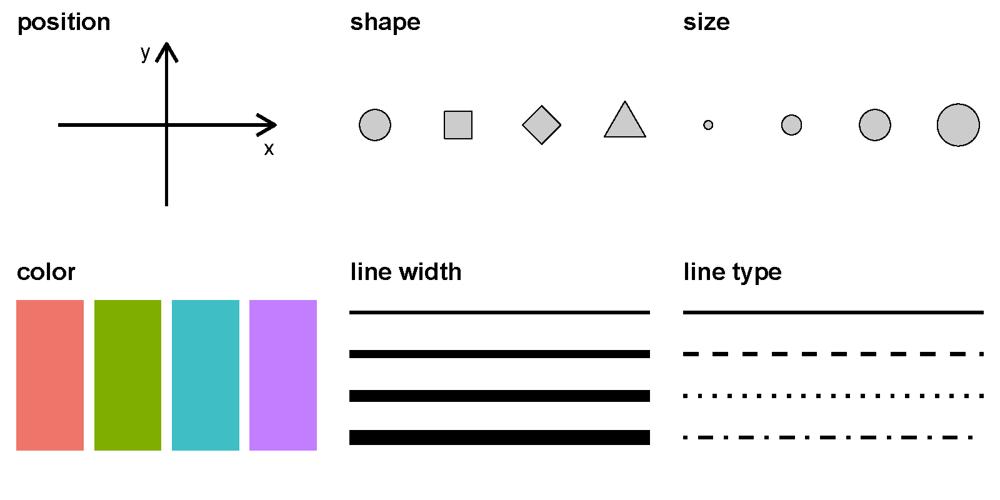
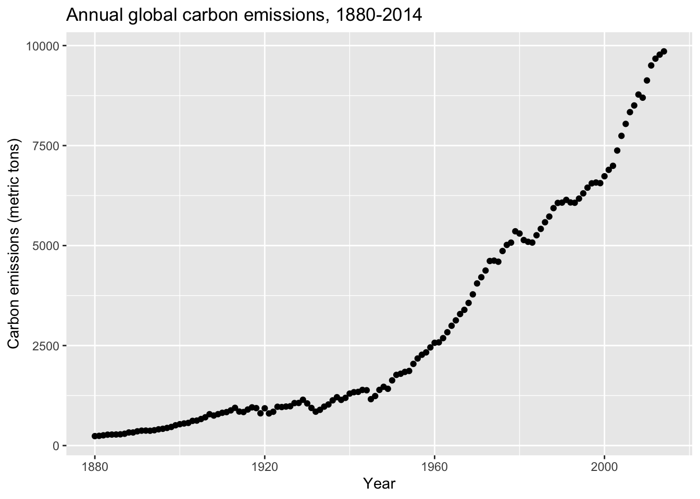
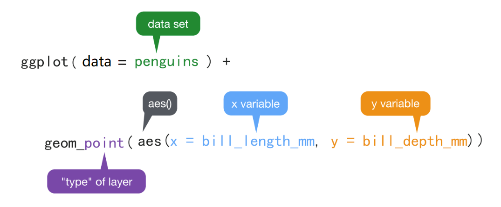
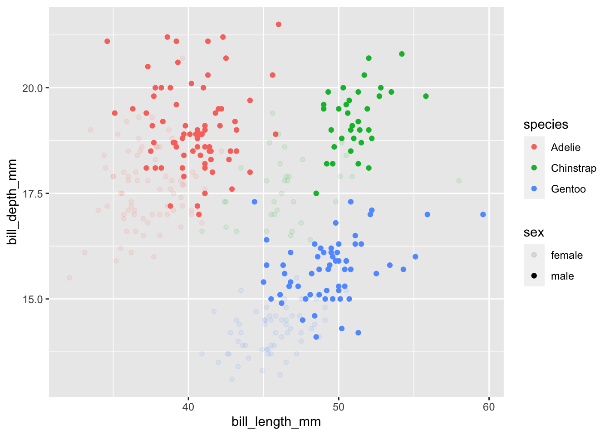
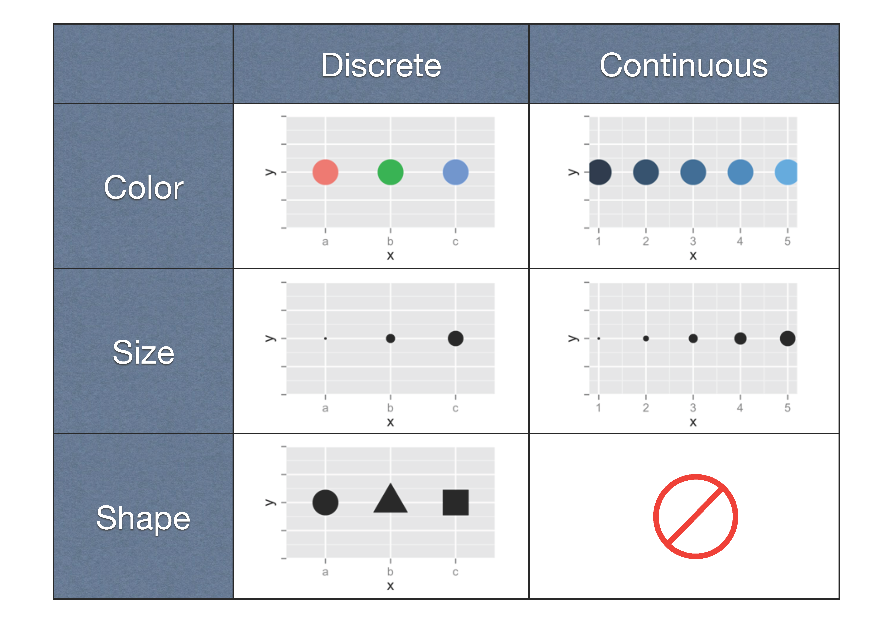
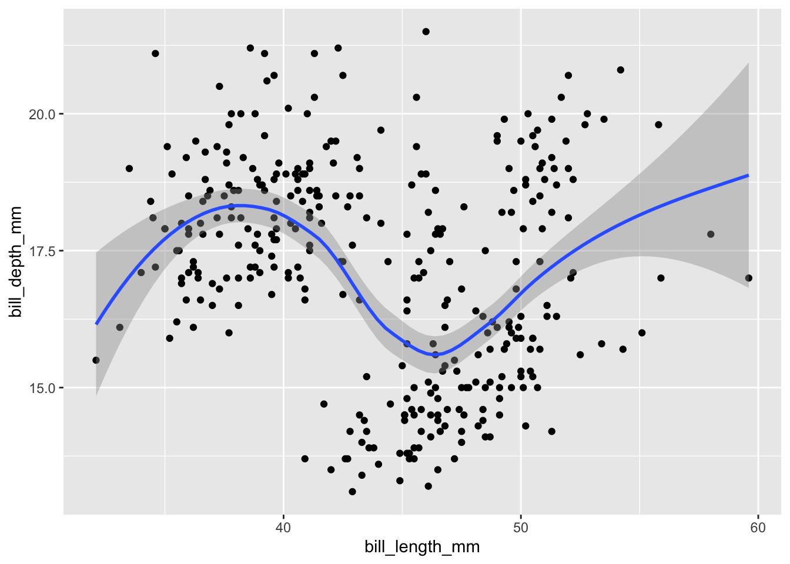
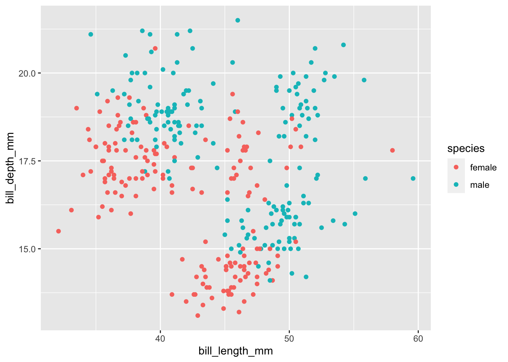
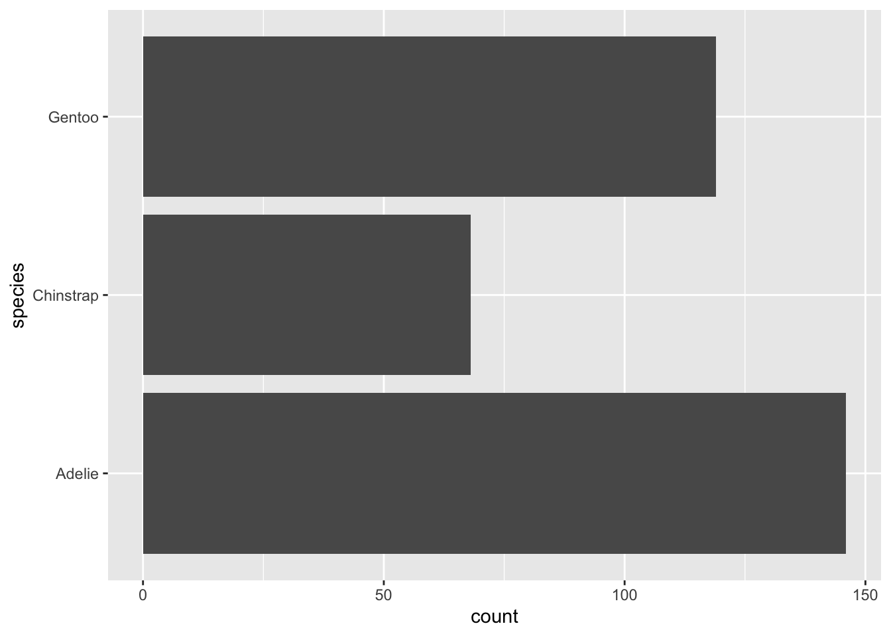
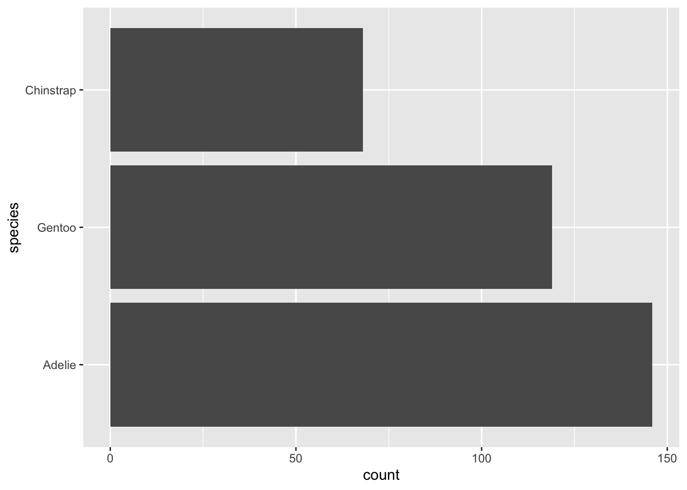

# (PART) 画图 {-}

# 数据可视化 {#tidyverse-ggplot2-aes}


我们介绍R语言最强大的可视化，看看都有哪些炫酷的操作。


```r
library(tidyverse) # install.packages("tidyverse")
library(patchwork) # install.packages("patchwork")
```


## 什么是数据可视化

### 图形属性(视觉元素)

我们在图中画一个点，那么这个**点**就有（形状，大小，颜色，位置，透明度）等属性，
这些属性就是**图形属性**（有时也称之为图形元素或者视觉元素），下图 \@ref(fig:common-aesthetics)列出了常用的图形属性。

<div class="figure">

<p class="caption">(\#fig:common-aesthetics)常用的图形元素</p>
</div>


点和线常用的图形属性

|  geom | x | y | size | color | shape | linetype | alpha | fill | group |
|:-----:|:-:|:-:|:----:|:-----:|:-----:|:--------:|:-----:|:----:|:-----:|
| point | √ | √ |   √  |   √   |   √   |     √    |   √   |   √  |   √   |
|  line | √ | √ |   √  |   √   |       |     √    |   √   |      |   √   |


R有最初的基本绘图， 这是从S语言继承过来的， 还有一些功能更易用、更强大的绘图系统， 如lattice、ggplot2。 基本绘图使用简单(如barplot画条形图)， 灵活性强， 但是为了做出满意的图形需要比较多的调整，重要的是颜值低！！！ 所以推荐ggplot2画图。 


## 宏包ggplot2 

ggplot2是RStudio首席科学家Hadley Wickham在2005年读博士期间的作品。很多人学习R语言，就是因为ggplot2宏包。目前，
ggplot2已经发展成为最受欢迎的R宏包，没有之一。


### ggplot2 的图形语法

ggplot2有一套优雅的绘图语法，包名中“gg”是grammar of graphics的简称。
Hadley Wickham将这套可视化语法诠释为:

> 一张统计图形就是从**数据**到几何形状(geometric object，缩写geom)所包含的**图形属性**(aesthetic attribute，缩写aes)的一种映射。


通俗解释：就是我们的**数据**通过图形的**视觉元素**表示出来。比如**点的位置**，如果坐标x值越大，水平方向离原点的位置就越远，数值越小，水平方向离原点的位置就越近。
**数值的大小变成了视觉能感知的东西**。

<div class="figure">

<p class="caption">(\#fig:ggplot2-aes2-5)数值到图形属性的映射过程</p>
</div>


同理，我们希望用**点的大小**代表这个位置上的某个变量（比如，降雨量，产品销量等等），那么变量的数值越小，点的半径就小一点，数值越大，点就可以大一点；或者变量的数值大，点的颜色就深一点，数值小，点的颜色就浅一点。即，数值到图形属性的**映射**过程。映射是一个数学词汇，这里您可以理解为**一一对应**。


### 怎么写代码

`ggplot()`函数包括9个部件：

- **数据 (data)**      （数据框）
- **映射 (mapping)**
- **几何形状 (geom)**
- 统计变换 (stats)
- 标度 (scale)
- 坐标系 (coord)
- 分面 (facet)
- 主题 (theme)
- 存储和输出 (output)

其中前三个是必需的。语法模板


```r
ggplot(data = <DATA>) + 
   <GEOM_FUNCTION>(mapping = aes(<MAPPINGS>))
```


此外，图形中还可能包含数据的统计变换(statistical  transformation，缩写stats)，最后绘制在某个特定的坐标系(coordinate
system，缩写coord)中，而分面(facet)则可以用来生成数据不同子集的图形。


先来点小菜。先看一个简单的案例（1880-2014年温度变化和二氧化碳排放量）


```r
library(tidyverse)
d <- read_csv(here::here("demo_data", "temp_carbon.csv"))
d %>% head(5)
```

```
## # A tibble: 5 × 5
##    year temp_anomaly land_anomaly ocean_anomaly carbon_emissions
##   <dbl>        <dbl>        <dbl>         <dbl>            <dbl>
## 1  1880        -0.11        -0.48         -0.01              236
## 2  1881        -0.08        -0.4           0.01              243
## 3  1882        -0.1         -0.48          0                 256
## 4  1883        -0.18        -0.66         -0.04              272
## 5  1884        -0.26        -0.69         -0.14              275
```
注：如果用read.csv读取文件，返回一个通常的数据框data.frame


```r
library(ggplot2)
ggplot(___) + 
  geom_point(
    mapping = aes(x = ___, y = ___)
  )
```

我们只需要在相应位置填入数据框，和数据框的变量，就可以画图


```r
ggplot(data = d) +
  geom_point(mapping = aes(x = year, y = carbon_emissions)) +
  xlab("Year") +
  ylab("Carbon emissions (metric tons)") +
  ggtitle("Annual global carbon emissions, 1880-2014")
```



是不是很简单?


## 映射 

我们这里用科考人员收集的企鹅体征[数据](https://raw.githubusercontent.com/rfordatascience/tidytuesday/master/data/2020/2020-07-28/penguins.csv)来演示。


```r
library(tidyverse)
penguins <- read_csv(here::here("demo_data", "penguins.csv")) %>%
  janitor::clean_names() %>% 
  drop_na()

penguins %>%
  head()
```

```
## # A tibble: 6 × 8
##   species island    bill_length_mm bill_depth_mm flipper_length_mm body_mass_g
##   <chr>   <chr>              <dbl>         <dbl>             <dbl>       <dbl>
## 1 Adelie  Torgersen           39.1          18.7               181        3750
## 2 Adelie  Torgersen           39.5          17.4               186        3800
## 3 Adelie  Torgersen           40.3          18                 195        3250
## 4 Adelie  Torgersen           36.7          19.3               193        3450
## 5 Adelie  Torgersen           39.3          20.6               190        3650
## 6 Adelie  Torgersen           38.9          17.8               181        3625
## # ℹ 2 more variables: sex <chr>, year <dbl>
```

我们会用到penguins数据集其中的四个变量


```r
penguins %>%
  select(species, sex, bill_length_mm, bill_depth_mm) %>%
  head(4)
```


### 嘴巴越长，嘴巴也会越厚？

这里提出一个问题，嘴巴越长，嘴巴也会越厚？


为考察嘴峰长度(bill_length_mm)与嘴峰深度(bill_depth_mm)之间的关联，先绘制这两个变量的散点图，



- `ggplot()` 初始化绘图，相当于打开了一张纸，准备画画。
- `ggplot(data = penguins)` 表示使用penguins这个**数据框**来画图。

- `+`表示添加图层。

- `geom_point()`表示绘制散点图。

- `aes()`表示数值和视觉属性之间的映射。
  
`aes(x = bill_length_mm, y = bill_depth_mm)`，意思是变量bill_length_mm作为（映射为）**x轴方向的位置**，变量bill_depth_mm作为（映射为）**y轴方向的位置**。

- `aes()`除了位置上映射，还可以实现色彩、形状或透明度等视觉属性的映射。


运行脚本后生成图片：


刚才看到的是位置上的映射，`ggplot()`还包含了颜色、形状以及透明度等图形属性的映射，

比如我们在`aes()`里增加一个颜色映射` color = species`, 这样做就是希望，**不同的企鹅类型**, 用**不同的颜色**来表现。这里，企鹅类型有三组，那么就用三种不同的颜色来表示


```r
ggplot(penguins) +
  geom_point(aes(x = bill_length_mm, y = bill_depth_mm, color = species))
```


此图绘制不同类型的企鹅，嘴峰长度与嘴峰深度散点图，并用颜色来实现了分组。


大家试试下面代码呢，

```r
ggplot(penguins) +
  geom_point(aes(x = bill_length_mm, y = bill_depth_mm, size = species))
```


```r
ggplot(penguins) +
  geom_point(aes(x = bill_length_mm, y = bill_depth_mm, shape = species))
```


```r
ggplot(penguins) +
  geom_point(aes(x = bill_length_mm, y = bill_depth_mm, alpha = species))
```

也可更多映射


```r
ggplot(penguins) +
  geom_point(
    aes(x = bill_length_mm, y = bill_depth_mm, color = species, alpha = sex)
  )
```

```
## Warning: Using alpha for a discrete variable is not advised.
```



为什么图中是这样的颜色呢？那是因为`ggplot()`内部有一套默认的设置




不喜欢默认的颜色，可以自己定义喔。请往下看


## 映射 vs.设置

想把图中的点指定为某一种颜色，可以使用设置语句，比如


```r
ggplot(penguins) +
  geom_point(aes(x = bill_length_mm, y = bill_depth_mm), color = "blue")
```


大家也可以试试下面

```r
ggplot(penguins) +
  geom_point(aes(x = bill_length_mm, y = bill_depth_mm), size = 5)
```


```r
ggplot(penguins) +
  geom_point(aes(x = bill_length_mm, y = bill_depth_mm), shape = 2)
```


```r
ggplot(penguins) +
  geom_point(aes(x = bill_length_mm, y = bill_depth_mm), alpha = 0.5)
```


### 提问


思考下左图中`aes(color = "blue")`为什么会变成了红色的点？


## 几何形状

`geom_point()` 可以画散点图，也可以使用`geom_smooth()`绘制平滑曲线，

```r
ggplot(penguins) +
  geom_smooth(aes(x = bill_length_mm, y = bill_depth_mm))
```

```
## `geom_smooth()` using method = 'loess' and formula = 'y ~ x'
```


## 图层叠加


```r
ggplot(penguins) +
  geom_point(aes(x = bill_length_mm, y = bill_depth_mm)) +
  geom_smooth(aes(x = bill_length_mm, y = bill_depth_mm))
```

```
## `geom_smooth()` using method = 'loess' and formula = 'y ~ x'
```


很强大，但相同的代码让我写两遍，我不高兴。要在偷懒的路上追求简约


```r
ggplot(penguins, aes(x = bill_length_mm, y = bill_depth_mm)) +
  geom_point() +
  geom_smooth()
```

```
## `geom_smooth()` using method = 'loess' and formula = 'y ~ x'
```




以上两段代码出来的图为什么是一样？背后的含义有什么不同？接着往下看


## Global vs. Local


```r
ggplot(penguins, aes(x = bill_length_mm, y = bill_depth_mm, color = species)) +
  geom_point()
```


```r
ggplot(penguins) +
  geom_point(aes(x = bill_length_mm, y = bill_depth_mm, color = species))
```


大家可以看到，以上两段代码出来的图是一样。但背后的含义却不同。


- 映射关系`aes(x = bill_length_mm, y = bill_depth_mm)` 写在`ggplot()`里, 为**全局声明**。那么，当`geom_point()`画图时，发现缺少图形所需要的映射关系（点的位置、点的大小、点的颜色等等），就会从`ggplot()`全局变量中继承映射关系。

- 如果映射关系`aes(x = bill_length_mm, y = bill_depth_mm)` 写在几何形状`geom_point()`里, 那么此处的映射关系就为**局部声明**, 那么`geom_point()`绘图时，发现所需要的映射关系已经存在，就不会继承全局变量的映射关系。


看下面这个例子，

```r
ggplot(penguins, aes(x = bill_length_mm, y = bill_depth_mm)) +
  geom_point(aes(color = species)) +
  geom_smooth()
```


这里的 `geom_point()` 和 `geom_smooth()` 都会从全局变量中继承位置映射关系。


再看下面这个例子，


```r
ggplot(penguins,aes(x = bill_length_mm, y = bill_depth_mm, color = species)) +
  geom_point(aes(color = sex))
```



局部变量中的映射关系
`aes(color = )`已经存在，因此不会从全局变量中继承，沿用当前的映射关系。


### 图层之间没有继承关系


```r
ggplot(penguins, aes(x = bill_length_mm, y = bill_depth_mm)) +
  geom_point(aes(color = species)) +
  geom_smooth(method = "lm")
```

```
## `geom_smooth()` using formula = 'y ~ x'
```


```r
ggplot(penguins, aes(x = bill_length_mm, y = bill_depth_mm, color = species)) +
  geom_point() +
  geom_smooth(method = "lm", aes(color = sex)) 
```

```
## `geom_smooth()` using formula = 'y ~ x'
```


## 保存图片

可以使用`ggsave()`函数，将图片保存为所需要的格式，如".pdf", ".png"等，
还可以指定图片的高度和宽度，默认`units`是英寸，也可以使用"cm", or "mm".


```r
gg <- penguins %>% 
  ggplot(aes(x = bill_length_mm, y = bill_depth_mm)) +
  geom_smooth(method = lm) +
  geom_point(aes(color = species)) +
  ggtitle("This is my first plot")

ggsave(
  plot = gg,
  filename = "my_plot.pdf",
  width = 8,
  height = 6,
  dpi = 300
)
# 推荐下面的方式
cowplot::save_plot(filename="my_plot.pdf", plot=gg, base_width = 7, base_height = 5)
```

## 画图时要注意因子变量
画图时所有的变量都会转化为因子变量，因此确保因子变量的因子顺序就非常重要。 

```r
ggplot(penguins, aes(y = species)) +
  geom_bar()
```



```r
penguins$species <- factor(penguins$species, levels = c("Adelie","Gentoo","Chinstrap"))
ggplot(penguins, aes(y = species)) +
  geom_bar()
```



## 画多个子图
使用facet_wrap函数，可以按照某一个变量的取值个数来画多个子图


## 课堂作业

补充代码，要求在一张图中画出

- 企鹅嘴巴长度和嘴巴厚度的散点图
- 不同企鹅种类用不同的颜色
- 整体的线性拟合
- 不同种类分别线性拟合


```r
ggplot(penguins, aes(x = ___, y = ___)) +
  geom_point() +
  geom_smooth() +
  geom_smooth() 
```

## 小结

<div class="figure">

<p class="caption">(\#fig:unnamed-chunk-12)Evolution of a layered plot</p>
</div>

## 延伸阅读 

在第 \@ref(tidyverse-ggplot2-geom) 章到第 \@ref(tidyverse-ggplot2-customize) 章会再讲ggplot2

- 一个点有位置、颜色、大小、形状外，还有哪些属性？如果画线条，应该有哪些视觉属性？
  - 打开 <https://ggplot2tor.com/aesthetics>
  - 输入 geom_point 或者 geom_line 试试

- <https://osf.io/bj83f/>
- <https://ggplot2.tidyverse.org/>


```
## Warning in rm(corrs, d, dat, data, means, penguins, N, p, p1, p2, p3, Sigma):
## object 'corrs' not found
```

```
## Warning in rm(corrs, d, dat, data, means, penguins, N, p, p1, p2, p3, Sigma):
## object 'dat' not found
```

```
## Warning in rm(corrs, d, dat, data, means, penguins, N, p, p1, p2, p3, Sigma):
## object 'data' not found
```

```
## Warning in rm(corrs, d, dat, data, means, penguins, N, p, p1, p2, p3, Sigma):
## object 'means' not found
```

```
## Warning in rm(corrs, d, dat, data, means, penguins, N, p, p1, p2, p3, Sigma):
## object 'N' not found
```

```
## Warning in rm(corrs, d, dat, data, means, penguins, N, p, p1, p2, p3, Sigma):
## object 'p' not found
```

```
## Warning in rm(corrs, d, dat, data, means, penguins, N, p, p1, p2, p3, Sigma):
## object 'p1' not found
```

```
## Warning in rm(corrs, d, dat, data, means, penguins, N, p, p1, p2, p3, Sigma):
## object 'p2' not found
```

```
## Warning in rm(corrs, d, dat, data, means, penguins, N, p, p1, p2, p3, Sigma):
## object 'p3' not found
```

```
## Warning in rm(corrs, d, dat, data, means, penguins, N, p, p1, p2, p3, Sigma):
## object 'Sigma' not found
```


