# ggplot2之扩展内容 {#tidyverse-ggplot2-customize}


ggplot2的强大，还在于它的扩展包。本章在介绍ggplot2新的内容的同时还会引入一些新的宏包，需要提前安装

```r
install.packages(c("sf", "cowplot", "patchwork", "gghighlight", "ggforce", "ggfx"))
```

如果安装不成功，请先update宏包，再执行上面安装命令

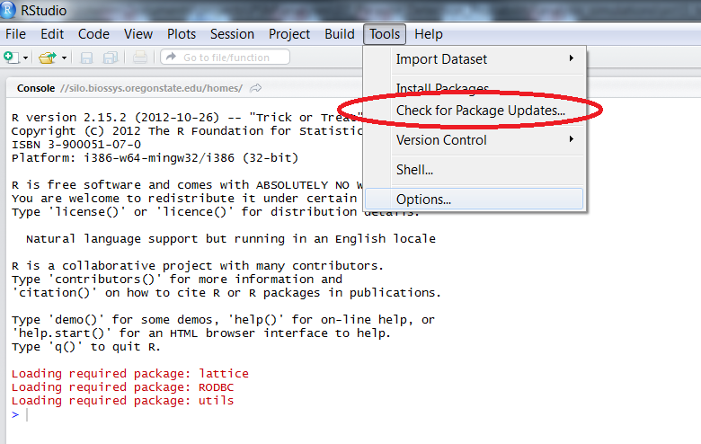


```r
library(tidyverse)
library(gghighlight)
library(cowplot)
library(patchwork)
library(ggforce)
library(ggridges)
```


## 你喜欢哪个图


```r
p1 <- ggplot(mpg, aes(x = cty, y = hwy)) +
  geom_point() +
  geom_smooth() +
  labs(title = "1: geom_point() + geom_smooth()") +
  theme(plot.title = element_text(face = "bold"))

p2 <- ggplot(mpg, aes(x = cty, y = hwy)) +
  geom_hex() +
  labs(title = "2: geom_hex()") +
  guides(fill = FALSE) +
  theme(plot.title = element_text(face = "bold"))
```

```
## Warning: The `<scale>` argument of `guides()` cannot be `FALSE`. Use "none" instead as
## of ggplot2 3.3.4.
## This warning is displayed once every 8 hours.
## Call `lifecycle::last_lifecycle_warnings()` to see where this warning was
## generated.
```

```r
p3 <- ggplot(mpg, aes(x = drv, fill = drv)) +
  geom_bar() +
  labs(title = "3: geom_bar()") +
  guides(fill = FALSE) +
  theme(plot.title = element_text(face = "bold"))

p4 <- ggplot(mpg, aes(x = cty)) +
  geom_histogram(binwidth = 2, color = "white") +
  labs(title = "4: geom_histogram()") +
  theme(plot.title = element_text(face = "bold"))

p5 <- ggplot(mpg, aes(x = cty, y = drv, fill = drv)) +
  geom_violin() +
  guides(fill = FALSE) +
  labs(title = "5: geom_violin()") +
  theme(plot.title = element_text(face = "bold"))

p6 <- ggplot(mpg, aes(x = cty, y = drv, fill = drv)) +
  geom_boxplot() +
  guides(fill = FALSE) +
  labs(title = "6: geom_boxplot()") +
  theme(plot.title = element_text(face = "bold"))

p7 <- ggplot(mpg, aes(x = cty, fill = drv)) +
  geom_density(alpha = 0.7) +
  guides(fill = FALSE) +
  labs(title = "7: geom_density()") +
  theme(plot.title = element_text(face = "bold"))

p8 <- ggplot(mpg, aes(x = cty, y = drv, fill = drv)) +
  geom_density_ridges() +
  guides(fill = FALSE) +
  labs(title = "8: ggridges::geom_density_ridges()") +
  theme(plot.title = element_text(face = "bold"))

p9 <- ggplot(mpg, aes(x = cty, y = hwy)) +
  geom_density_2d() +
  labs(title = "9: geom_density_2d()") +
  theme(plot.title = element_text(face = "bold"))

p1 + p2 + p3 + p4 + p5 + p6 + p7 + p8 + p9 +
  plot_layout(nrow = 3)
```

```
## `geom_smooth()` using method = 'loess' and formula = 'y ~ x'
## Picking joint bandwidth of 0.879
```

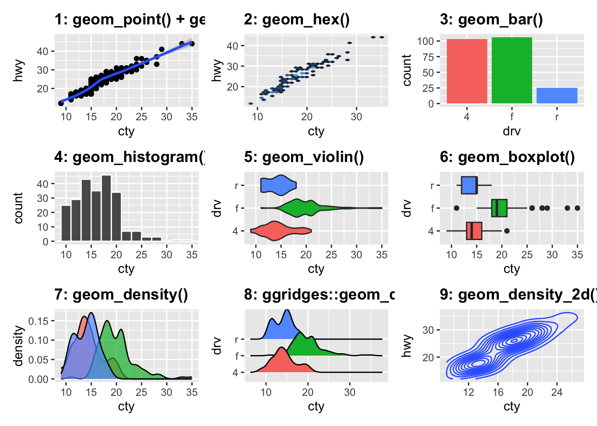


## 定制

### 标签 


```r
gapdata <- read_csv("./demo_data/gapminder.csv")
```

```
## Rows: 1704 Columns: 6
## ── Column specification ────────────────────────────────────────────────────────
## Delimiter: ","
## chr (2): country, continent
## dbl (4): year, lifeExp, pop, gdpPercap
## 
## ℹ Use `spec()` to retrieve the full column specification for this data.
## ℹ Specify the column types or set `show_col_types = FALSE` to quiet this message.
```

```r
gapdata
```

```
## # A tibble: 1,704 × 6
##    country     continent  year lifeExp      pop gdpPercap
##    <chr>       <chr>     <dbl>   <dbl>    <dbl>     <dbl>
##  1 Afghanistan Asia       1952    28.8  8425333      779.
##  2 Afghanistan Asia       1957    30.3  9240934      821.
##  3 Afghanistan Asia       1962    32.0 10267083      853.
##  4 Afghanistan Asia       1967    34.0 11537966      836.
##  5 Afghanistan Asia       1972    36.1 13079460      740.
##  6 Afghanistan Asia       1977    38.4 14880372      786.
##  7 Afghanistan Asia       1982    39.9 12881816      978.
##  8 Afghanistan Asia       1987    40.8 13867957      852.
##  9 Afghanistan Asia       1992    41.7 16317921      649.
## 10 Afghanistan Asia       1997    41.8 22227415      635.
## # ℹ 1,694 more rows
```


```r
gapdata %>%
  ggplot(aes(x = gdpPercap, y = lifeExp, color = continent)) +
  geom_point() +
  scale_x_log10() +
  ggtitle("My Plot Title") +
  xlab("The X Variable") +
  ylab("The Y Variable")
```

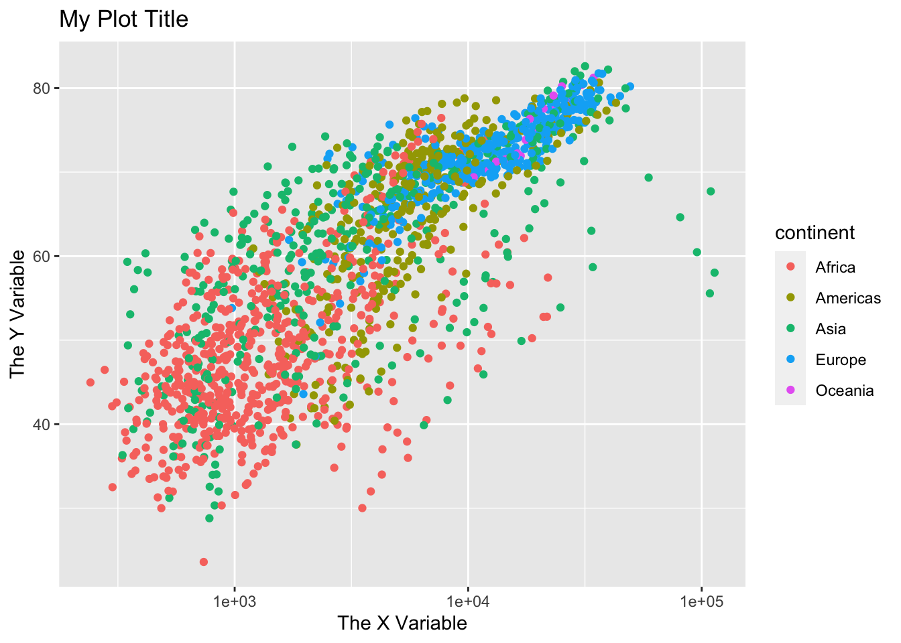


```r
gapdata %>%
  ggplot(aes(x = gdpPercap, y = lifeExp, color = continent)) +
  geom_point() +
  scale_x_log10() +
  labs(
    title = "My Plot Title",
    subtitle = "My Plot subtitle",
    x = "The X Variable",
    y = "The Y Variable"
  )
```

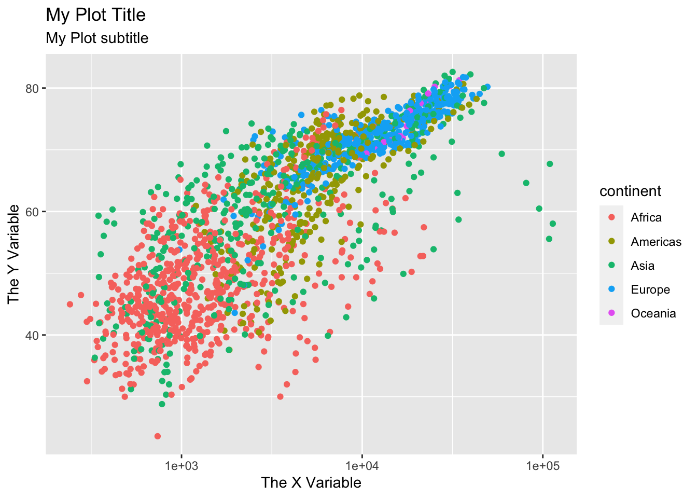


### 定制颜色

 我喜欢用这两个函数定制喜欢的绘图色彩，`scale_colour_manual()` 和 `scale_fill_manual()`. 更多方法可以参考 [Colours chapter in Cookbook for R](http://www.cookbook-r.com/Graphs/Colors_(ggplot2)/) 


```r
gapdata %>%
  ggplot(aes(x = gdpPercap, y = lifeExp, color = continent)) +
  geom_point() +
  scale_x_log10() +
  scale_color_manual(
    values = c("#195744", "#008148", "#C6C013", "#EF8A17", "#EF2917")
  )
```

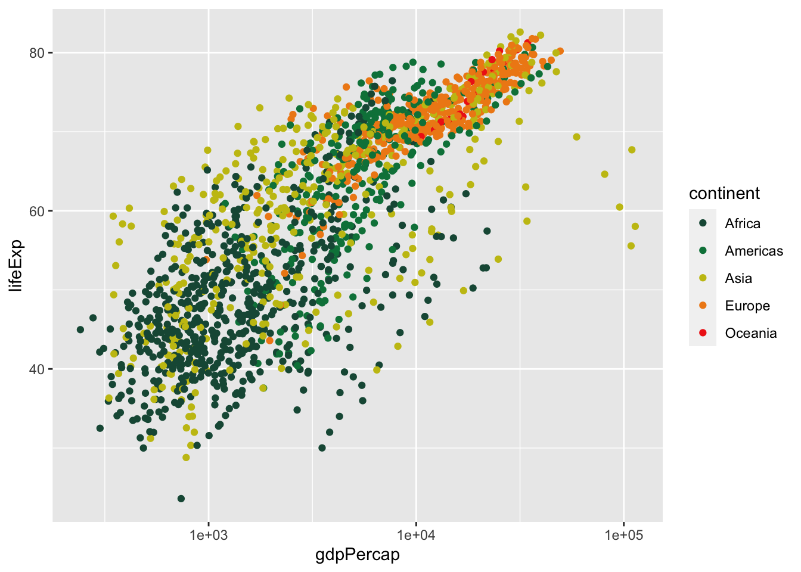
 

## 组合图片

我们有时候想把多张图组合到一起

### cowplot

可以使用 [`cowplot`](https://cran.r-project.org/web/packages/cowplot/vignettes/introduction.html) 宏包的`plot_grid()`函数完成多张图片的组合，使用方法很简单。


```r
p1 <- gapdata %>%
  ggplot(aes(x = gdpPercap, y = lifeExp)) +
  geom_point(aes(color = lifeExp > mean(lifeExp))) +
  scale_x_log10() +
  theme(legend.position = "none") +
  scale_color_manual(values = c("orange", "pink")) +
  labs(
    title = "My Plot Title",
    x = "The X Variable",
    y = "The Y Variable"
  )
```


```r
p2 <- gapdata %>%
  ggplot(aes(x = gdpPercap, y = lifeExp, color = continent)) +
  geom_point() +
  scale_x_log10() +
  scale_color_manual(
    values = c("#195744", "#008148", "#C6C013", "#EF8A17", "#EF2917")
  ) +
  theme(legend.position = "none") +
  labs(
    title = "My Plot Title",
    x = "The X Variable",
    y = "The Y Variable"
  )
```


```r
cowplot::plot_grid(
  p1,
  p2,
  labels = c("A", "B")
)
```

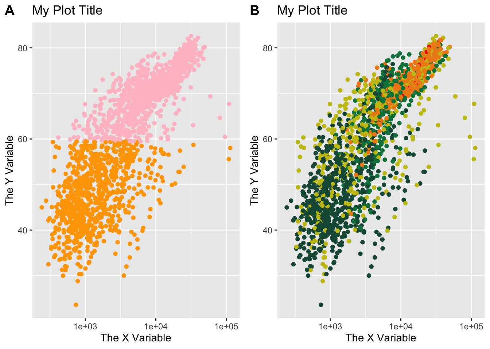


也可以使用patchwork宏包，更简单的方法

```r
library(patchwork)
p1 + p2
```

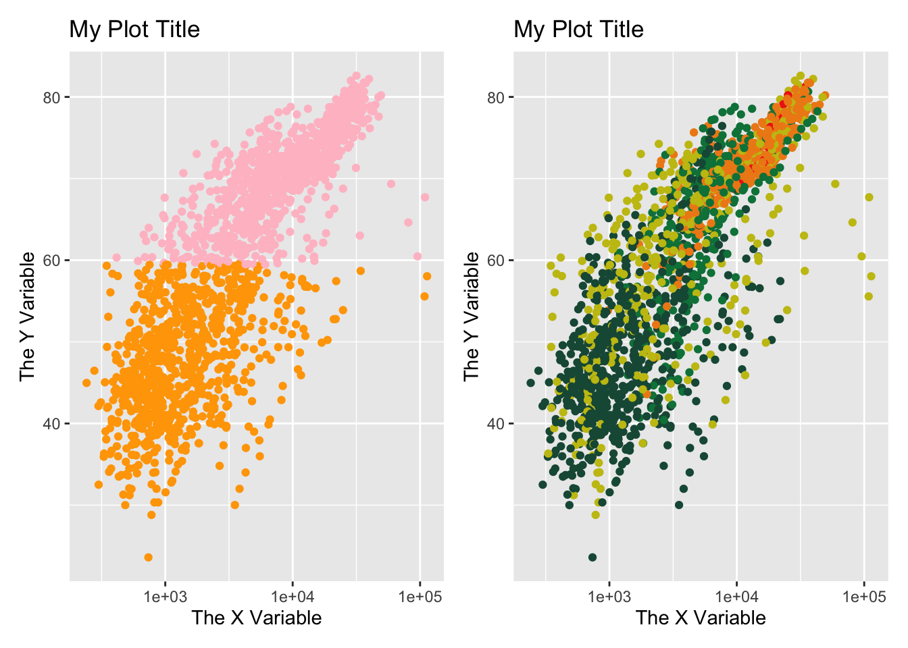


```r
p1 / p2
```

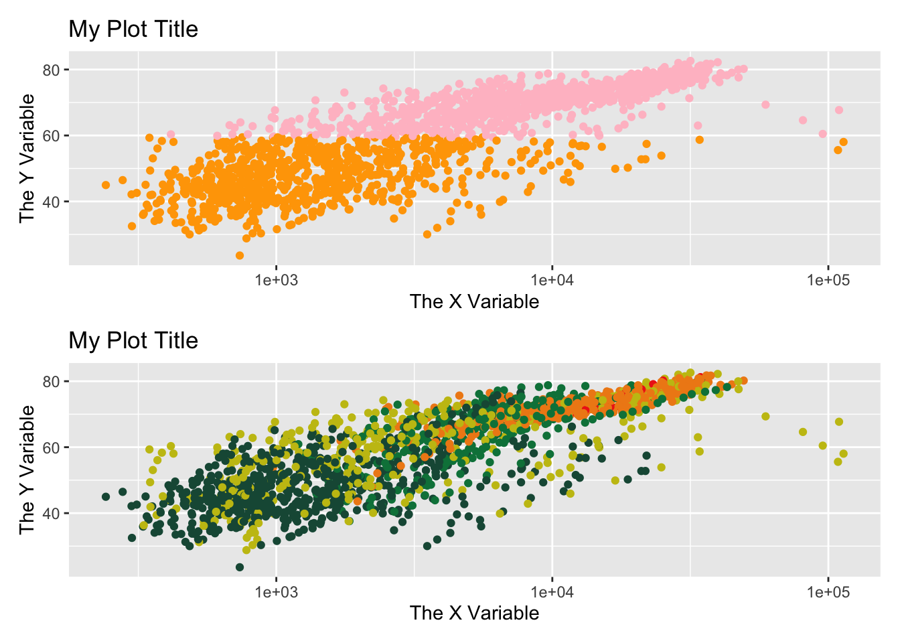


```r
p1 + p2 +
  plot_annotation(
    tag_levels = "A",
    title = "The surprising truth about mtcars",
    subtitle = "These 3 plots will reveal yet-untold secrets about our beloved data-set",
    caption = "Disclaimer: None of these plots are insightful"
  )
```

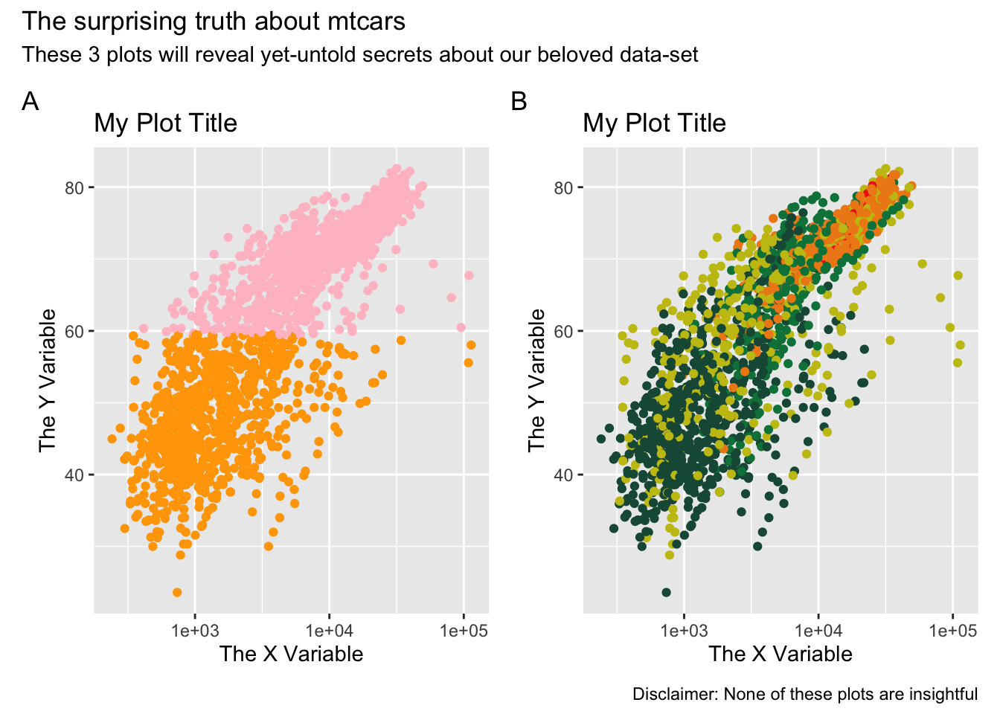

再来一个


```r
library(palmerpenguins)

g1 <- penguins %>% 
  ggplot(aes(bill_length_mm, body_mass_g, color = species)) +
  geom_point() + 
  theme_bw(base_size = 14) +
  labs(tag = "(A)", x = "Bill length (mm)", y = "Body mass (g)", color = "Species")
       
g2 <- penguins %>% 
  ggplot(aes(bill_length_mm, bill_depth_mm, color = species)) +
  geom_point() + 
  theme_bw(base_size = 14) +
  labs(tag = "(B)", x = "Bill length (mm)", y = "Bill depth (mm)",  color = "Species")
         
g1 + g2 + patchwork::plot_layout(guides = "collect")
```

```
## Warning: Removed 2 rows containing missing values (`geom_point()`).
## Removed 2 rows containing missing values (`geom_point()`).
```

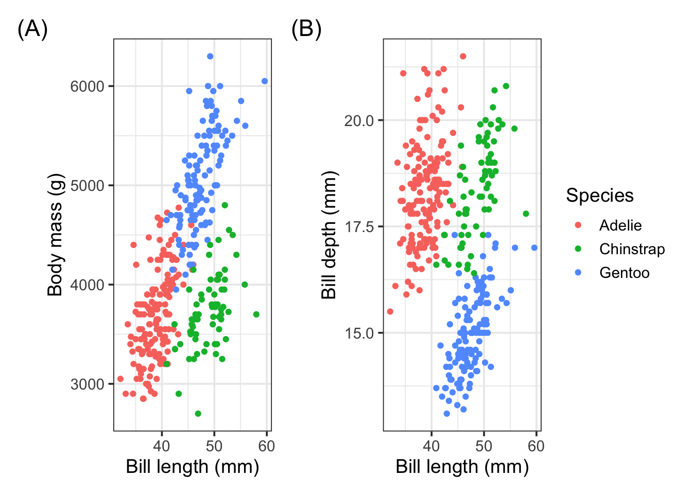

patchwork 使用方法很简单，根本不需要记


<!-- ### 保存图片 -->

<!-- 使用`ggsave()`函数，将图片保存为所需要的格式，如".pdf", ".png"等， 还可以指定图片的高度和宽度，默认`units`是英寸，也可以使用"cm", or "mm". -->

<!-- ```{r ggsave-example} -->
<!-- pp <- gapdata %>% -->
<!--   ggplot(aes(x = gdpPercap, y = lifeExp, color = continent)) + -->
<!--   geom_point() + -->
<!--   scale_x_log10() + -->
<!--   scale_color_manual( -->
<!--     values = c("#195744", "#008148", "#C6C013", "#EF8A17", "#EF2917") -->
<!--   ) + -->
<!--   theme(legend.position = "none") + -->
<!--   labs( -->
<!--     title = "My Plot Title", -->
<!--     x = "The X Variable", -->
<!--     y = "The Y Variable" -->
<!--   ) -->

<!-- # ggsave("demo_plot.pdf", plot = pp, width = 8, height = 6) -->
<!-- ``` -->


## 高亮某一组
画图很容易，然而画一张好图，不容易。图片质量好不好，其原则就是**不增加看图者的心智负担**，有些图片的色彩很丰富，然而需要看图人配合文字和图注等信息才能看懂作者想表达的意思，这样就失去了图片“一图胜千言”的价值。


分析数据过程中，我们可以使用**高亮**我们某组数据，**突出**我们想表达的信息，是非常好的一种可视化探索手段。


### ggplot2方法

这种方法是将**背景部分**和**高亮部分**分两步来画


```r
drop_facet <- function(x) select(x, -continent)

gapdata %>%
  ggplot() +
  geom_line(
    data = drop_facet,
    aes(x = year, y = lifeExp, group = country), color = "grey",
  ) +
  geom_line(aes(x = year, y = lifeExp, color = country, group = country)) +
  facet_wrap(vars(continent)) +
  theme(legend.position = "none")
```

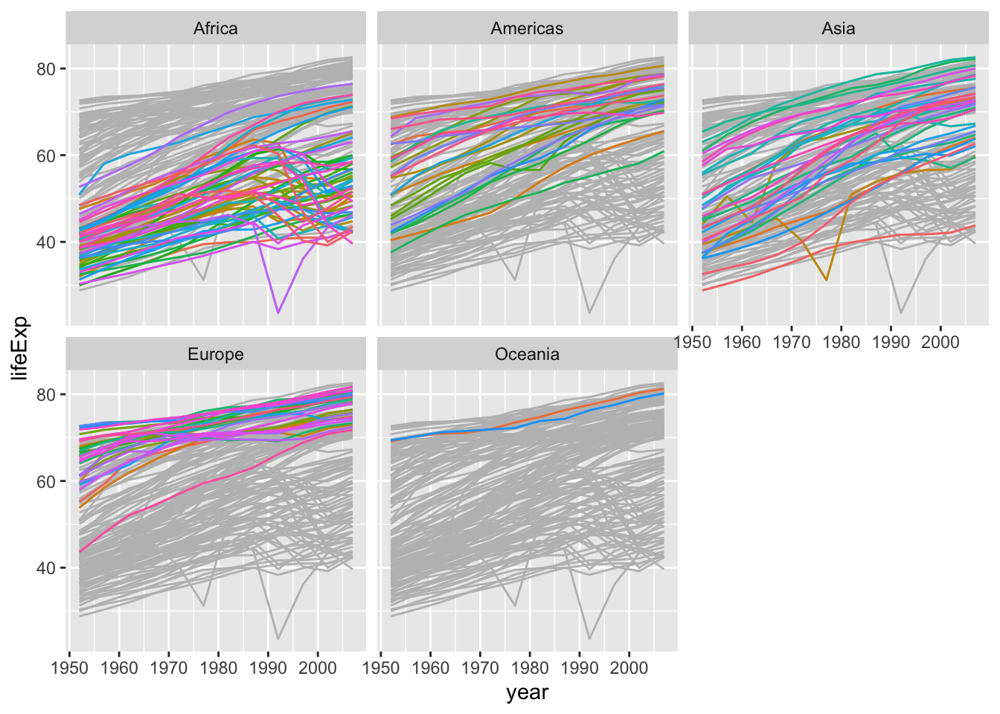

再来一个

```r
gapdata %>%
  mutate(group = country) %>%
  filter(continent == "Asia") %>%
  ggplot() +
  geom_line(
    data = function(d) select(d, -country),
    aes(x = year, y = lifeExp, group = group), color = "grey",
  ) +
  geom_line(aes(x = year, y = lifeExp, group = country), color = "red") +
  facet_wrap(vars(country)) +
  theme(legend.position = "none")
```

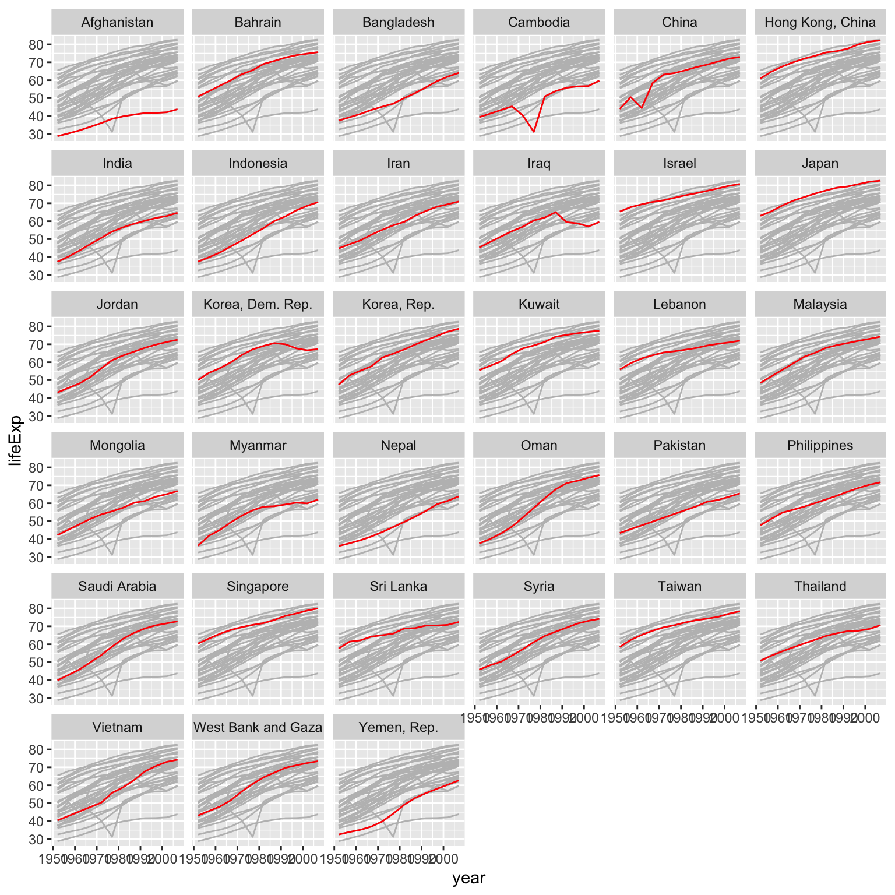


### gghighlight方法

这里推荐[gghighlight宏包](<https://yutannihilation.github.io/gghighlight/articles/gghighlight.html>)

- dplyr has filter()
- ggplot has Highlighting


```r
gapdata %>% filter(country == "China")
```

```
## # A tibble: 12 × 6
##    country continent  year lifeExp        pop gdpPercap
##    <chr>   <chr>     <dbl>   <dbl>      <dbl>     <dbl>
##  1 China   Asia       1952    44    556263527      400.
##  2 China   Asia       1957    50.5  637408000      576.
##  3 China   Asia       1962    44.5  665770000      488.
##  4 China   Asia       1967    58.4  754550000      613.
##  5 China   Asia       1972    63.1  862030000      677.
##  6 China   Asia       1977    64.0  943455000      741.
##  7 China   Asia       1982    65.5 1000281000      962.
##  8 China   Asia       1987    67.3 1084035000     1379.
##  9 China   Asia       1992    68.7 1164970000     1656.
## 10 China   Asia       1997    70.4 1230075000     2289.
## 11 China   Asia       2002    72.0 1280400000     3119.
## 12 China   Asia       2007    73.0 1318683096     4959.
```


```r
gapdata %>%
  ggplot(
    aes(x = year, y = lifeExp, color = continent, group = country)
  ) +
  geom_line() +
  gghighlight(
    country == "China", # which is passed to dplyr::filter().
    label_key = country
  )
```

```
## Warning: Tried to calculate with group_by(), but the calculation failed.
## Falling back to ungrouped filter operation...
```

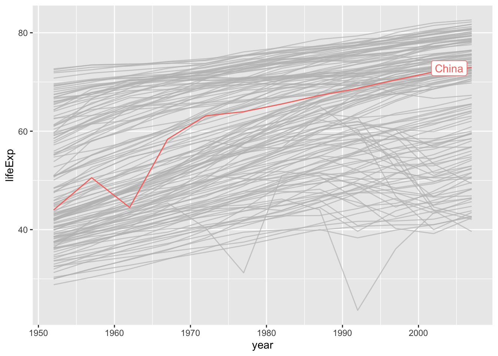


```r
gapdata %>% filter(continent == "Asia")
```

```
## # A tibble: 396 × 6
##    country     continent  year lifeExp      pop gdpPercap
##    <chr>       <chr>     <dbl>   <dbl>    <dbl>     <dbl>
##  1 Afghanistan Asia       1952    28.8  8425333      779.
##  2 Afghanistan Asia       1957    30.3  9240934      821.
##  3 Afghanistan Asia       1962    32.0 10267083      853.
##  4 Afghanistan Asia       1967    34.0 11537966      836.
##  5 Afghanistan Asia       1972    36.1 13079460      740.
##  6 Afghanistan Asia       1977    38.4 14880372      786.
##  7 Afghanistan Asia       1982    39.9 12881816      978.
##  8 Afghanistan Asia       1987    40.8 13867957      852.
##  9 Afghanistan Asia       1992    41.7 16317921      649.
## 10 Afghanistan Asia       1997    41.8 22227415      635.
## # ℹ 386 more rows
```


```r
gapdata %>%
  filter(continent == "Asia") %>%
  ggplot(aes(year, lifeExp, color = country, group = country)) +
  geom_line(size = 1.2, alpha = .9, color = "#E58C23") +
  theme_minimal(base_size = 14) +
  theme(
    legend.position = "none",
    panel.grid.major.x = element_blank(),
    panel.grid.minor = element_blank()
  ) +
  gghighlight(
    country %in% c("China", "India", "Japan", "Korea, Rep."),
    use_group_by = FALSE,
    use_direct_label = FALSE,
    unhighlighted_params = list(color = "grey90")
  ) +
  facet_wrap(vars(country))
```

```
## Warning: Using `size` aesthetic for lines was deprecated in ggplot2 3.4.0.
## ℹ Please use `linewidth` instead.
## This warning is displayed once every 8 hours.
## Call `lifecycle::last_lifecycle_warnings()` to see where this warning was
## generated.
```

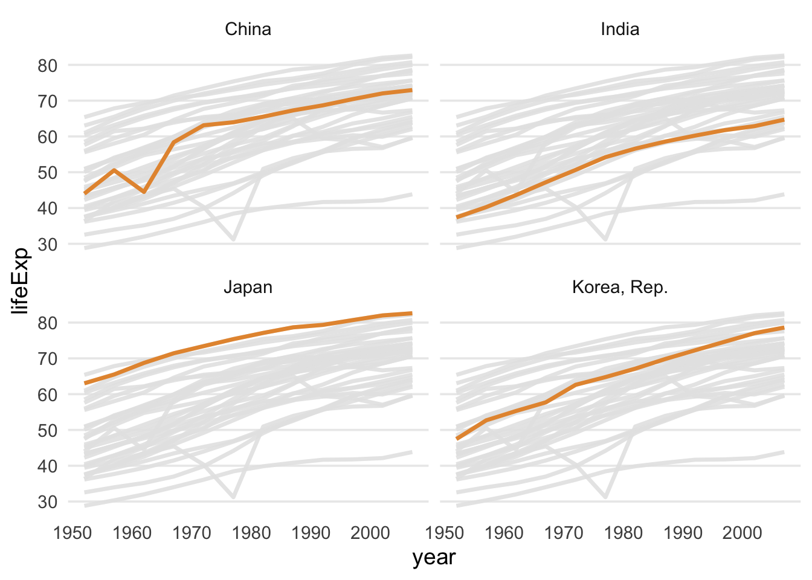


## 3D效果


```r
library(ggfx) 
# https://github.com/thomasp85/ggfx

mtcars %>% 
  ggplot(aes(mpg, disp)) +
  with_shadow(
    geom_smooth(alpha = 1), sigma = 4 
  ) +
  with_shadow(
    geom_point(), sigma = 4
  )
```

```
## `geom_smooth()` using method = 'loess' and formula = 'y ~ x'
```

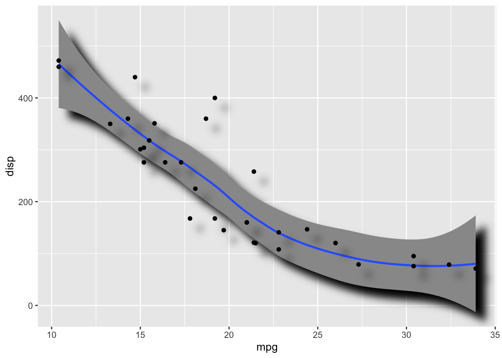

## 弯曲文本
弯曲文本，使其匹配多种图形的轨迹。

```r
library(geomtextpath) # remotes::install_github("AllanCameron/geomtextpath")
```


```r
iris %>% 
  ggplot(aes(x = Sepal.Length, colour = Species, label = Species)) +
  geom_textdensity(size = 6, fontface = 2, hjust = 0.2, vjust = 0.3) +
  theme(legend.position = "none")
```

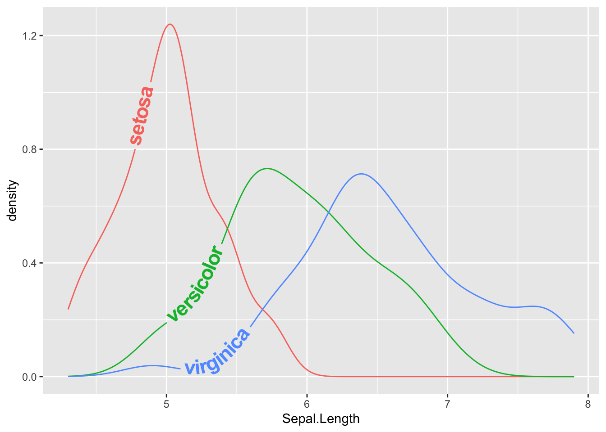


```r
library(palmerpenguins)
penguins %>% 
  ggplot(aes(x = bill_length_mm, y = bill_depth_mm, color = species)) +
  geom_point(alpha = 0.3) +
  geom_labelsmooth(aes(label = species), method = "loess", size = 5, linewidth = 1) +
  scale_colour_manual(values = c("forestgreen", "deepskyblue4", "tomato4")) +
  theme(legend.position = "none")
```

```
## `geom_smooth()` using formula = 'y ~ x'
```

```
## Warning: Removed 2 rows containing non-finite values (`stat_smooth()`).
```

```
## Warning: Removed 2 rows containing missing values (`geom_point()`).
```

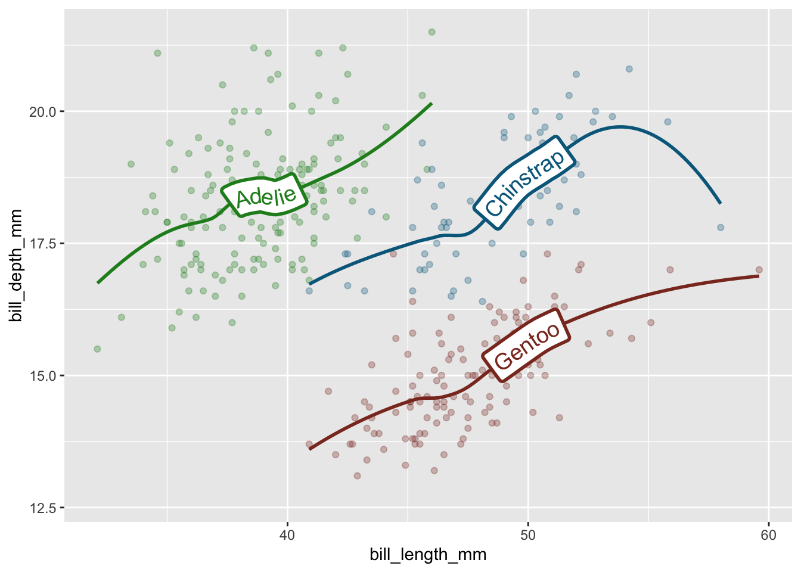

更多风格可参见[https://github.com/AllanCameron/geomtextpath](https://github.com/AllanCameron/geomtextpath)


## 函数图

有时候我们想画一个函数图，比如正态分布的函数，可能会想到先产生数据，然后画图，比如下面的代码


```r
tibble(x = seq(from = -3, to = 3, by = .01)) %>%
  mutate(y = dnorm(x, mean = 0, sd = 1)) %>%
  ggplot(aes(x = x, y = y)) +
  geom_line(color = "grey33")
```


事实上，`stat_function()`可以简化这个过程

```r
ggplot(data = data.frame(x = c(-3, 3)), aes(x = x)) +
  stat_function(fun = dnorm)
```

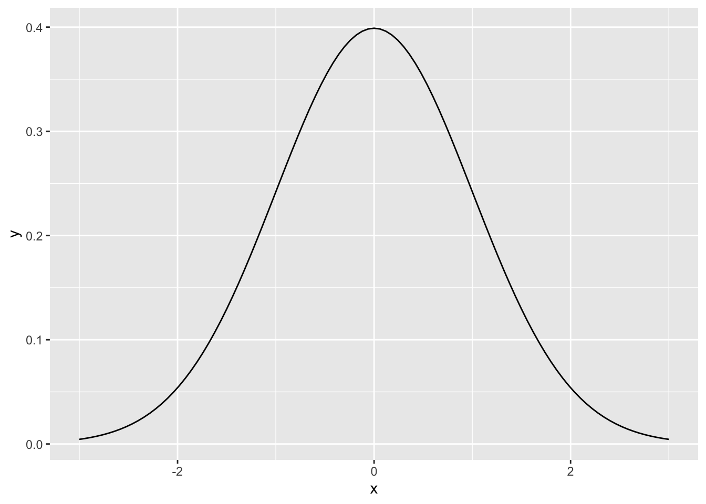


当然我们也可以绘制自定义函数

```r
myfun <- function(x) {
  (x - 1)**2
}

ggplot(data = data.frame(x = c(-1, 3)), aes(x = x)) +
  stat_function(fun = myfun, geom = "line", colour = "red")
```

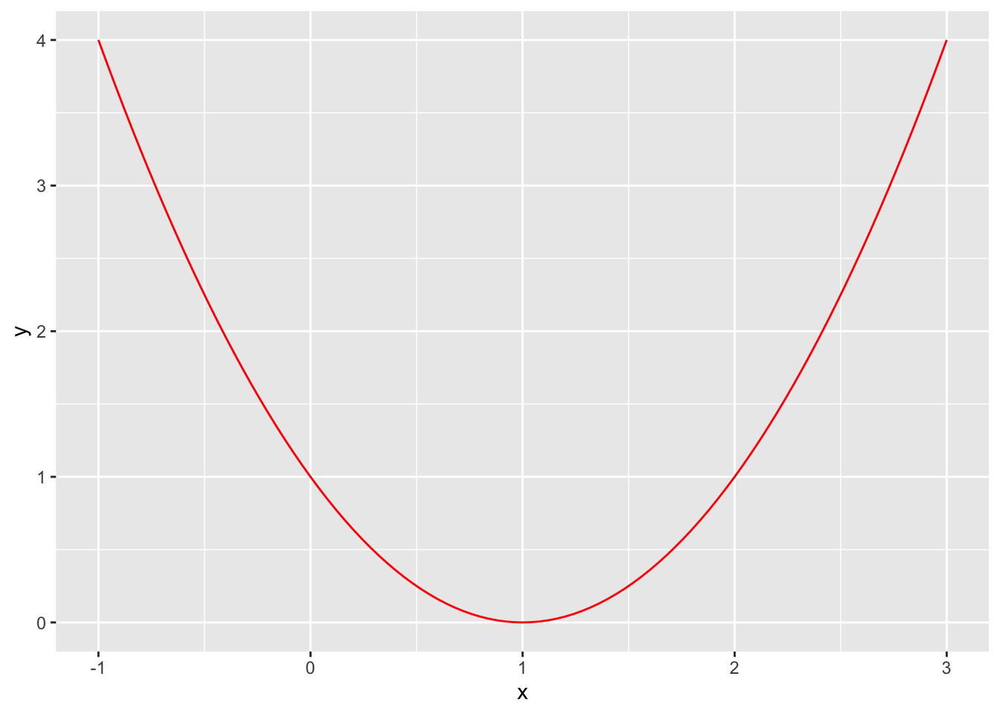


下面这是一个很不错的例子，细细体会下

```r
d <- tibble(x = rnorm(2000, mean = 2, sd = 4))

ggplot(data = d, aes(x = x)) +
  geom_histogram(aes(y = after_stat(density))) +
  geom_density() +
  stat_function(fun = dnorm, args = list(mean = 2, sd = 4), colour = "red")
```

```
## `stat_bin()` using `bins = 30`. Pick better value with `binwidth`.
```

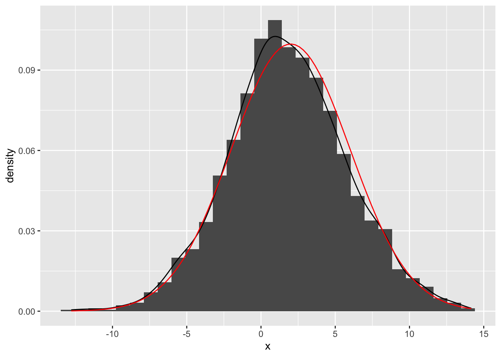


## 字体

如果想使用不同的字体，可以用`theme()` 的 `element_text()` 函数

- `family`: font family 
- `face` : bold, italic, bold.italic, plain 
- `color`, `size`, `angle`, etc. 
    
其中，`family = `字体名，可以用 [`extrafont`](https://github.com/wch/extrafont) 导入`C:\Windows\Fonts\`的字体，然后选取


```r
library(extrafont)
font_import() # will take 2-3 minutes. Only need to run once
loadfonts()
fonts()
fonttable()
```


```r
mpg %>% 
  ggplot() +
  geom_jitter(aes(x = cty, y = hwy, color = class)) +
  theme(text = element_text(family = "Peralta"))
```

```
## Warning in grid.Call(C_stringMetric, as.graphicsAnnot(x$label)): no font could
## be found for family "Peralta"

## Warning in grid.Call(C_stringMetric, as.graphicsAnnot(x$label)): no font could
## be found for family "Peralta"

## Warning in grid.Call(C_stringMetric, as.graphicsAnnot(x$label)): no font could
## be found for family "Peralta"

## Warning in grid.Call(C_stringMetric, as.graphicsAnnot(x$label)): no font could
## be found for family "Peralta"

## Warning in grid.Call(C_stringMetric, as.graphicsAnnot(x$label)): no font could
## be found for family "Peralta"

## Warning in grid.Call(C_stringMetric, as.graphicsAnnot(x$label)): no font could
## be found for family "Peralta"

## Warning in grid.Call(C_stringMetric, as.graphicsAnnot(x$label)): no font could
## be found for family "Peralta"

## Warning in grid.Call(C_stringMetric, as.graphicsAnnot(x$label)): no font could
## be found for family "Peralta"

## Warning in grid.Call(C_stringMetric, as.graphicsAnnot(x$label)): no font could
## be found for family "Peralta"

## Warning in grid.Call(C_stringMetric, as.graphicsAnnot(x$label)): no font could
## be found for family "Peralta"

## Warning in grid.Call(C_stringMetric, as.graphicsAnnot(x$label)): no font could
## be found for family "Peralta"

## Warning in grid.Call(C_stringMetric, as.graphicsAnnot(x$label)): no font could
## be found for family "Peralta"

## Warning in grid.Call(C_stringMetric, as.graphicsAnnot(x$label)): no font could
## be found for family "Peralta"

## Warning in grid.Call(C_stringMetric, as.graphicsAnnot(x$label)): no font could
## be found for family "Peralta"

## Warning in grid.Call(C_stringMetric, as.graphicsAnnot(x$label)): no font could
## be found for family "Peralta"

## Warning in grid.Call(C_stringMetric, as.graphicsAnnot(x$label)): no font could
## be found for family "Peralta"

## Warning in grid.Call(C_stringMetric, as.graphicsAnnot(x$label)): no font could
## be found for family "Peralta"

## Warning in grid.Call(C_stringMetric, as.graphicsAnnot(x$label)): no font could
## be found for family "Peralta"

## Warning in grid.Call(C_stringMetric, as.graphicsAnnot(x$label)): no font could
## be found for family "Peralta"

## Warning in grid.Call(C_stringMetric, as.graphicsAnnot(x$label)): no font could
## be found for family "Peralta"

## Warning in grid.Call(C_stringMetric, as.graphicsAnnot(x$label)): no font could
## be found for family "Peralta"

## Warning in grid.Call(C_stringMetric, as.graphicsAnnot(x$label)): no font could
## be found for family "Peralta"

## Warning in grid.Call(C_stringMetric, as.graphicsAnnot(x$label)): no font could
## be found for family "Peralta"

## Warning in grid.Call(C_stringMetric, as.graphicsAnnot(x$label)): no font could
## be found for family "Peralta"

## Warning in grid.Call(C_stringMetric, as.graphicsAnnot(x$label)): no font could
## be found for family "Peralta"

## Warning in grid.Call(C_stringMetric, as.graphicsAnnot(x$label)): no font could
## be found for family "Peralta"

## Warning in grid.Call(C_stringMetric, as.graphicsAnnot(x$label)): no font could
## be found for family "Peralta"

## Warning in grid.Call(C_stringMetric, as.graphicsAnnot(x$label)): no font could
## be found for family "Peralta"
```

```
## Warning in grid.Call(C_textBounds, as.graphicsAnnot(x$label), x$x, x$y, : no
## font could be found for family "Peralta"
```

```
## Warning in grid.Call(C_textBounds, as.graphicsAnnot(x$label), x$x, x$y, :
## Unable to calculate text width/height (using zero)
```

```
## Warning in grid.Call(C_textBounds, as.graphicsAnnot(x$label), x$x, x$y, : no
## font could be found for family "Peralta"
```

```
## Warning in grid.Call(C_textBounds, as.graphicsAnnot(x$label), x$x, x$y, :
## Unable to calculate text width/height (using zero)
```

```
## Warning in grid.Call(C_textBounds, as.graphicsAnnot(x$label), x$x, x$y, : no
## font could be found for family "Peralta"
```

```
## Warning in grid.Call(C_textBounds, as.graphicsAnnot(x$label), x$x, x$y, :
## Unable to calculate text width/height (using zero)
```

```
## Warning in grid.Call(C_textBounds, as.graphicsAnnot(x$label), x$x, x$y, : no
## font could be found for family "Peralta"
```

```
## Warning in grid.Call(C_textBounds, as.graphicsAnnot(x$label), x$x, x$y, :
## Unable to calculate text width/height (using zero)
```

```
## Warning in grid.Call(C_textBounds, as.graphicsAnnot(x$label), x$x, x$y, : no
## font could be found for family "Peralta"
```

```
## Warning in grid.Call(C_textBounds, as.graphicsAnnot(x$label), x$x, x$y, :
## Unable to calculate text width/height (using zero)
```

```
## Warning in grid.Call(C_textBounds, as.graphicsAnnot(x$label), x$x, x$y, : no
## font could be found for family "Peralta"
```

```
## Warning in grid.Call(C_textBounds, as.graphicsAnnot(x$label), x$x, x$y, :
## Unable to calculate text width/height (using zero)
```

```
## Warning in grid.Call(C_textBounds, as.graphicsAnnot(x$label), x$x, x$y, : no
## font could be found for family "Peralta"
```

```
## Warning in grid.Call(C_textBounds, as.graphicsAnnot(x$label), x$x, x$y, :
## Unable to calculate text width/height (using zero)
```

```
## Warning in grid.Call(C_textBounds, as.graphicsAnnot(x$label), x$x, x$y, : no
## font could be found for family "Peralta"
```

```
## Warning in grid.Call(C_textBounds, as.graphicsAnnot(x$label), x$x, x$y, :
## Unable to calculate text width/height (using zero)
```

```
## Warning in grid.Call(C_textBounds, as.graphicsAnnot(x$label), x$x, x$y, : no
## font could be found for family "Peralta"
```

```
## Warning in grid.Call(C_textBounds, as.graphicsAnnot(x$label), x$x, x$y, :
## Unable to calculate text width/height (using zero)
```

```
## Warning in grid.Call(C_textBounds, as.graphicsAnnot(x$label), x$x, x$y, : no
## font could be found for family "Peralta"
```

```
## Warning in grid.Call(C_textBounds, as.graphicsAnnot(x$label), x$x, x$y, :
## Unable to calculate text width/height (using zero)
```

```
## Warning in grid.Call(C_textBounds, as.graphicsAnnot(x$label), x$x, x$y, : no
## font could be found for family "Peralta"

## Warning in grid.Call(C_textBounds, as.graphicsAnnot(x$label), x$x, x$y, : no
## font could be found for family "Peralta"
```

```
## Warning in grid.Call(C_textBounds, as.graphicsAnnot(x$label), x$x, x$y, :
## Unable to calculate text width/height (using zero)
```

```
## Warning in grid.Call(C_textBounds, as.graphicsAnnot(x$label), x$x, x$y, : no
## font could be found for family "Peralta"
```

```
## Warning in grid.Call(C_textBounds, as.graphicsAnnot(x$label), x$x, x$y, :
## Unable to calculate text width/height (using zero)
```

```
## Warning in grid.Call(C_textBounds, as.graphicsAnnot(x$label), x$x, x$y, : no
## font could be found for family "Peralta"
```

```
## Warning in grid.Call(C_textBounds, as.graphicsAnnot(x$label), x$x, x$y, :
## Unable to calculate text width/height (using zero)
```

```
## Warning in grid.Call(C_textBounds, as.graphicsAnnot(x$label), x$x, x$y, : no
## font could be found for family "Peralta"
```

```
## Warning in grid.Call(C_textBounds, as.graphicsAnnot(x$label), x$x, x$y, :
## Unable to calculate text width/height (using zero)
```

```
## Warning in grid.Call(C_textBounds, as.graphicsAnnot(x$label), x$x, x$y, : no
## font could be found for family "Peralta"
```

```
## Warning in grid.Call(C_textBounds, as.graphicsAnnot(x$label), x$x, x$y, :
## Unable to calculate text width/height (using zero)
```

```
## Warning in grid.Call(C_textBounds, as.graphicsAnnot(x$label), x$x, x$y, : no
## font could be found for family "Peralta"
```

```
## Warning in grid.Call(C_textBounds, as.graphicsAnnot(x$label), x$x, x$y, :
## Unable to calculate text width/height (using zero)
```

```
## Warning in grid.Call(C_textBounds, as.graphicsAnnot(x$label), x$x, x$y, : no
## font could be found for family "Peralta"
```

```
## Warning in grid.Call(C_textBounds, as.graphicsAnnot(x$label), x$x, x$y, :
## Unable to calculate text width/height (using zero)
```

```
## Warning in grid.Call(C_textBounds, as.graphicsAnnot(x$label), x$x, x$y, : no
## font could be found for family "Peralta"
```

```
## Warning in grid.Call(C_textBounds, as.graphicsAnnot(x$label), x$x, x$y, :
## Unable to calculate text width/height (using zero)
```

```
## Warning in grid.Call(C_textBounds, as.graphicsAnnot(x$label), x$x, x$y, : no
## font could be found for family "Peralta"
```

```
## Warning in grid.Call(C_textBounds, as.graphicsAnnot(x$label), x$x, x$y, :
## Unable to calculate text width/height (using zero)
```

```
## Warning in grid.Call(C_textBounds, as.graphicsAnnot(x$label), x$x, x$y, : no
## font could be found for family "Peralta"
```

```
## Warning in grid.Call(C_textBounds, as.graphicsAnnot(x$label), x$x, x$y, :
## Unable to calculate text width/height (using zero)
```

```
## Warning in grid.Call(C_textBounds, as.graphicsAnnot(x$label), x$x, x$y, : no
## font could be found for family "Peralta"
```

```
## Warning in grid.Call(C_textBounds, as.graphicsAnnot(x$label), x$x, x$y, :
## Unable to calculate text width/height (using zero)
```

```
## Warning in grid.Call(C_textBounds, as.graphicsAnnot(x$label), x$x, x$y, : no
## font could be found for family "Peralta"
```

```
## Warning in grid.Call(C_textBounds, as.graphicsAnnot(x$label), x$x, x$y, :
## Unable to calculate text width/height (using zero)
```

```
## Warning in grid.Call(C_textBounds, as.graphicsAnnot(x$label), x$x, x$y, : no
## font could be found for family "Peralta"
```

```
## Warning in grid.Call(C_textBounds, as.graphicsAnnot(x$label), x$x, x$y, :
## Unable to calculate text width/height (using zero)
```

```
## Warning in grid.Call(C_textBounds, as.graphicsAnnot(x$label), x$x, x$y, : no
## font could be found for family "Peralta"
```

```
## Warning in grid.Call(C_textBounds, as.graphicsAnnot(x$label), x$x, x$y, :
## Unable to calculate text width/height (using zero)
```

```
## Warning in grid.Call(C_textBounds, as.graphicsAnnot(x$label), x$x, x$y, : no
## font could be found for family "Peralta"
```

```
## Warning in grid.Call(C_textBounds, as.graphicsAnnot(x$label), x$x, x$y, :
## Unable to calculate text width/height (using zero)
```

```
## Warning in grid.Call(C_textBounds, as.graphicsAnnot(x$label), x$x, x$y, : no
## font could be found for family "Peralta"
```

```
## Warning in grid.Call(C_textBounds, as.graphicsAnnot(x$label), x$x, x$y, :
## Unable to calculate text width/height (using zero)
```

```
## Warning in grid.Call(C_textBounds, as.graphicsAnnot(x$label), x$x, x$y, : no
## font could be found for family "Peralta"
```

```
## Warning in grid.Call(C_textBounds, as.graphicsAnnot(x$label), x$x, x$y, :
## Unable to calculate text width/height (using zero)
```

```
## Warning in grid.Call(C_textBounds, as.graphicsAnnot(x$label), x$x, x$y, : no
## font could be found for family "Peralta"
```

```
## Warning in grid.Call(C_textBounds, as.graphicsAnnot(x$label), x$x, x$y, :
## Unable to calculate text width/height (using zero)
```

```
## Warning in grid.Call(C_textBounds, as.graphicsAnnot(x$label), x$x, x$y, : no
## font could be found for family "Peralta"
```

```
## Warning in grid.Call(C_textBounds, as.graphicsAnnot(x$label), x$x, x$y, :
## Unable to calculate text width/height (using zero)
```

```
## Warning in grid.Call(C_textBounds, as.graphicsAnnot(x$label), x$x, x$y, : no
## font could be found for family "Peralta"
```

```
## Warning in grid.Call(C_textBounds, as.graphicsAnnot(x$label), x$x, x$y, :
## Unable to calculate text width/height (using zero)
```

```
## Warning in grid.Call(C_textBounds, as.graphicsAnnot(x$label), x$x, x$y, : no
## font could be found for family "Peralta"
```

```
## Warning in grid.Call(C_textBounds, as.graphicsAnnot(x$label), x$x, x$y, :
## Unable to calculate text width/height (using zero)
```

```
## Warning in grid.Call(C_textBounds, as.graphicsAnnot(x$label), x$x, x$y, : no
## font could be found for family "Peralta"
```

```
## Warning in grid.Call(C_textBounds, as.graphicsAnnot(x$label), x$x, x$y, :
## Unable to calculate text width/height (using zero)
```

```
## Warning in grid.Call(C_textBounds, as.graphicsAnnot(x$label), x$x, x$y, : no
## font could be found for family "Peralta"
```

```
## Warning in grid.Call(C_textBounds, as.graphicsAnnot(x$label), x$x, x$y, :
## Unable to calculate text width/height (using zero)
```

```
## Warning in grid.Call(C_textBounds, as.graphicsAnnot(x$label), x$x, x$y, : no
## font could be found for family "Peralta"
```

```
## Warning in grid.Call(C_textBounds, as.graphicsAnnot(x$label), x$x, x$y, :
## Unable to calculate text width/height (using zero)
```

```
## Warning in grid.Call(C_textBounds, as.graphicsAnnot(x$label), x$x, x$y, : no
## font could be found for family "Peralta"
```

```
## Warning in grid.Call(C_textBounds, as.graphicsAnnot(x$label), x$x, x$y, :
## Unable to calculate text width/height (using zero)
```

```
## Warning in grid.Call(C_textBounds, as.graphicsAnnot(x$label), x$x, x$y, : no
## font could be found for family "Peralta"
```

```
## Warning in grid.Call(C_textBounds, as.graphicsAnnot(x$label), x$x, x$y, :
## Unable to calculate text width/height (using zero)
```

```
## Warning in grid.Call(C_textBounds, as.graphicsAnnot(x$label), x$x, x$y, : no
## font could be found for family "Peralta"
```

```
## Warning in grid.Call(C_textBounds, as.graphicsAnnot(x$label), x$x, x$y, :
## Unable to calculate text width/height (using zero)
```

```
## Warning in grid.Call(C_textBounds, as.graphicsAnnot(x$label), x$x, x$y, : no
## font could be found for family "Peralta"
```

```
## Warning in grid.Call(C_textBounds, as.graphicsAnnot(x$label), x$x, x$y, :
## Unable to calculate text width/height (using zero)
```

```
## Warning in grid.Call(C_textBounds, as.graphicsAnnot(x$label), x$x, x$y, : no
## font could be found for family "Peralta"
```

```
## Warning in grid.Call(C_textBounds, as.graphicsAnnot(x$label), x$x, x$y, :
## Unable to calculate text width/height (using zero)
```

```
## Warning in grid.Call(C_textBounds, as.graphicsAnnot(x$label), x$x, x$y, : no
## font could be found for family "Peralta"
```

```
## Warning in grid.Call(C_textBounds, as.graphicsAnnot(x$label), x$x, x$y, :
## Unable to calculate text width/height (using zero)
```

```
## Warning in grid.Call(C_textBounds, as.graphicsAnnot(x$label), x$x, x$y, : no
## font could be found for family "Peralta"
```

```
## Warning in grid.Call(C_textBounds, as.graphicsAnnot(x$label), x$x, x$y, :
## Unable to calculate text width/height (using zero)
```

```
## Warning in grid.Call(C_textBounds, as.graphicsAnnot(x$label), x$x, x$y, : no
## font could be found for family "Peralta"
```

```
## Warning in grid.Call(C_textBounds, as.graphicsAnnot(x$label), x$x, x$y, :
## Unable to calculate text width/height (using zero)
```

```
## Warning in grid.Call(C_textBounds, as.graphicsAnnot(x$label), x$x, x$y, : no
## font could be found for family "Peralta"
```

```
## Warning in grid.Call(C_textBounds, as.graphicsAnnot(x$label), x$x, x$y, :
## Unable to calculate text width/height (using zero)
```

```
## Warning in grid.Call(C_textBounds, as.graphicsAnnot(x$label), x$x, x$y, : no
## font could be found for family "Peralta"
```

```
## Warning in grid.Call(C_textBounds, as.graphicsAnnot(x$label), x$x, x$y, :
## Unable to calculate text width/height (using zero)
```

```
## Warning in grid.Call(C_textBounds, as.graphicsAnnot(x$label), x$x, x$y, : no
## font could be found for family "Peralta"
```

```
## Warning in grid.Call(C_textBounds, as.graphicsAnnot(x$label), x$x, x$y, :
## Unable to calculate text width/height (using zero)
```

```
## Warning in grid.Call(C_textBounds, as.graphicsAnnot(x$label), x$x, x$y, : no
## font could be found for family "Peralta"
```

```
## Warning in grid.Call(C_textBounds, as.graphicsAnnot(x$label), x$x, x$y, :
## Unable to calculate text width/height (using zero)
```

```
## Warning in grid.Call(C_textBounds, as.graphicsAnnot(x$label), x$x, x$y, : no
## font could be found for family "Peralta"
```

```
## Warning in grid.Call(C_textBounds, as.graphicsAnnot(x$label), x$x, x$y, :
## Unable to calculate text width/height (using zero)
```

```
## Warning in grid.Call(C_textBounds, as.graphicsAnnot(x$label), x$x, x$y, : no
## font could be found for family "Peralta"
```

```
## Warning in grid.Call(C_textBounds, as.graphicsAnnot(x$label), x$x, x$y, :
## Unable to calculate text width/height (using zero)
```

```
## Warning in grid.Call(C_textBounds, as.graphicsAnnot(x$label), x$x, x$y, : no
## font could be found for family "Peralta"
```

```
## Warning in grid.Call(C_textBounds, as.graphicsAnnot(x$label), x$x, x$y, :
## Unable to calculate text width/height (using zero)
```

```
## Warning in grid.Call(C_textBounds, as.graphicsAnnot(x$label), x$x, x$y, : no
## font could be found for family "Peralta"
```

```
## Warning in grid.Call(C_textBounds, as.graphicsAnnot(x$label), x$x, x$y, :
## Unable to calculate text width/height (using zero)
```

```
## Warning in grid.Call(C_textBounds, as.graphicsAnnot(x$label), x$x, x$y, : no
## font could be found for family "Peralta"
```

```
## Warning in grid.Call(C_textBounds, as.graphicsAnnot(x$label), x$x, x$y, :
## Unable to calculate text width/height (using zero)
```

```
## Warning in grid.Call(C_textBounds, as.graphicsAnnot(x$label), x$x, x$y, : no
## font could be found for family "Peralta"
```

```
## Warning in grid.Call(C_textBounds, as.graphicsAnnot(x$label), x$x, x$y, :
## Unable to calculate text width/height (using zero)
```

```
## Warning in grid.Call(C_textBounds, as.graphicsAnnot(x$label), x$x, x$y, : no
## font could be found for family "Peralta"
```

```
## Warning in grid.Call(C_textBounds, as.graphicsAnnot(x$label), x$x, x$y, :
## Unable to calculate text width/height (using zero)
```

```
## Warning in grid.Call(C_textBounds, as.graphicsAnnot(x$label), x$x, x$y, : no
## font could be found for family "Peralta"
```

```
## Warning in grid.Call(C_textBounds, as.graphicsAnnot(x$label), x$x, x$y, :
## Unable to calculate text width/height (using zero)
```

```
## Warning in grid.Call(C_textBounds, as.graphicsAnnot(x$label), x$x, x$y, : no
## font could be found for family "Peralta"
```

```
## Warning in grid.Call(C_textBounds, as.graphicsAnnot(x$label), x$x, x$y, :
## Unable to calculate text width/height (using zero)
```

```
## Warning in grid.Call(C_textBounds, as.graphicsAnnot(x$label), x$x, x$y, : no
## font could be found for family "Peralta"
```

```
## Warning in grid.Call(C_textBounds, as.graphicsAnnot(x$label), x$x, x$y, :
## Unable to calculate text width/height (using zero)
```

```
## Warning in grid.Call(C_textBounds, as.graphicsAnnot(x$label), x$x, x$y, : no
## font could be found for family "Peralta"
```

```
## Warning in grid.Call(C_textBounds, as.graphicsAnnot(x$label), x$x, x$y, :
## Unable to calculate text width/height (using zero)
```

```
## Warning in grid.Call(C_textBounds, as.graphicsAnnot(x$label), x$x, x$y, : no
## font could be found for family "Peralta"
```

```
## Warning in grid.Call(C_textBounds, as.graphicsAnnot(x$label), x$x, x$y, :
## Unable to calculate text width/height (using zero)
```

```
## Warning in grid.Call(C_textBounds, as.graphicsAnnot(x$label), x$x, x$y, : no
## font could be found for family "Peralta"
```

```
## Warning in grid.Call(C_textBounds, as.graphicsAnnot(x$label), x$x, x$y, :
## Unable to calculate text width/height (using zero)
```

```
## Warning in grid.Call(C_textBounds, as.graphicsAnnot(x$label), x$x, x$y, : no
## font could be found for family "Peralta"
```

```
## Warning in grid.Call(C_textBounds, as.graphicsAnnot(x$label), x$x, x$y, :
## Unable to calculate text width/height (using zero)
```

```
## Warning in grid.Call(C_textBounds, as.graphicsAnnot(x$label), x$x, x$y, : no
## font could be found for family "Peralta"
```

```
## Warning in grid.Call(C_textBounds, as.graphicsAnnot(x$label), x$x, x$y, :
## Unable to calculate text width/height (using zero)
```

```
## Warning in grid.Call(C_textBounds, as.graphicsAnnot(x$label), x$x, x$y, : no
## font could be found for family "Peralta"
```

```
## Warning in grid.Call(C_textBounds, as.graphicsAnnot(x$label), x$x, x$y, :
## Unable to calculate text width/height (using zero)
```

```
## Warning in grid.Call(C_textBounds, as.graphicsAnnot(x$label), x$x, x$y, : no
## font could be found for family "Peralta"
```

```
## Warning in grid.Call(C_textBounds, as.graphicsAnnot(x$label), x$x, x$y, :
## Unable to calculate text width/height (using zero)
```

```
## Warning in grid.Call(C_textBounds, as.graphicsAnnot(x$label), x$x, x$y, : no
## font could be found for family "Peralta"
```

```
## Warning in grid.Call(C_textBounds, as.graphicsAnnot(x$label), x$x, x$y, :
## Unable to calculate text width/height (using zero)
```

```
## Warning in grid.Call(C_textBounds, as.graphicsAnnot(x$label), x$x, x$y, : no
## font could be found for family "Peralta"
```

```
## Warning in grid.Call(C_textBounds, as.graphicsAnnot(x$label), x$x, x$y, :
## Unable to calculate text width/height (using zero)
```

```
## Warning in grid.Call(C_textBounds, as.graphicsAnnot(x$label), x$x, x$y, : no
## font could be found for family "Peralta"
```

```
## Warning in grid.Call(C_textBounds, as.graphicsAnnot(x$label), x$x, x$y, :
## Unable to calculate text width/height (using zero)
```

```
## Warning in grid.Call(C_textBounds, as.graphicsAnnot(x$label), x$x, x$y, : no
## font could be found for family "Peralta"
```

```
## Warning in grid.Call(C_textBounds, as.graphicsAnnot(x$label), x$x, x$y, :
## Unable to calculate text width/height (using zero)
```

```
## Warning in grid.Call(C_textBounds, as.graphicsAnnot(x$label), x$x, x$y, : no
## font could be found for family "Peralta"
```

```
## Warning in grid.Call(C_textBounds, as.graphicsAnnot(x$label), x$x, x$y, :
## Unable to calculate text width/height (using zero)
```

```
## Warning in grid.Call(C_textBounds, as.graphicsAnnot(x$label), x$x, x$y, : no
## font could be found for family "Peralta"
```

```
## Warning in grid.Call(C_textBounds, as.graphicsAnnot(x$label), x$x, x$y, :
## Unable to calculate text width/height (using zero)
```

```
## Warning in grid.Call(C_textBounds, as.graphicsAnnot(x$label), x$x, x$y, : no
## font could be found for family "Peralta"
```

```
## Warning in grid.Call(C_textBounds, as.graphicsAnnot(x$label), x$x, x$y, :
## Unable to calculate text width/height (using zero)
```

```
## Warning in grid.Call(C_textBounds, as.graphicsAnnot(x$label), x$x, x$y, : no
## font could be found for family "Peralta"
```

```
## Warning in grid.Call(C_textBounds, as.graphicsAnnot(x$label), x$x, x$y, :
## Unable to calculate text width/height (using zero)
```

```
## Warning in grid.Call(C_textBounds, as.graphicsAnnot(x$label), x$x, x$y, : no
## font could be found for family "Peralta"
```

```
## Warning in grid.Call(C_textBounds, as.graphicsAnnot(x$label), x$x, x$y, :
## Unable to calculate text width/height (using zero)
```

```
## Warning in grid.Call(C_textBounds, as.graphicsAnnot(x$label), x$x, x$y, : no
## font could be found for family "Peralta"
```

```
## Warning in grid.Call(C_textBounds, as.graphicsAnnot(x$label), x$x, x$y, :
## Unable to calculate text width/height (using zero)
```

```
## Warning in grid.Call(C_textBounds, as.graphicsAnnot(x$label), x$x, x$y, : no
## font could be found for family "Peralta"
```

```
## Warning in grid.Call(C_textBounds, as.graphicsAnnot(x$label), x$x, x$y, :
## Unable to calculate text width/height (using zero)
```

```
## Warning in grid.Call(C_textBounds, as.graphicsAnnot(x$label), x$x, x$y, : no
## font could be found for family "Peralta"
```

```
## Warning in grid.Call(C_textBounds, as.graphicsAnnot(x$label), x$x, x$y, :
## Unable to calculate text width/height (using zero)
```

```
## Warning in grid.Call(C_textBounds, as.graphicsAnnot(x$label), x$x, x$y, : no
## font could be found for family "Peralta"
```

```
## Warning in grid.Call(C_textBounds, as.graphicsAnnot(x$label), x$x, x$y, :
## Unable to calculate text width/height (using zero)
```

```
## Warning in grid.Call(C_textBounds, as.graphicsAnnot(x$label), x$x, x$y, : no
## font could be found for family "Peralta"
```

```
## Warning in grid.Call(C_textBounds, as.graphicsAnnot(x$label), x$x, x$y, :
## Unable to calculate text width/height (using zero)
```

```
## Warning in grid.Call(C_textBounds, as.graphicsAnnot(x$label), x$x, x$y, : no
## font could be found for family "Peralta"
```

```
## Warning in grid.Call(C_textBounds, as.graphicsAnnot(x$label), x$x, x$y, :
## Unable to calculate text width/height (using zero)
```

```
## Warning in grid.Call(C_textBounds, as.graphicsAnnot(x$label), x$x, x$y, : no
## font could be found for family "Peralta"
```

```
## Warning in grid.Call(C_textBounds, as.graphicsAnnot(x$label), x$x, x$y, :
## Unable to calculate text width/height (using zero)
```

```
## Warning in grid.Call(C_textBounds, as.graphicsAnnot(x$label), x$x, x$y, : no
## font could be found for family "Peralta"
```

```
## Warning in grid.Call(C_textBounds, as.graphicsAnnot(x$label), x$x, x$y, :
## Unable to calculate text width/height (using zero)
```

```
## Warning in grid.Call(C_textBounds, as.graphicsAnnot(x$label), x$x, x$y, : no
## font could be found for family "Peralta"

## Warning in grid.Call(C_textBounds, as.graphicsAnnot(x$label), x$x, x$y, : no
## font could be found for family "Peralta"
```

```
## Warning in grid.Call(C_textBounds, as.graphicsAnnot(x$label), x$x, x$y, :
## Unable to calculate text width/height (using zero)
```

```
## Warning in grid.Call(C_textBounds, as.graphicsAnnot(x$label), x$x, x$y, : no
## font could be found for family "Peralta"
```

```
## Warning in grid.Call(C_textBounds, as.graphicsAnnot(x$label), x$x, x$y, :
## Unable to calculate text width/height (using zero)
```

```
## Warning in grid.Call(C_textBounds, as.graphicsAnnot(x$label), x$x, x$y, : no
## font could be found for family "Peralta"

## Warning in grid.Call(C_textBounds, as.graphicsAnnot(x$label), x$x, x$y, : no
## font could be found for family "Peralta"
```

```
## Warning in grid.Call(C_textBounds, as.graphicsAnnot(x$label), x$x, x$y, :
## Unable to calculate text width/height (using zero)
```

```
## Warning in grid.Call(C_textBounds, as.graphicsAnnot(x$label), x$x, x$y, : no
## font could be found for family "Peralta"
```

```
## Warning in grid.Call(C_textBounds, as.graphicsAnnot(x$label), x$x, x$y, :
## Unable to calculate text width/height (using zero)
```

```
## Warning in grid.Call(C_textBounds, as.graphicsAnnot(x$label), x$x, x$y, : no
## font could be found for family "Peralta"
```

```
## Warning in grid.Call(C_textBounds, as.graphicsAnnot(x$label), x$x, x$y, :
## Unable to calculate text width/height (using zero)
```

```
## Warning in grid.Call(C_textBounds, as.graphicsAnnot(x$label), x$x, x$y, : no
## font could be found for family "Peralta"
```

```
## Warning in grid.Call(C_textBounds, as.graphicsAnnot(x$label), x$x, x$y, :
## Unable to calculate text width/height (using zero)
```

```
## Warning in grid.Call(C_textBounds, as.graphicsAnnot(x$label), x$x, x$y, : no
## font could be found for family "Peralta"
```

```
## Warning in grid.Call(C_textBounds, as.graphicsAnnot(x$label), x$x, x$y, :
## Unable to calculate text width/height (using zero)
```

```
## Warning in grid.Call(C_textBounds, as.graphicsAnnot(x$label), x$x, x$y, : no
## font could be found for family "Peralta"
```

```
## Warning in grid.Call(C_textBounds, as.graphicsAnnot(x$label), x$x, x$y, :
## Unable to calculate text width/height (using zero)
```

```
## Warning in grid.Call(C_textBounds, as.graphicsAnnot(x$label), x$x, x$y, : no
## font could be found for family "Peralta"

## Warning in grid.Call(C_textBounds, as.graphicsAnnot(x$label), x$x, x$y, : no
## font could be found for family "Peralta"
```

```
## Warning in grid.Call(C_textBounds, as.graphicsAnnot(x$label), x$x, x$y, :
## Unable to calculate text width/height (using zero)
```

```
## Warning in grid.Call(C_textBounds, as.graphicsAnnot(x$label), x$x, x$y, : no
## font could be found for family "Peralta"
```

```
## Warning in grid.Call(C_textBounds, as.graphicsAnnot(x$label), x$x, x$y, :
## Unable to calculate text width/height (using zero)
```

```
## Warning in grid.Call(C_textBounds, as.graphicsAnnot(x$label), x$x, x$y, : no
## font could be found for family "Peralta"
```

```
## Warning in grid.Call(C_textBounds, as.graphicsAnnot(x$label), x$x, x$y, :
## Unable to calculate text width/height (using zero)
```

```
## Warning in grid.Call(C_textBounds, as.graphicsAnnot(x$label), x$x, x$y, : no
## font could be found for family "Peralta"
```

```
## Warning in grid.Call(C_textBounds, as.graphicsAnnot(x$label), x$x, x$y, :
## Unable to calculate text width/height (using zero)
```

```
## Warning in grid.Call(C_textBounds, as.graphicsAnnot(x$label), x$x, x$y, : no
## font could be found for family "Peralta"
```

```
## Warning in grid.Call(C_textBounds, as.graphicsAnnot(x$label), x$x, x$y, :
## Unable to calculate text width/height (using zero)
```

```
## Warning in grid.Call(C_textBounds, as.graphicsAnnot(x$label), x$x, x$y, : no
## font could be found for family "Peralta"

## Warning in grid.Call(C_textBounds, as.graphicsAnnot(x$label), x$x, x$y, : no
## font could be found for family "Peralta"
```

```
## Warning in grid.Call(C_textBounds, as.graphicsAnnot(x$label), x$x, x$y, :
## Unable to calculate text width/height (using zero)
```

```
## Warning in grid.Call(C_textBounds, as.graphicsAnnot(x$label), x$x, x$y, : no
## font could be found for family "Peralta"
```

```
## Warning in grid.Call(C_textBounds, as.graphicsAnnot(x$label), x$x, x$y, :
## Unable to calculate text width/height (using zero)
```

```
## Warning in grid.Call(C_textBounds, as.graphicsAnnot(x$label), x$x, x$y, : no
## font could be found for family "Peralta"
```

```
## Warning in grid.Call(C_textBounds, as.graphicsAnnot(x$label), x$x, x$y, :
## Unable to calculate text width/height (using zero)
```

```
## Warning in grid.Call(C_textBounds, as.graphicsAnnot(x$label), x$x, x$y, : no
## font could be found for family "Peralta"
```

```
## Warning in grid.Call(C_textBounds, as.graphicsAnnot(x$label), x$x, x$y, :
## Unable to calculate text width/height (using zero)
```

```
## Warning in grid.Call(C_textBounds, as.graphicsAnnot(x$label), x$x, x$y, : no
## font could be found for family "Peralta"
```

```
## Warning in grid.Call(C_textBounds, as.graphicsAnnot(x$label), x$x, x$y, :
## Unable to calculate text width/height (using zero)
```

```
## Warning in grid.Call(C_textBounds, as.graphicsAnnot(x$label), x$x, x$y, : no
## font could be found for family "Peralta"
```

```
## Warning in grid.Call(C_textBounds, as.graphicsAnnot(x$label), x$x, x$y, :
## Unable to calculate text width/height (using zero)
```

```
## Warning in grid.Call(C_textBounds, as.graphicsAnnot(x$label), x$x, x$y, : no
## font could be found for family "Peralta"
```

```
## Warning in grid.Call(C_textBounds, as.graphicsAnnot(x$label), x$x, x$y, :
## Unable to calculate text width/height (using zero)
```

```
## Warning in grid.Call(C_textBounds, as.graphicsAnnot(x$label), x$x, x$y, : no
## font could be found for family "Peralta"
```

```
## Warning in grid.Call(C_textBounds, as.graphicsAnnot(x$label), x$x, x$y, :
## Unable to calculate text width/height (using zero)
```

```
## Warning in grid.Call(C_textBounds, as.graphicsAnnot(x$label), x$x, x$y, : no
## font could be found for family "Peralta"
```

```
## Warning in grid.Call(C_textBounds, as.graphicsAnnot(x$label), x$x, x$y, :
## Unable to calculate text width/height (using zero)
```

```
## Warning in grid.Call(C_textBounds, as.graphicsAnnot(x$label), x$x, x$y, : no
## font could be found for family "Peralta"
```

```
## Warning in grid.Call(C_textBounds, as.graphicsAnnot(x$label), x$x, x$y, :
## Unable to calculate text width/height (using zero)
```

```
## Warning in grid.Call(C_textBounds, as.graphicsAnnot(x$label), x$x, x$y, : no
## font could be found for family "Peralta"
```

```
## Warning in grid.Call(C_textBounds, as.graphicsAnnot(x$label), x$x, x$y, :
## Unable to calculate text width/height (using zero)
```

```
## Warning in grid.Call(C_textBounds, as.graphicsAnnot(x$label), x$x, x$y, : no
## font could be found for family "Peralta"
```

```
## Warning in grid.Call(C_textBounds, as.graphicsAnnot(x$label), x$x, x$y, :
## Unable to calculate text width/height (using zero)
```

```
## Warning in grid.Call(C_textBounds, as.graphicsAnnot(x$label), x$x, x$y, : no
## font could be found for family "Peralta"
```

```
## Warning in grid.Call(C_textBounds, as.graphicsAnnot(x$label), x$x, x$y, :
## Unable to calculate text width/height (using zero)
```

```
## Warning in grid.Call(C_textBounds, as.graphicsAnnot(x$label), x$x, x$y, : no
## font could be found for family "Peralta"
```

```
## Warning in grid.Call(C_textBounds, as.graphicsAnnot(x$label), x$x, x$y, :
## Unable to calculate text width/height (using zero)
```

```
## Warning in grid.Call(C_textBounds, as.graphicsAnnot(x$label), x$x, x$y, : no
## font could be found for family "Peralta"
```

```
## Warning in grid.Call(C_textBounds, as.graphicsAnnot(x$label), x$x, x$y, :
## Unable to calculate text width/height (using zero)
```

```
## Warning in grid.Call(C_textBounds, as.graphicsAnnot(x$label), x$x, x$y, : no
## font could be found for family "Peralta"
```

```
## Warning in grid.Call(C_textBounds, as.graphicsAnnot(x$label), x$x, x$y, :
## Unable to calculate text width/height (using zero)
```

```
## Warning in grid.Call(C_textBounds, as.graphicsAnnot(x$label), x$x, x$y, : no
## font could be found for family "Peralta"
```

```
## Warning in grid.Call(C_textBounds, as.graphicsAnnot(x$label), x$x, x$y, :
## Unable to calculate text width/height (using zero)
```

```
## Warning in grid.Call(C_textBounds, as.graphicsAnnot(x$label), x$x, x$y, : no
## font could be found for family "Peralta"
```

```
## Warning in grid.Call(C_textBounds, as.graphicsAnnot(x$label), x$x, x$y, :
## Unable to calculate text width/height (using zero)
```

```
## Warning in grid.Call(C_textBounds, as.graphicsAnnot(x$label), x$x, x$y, : no
## font could be found for family "Peralta"

## Warning in grid.Call(C_textBounds, as.graphicsAnnot(x$label), x$x, x$y, : no
## font could be found for family "Peralta"
```

```
## Warning in grid.Call(C_textBounds, as.graphicsAnnot(x$label), x$x, x$y, :
## Unable to calculate text width/height (using zero)
```

```
## Warning in grid.Call(C_textBounds, as.graphicsAnnot(x$label), x$x, x$y, : no
## font could be found for family "Peralta"
```

```
## Warning in grid.Call(C_textBounds, as.graphicsAnnot(x$label), x$x, x$y, :
## Unable to calculate text width/height (using zero)
```

```
## Warning in grid.Call(C_textBounds, as.graphicsAnnot(x$label), x$x, x$y, : no
## font could be found for family "Peralta"
```

```
## Warning in grid.Call(C_textBounds, as.graphicsAnnot(x$label), x$x, x$y, :
## Unable to calculate text width/height (using zero)
```

```
## Warning in grid.Call(C_textBounds, as.graphicsAnnot(x$label), x$x, x$y, : no
## font could be found for family "Peralta"

## Warning in grid.Call(C_textBounds, as.graphicsAnnot(x$label), x$x, x$y, : no
## font could be found for family "Peralta"
```

```
## Warning in grid.Call(C_textBounds, as.graphicsAnnot(x$label), x$x, x$y, :
## Unable to calculate text width/height (using zero)
```

```
## Warning in grid.Call(C_textBounds, as.graphicsAnnot(x$label), x$x, x$y, : no
## font could be found for family "Peralta"
```

```
## Warning in grid.Call(C_textBounds, as.graphicsAnnot(x$label), x$x, x$y, :
## Unable to calculate text width/height (using zero)
```

```
## Warning in grid.Call(C_textBounds, as.graphicsAnnot(x$label), x$x, x$y, : no
## font could be found for family "Peralta"
```

```
## Warning in grid.Call(C_textBounds, as.graphicsAnnot(x$label), x$x, x$y, :
## Unable to calculate text width/height (using zero)
```

```
## Warning in grid.Call(C_textBounds, as.graphicsAnnot(x$label), x$x, x$y, : no
## font could be found for family "Peralta"
```

```
## Warning in grid.Call(C_textBounds, as.graphicsAnnot(x$label), x$x, x$y, :
## Unable to calculate text width/height (using zero)
```

```
## Warning in grid.Call(C_textBounds, as.graphicsAnnot(x$label), x$x, x$y, : no
## font could be found for family "Peralta"
```

```
## Warning in grid.Call(C_textBounds, as.graphicsAnnot(x$label), x$x, x$y, :
## Unable to calculate text width/height (using zero)
```

```
## Warning in grid.Call(C_textBounds, as.graphicsAnnot(x$label), x$x, x$y, : no
## font could be found for family "Peralta"
```

```
## Warning in grid.Call(C_textBounds, as.graphicsAnnot(x$label), x$x, x$y, :
## Unable to calculate text width/height (using zero)
```

```
## Warning in grid.Call(C_textBounds, as.graphicsAnnot(x$label), x$x, x$y, : no
## font could be found for family "Peralta"
```

```
## Warning in grid.Call(C_textBounds, as.graphicsAnnot(x$label), x$x, x$y, :
## Unable to calculate text width/height (using zero)
```

```
## Warning in grid.Call(C_textBounds, as.graphicsAnnot(x$label), x$x, x$y, : no
## font could be found for family "Peralta"
```

```
## Warning in grid.Call(C_textBounds, as.graphicsAnnot(x$label), x$x, x$y, :
## Unable to calculate text width/height (using zero)
```

```
## Warning in grid.Call(C_textBounds, as.graphicsAnnot(x$label), x$x, x$y, : no
## font could be found for family "Peralta"
```

```
## Warning in grid.Call(C_textBounds, as.graphicsAnnot(x$label), x$x, x$y, :
## Unable to calculate text width/height (using zero)
```

```
## Warning in grid.Call(C_textBounds, as.graphicsAnnot(x$label), x$x, x$y, : no
## font could be found for family "Peralta"
```

```
## Warning in grid.Call(C_textBounds, as.graphicsAnnot(x$label), x$x, x$y, :
## Unable to calculate text width/height (using zero)
```

```
## Warning in grid.Call(C_textBounds, as.graphicsAnnot(x$label), x$x, x$y, : no
## font could be found for family "Peralta"
```

```
## Warning in grid.Call(C_textBounds, as.graphicsAnnot(x$label), x$x, x$y, :
## Unable to calculate text width/height (using zero)
```

```
## Warning in grid.Call(C_textBounds, as.graphicsAnnot(x$label), x$x, x$y, : no
## font could be found for family "Peralta"
```

```
## Warning in grid.Call(C_textBounds, as.graphicsAnnot(x$label), x$x, x$y, :
## Unable to calculate text width/height (using zero)
```

```
## Warning in grid.Call(C_textBounds, as.graphicsAnnot(x$label), x$x, x$y, : no
## font could be found for family "Peralta"
```

```
## Warning in grid.Call(C_textBounds, as.graphicsAnnot(x$label), x$x, x$y, :
## Unable to calculate text width/height (using zero)
```

```
## Warning in grid.Call(C_textBounds, as.graphicsAnnot(x$label), x$x, x$y, : no
## font could be found for family "Peralta"
```

```
## Warning in grid.Call(C_textBounds, as.graphicsAnnot(x$label), x$x, x$y, :
## Unable to calculate text width/height (using zero)
```

```
## Warning in grid.Call(C_textBounds, as.graphicsAnnot(x$label), x$x, x$y, : no
## font could be found for family "Peralta"
```

```
## Warning in grid.Call(C_textBounds, as.graphicsAnnot(x$label), x$x, x$y, :
## Unable to calculate text width/height (using zero)
```

```
## Warning in grid.Call(C_textBounds, as.graphicsAnnot(x$label), x$x, x$y, : no
## font could be found for family "Peralta"
```

```
## Warning in grid.Call(C_textBounds, as.graphicsAnnot(x$label), x$x, x$y, :
## Unable to calculate text width/height (using zero)
```

```
## Warning in grid.Call(C_textBounds, as.graphicsAnnot(x$label), x$x, x$y, : no
## font could be found for family "Peralta"
```

```
## Warning in grid.Call(C_textBounds, as.graphicsAnnot(x$label), x$x, x$y, :
## Unable to calculate text width/height (using zero)
```

```
## Warning in grid.Call(C_textBounds, as.graphicsAnnot(x$label), x$x, x$y, : no
## font could be found for family "Peralta"
```

```
## Warning in grid.Call(C_textBounds, as.graphicsAnnot(x$label), x$x, x$y, :
## Unable to calculate text width/height (using zero)
```

```
## Warning in grid.Call(C_textBounds, as.graphicsAnnot(x$label), x$x, x$y, : no
## font could be found for family "Peralta"
```

```
## Warning in grid.Call(C_textBounds, as.graphicsAnnot(x$label), x$x, x$y, :
## Unable to calculate text width/height (using zero)
```

```
## Warning in grid.Call(C_textBounds, as.graphicsAnnot(x$label), x$x, x$y, : no
## font could be found for family "Peralta"
```

```
## Warning in grid.Call(C_textBounds, as.graphicsAnnot(x$label), x$x, x$y, :
## Unable to calculate text width/height (using zero)
```

```
## Warning in grid.Call(C_textBounds, as.graphicsAnnot(x$label), x$x, x$y, : no
## font could be found for family "Peralta"
```

```
## Warning in grid.Call(C_textBounds, as.graphicsAnnot(x$label), x$x, x$y, :
## Unable to calculate text width/height (using zero)
```

```
## Warning in grid.Call(C_textBounds, as.graphicsAnnot(x$label), x$x, x$y, : no
## font could be found for family "Peralta"
```

```
## Warning in grid.Call(C_textBounds, as.graphicsAnnot(x$label), x$x, x$y, :
## Unable to calculate text width/height (using zero)
```

```
## Warning in grid.Call(C_textBounds, as.graphicsAnnot(x$label), x$x, x$y, : no
## font could be found for family "Peralta"
```

```
## Warning in grid.Call(C_textBounds, as.graphicsAnnot(x$label), x$x, x$y, :
## Unable to calculate text width/height (using zero)
```

```
## Warning in grid.Call(C_textBounds, as.graphicsAnnot(x$label), x$x, x$y, : no
## font could be found for family "Peralta"
```

```
## Warning in grid.Call(C_textBounds, as.graphicsAnnot(x$label), x$x, x$y, :
## Unable to calculate text width/height (using zero)
```

```
## Warning in grid.Call(C_textBounds, as.graphicsAnnot(x$label), x$x, x$y, : no
## font could be found for family "Peralta"
```

```
## Warning in grid.Call(C_textBounds, as.graphicsAnnot(x$label), x$x, x$y, :
## Unable to calculate text width/height (using zero)
```

```
## Warning in grid.Call(C_textBounds, as.graphicsAnnot(x$label), x$x, x$y, : no
## font could be found for family "Peralta"
```

```
## Warning in grid.Call(C_textBounds, as.graphicsAnnot(x$label), x$x, x$y, :
## Unable to calculate text width/height (using zero)
```

```
## Warning in grid.Call(C_textBounds, as.graphicsAnnot(x$label), x$x, x$y, : no
## font could be found for family "Peralta"
```

```
## Warning in grid.Call(C_textBounds, as.graphicsAnnot(x$label), x$x, x$y, :
## Unable to calculate text width/height (using zero)
```

```
## Warning in grid.Call(C_textBounds, as.graphicsAnnot(x$label), x$x, x$y, : no
## font could be found for family "Peralta"
```

```
## Warning in grid.Call(C_textBounds, as.graphicsAnnot(x$label), x$x, x$y, :
## Unable to calculate text width/height (using zero)
```

```
## Warning in grid.Call(C_textBounds, as.graphicsAnnot(x$label), x$x, x$y, : no
## font could be found for family "Peralta"
```

```
## Warning in grid.Call(C_textBounds, as.graphicsAnnot(x$label), x$x, x$y, :
## Unable to calculate text width/height (using zero)
```

```
## Warning in grid.Call(C_textBounds, as.graphicsAnnot(x$label), x$x, x$y, : no
## font could be found for family "Peralta"
```

```
## Warning in grid.Call(C_textBounds, as.graphicsAnnot(x$label), x$x, x$y, :
## Unable to calculate text width/height (using zero)
```

```
## Warning in grid.Call.graphics(C_text, as.graphicsAnnot(x$label), x$x, x$y, : no
## font could be found for family "Peralta"

## Warning in grid.Call.graphics(C_text, as.graphicsAnnot(x$label), x$x, x$y, : no
## font could be found for family "Peralta"

## Warning in grid.Call.graphics(C_text, as.graphicsAnnot(x$label), x$x, x$y, : no
## font could be found for family "Peralta"

## Warning in grid.Call.graphics(C_text, as.graphicsAnnot(x$label), x$x, x$y, : no
## font could be found for family "Peralta"

## Warning in grid.Call.graphics(C_text, as.graphicsAnnot(x$label), x$x, x$y, : no
## font could be found for family "Peralta"

## Warning in grid.Call.graphics(C_text, as.graphicsAnnot(x$label), x$x, x$y, : no
## font could be found for family "Peralta"
```

```
## Warning in grid.Call(C_textBounds, as.graphicsAnnot(x$label), x$x, x$y, : no
## font could be found for family "Peralta"
```

```
## Warning in grid.Call(C_textBounds, as.graphicsAnnot(x$label), x$x, x$y, :
## Unable to calculate text width/height (using zero)
```

```
## Warning in grid.Call(C_textBounds, as.graphicsAnnot(x$label), x$x, x$y, : no
## font could be found for family "Peralta"
```

```
## Warning in grid.Call(C_textBounds, as.graphicsAnnot(x$label), x$x, x$y, :
## Unable to calculate text width/height (using zero)
```

```
## Warning in grid.Call(C_textBounds, as.graphicsAnnot(x$label), x$x, x$y, : no
## font could be found for family "Peralta"
```

```
## Warning in grid.Call(C_textBounds, as.graphicsAnnot(x$label), x$x, x$y, :
## Unable to calculate text width/height (using zero)
```

```
## Warning in grid.Call(C_textBounds, as.graphicsAnnot(x$label), x$x, x$y, : no
## font could be found for family "Peralta"
```

```
## Warning in grid.Call(C_textBounds, as.graphicsAnnot(x$label), x$x, x$y, :
## Unable to calculate text width/height (using zero)
```

```
## Warning in grid.Call(C_textBounds, as.graphicsAnnot(x$label), x$x, x$y, : no
## font could be found for family "Peralta"
```

```
## Warning in grid.Call(C_textBounds, as.graphicsAnnot(x$label), x$x, x$y, :
## Unable to calculate text width/height (using zero)
```

```
## Warning in grid.Call(C_textBounds, as.graphicsAnnot(x$label), x$x, x$y, : no
## font could be found for family "Peralta"
```

```
## Warning in grid.Call(C_textBounds, as.graphicsAnnot(x$label), x$x, x$y, :
## Unable to calculate text width/height (using zero)
```

```
## Warning in grid.Call(C_textBounds, as.graphicsAnnot(x$label), x$x, x$y, : no
## font could be found for family "Peralta"
```

```
## Warning in grid.Call(C_textBounds, as.graphicsAnnot(x$label), x$x, x$y, :
## Unable to calculate text width/height (using zero)
```

```
## Warning in grid.Call(C_textBounds, as.graphicsAnnot(x$label), x$x, x$y, : no
## font could be found for family "Peralta"
```

```
## Warning in grid.Call(C_textBounds, as.graphicsAnnot(x$label), x$x, x$y, :
## Unable to calculate text width/height (using zero)
```

```
## Warning in grid.Call(C_textBounds, as.graphicsAnnot(x$label), x$x, x$y, : no
## font could be found for family "Peralta"
```

```
## Warning in grid.Call(C_textBounds, as.graphicsAnnot(x$label), x$x, x$y, :
## Unable to calculate text width/height (using zero)
```

```
## Warning in grid.Call(C_textBounds, as.graphicsAnnot(x$label), x$x, x$y, : no
## font could be found for family "Peralta"
```

```
## Warning in grid.Call(C_textBounds, as.graphicsAnnot(x$label), x$x, x$y, :
## Unable to calculate text width/height (using zero)
```

```
## Warning in grid.Call(C_textBounds, as.graphicsAnnot(x$label), x$x, x$y, : no
## font could be found for family "Peralta"
```

```
## Warning in grid.Call(C_textBounds, as.graphicsAnnot(x$label), x$x, x$y, :
## Unable to calculate text width/height (using zero)
```

```
## Warning in grid.Call(C_textBounds, as.graphicsAnnot(x$label), x$x, x$y, : no
## font could be found for family "Peralta"
```

```
## Warning in grid.Call(C_textBounds, as.graphicsAnnot(x$label), x$x, x$y, :
## Unable to calculate text width/height (using zero)
```

```
## Warning in grid.Call(C_textBounds, as.graphicsAnnot(x$label), x$x, x$y, : no
## font could be found for family "Peralta"
```

```
## Warning in grid.Call(C_textBounds, as.graphicsAnnot(x$label), x$x, x$y, :
## Unable to calculate text width/height (using zero)
```

```
## Warning in grid.Call(C_textBounds, as.graphicsAnnot(x$label), x$x, x$y, : no
## font could be found for family "Peralta"
```

```
## Warning in grid.Call(C_textBounds, as.graphicsAnnot(x$label), x$x, x$y, :
## Unable to calculate text width/height (using zero)
```

```
## Warning in grid.Call(C_textBounds, as.graphicsAnnot(x$label), x$x, x$y, : no
## font could be found for family "Peralta"
```

```
## Warning in grid.Call(C_textBounds, as.graphicsAnnot(x$label), x$x, x$y, :
## Unable to calculate text width/height (using zero)
```

```
## Warning in grid.Call(C_textBounds, as.graphicsAnnot(x$label), x$x, x$y, : no
## font could be found for family "Peralta"
```

```
## Warning in grid.Call(C_textBounds, as.graphicsAnnot(x$label), x$x, x$y, :
## Unable to calculate text width/height (using zero)
```

```
## Warning in grid.Call(C_textBounds, as.graphicsAnnot(x$label), x$x, x$y, : no
## font could be found for family "Peralta"
```

```
## Warning in grid.Call(C_textBounds, as.graphicsAnnot(x$label), x$x, x$y, :
## Unable to calculate text width/height (using zero)
```

```
## Warning in grid.Call(C_textBounds, as.graphicsAnnot(x$label), x$x, x$y, : no
## font could be found for family "Peralta"
```

```
## Warning in grid.Call(C_textBounds, as.graphicsAnnot(x$label), x$x, x$y, :
## Unable to calculate text width/height (using zero)
```

```
## Warning in grid.Call(C_textBounds, as.graphicsAnnot(x$label), x$x, x$y, : no
## font could be found for family "Peralta"
```

```
## Warning in grid.Call(C_textBounds, as.graphicsAnnot(x$label), x$x, x$y, :
## Unable to calculate text width/height (using zero)
```

```
## Warning in grid.Call(C_textBounds, as.graphicsAnnot(x$label), x$x, x$y, : no
## font could be found for family "Peralta"
```

```
## Warning in grid.Call(C_textBounds, as.graphicsAnnot(x$label), x$x, x$y, :
## Unable to calculate text width/height (using zero)
```

```
## Warning in grid.Call(C_textBounds, as.graphicsAnnot(x$label), x$x, x$y, : no
## font could be found for family "Peralta"
```

```
## Warning in grid.Call(C_textBounds, as.graphicsAnnot(x$label), x$x, x$y, :
## Unable to calculate text width/height (using zero)
```

```
## Warning in grid.Call(C_textBounds, as.graphicsAnnot(x$label), x$x, x$y, : no
## font could be found for family "Peralta"
```

```
## Warning in grid.Call(C_textBounds, as.graphicsAnnot(x$label), x$x, x$y, :
## Unable to calculate text width/height (using zero)
```

```
## Warning in grid.Call(C_textBounds, as.graphicsAnnot(x$label), x$x, x$y, : no
## font could be found for family "Peralta"
```

```
## Warning in grid.Call(C_textBounds, as.graphicsAnnot(x$label), x$x, x$y, :
## Unable to calculate text width/height (using zero)
```

```
## Warning in grid.Call(C_textBounds, as.graphicsAnnot(x$label), x$x, x$y, : no
## font could be found for family "Peralta"
```

```
## Warning in grid.Call(C_textBounds, as.graphicsAnnot(x$label), x$x, x$y, :
## Unable to calculate text width/height (using zero)
```

```
## Warning in grid.Call(C_textBounds, as.graphicsAnnot(x$label), x$x, x$y, : no
## font could be found for family "Peralta"
```

```
## Warning in grid.Call(C_textBounds, as.graphicsAnnot(x$label), x$x, x$y, :
## Unable to calculate text width/height (using zero)
```

```
## Warning in grid.Call(C_textBounds, as.graphicsAnnot(x$label), x$x, x$y, : no
## font could be found for family "Peralta"
```

```
## Warning in grid.Call(C_textBounds, as.graphicsAnnot(x$label), x$x, x$y, :
## Unable to calculate text width/height (using zero)
```

```
## Warning in grid.Call(C_textBounds, as.graphicsAnnot(x$label), x$x, x$y, : no
## font could be found for family "Peralta"
```

```
## Warning in grid.Call(C_textBounds, as.graphicsAnnot(x$label), x$x, x$y, :
## Unable to calculate text width/height (using zero)
```

```
## Warning in grid.Call(C_textBounds, as.graphicsAnnot(x$label), x$x, x$y, : no
## font could be found for family "Peralta"
```

```
## Warning in grid.Call(C_textBounds, as.graphicsAnnot(x$label), x$x, x$y, :
## Unable to calculate text width/height (using zero)
```

```
## Warning in grid.Call(C_textBounds, as.graphicsAnnot(x$label), x$x, x$y, : no
## font could be found for family "Peralta"
```

```
## Warning in grid.Call(C_textBounds, as.graphicsAnnot(x$label), x$x, x$y, :
## Unable to calculate text width/height (using zero)
```

```
## Warning in grid.Call(C_textBounds, as.graphicsAnnot(x$label), x$x, x$y, : no
## font could be found for family "Peralta"
```

```
## Warning in grid.Call(C_textBounds, as.graphicsAnnot(x$label), x$x, x$y, :
## Unable to calculate text width/height (using zero)
```

```
## Warning in grid.Call.graphics(C_text, as.graphicsAnnot(x$label), x$x, x$y, : no
## font could be found for family "Peralta"

## Warning in grid.Call.graphics(C_text, as.graphicsAnnot(x$label), x$x, x$y, : no
## font could be found for family "Peralta"

## Warning in grid.Call.graphics(C_text, as.graphicsAnnot(x$label), x$x, x$y, : no
## font could be found for family "Peralta"

## Warning in grid.Call.graphics(C_text, as.graphicsAnnot(x$label), x$x, x$y, : no
## font could be found for family "Peralta"

## Warning in grid.Call.graphics(C_text, as.graphicsAnnot(x$label), x$x, x$y, : no
## font could be found for family "Peralta"

## Warning in grid.Call.graphics(C_text, as.graphicsAnnot(x$label), x$x, x$y, : no
## font could be found for family "Peralta"
```

```
## Warning in grid.Call(C_textBounds, as.graphicsAnnot(x$label), x$x, x$y, : no
## font could be found for family "Peralta"

## Warning in grid.Call(C_textBounds, as.graphicsAnnot(x$label), x$x, x$y, : no
## font could be found for family "Peralta"
```

```
## Warning in grid.Call(C_textBounds, as.graphicsAnnot(x$label), x$x, x$y, :
## Unable to calculate text width/height (using zero)
```

```
## Warning in grid.Call(C_textBounds, as.graphicsAnnot(x$label), x$x, x$y, : no
## font could be found for family "Peralta"
```

```
## Warning in grid.Call(C_textBounds, as.graphicsAnnot(x$label), x$x, x$y, :
## Unable to calculate text width/height (using zero)
```

```
## Warning in grid.Call.graphics(C_text, as.graphicsAnnot(x$label), x$x, x$y, : no
## font could be found for family "Peralta"

## Warning in grid.Call.graphics(C_text, as.graphicsAnnot(x$label), x$x, x$y, : no
## font could be found for family "Peralta"
```

```
## Warning in grid.Call(C_textBounds, as.graphicsAnnot(x$label), x$x, x$y, : no
## font could be found for family "Peralta"
```

```
## Warning in grid.Call(C_textBounds, as.graphicsAnnot(x$label), x$x, x$y, :
## Unable to calculate text width/height (using zero)
```

```
## Warning in grid.Call(C_textBounds, as.graphicsAnnot(x$label), x$x, x$y, : no
## font could be found for family "Peralta"
```

```
## Warning in grid.Call(C_textBounds, as.graphicsAnnot(x$label), x$x, x$y, :
## Unable to calculate text width/height (using zero)
```

```
## Warning in grid.Call.graphics(C_text, as.graphicsAnnot(x$label), x$x, x$y, : no
## font could be found for family "Peralta"

## Warning in grid.Call.graphics(C_text, as.graphicsAnnot(x$label), x$x, x$y, : no
## font could be found for family "Peralta"
```

```
## Warning in grid.Call(C_textBounds, as.graphicsAnnot(x$label), x$x, x$y, : no
## font could be found for family "Peralta"
```

```
## Warning in grid.Call(C_textBounds, as.graphicsAnnot(x$label), x$x, x$y, :
## Unable to calculate text width/height (using zero)
```

```
## Warning in grid.Call(C_textBounds, as.graphicsAnnot(x$label), x$x, x$y, : no
## font could be found for family "Peralta"
```

```
## Warning in grid.Call(C_textBounds, as.graphicsAnnot(x$label), x$x, x$y, :
## Unable to calculate text width/height (using zero)
```

```
## Warning in grid.Call(C_textBounds, as.graphicsAnnot(x$label), x$x, x$y, : no
## font could be found for family "Peralta"
```

```
## Warning in grid.Call(C_textBounds, as.graphicsAnnot(x$label), x$x, x$y, :
## Unable to calculate text width/height (using zero)
```

```
## Warning in grid.Call(C_textBounds, as.graphicsAnnot(x$label), x$x, x$y, : no
## font could be found for family "Peralta"
```

```
## Warning in grid.Call(C_textBounds, as.graphicsAnnot(x$label), x$x, x$y, :
## Unable to calculate text width/height (using zero)
```

```
## Warning in grid.Call(C_textBounds, as.graphicsAnnot(x$label), x$x, x$y, : no
## font could be found for family "Peralta"
```

```
## Warning in grid.Call(C_textBounds, as.graphicsAnnot(x$label), x$x, x$y, :
## Unable to calculate text width/height (using zero)
```

```
## Warning in grid.Call(C_textBounds, as.graphicsAnnot(x$label), x$x, x$y, : no
## font could be found for family "Peralta"
```

```
## Warning in grid.Call(C_textBounds, as.graphicsAnnot(x$label), x$x, x$y, :
## Unable to calculate text width/height (using zero)
```

```
## Warning in grid.Call(C_textBounds, as.graphicsAnnot(x$label), x$x, x$y, : no
## font could be found for family "Peralta"
```

```
## Warning in grid.Call(C_textBounds, as.graphicsAnnot(x$label), x$x, x$y, :
## Unable to calculate text width/height (using zero)
```

```
## Warning in grid.Call(C_textBounds, as.graphicsAnnot(x$label), x$x, x$y, : no
## font could be found for family "Peralta"
```

```
## Warning in grid.Call(C_textBounds, as.graphicsAnnot(x$label), x$x, x$y, :
## Unable to calculate text width/height (using zero)
```

```
## Warning in grid.Call(C_textBounds, as.graphicsAnnot(x$label), x$x, x$y, : no
## font could be found for family "Peralta"
```

```
## Warning in grid.Call(C_textBounds, as.graphicsAnnot(x$label), x$x, x$y, :
## Unable to calculate text width/height (using zero)
```

```
## Warning in grid.Call(C_textBounds, as.graphicsAnnot(x$label), x$x, x$y, : no
## font could be found for family "Peralta"
```

```
## Warning in grid.Call(C_textBounds, as.graphicsAnnot(x$label), x$x, x$y, :
## Unable to calculate text width/height (using zero)
```

```
## Warning in grid.Call(C_textBounds, as.graphicsAnnot(x$label), x$x, x$y, : no
## font could be found for family "Peralta"
```

```
## Warning in grid.Call(C_textBounds, as.graphicsAnnot(x$label), x$x, x$y, :
## Unable to calculate text width/height (using zero)
```

```
## Warning in grid.Call(C_textBounds, as.graphicsAnnot(x$label), x$x, x$y, : no
## font could be found for family "Peralta"
```

```
## Warning in grid.Call(C_textBounds, as.graphicsAnnot(x$label), x$x, x$y, :
## Unable to calculate text width/height (using zero)
```

```
## Warning in grid.Call(C_textBounds, as.graphicsAnnot(x$label), x$x, x$y, : no
## font could be found for family "Peralta"
```

```
## Warning in grid.Call(C_textBounds, as.graphicsAnnot(x$label), x$x, x$y, :
## Unable to calculate text width/height (using zero)
```

```
## Warning in grid.Call(C_textBounds, as.graphicsAnnot(x$label), x$x, x$y, : no
## font could be found for family "Peralta"
```

```
## Warning in grid.Call(C_textBounds, as.graphicsAnnot(x$label), x$x, x$y, :
## Unable to calculate text width/height (using zero)
```

```
## Warning in grid.Call.graphics(C_text, as.graphicsAnnot(x$label), x$x, x$y, : no
## font could be found for family "Peralta"

## Warning in grid.Call.graphics(C_text, as.graphicsAnnot(x$label), x$x, x$y, : no
## font could be found for family "Peralta"
```

```
## Warning in grid.Call(C_textBounds, as.graphicsAnnot(x$label), x$x, x$y, : no
## font could be found for family "Peralta"

## Warning in grid.Call(C_textBounds, as.graphicsAnnot(x$label), x$x, x$y, : no
## font could be found for family "Peralta"
```

```
## Warning in grid.Call(C_textBounds, as.graphicsAnnot(x$label), x$x, x$y, :
## Unable to calculate text width/height (using zero)
```

```
## Warning in grid.Call(C_textBounds, as.graphicsAnnot(x$label), x$x, x$y, : no
## font could be found for family "Peralta"
```

```
## Warning in grid.Call(C_textBounds, as.graphicsAnnot(x$label), x$x, x$y, :
## Unable to calculate text width/height (using zero)
```

```
## Warning in grid.Call(C_textBounds, as.graphicsAnnot(x$label), x$x, x$y, : no
## font could be found for family "Peralta"
```

```
## Warning in grid.Call(C_textBounds, as.graphicsAnnot(x$label), x$x, x$y, :
## Unable to calculate text width/height (using zero)
```

```
## Warning in grid.Call(C_textBounds, as.graphicsAnnot(x$label), x$x, x$y, : no
## font could be found for family "Peralta"
```

```
## Warning in grid.Call(C_textBounds, as.graphicsAnnot(x$label), x$x, x$y, :
## Unable to calculate text width/height (using zero)
```

```
## Warning in grid.Call(C_textBounds, as.graphicsAnnot(x$label), x$x, x$y, : no
## font could be found for family "Peralta"
```

```
## Warning in grid.Call(C_textBounds, as.graphicsAnnot(x$label), x$x, x$y, :
## Unable to calculate text width/height (using zero)
```

```
## Warning in grid.Call(C_textBounds, as.graphicsAnnot(x$label), x$x, x$y, : no
## font could be found for family "Peralta"
```

```
## Warning in grid.Call(C_textBounds, as.graphicsAnnot(x$label), x$x, x$y, :
## Unable to calculate text width/height (using zero)
```

```
## Warning in grid.Call(C_textBounds, as.graphicsAnnot(x$label), x$x, x$y, : no
## font could be found for family "Peralta"
```

```
## Warning in grid.Call(C_textBounds, as.graphicsAnnot(x$label), x$x, x$y, :
## Unable to calculate text width/height (using zero)
```

```
## Warning in grid.Call(C_textBounds, as.graphicsAnnot(x$label), x$x, x$y, : no
## font could be found for family "Peralta"
```

```
## Warning in grid.Call(C_textBounds, as.graphicsAnnot(x$label), x$x, x$y, :
## Unable to calculate text width/height (using zero)
```

```
## Warning in grid.Call(C_textBounds, as.graphicsAnnot(x$label), x$x, x$y, : no
## font could be found for family "Peralta"
```

```
## Warning in grid.Call(C_textBounds, as.graphicsAnnot(x$label), x$x, x$y, :
## Unable to calculate text width/height (using zero)
```

```
## Warning in grid.Call(C_textBounds, as.graphicsAnnot(x$label), x$x, x$y, : no
## font could be found for family "Peralta"
```

```
## Warning in grid.Call(C_textBounds, as.graphicsAnnot(x$label), x$x, x$y, :
## Unable to calculate text width/height (using zero)
```

```
## Warning in grid.Call(C_textBounds, as.graphicsAnnot(x$label), x$x, x$y, : no
## font could be found for family "Peralta"
```

```
## Warning in grid.Call(C_textBounds, as.graphicsAnnot(x$label), x$x, x$y, :
## Unable to calculate text width/height (using zero)
```

```
## Warning in grid.Call(C_textBounds, as.graphicsAnnot(x$label), x$x, x$y, : no
## font could be found for family "Peralta"
```

```
## Warning in grid.Call(C_textBounds, as.graphicsAnnot(x$label), x$x, x$y, :
## Unable to calculate text width/height (using zero)
```

```
## Warning in grid.Call(C_textBounds, as.graphicsAnnot(x$label), x$x, x$y, : no
## font could be found for family "Peralta"
```

```
## Warning in grid.Call(C_textBounds, as.graphicsAnnot(x$label), x$x, x$y, :
## Unable to calculate text width/height (using zero)
```

```
## Warning in grid.Call(C_textBounds, as.graphicsAnnot(x$label), x$x, x$y, : no
## font could be found for family "Peralta"
```

```
## Warning in grid.Call(C_textBounds, as.graphicsAnnot(x$label), x$x, x$y, :
## Unable to calculate text width/height (using zero)
```

```
## Warning in grid.Call.graphics(C_text, as.graphicsAnnot(x$label), x$x, x$y, : no
## font could be found for family "Peralta"

## Warning in grid.Call.graphics(C_text, as.graphicsAnnot(x$label), x$x, x$y, : no
## font could be found for family "Peralta"
```

```
## Warning in grid.Call(C_textBounds, as.graphicsAnnot(x$label), x$x, x$y, : no
## font could be found for family "Peralta"
```

```
## Warning in grid.Call(C_textBounds, as.graphicsAnnot(x$label), x$x, x$y, :
## Unable to calculate text width/height (using zero)
```

```
## Warning in grid.Call(C_textBounds, as.graphicsAnnot(x$label), x$x, x$y, : no
## font could be found for family "Peralta"
```

```
## Warning in grid.Call(C_textBounds, as.graphicsAnnot(x$label), x$x, x$y, :
## Unable to calculate text width/height (using zero)
```

```
## Warning in grid.Call(C_textBounds, as.graphicsAnnot(x$label), x$x, x$y, : no
## font could be found for family "Peralta"
```

```
## Warning in grid.Call(C_textBounds, as.graphicsAnnot(x$label), x$x, x$y, :
## Unable to calculate text width/height (using zero)
```

```
## Warning in grid.Call(C_textBounds, as.graphicsAnnot(x$label), x$x, x$y, : no
## font could be found for family "Peralta"
```

```
## Warning in grid.Call(C_textBounds, as.graphicsAnnot(x$label), x$x, x$y, :
## Unable to calculate text width/height (using zero)
```

```
## Warning in grid.Call(C_textBounds, as.graphicsAnnot(x$label), x$x, x$y, : no
## font could be found for family "Peralta"
```

```
## Warning in grid.Call(C_textBounds, as.graphicsAnnot(x$label), x$x, x$y, :
## Unable to calculate text width/height (using zero)
```

```
## Warning in grid.Call(C_textBounds, as.graphicsAnnot(x$label), x$x, x$y, : no
## font could be found for family "Peralta"
```

```
## Warning in grid.Call(C_textBounds, as.graphicsAnnot(x$label), x$x, x$y, :
## Unable to calculate text width/height (using zero)
```

```
## Warning in grid.Call(C_textBounds, as.graphicsAnnot(x$label), x$x, x$y, : no
## font could be found for family "Peralta"
```

```
## Warning in grid.Call(C_textBounds, as.graphicsAnnot(x$label), x$x, x$y, :
## Unable to calculate text width/height (using zero)
```

```
## Warning in grid.Call(C_textBounds, as.graphicsAnnot(x$label), x$x, x$y, : no
## font could be found for family "Peralta"
```

```
## Warning in grid.Call(C_textBounds, as.graphicsAnnot(x$label), x$x, x$y, :
## Unable to calculate text width/height (using zero)
```

```
## Warning in grid.Call(C_textBounds, as.graphicsAnnot(x$label), x$x, x$y, : no
## font could be found for family "Peralta"
```

```
## Warning in grid.Call(C_textBounds, as.graphicsAnnot(x$label), x$x, x$y, :
## Unable to calculate text width/height (using zero)
```

```
## Warning in grid.Call(C_textBounds, as.graphicsAnnot(x$label), x$x, x$y, : no
## font could be found for family "Peralta"
```

```
## Warning in grid.Call(C_textBounds, as.graphicsAnnot(x$label), x$x, x$y, :
## Unable to calculate text width/height (using zero)
```

```
## Warning in grid.Call(C_textBounds, as.graphicsAnnot(x$label), x$x, x$y, : no
## font could be found for family "Peralta"
```

```
## Warning in grid.Call(C_textBounds, as.graphicsAnnot(x$label), x$x, x$y, :
## Unable to calculate text width/height (using zero)
```

```
## Warning in grid.Call(C_textBounds, as.graphicsAnnot(x$label), x$x, x$y, : no
## font could be found for family "Peralta"
```

```
## Warning in grid.Call(C_textBounds, as.graphicsAnnot(x$label), x$x, x$y, :
## Unable to calculate text width/height (using zero)
```

```
## Warning in grid.Call(C_textBounds, as.graphicsAnnot(x$label), x$x, x$y, : no
## font could be found for family "Peralta"
```

```
## Warning in grid.Call(C_textBounds, as.graphicsAnnot(x$label), x$x, x$y, :
## Unable to calculate text width/height (using zero)
```

```
## Warning in grid.Call(C_textBounds, as.graphicsAnnot(x$label), x$x, x$y, : no
## font could be found for family "Peralta"
```

```
## Warning in grid.Call(C_textBounds, as.graphicsAnnot(x$label), x$x, x$y, :
## Unable to calculate text width/height (using zero)
```

```
## Warning in grid.Call.graphics(C_text, as.graphicsAnnot(x$label), x$x, x$y, : no
## font could be found for family "Peralta"

## Warning in grid.Call.graphics(C_text, as.graphicsAnnot(x$label), x$x, x$y, : no
## font could be found for family "Peralta"
```

```
## Warning in grid.Call(C_textBounds, as.graphicsAnnot(x$label), x$x, x$y, : no
## font could be found for family "Peralta"
```

```
## Warning in grid.Call(C_textBounds, as.graphicsAnnot(x$label), x$x, x$y, :
## Unable to calculate text width/height (using zero)
```

```
## Warning in grid.Call(C_textBounds, as.graphicsAnnot(x$label), x$x, x$y, : no
## font could be found for family "Peralta"
```

```
## Warning in grid.Call(C_textBounds, as.graphicsAnnot(x$label), x$x, x$y, :
## Unable to calculate text width/height (using zero)
```

```
## Warning in grid.Call(C_textBounds, as.graphicsAnnot(x$label), x$x, x$y, : no
## font could be found for family "Peralta"
```

```
## Warning in grid.Call(C_textBounds, as.graphicsAnnot(x$label), x$x, x$y, :
## Unable to calculate text width/height (using zero)
```

```
## Warning in grid.Call(C_textBounds, as.graphicsAnnot(x$label), x$x, x$y, : no
## font could be found for family "Peralta"
```

```
## Warning in grid.Call(C_textBounds, as.graphicsAnnot(x$label), x$x, x$y, :
## Unable to calculate text width/height (using zero)
```

```
## Warning in grid.Call(C_textBounds, as.graphicsAnnot(x$label), x$x, x$y, : no
## font could be found for family "Peralta"
```

```
## Warning in grid.Call(C_textBounds, as.graphicsAnnot(x$label), x$x, x$y, :
## Unable to calculate text width/height (using zero)
```

```
## Warning in grid.Call(C_textBounds, as.graphicsAnnot(x$label), x$x, x$y, : no
## font could be found for family "Peralta"
```

```
## Warning in grid.Call(C_textBounds, as.graphicsAnnot(x$label), x$x, x$y, :
## Unable to calculate text width/height (using zero)
```

```
## Warning in grid.Call(C_textBounds, as.graphicsAnnot(x$label), x$x, x$y, : no
## font could be found for family "Peralta"
```

```
## Warning in grid.Call(C_textBounds, as.graphicsAnnot(x$label), x$x, x$y, :
## Unable to calculate text width/height (using zero)
```

```
## Warning in grid.Call(C_textBounds, as.graphicsAnnot(x$label), x$x, x$y, : no
## font could be found for family "Peralta"
```

```
## Warning in grid.Call(C_textBounds, as.graphicsAnnot(x$label), x$x, x$y, :
## Unable to calculate text width/height (using zero)
```

```
## Warning in grid.Call(C_textBounds, as.graphicsAnnot(x$label), x$x, x$y, : no
## font could be found for family "Peralta"
```

```
## Warning in grid.Call(C_textBounds, as.graphicsAnnot(x$label), x$x, x$y, :
## Unable to calculate text width/height (using zero)
```

```
## Warning in grid.Call(C_textBounds, as.graphicsAnnot(x$label), x$x, x$y, : no
## font could be found for family "Peralta"
```

```
## Warning in grid.Call(C_textBounds, as.graphicsAnnot(x$label), x$x, x$y, :
## Unable to calculate text width/height (using zero)
```

```
## Warning in grid.Call(C_textBounds, as.graphicsAnnot(x$label), x$x, x$y, : no
## font could be found for family "Peralta"
```

```
## Warning in grid.Call(C_textBounds, as.graphicsAnnot(x$label), x$x, x$y, :
## Unable to calculate text width/height (using zero)
```

```
## Warning in grid.Call(C_textBounds, as.graphicsAnnot(x$label), x$x, x$y, : no
## font could be found for family "Peralta"
```

```
## Warning in grid.Call(C_textBounds, as.graphicsAnnot(x$label), x$x, x$y, :
## Unable to calculate text width/height (using zero)
```

```
## Warning in grid.Call(C_textBounds, as.graphicsAnnot(x$label), x$x, x$y, : no
## font could be found for family "Peralta"
```

```
## Warning in grid.Call(C_textBounds, as.graphicsAnnot(x$label), x$x, x$y, :
## Unable to calculate text width/height (using zero)
```

```
## Warning in grid.Call(C_textBounds, as.graphicsAnnot(x$label), x$x, x$y, : no
## font could be found for family "Peralta"
```

```
## Warning in grid.Call(C_textBounds, as.graphicsAnnot(x$label), x$x, x$y, :
## Unable to calculate text width/height (using zero)
```

```
## Warning in grid.Call.graphics(C_text, as.graphicsAnnot(x$label), x$x, x$y, : no
## font could be found for family "Peralta"

## Warning in grid.Call.graphics(C_text, as.graphicsAnnot(x$label), x$x, x$y, : no
## font could be found for family "Peralta"
```

```
## Warning in grid.Call(C_textBounds, as.graphicsAnnot(x$label), x$x, x$y, : no
## font could be found for family "Peralta"
```

```
## Warning in grid.Call(C_textBounds, as.graphicsAnnot(x$label), x$x, x$y, :
## Unable to calculate text width/height (using zero)
```

```
## Warning in grid.Call(C_textBounds, as.graphicsAnnot(x$label), x$x, x$y, : no
## font could be found for family "Peralta"
```

```
## Warning in grid.Call(C_textBounds, as.graphicsAnnot(x$label), x$x, x$y, :
## Unable to calculate text width/height (using zero)
```

```
## Warning in grid.Call(C_textBounds, as.graphicsAnnot(x$label), x$x, x$y, : no
## font could be found for family "Peralta"
```

```
## Warning in grid.Call(C_textBounds, as.graphicsAnnot(x$label), x$x, x$y, :
## Unable to calculate text width/height (using zero)
```

```
## Warning in grid.Call(C_textBounds, as.graphicsAnnot(x$label), x$x, x$y, : no
## font could be found for family "Peralta"
```

```
## Warning in grid.Call(C_textBounds, as.graphicsAnnot(x$label), x$x, x$y, :
## Unable to calculate text width/height (using zero)
```

```
## Warning in grid.Call(C_textBounds, as.graphicsAnnot(x$label), x$x, x$y, : no
## font could be found for family "Peralta"
```

```
## Warning in grid.Call(C_textBounds, as.graphicsAnnot(x$label), x$x, x$y, :
## Unable to calculate text width/height (using zero)
```

```
## Warning in grid.Call(C_textBounds, as.graphicsAnnot(x$label), x$x, x$y, : no
## font could be found for family "Peralta"
```

```
## Warning in grid.Call(C_textBounds, as.graphicsAnnot(x$label), x$x, x$y, :
## Unable to calculate text width/height (using zero)
```

```
## Warning in grid.Call(C_textBounds, as.graphicsAnnot(x$label), x$x, x$y, : no
## font could be found for family "Peralta"
```

```
## Warning in grid.Call(C_textBounds, as.graphicsAnnot(x$label), x$x, x$y, :
## Unable to calculate text width/height (using zero)
```

```
## Warning in grid.Call(C_textBounds, as.graphicsAnnot(x$label), x$x, x$y, : no
## font could be found for family "Peralta"
```

```
## Warning in grid.Call(C_textBounds, as.graphicsAnnot(x$label), x$x, x$y, :
## Unable to calculate text width/height (using zero)
```

```
## Warning in grid.Call(C_textBounds, as.graphicsAnnot(x$label), x$x, x$y, : no
## font could be found for family "Peralta"
```

```
## Warning in grid.Call(C_textBounds, as.graphicsAnnot(x$label), x$x, x$y, :
## Unable to calculate text width/height (using zero)
```

```
## Warning in grid.Call(C_textBounds, as.graphicsAnnot(x$label), x$x, x$y, : no
## font could be found for family "Peralta"
```

```
## Warning in grid.Call(C_textBounds, as.graphicsAnnot(x$label), x$x, x$y, :
## Unable to calculate text width/height (using zero)
```

```
## Warning in grid.Call(C_textBounds, as.graphicsAnnot(x$label), x$x, x$y, : no
## font could be found for family "Peralta"
```

```
## Warning in grid.Call(C_textBounds, as.graphicsAnnot(x$label), x$x, x$y, :
## Unable to calculate text width/height (using zero)
```

```
## Warning in grid.Call(C_textBounds, as.graphicsAnnot(x$label), x$x, x$y, : no
## font could be found for family "Peralta"
```

```
## Warning in grid.Call(C_textBounds, as.graphicsAnnot(x$label), x$x, x$y, :
## Unable to calculate text width/height (using zero)
```

```
## Warning in grid.Call(C_textBounds, as.graphicsAnnot(x$label), x$x, x$y, : no
## font could be found for family "Peralta"
```

```
## Warning in grid.Call(C_textBounds, as.graphicsAnnot(x$label), x$x, x$y, :
## Unable to calculate text width/height (using zero)
```

```
## Warning in grid.Call(C_textBounds, as.graphicsAnnot(x$label), x$x, x$y, : no
## font could be found for family "Peralta"
```

```
## Warning in grid.Call(C_textBounds, as.graphicsAnnot(x$label), x$x, x$y, :
## Unable to calculate text width/height (using zero)
```

```
## Warning in grid.Call.graphics(C_text, as.graphicsAnnot(x$label), x$x, x$y, : no
## font could be found for family "Peralta"

## Warning in grid.Call.graphics(C_text, as.graphicsAnnot(x$label), x$x, x$y, : no
## font could be found for family "Peralta"
```

```
## Warning in grid.Call(C_textBounds, as.graphicsAnnot(x$label), x$x, x$y, : no
## font could be found for family "Peralta"
```

```
## Warning in grid.Call(C_textBounds, as.graphicsAnnot(x$label), x$x, x$y, :
## Unable to calculate text width/height (using zero)
```

```
## Warning in grid.Call(C_textBounds, as.graphicsAnnot(x$label), x$x, x$y, : no
## font could be found for family "Peralta"
```

```
## Warning in grid.Call(C_textBounds, as.graphicsAnnot(x$label), x$x, x$y, :
## Unable to calculate text width/height (using zero)
```

```
## Warning in grid.Call(C_textBounds, as.graphicsAnnot(x$label), x$x, x$y, : no
## font could be found for family "Peralta"
```

```
## Warning in grid.Call(C_textBounds, as.graphicsAnnot(x$label), x$x, x$y, :
## Unable to calculate text width/height (using zero)
```

```
## Warning in grid.Call(C_textBounds, as.graphicsAnnot(x$label), x$x, x$y, : no
## font could be found for family "Peralta"
```

```
## Warning in grid.Call(C_textBounds, as.graphicsAnnot(x$label), x$x, x$y, :
## Unable to calculate text width/height (using zero)
```

```
## Warning in grid.Call(C_textBounds, as.graphicsAnnot(x$label), x$x, x$y, : no
## font could be found for family "Peralta"
```

```
## Warning in grid.Call(C_textBounds, as.graphicsAnnot(x$label), x$x, x$y, :
## Unable to calculate text width/height (using zero)
```

```
## Warning in grid.Call(C_textBounds, as.graphicsAnnot(x$label), x$x, x$y, : no
## font could be found for family "Peralta"
```

```
## Warning in grid.Call(C_textBounds, as.graphicsAnnot(x$label), x$x, x$y, :
## Unable to calculate text width/height (using zero)
```

```
## Warning in grid.Call(C_textBounds, as.graphicsAnnot(x$label), x$x, x$y, : no
## font could be found for family "Peralta"
```

```
## Warning in grid.Call(C_textBounds, as.graphicsAnnot(x$label), x$x, x$y, :
## Unable to calculate text width/height (using zero)
```

```
## Warning in grid.Call(C_textBounds, as.graphicsAnnot(x$label), x$x, x$y, : no
## font could be found for family "Peralta"
```

```
## Warning in grid.Call(C_textBounds, as.graphicsAnnot(x$label), x$x, x$y, :
## Unable to calculate text width/height (using zero)
```

```
## Warning in grid.Call(C_textBounds, as.graphicsAnnot(x$label), x$x, x$y, : no
## font could be found for family "Peralta"
```

```
## Warning in grid.Call(C_textBounds, as.graphicsAnnot(x$label), x$x, x$y, :
## Unable to calculate text width/height (using zero)
```

```
## Warning in grid.Call(C_textBounds, as.graphicsAnnot(x$label), x$x, x$y, : no
## font could be found for family "Peralta"
```

```
## Warning in grid.Call(C_textBounds, as.graphicsAnnot(x$label), x$x, x$y, :
## Unable to calculate text width/height (using zero)
```

```
## Warning in grid.Call(C_textBounds, as.graphicsAnnot(x$label), x$x, x$y, : no
## font could be found for family "Peralta"
```

```
## Warning in grid.Call(C_textBounds, as.graphicsAnnot(x$label), x$x, x$y, :
## Unable to calculate text width/height (using zero)
```

```
## Warning in grid.Call(C_textBounds, as.graphicsAnnot(x$label), x$x, x$y, : no
## font could be found for family "Peralta"
```

```
## Warning in grid.Call(C_textBounds, as.graphicsAnnot(x$label), x$x, x$y, :
## Unable to calculate text width/height (using zero)
```

```
## Warning in grid.Call(C_textBounds, as.graphicsAnnot(x$label), x$x, x$y, : no
## font could be found for family "Peralta"
```

```
## Warning in grid.Call(C_textBounds, as.graphicsAnnot(x$label), x$x, x$y, :
## Unable to calculate text width/height (using zero)
```

```
## Warning in grid.Call(C_textBounds, as.graphicsAnnot(x$label), x$x, x$y, : no
## font could be found for family "Peralta"
```

```
## Warning in grid.Call(C_textBounds, as.graphicsAnnot(x$label), x$x, x$y, :
## Unable to calculate text width/height (using zero)
```

```
## Warning in grid.Call.graphics(C_text, as.graphicsAnnot(x$label), x$x, x$y, : no
## font could be found for family "Peralta"

## Warning in grid.Call.graphics(C_text, as.graphicsAnnot(x$label), x$x, x$y, : no
## font could be found for family "Peralta"
```

```
## Warning in grid.Call(C_textBounds, as.graphicsAnnot(x$label), x$x, x$y, : no
## font could be found for family "Peralta"
```

```
## Warning in grid.Call(C_textBounds, as.graphicsAnnot(x$label), x$x, x$y, :
## Unable to calculate text width/height (using zero)
```

```
## Warning in grid.Call(C_textBounds, as.graphicsAnnot(x$label), x$x, x$y, : no
## font could be found for family "Peralta"
```

```
## Warning in grid.Call(C_textBounds, as.graphicsAnnot(x$label), x$x, x$y, :
## Unable to calculate text width/height (using zero)
```

```
## Warning in grid.Call(C_textBounds, as.graphicsAnnot(x$label), x$x, x$y, : no
## font could be found for family "Peralta"
```

```
## Warning in grid.Call(C_textBounds, as.graphicsAnnot(x$label), x$x, x$y, :
## Unable to calculate text width/height (using zero)
```

```
## Warning in grid.Call(C_textBounds, as.graphicsAnnot(x$label), x$x, x$y, : no
## font could be found for family "Peralta"
```

```
## Warning in grid.Call(C_textBounds, as.graphicsAnnot(x$label), x$x, x$y, :
## Unable to calculate text width/height (using zero)
```

```
## Warning in grid.Call(C_textBounds, as.graphicsAnnot(x$label), x$x, x$y, : no
## font could be found for family "Peralta"
```

```
## Warning in grid.Call(C_textBounds, as.graphicsAnnot(x$label), x$x, x$y, :
## Unable to calculate text width/height (using zero)
```

```
## Warning in grid.Call(C_textBounds, as.graphicsAnnot(x$label), x$x, x$y, : no
## font could be found for family "Peralta"
```

```
## Warning in grid.Call(C_textBounds, as.graphicsAnnot(x$label), x$x, x$y, :
## Unable to calculate text width/height (using zero)
```

```
## Warning in grid.Call(C_textBounds, as.graphicsAnnot(x$label), x$x, x$y, : no
## font could be found for family "Peralta"
```

```
## Warning in grid.Call(C_textBounds, as.graphicsAnnot(x$label), x$x, x$y, :
## Unable to calculate text width/height (using zero)
```

```
## Warning in grid.Call(C_textBounds, as.graphicsAnnot(x$label), x$x, x$y, : no
## font could be found for family "Peralta"
```

```
## Warning in grid.Call(C_textBounds, as.graphicsAnnot(x$label), x$x, x$y, :
## Unable to calculate text width/height (using zero)
```

```
## Warning in grid.Call(C_textBounds, as.graphicsAnnot(x$label), x$x, x$y, : no
## font could be found for family "Peralta"
```

```
## Warning in grid.Call(C_textBounds, as.graphicsAnnot(x$label), x$x, x$y, :
## Unable to calculate text width/height (using zero)
```

```
## Warning in grid.Call(C_textBounds, as.graphicsAnnot(x$label), x$x, x$y, : no
## font could be found for family "Peralta"
```

```
## Warning in grid.Call(C_textBounds, as.graphicsAnnot(x$label), x$x, x$y, :
## Unable to calculate text width/height (using zero)
```

```
## Warning in grid.Call(C_textBounds, as.graphicsAnnot(x$label), x$x, x$y, : no
## font could be found for family "Peralta"
```

```
## Warning in grid.Call(C_textBounds, as.graphicsAnnot(x$label), x$x, x$y, :
## Unable to calculate text width/height (using zero)
```

```
## Warning in grid.Call(C_textBounds, as.graphicsAnnot(x$label), x$x, x$y, : no
## font could be found for family "Peralta"
```

```
## Warning in grid.Call(C_textBounds, as.graphicsAnnot(x$label), x$x, x$y, :
## Unable to calculate text width/height (using zero)
```

```
## Warning in grid.Call(C_textBounds, as.graphicsAnnot(x$label), x$x, x$y, : no
## font could be found for family "Peralta"
```

```
## Warning in grid.Call(C_textBounds, as.graphicsAnnot(x$label), x$x, x$y, :
## Unable to calculate text width/height (using zero)
```

```
## Warning in grid.Call(C_textBounds, as.graphicsAnnot(x$label), x$x, x$y, : no
## font could be found for family "Peralta"
```

```
## Warning in grid.Call(C_textBounds, as.graphicsAnnot(x$label), x$x, x$y, :
## Unable to calculate text width/height (using zero)
```

```
## Warning in grid.Call.graphics(C_text, as.graphicsAnnot(x$label), x$x, x$y, : no
## font could be found for family "Peralta"

## Warning in grid.Call.graphics(C_text, as.graphicsAnnot(x$label), x$x, x$y, : no
## font could be found for family "Peralta"
```

```
## Warning in grid.Call(C_textBounds, as.graphicsAnnot(x$label), x$x, x$y, : no
## font could be found for family "Peralta"
```

```
## Warning in grid.Call(C_textBounds, as.graphicsAnnot(x$label), x$x, x$y, :
## Unable to calculate text width/height (using zero)
```

```
## Warning in grid.Call(C_textBounds, as.graphicsAnnot(x$label), x$x, x$y, : no
## font could be found for family "Peralta"
```

```
## Warning in grid.Call(C_textBounds, as.graphicsAnnot(x$label), x$x, x$y, :
## Unable to calculate text width/height (using zero)
```

```
## Warning in grid.Call(C_textBounds, as.graphicsAnnot(x$label), x$x, x$y, : no
## font could be found for family "Peralta"
```

```
## Warning in grid.Call(C_textBounds, as.graphicsAnnot(x$label), x$x, x$y, :
## Unable to calculate text width/height (using zero)
```

```
## Warning in grid.Call(C_textBounds, as.graphicsAnnot(x$label), x$x, x$y, : no
## font could be found for family "Peralta"
```

```
## Warning in grid.Call(C_textBounds, as.graphicsAnnot(x$label), x$x, x$y, :
## Unable to calculate text width/height (using zero)
```

```
## Warning in grid.Call(C_textBounds, as.graphicsAnnot(x$label), x$x, x$y, : no
## font could be found for family "Peralta"
```

```
## Warning in grid.Call(C_textBounds, as.graphicsAnnot(x$label), x$x, x$y, :
## Unable to calculate text width/height (using zero)
```

```
## Warning in grid.Call(C_textBounds, as.graphicsAnnot(x$label), x$x, x$y, : no
## font could be found for family "Peralta"
```

```
## Warning in grid.Call(C_textBounds, as.graphicsAnnot(x$label), x$x, x$y, :
## Unable to calculate text width/height (using zero)
```

```
## Warning in grid.Call(C_textBounds, as.graphicsAnnot(x$label), x$x, x$y, : no
## font could be found for family "Peralta"
```

```
## Warning in grid.Call(C_textBounds, as.graphicsAnnot(x$label), x$x, x$y, :
## Unable to calculate text width/height (using zero)
```

```
## Warning in grid.Call(C_textBounds, as.graphicsAnnot(x$label), x$x, x$y, : no
## font could be found for family "Peralta"
```

```
## Warning in grid.Call(C_textBounds, as.graphicsAnnot(x$label), x$x, x$y, :
## Unable to calculate text width/height (using zero)
```

```
## Warning in grid.Call(C_textBounds, as.graphicsAnnot(x$label), x$x, x$y, : no
## font could be found for family "Peralta"
```

```
## Warning in grid.Call(C_textBounds, as.graphicsAnnot(x$label), x$x, x$y, :
## Unable to calculate text width/height (using zero)
```

```
## Warning in grid.Call(C_textBounds, as.graphicsAnnot(x$label), x$x, x$y, : no
## font could be found for family "Peralta"
```

```
## Warning in grid.Call(C_textBounds, as.graphicsAnnot(x$label), x$x, x$y, :
## Unable to calculate text width/height (using zero)
```

```
## Warning in grid.Call(C_textBounds, as.graphicsAnnot(x$label), x$x, x$y, : no
## font could be found for family "Peralta"
```

```
## Warning in grid.Call(C_textBounds, as.graphicsAnnot(x$label), x$x, x$y, :
## Unable to calculate text width/height (using zero)
```

```
## Warning in grid.Call(C_textBounds, as.graphicsAnnot(x$label), x$x, x$y, : no
## font could be found for family "Peralta"
```

```
## Warning in grid.Call(C_textBounds, as.graphicsAnnot(x$label), x$x, x$y, :
## Unable to calculate text width/height (using zero)
```

```
## Warning in grid.Call(C_textBounds, as.graphicsAnnot(x$label), x$x, x$y, : no
## font could be found for family "Peralta"
```

```
## Warning in grid.Call(C_textBounds, as.graphicsAnnot(x$label), x$x, x$y, :
## Unable to calculate text width/height (using zero)
```

```
## Warning in grid.Call(C_textBounds, as.graphicsAnnot(x$label), x$x, x$y, : no
## font could be found for family "Peralta"
```

```
## Warning in grid.Call(C_textBounds, as.graphicsAnnot(x$label), x$x, x$y, :
## Unable to calculate text width/height (using zero)
```

```
## Warning in grid.Call.graphics(C_text, as.graphicsAnnot(x$label), x$x, x$y, : no
## font could be found for family "Peralta"

## Warning in grid.Call.graphics(C_text, as.graphicsAnnot(x$label), x$x, x$y, : no
## font could be found for family "Peralta"
```

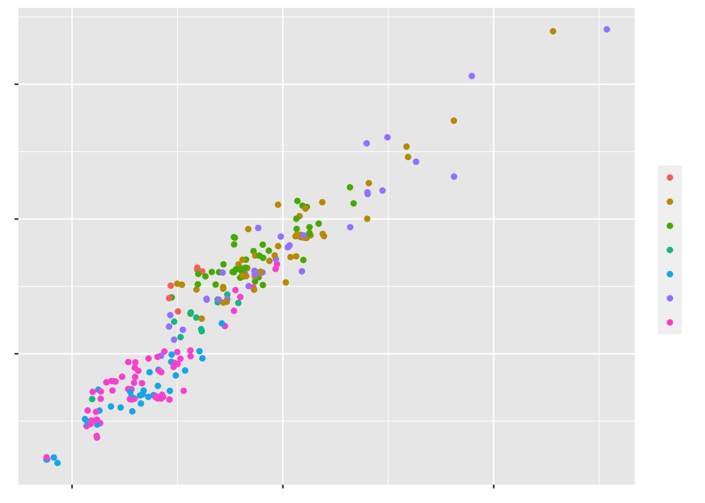


## latex公式


```r
library(ggplot2)
library(latex2exp)

ggplot(mpg, aes(x = displ, y = hwy)) +
  geom_point() +
  annotate("text",
    x = 4, y = 40,
    label = TeX("$\\alpha^2 + \\theta^2 = \\omega^2 $"),
    size = 9
  ) +
  labs(
    title = TeX("The ratio of 1 and 2 is $\\,\\, \\frac{1}{2}$"),
    x = TeX("$\\alpha$"),
    y = TeX("$\\alpha^2$")
  )
```

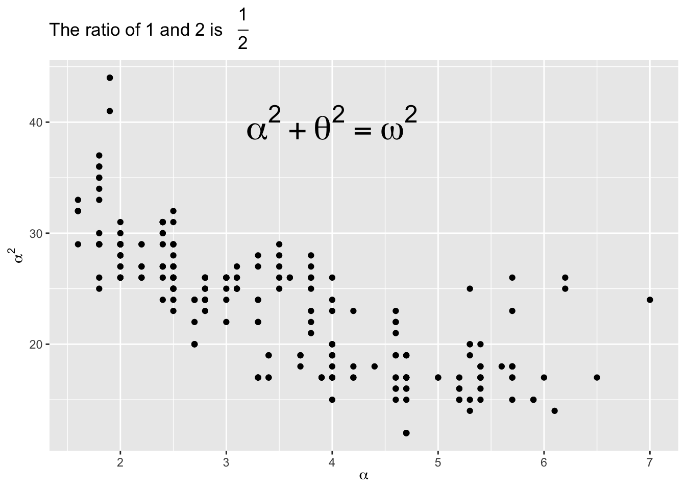


## "coord_cartesian() 与 scale_x_continuous()"


乍一看，这两个操作没有区别


```r
p1 <- mtcars %>% 
  ggplot(aes(disp, wt)) +
  geom_point() +
  scale_x_continuous(limits = c(325, 500)) +
  ggtitle("scale_x_continuous(limits = c(325, 500))")

p2 <- mtcars %>% 
  ggplot(aes(disp, wt)) +
  geom_point() +
  coord_cartesian(xlim = c(325, 500)) +
  ggtitle("coord_cartesian(xlim = c(325, 500))")


p1 + p2
```

```
## Warning: Removed 24 rows containing missing values (`geom_point()`).
```

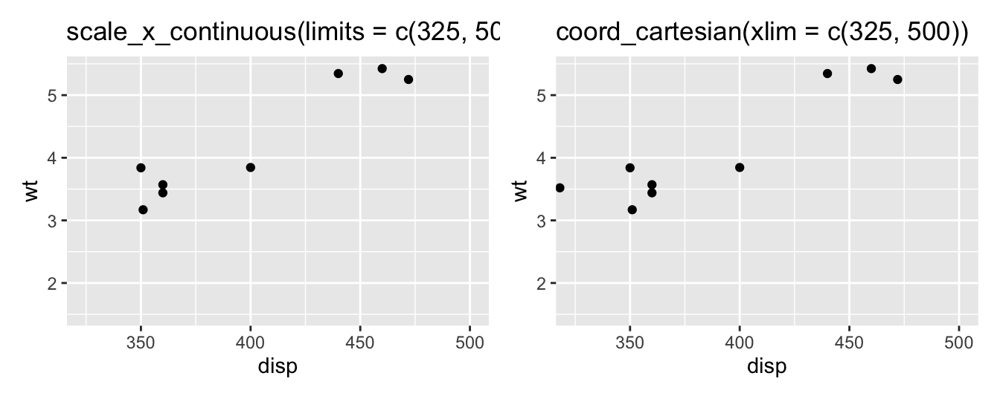


实际上这两个操作，区别蛮大的


```r
p3 <- mtcars %>% 
  ggplot(aes(disp, wt)) +
  geom_point() +
  geom_smooth() +
  ggtitle("no limits setting") 

p4 <- mtcars %>% 
  ggplot(aes(disp, wt)) +
  geom_point() +
  geom_smooth() +
  scale_x_continuous(limits = c(325, 500)) +
  ggtitle("scale_x_continuous(limits = c(325, 500))")


p5 <- mtcars %>% 
  ggplot(aes(disp, wt)) +
  geom_point() +
  geom_smooth() +
  coord_cartesian(xlim = c(325, 500)) +
  ggtitle("coord_cartesian(xlim = c(325, 500))")


p3 + p4 + p5
```

```
## `geom_smooth()` using method = 'loess' and formula = 'y ~ x'
## `geom_smooth()` using method = 'loess' and formula = 'y ~ x'
```

```
## Warning: Removed 24 rows containing non-finite values (`stat_smooth()`).
```

```
## Warning: Removed 24 rows containing missing values (`geom_point()`).
```

```
## `geom_smooth()` using method = 'loess' and formula = 'y ~ x'
```

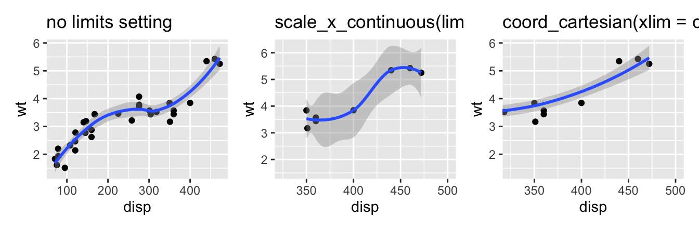


解释：

- `scale_x_continuous(limits = c(325,500))`
的骚操作，会把limits指定范围之外的点全部弄成NA, 也就说改变了原始数据，那么 `geom_smooth()` 会基于调整之后的数据做平滑曲线。

- `coord_cartesian(xlim = c(325,500))`
操作，不会改变数据，只是拿了一个放大镜，重点显示`xlim = c(325, 500)`这个范围。


## 练习

重复这张压平曲线（flatten curve）图


```
## Warning in rm(central_park, d, drop_facet, gapdata, label_colors, myfun, :
## object 'central_park' not found
```

```
## Warning in rm(central_park, d, drop_facet, gapdata, label_colors, myfun, :
## object 'label_colors' not found
```

```
## Warning in rm(central_park, d, drop_facet, gapdata, label_colors, myfun, :
## object 'nyc_squirrels' not found
```

```
## Warning in rm(central_park, d, drop_facet, gapdata, label_colors, myfun, :
## object 'pp' not found
```

```
## Warning in rm(central_park, d, drop_facet, gapdata, label_colors, myfun, :
## object 'df' not found
```


