# ggplot2之从图层到几何形状 {#tidyverse-ggplot2-from-layer-to-geom}


用ggplot2，大多是从几何形状出发，总有“只见树木不见森林”的感觉。我尝试从图层结构出发，去思考ggplot2绘图原理。欢迎大家批评指正。


## 图层的五大元素

ggplot2中每个**图层**都要有的五大元素：

1. 数据data 
2. 美学映射mapping  
3. 几何形状geom 
4. 统计变换stat 
5. 位置调整position

数据映射后，需要指定一种数据统计变换的方式，统计计算数据（不进行统计变换可以理解为是等值变换），最后通过某种几何形状geom来对其进行可视化的展现。

我们现在按照`layer() -> stat_*() -> geom_*() `这个思路来，理解各种图形。


一般情况下，统计变换会生成新的数据列，在ggplot2里称之为`Computed variables`，如果想要这些新变量映射到图形属性，就需要使用 `after_stat()`或者`stage()`函数，具体见下面的案例。


## 加载宏包


```r
library(tidyverse)
library(palmerpenguins)
penguins <- penguins %>% drop_na()
```


## stat_identity()

就是什么也不干，即等值变换。


```r
penguins %>%
  ggplot(aes(x = bill_length_mm, y = bill_depth_mm)) +
  layer(
    stat = "identity", 
    geom = "point", 
    params = list(na.rm = FALSE),
    position = "identity"
  )
```


```r
penguins %>%
  ggplot(aes(x = bill_length_mm, y = bill_depth_mm)) +
  stat_identity(
    geom = "point"
  )
```


```r
penguins %>%
  ggplot(aes(x = bill_length_mm, y = bill_depth_mm)) +
  geom_point()
```


## stat_count() 

统计 落在x(离散)位置上，点的个数


`Computed variables`

- count: number of points in bin
- prop: groupwise proportion


`默认几何形状`

- geom_bar()


`适用几何形状`

- geom_point() / geom_bar()


```r
penguins %>% 
  ggplot(aes(x = species)) +
  layer(
    stat = "count",
    geom = "bar",
    mapping = aes(y = after_stat(count)),
    position = "identity"
  )
```


```r
penguins %>% 
  ggplot(aes(x = species)) +
  layer(
    stat = "count",
    geom = "point",
    mapping = aes(y = after_stat(count)),
    position = "identity"
  )
```


这里`aes(y = after_stat(count))`  可以看作是`aes(y = stage(start = NULL, after_stat = count))`的简写


```r
penguins %>% 
  ggplot(aes(x = species)) +
  layer(
    stat = "count",
    geom = "bar",
    mapping = aes(y = stage(start = NULL, after_stat = count)),
    position = "identity"
  )
```


```r
penguins %>% 
  ggplot(aes(x = species, y = after_stat(count))) +
  stat_count(
    geom = "bar"       
  )
```


```r
penguins %>% 
  ggplot(aes(x = species, y = after_stat(count))) +
  geom_bar(
    stat = "count"     
  )
```

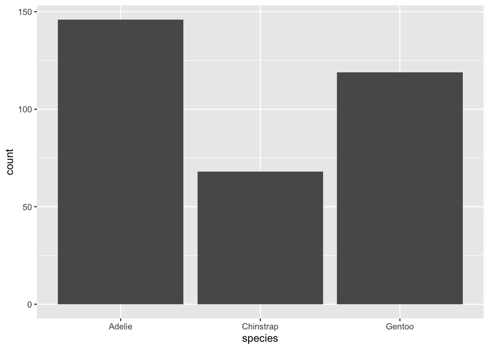


```r
penguins %>% 
  ggplot(aes(x = species, y = after_stat(count))) +
  stat_count(
    geom = "point"
  )
```


```r
penguins %>% 
  ggplot(aes(x = species, y = after_stat(count))) +
  geom_point(
    stat = "count"     
  )
```

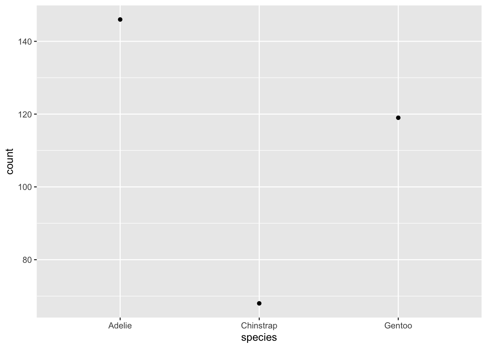


## stat_bin() 

统计 落在x(连续)区间上，点的个数


`Computed variables`

- count: number of points in bin
- density: density of points in bin, scaled to integrate to 1
- ncount: count, scaled to maximum of 1
- ndensity: density, scaled to maximum of 1


`默认几何形状`

- geom_bar()


`适用几何形状`

- geom_bar() / geom_histogram() / geom_freqpoly


```r
penguins %>% 
  ggplot(aes(x = bill_length_mm)) +
  layer(
    stat = "bin",
    geom = "bar",
    mapping = aes(y = after_stat(count)),
    position = "identity"
  )
```

```
## `stat_bin()` using `bins = 30`. Pick better value with `binwidth`.
```


```r
penguins %>% 
  ggplot(aes(x = bill_length_mm)) +
  layer(
    stat = "bin",
    geom = "point",
    mapping = aes(x = stage(start = bill_length_mm, after_stat = x), 
                  y = after_stat(count)
                 ),
    position = "identity"
  )
```

```
## `stat_bin()` using `bins = 30`. Pick better value with `binwidth`.
```

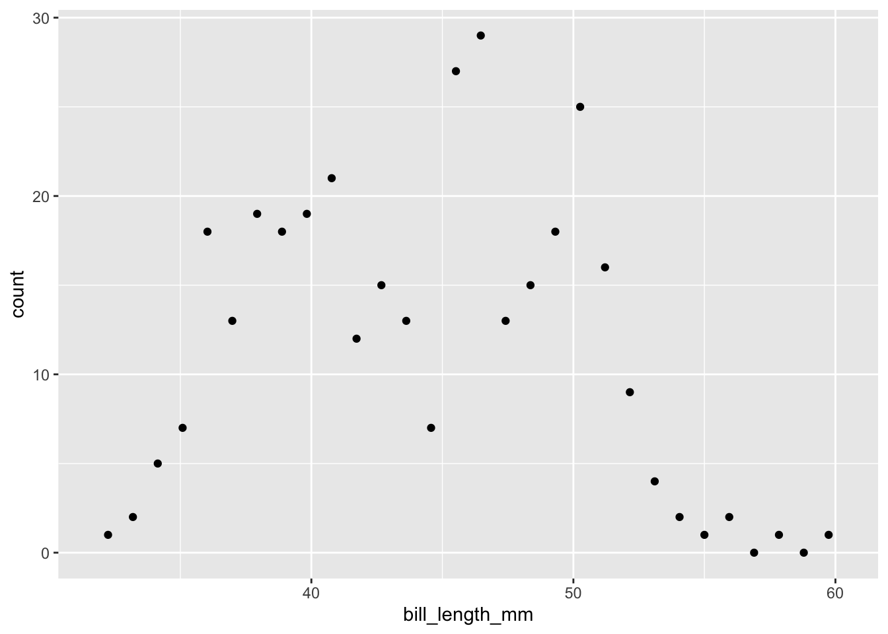


```r
penguins %>% 
  ggplot(aes(x = bill_length_mm, y = after_stat(count))) +
  stat_bin(
    geom = "point"
  )
```

```
## `stat_bin()` using `bins = 30`. Pick better value with `binwidth`.
```


```r
penguins %>% 
  ggplot(aes(x = bill_length_mm, y = after_stat(count))) +
  geom_bar(
    stat = "bin"
  )
```

```
## `stat_bin()` using `bins = 30`. Pick better value with `binwidth`.
```


geom_histogram 本质实际上是 geom_bar，都依赖stat_bin


```r
penguins %>% 
  ggplot(aes(x = bill_length_mm)) +
  layer(
    stat = "bin",
    geom = "bar",
    mapping = aes(y = after_stat(count)), 
    position = 'identity'
  ) 
```

```
## `stat_bin()` using `bins = 30`. Pick better value with `binwidth`.
```


```r
penguins %>% 
  ggplot(aes(x = bill_length_mm)) +
  layer(
    stat = "bin",
    geom = "bar",
    mapping = aes(y = after_stat(ncount)), 
    position = 'identity'
  ) 
```

```
## `stat_bin()` using `bins = 30`. Pick better value with `binwidth`.
```


```r
penguins %>% 
  ggplot(aes(x = bill_length_mm)) +
  stat_bin(
    mapping = aes(y = after_stat(count)),
    geom = "bar",
    position = 'identity'
  ) 
```

```
## `stat_bin()` using `bins = 30`. Pick better value with `binwidth`.
```


```r
penguins %>% 
  ggplot(aes(x = bill_length_mm)) +
  geom_histogram(
    mapping = aes(y = after_stat(count)),
    stat = "bin",
    position = 'identity'
  ) 
```

```
## `stat_bin()` using `bins = 30`. Pick better value with `binwidth`.
```


复杂点的geom_histogram()


```r
penguins %>% 
  ggplot(aes(x = bill_length_mm, fill = sex)) +
  layer(
    mapping = aes(y = after_stat(density)),
    geom = "bar",
    stat = "bin",
    position = 'dodge'
  ) +
  facet_wrap(vars(species)) 
```

```
## `stat_bin()` using `bins = 30`. Pick better value with `binwidth`.
```


```r
penguins %>% 
  ggplot(aes(x = bill_length_mm, fill = sex)) +
  layer(
    mapping = aes(y = stage(NULL, after_stat = density)),
    geom = "bar",
    stat = "bin",
    position = 'dodge'
  ) +
  facet_wrap(vars(species)) 
```

```
## `stat_bin()` using `bins = 30`. Pick better value with `binwidth`.
```


```r
penguins %>% 
  ggplot(aes(x = bill_length_mm, fill = sex)) +
  stat_bin(
    mapping = aes(y = after_stat(density)),
    geom = "bar",
    position = 'dodge'
  ) +
  facet_wrap(vars(species)) 
```

```
## `stat_bin()` using `bins = 30`. Pick better value with `binwidth`.
```

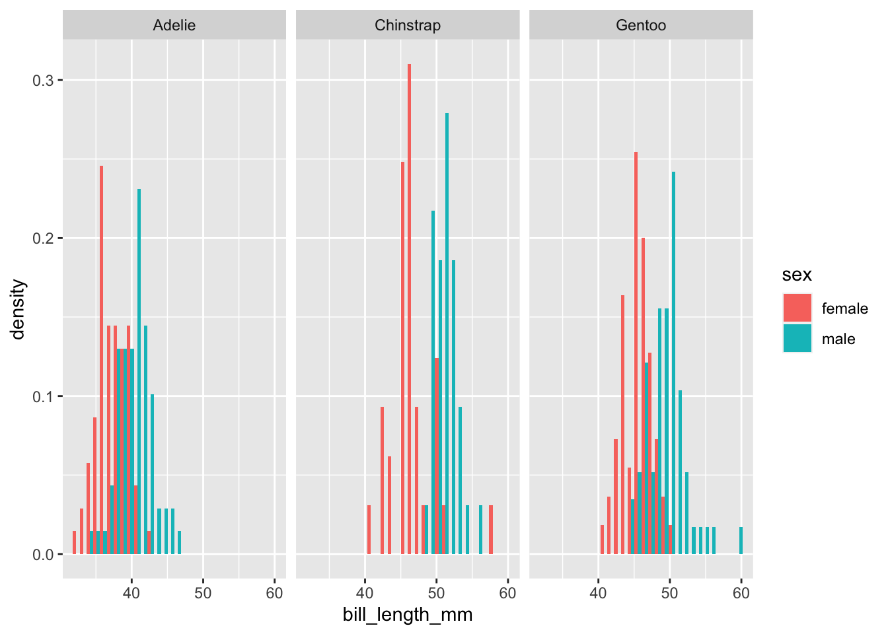


```r
penguins %>% 
  ggplot(aes(x = bill_length_mm, fill = sex)) +
  geom_histogram(
    aes(y = after_stat(density)),
    position = 'dodge'
  ) +
  facet_wrap(vars(species)) 
```

```
## `stat_bin()` using `bins = 30`. Pick better value with `binwidth`.
```


## stat_density()  


x(连续)核密度估计，可以看作是直方图的平滑版本


```r
kernel = c("gaussian", "epanechnikov", "rectangular",
           "triangular", "biweight",   "cosine", 
           "optcosine")
```


                   
                   
`Computed variables`

- density: density estimate
- count: density * number of points - useful for stacked density plots
- scaled: density estimate, scaled to maximum of 1
- ndensity: alias for scaled, to mirror the syntax of stat_bin()


`默认几何形状`

- geom_area()


`适用几何形状`

- geom_area()/ geom_line()/ geom_point()/ geom_density()


```r
penguins %>%
  ggplot(aes(x = bill_length_mm)) +
  layer(
        stat = "density",
        geom = "area",
      params = list(kernel = "gaussian"),
    position = "identity"
  )
```


```r
penguins %>%
  ggplot(aes(x = bill_length_mm)) +
  layer(
        stat = "density",
        geom = "line",
      params = list(kernel = "gaussian"),
    position = "identity"
  )
```

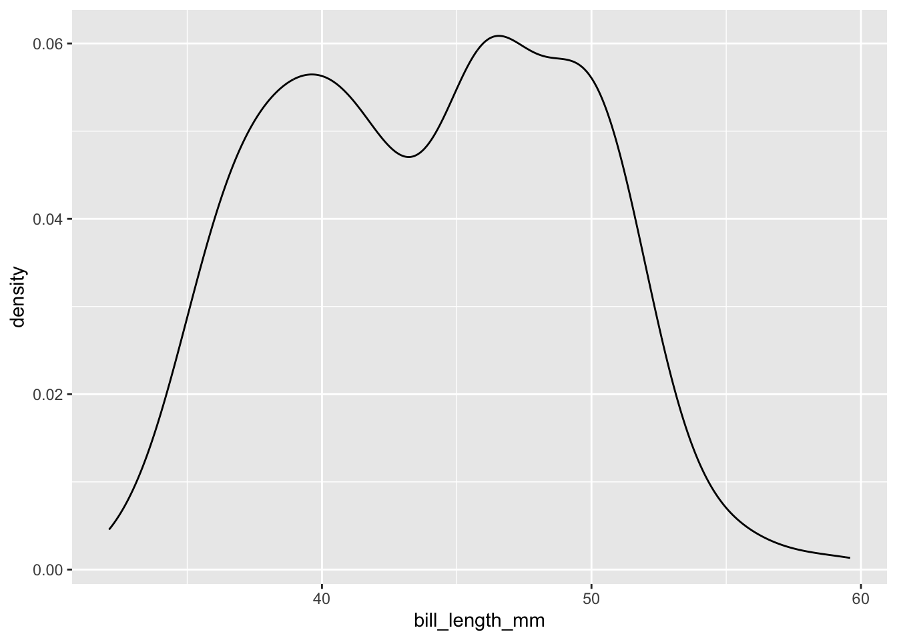


```r
penguins %>%
  ggplot(aes(x = bill_length_mm)) +
  layer(
        stat = "density",
        geom = "point",
      params = list(kernel = "gaussian"),
    position = "identity"
  )
```


```r
penguins %>%
  ggplot(aes(x = bill_length_mm)) +
  stat_density(
        geom = "point",
      kernel = "gaussian"
  )
```


## stat_boxplot() 


计算连续变量的五个统计值 (the median, two hinges and two whiskers), 以及outlier 


- `Aesthetics` 
  -  x or y;  lower;  upper;  middle;  ymin ; ymax


- `Computed variables`

  - `width`: width of boxplot
  - `ymin`: lower whisker = smallest observation greater than or equal to lower hinge - 1.5 * IQR
  - `lower`: lower hinge, 25% quantile
  - `notchlower`: lower edge of notch = median - 1.58 * IQR / sqrt(n)
  - `middle`: median, 50% quantile
  - `notchupper`: upper edge of notch = median + 1.58 * IQR / sqrt(n)
  - `upper`: upper hinge, 75% quantile
  - `ymax`: upper whisker = largest observation less than or equal to upper hinge + 1.5 * IQR


`默认几何形状`

- geom_boxplot() 


`适用几何形状`

- geom_boxplot() / geom_point()


```r
penguins %>% 
  ggplot(aes(x = species, y = bill_length_mm))+
  layer(
    stat = "boxplot",
    geom = "boxplot",
    position = "identity"
  )
```


```r
penguins %>% 
  ggplot(aes(x = species, y = bill_length_mm)) +
  stat_boxplot(
    geom = "boxplot"
  )
```


```r
penguins %>% 
  ggplot(aes(x = species, y = bill_length_mm)) +
  geom_boxplot()
```


可以根据 `Computed variables` 画出更多的几何形状


```r
penguins %>% 
  ggplot(aes(x = species, y = bill_length_mm)) +
  layer(
    stat = "boxplot",
    geom = "boxplot",
    mapping = aes(color = after_stat(middle)),
    position = "identity"
  )
```

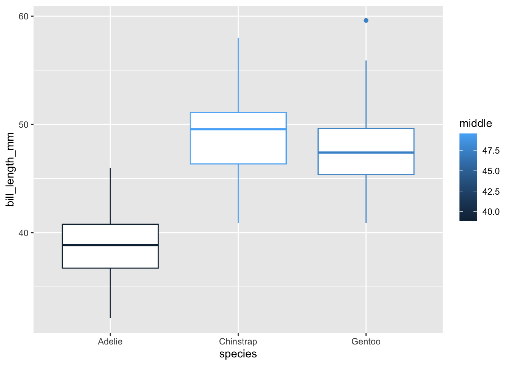


```r
penguins %>% 
  ggplot(aes(x = species, y = bill_length_mm)) +
  layer(
    stat = "boxplot",
    geom = "point",
    mapping = aes(y = after_stat(width)),
    position = "identity"
  )
```


```r
penguins %>% 
  ggplot(aes(x = species, y = bill_length_mm)) +
  layer(
    stat = "boxplot",
    geom = "point",
    mapping = aes(y = stage(bill_length_mm, after_stat = notchupper)),
    position = "identity"
  )
```


```r
penguins %>% 
  ggplot(aes(x = species, y = bill_length_mm)) +
  layer(
    stat = "boxplot",
    geom = "point",
    mapping = aes(y = stage(bill_length_mm, after_stat = ymax)),
    position = "identity"
  ) 
```

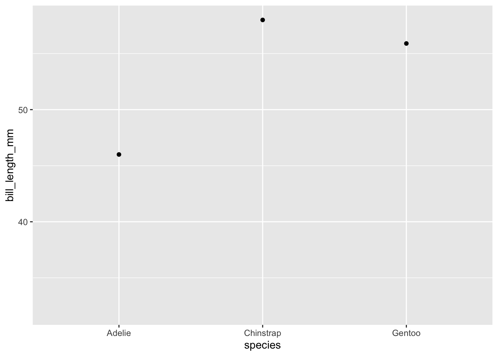


```r
penguins %>% 
  ggplot(aes(x = species, y = bill_length_mm)) +
  stat_boxplot()
```

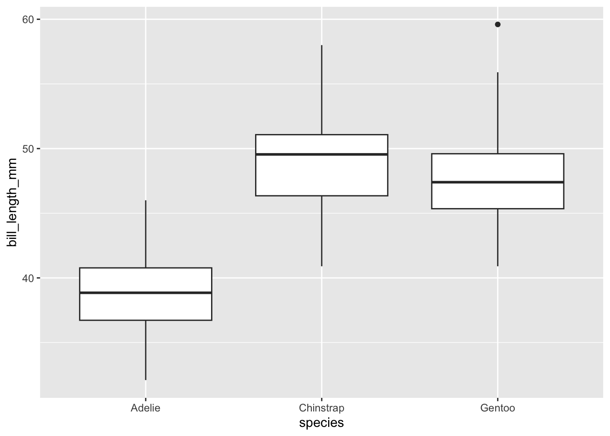


```r
penguins %>% 
  ggplot(aes(x = species, y = bill_length_mm)) +
  layer(
    stat = "boxplot",
    geom = "point",
    mapping = aes(y = stage(bill_length_mm, after_stat = middle)),
    params = list(color = "red", size = 5),
    position = "identity"
  ) 
```

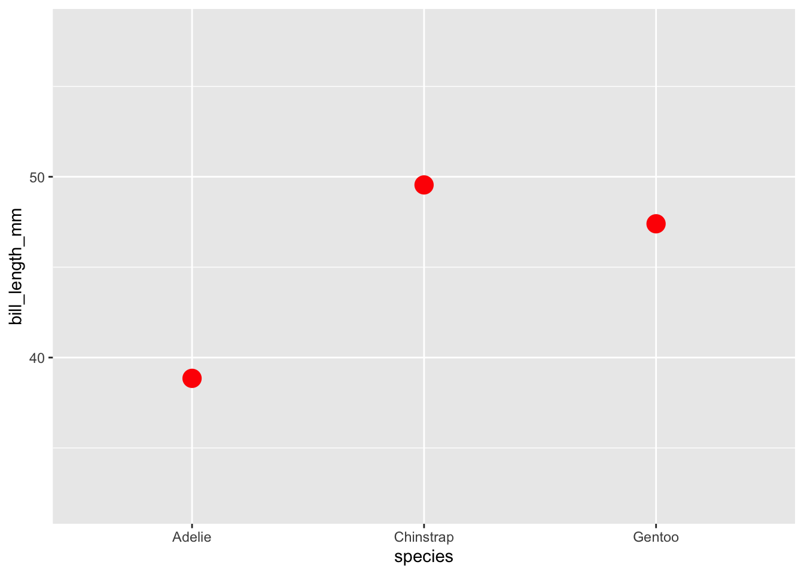


```r
penguins %>% 
  ggplot(aes(x = species, y = bill_length_mm)) +
  geom_boxplot(
    aes(colour = species, 
        fill = after_scale(alpha(colour, 0.4)))
  )
```


##  stat_ydensity() 

可以看作是箱线图的密度图呈现


`Computed variables`

- density: density estimate
- scaled: density estimate, scaled to maximum of 1
- count: density * number of points - probably useless for violin plots
- violinwidth: density scaled for the violin plot, according to area, counts or to a constant maximum width
- n: number of points
- width: width of violin bounding box


`默认几何形状`

-  geom_violin() 


`适用几何形状`

-  geom_violin() / geom_point() 


```r
penguins %>% 
  ggplot(aes(x = species, y = bill_length_mm)) +
  geom_point() +
  layer(
    geom     = "violin",
    stat     = "ydensity",
    position = "identity"
  )
```

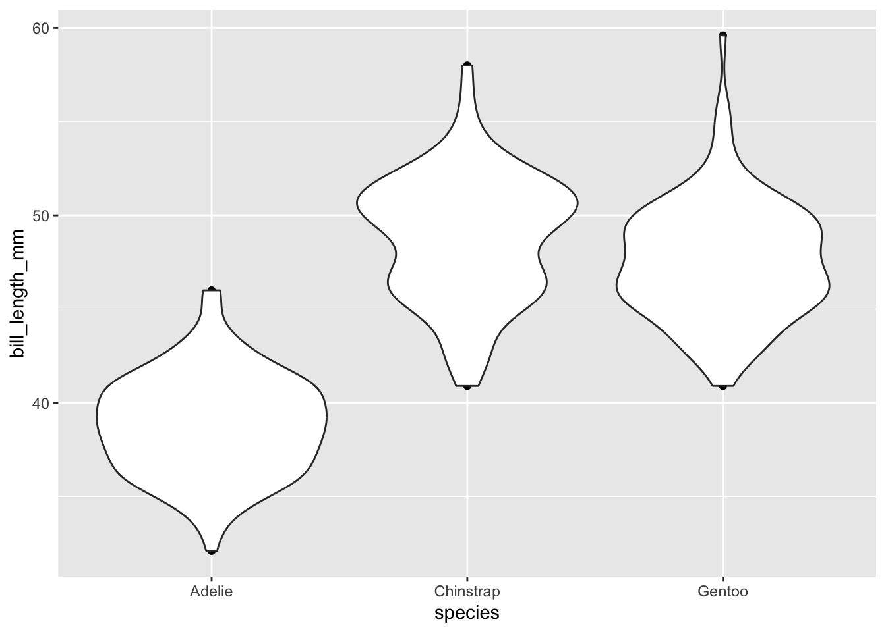


```r
penguins %>% 
  ggplot(aes(x = species, y = bill_length_mm)) +
  geom_point() +
  layer(
    geom     = "point",
    stat     = "ydensity",
    position = "identity"
  )
```


## stat_bindot()

圆点图，是直方图的另外一种形式


`Computed variables`

- x: center of each bin, if binaxis is "x"
- y: center of each bin, if binaxis is "x"
- binwidth: max width of each bin if method is "dotdensity";width of each bin if method is "histodot"
- count: number of points in bin
- ncount: count, scaled to maximum of 1
- density: density of points in bin, scaled to integrate to 1, if method is "histodot"
- ndensity: density, scaled to maximum of 1, if method is "histodot"


`默认几何形状`

- geom_dotplot()


`适用几何形状`

- geom_dotplot()


```r
penguins %>% 
  ggplot(aes(x = bill_length_mm)) +
  layer(
    stat = "bindot",
    geom = "dotplot",
    mapping = aes(y = stage(start = NULL, after_stat = count)),
    params = list(binwidth = 1, dotsize = 0.5), 
    position = position_nudge(-0.025)
  )
```


```r
penguins %>% 
  ggplot(aes(x = bill_length_mm)) +
  layer(
    stat = "bindot",
    geom = "point",
    mapping = aes(y = stage(start = NULL, after_stat = count)),
    params = list(binwidth = 1), 
    position = "identity"
  )
```

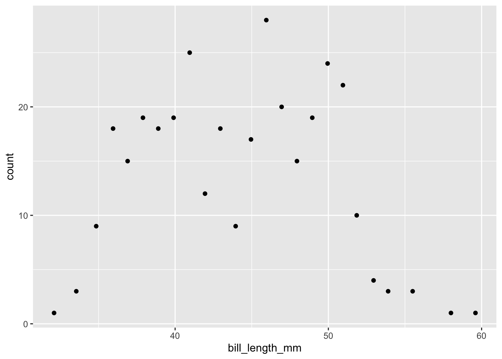


```r
penguins %>% 
  ggplot(aes(x = bill_length_mm)) +
  geom_dotplot(
    binwidth = 1, 
    dotsize = 0.5)
```

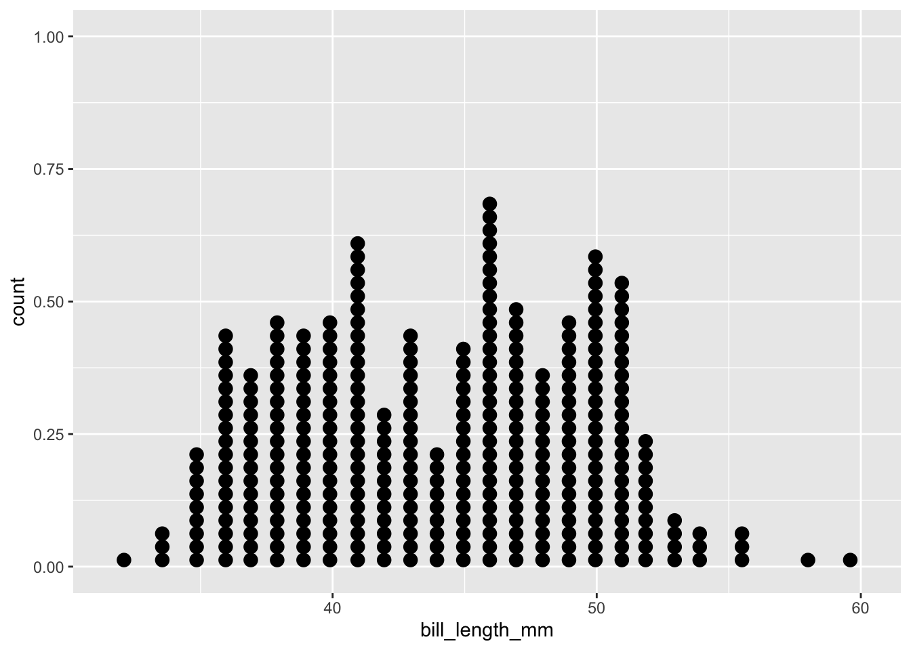


```r
penguins %>% 
  ggplot(aes(x = species, y = bill_length_mm)) +
  geom_dotplot(
    binaxis = "y", 
    stackdir = "down", 
    dotsize = 0.4, 
    position = position_nudge(-0.025)
    )
```

```
## Bin width defaults to 1/30 of the range of the data. Pick better value with
## `binwidth`.
```


## stat_sum() 

统计落在x(离散或者连续), y(离散或者连续)位置上，点的个数


`Computed variables`

- n    : number of observations at position
- prop : percent of points in that panel at that position


`默认几何形状`

- geom_point()


`适用几何形状`

- geom_point() / geom_count()  / geom_bar()


```r
penguins %>% 
  ggplot(aes(x = bill_length_mm, y = bill_depth_mm)) +
  layer(
    stat = "sum",
    geom = "point",
    mapping = aes(size = after_stat(n)),
    position = "identity"
  )
```


```r
penguins %>% 
  ggplot(aes(x = bill_length_mm, y = bill_depth_mm)) +
  stat_sum(
    geom = "point"
  )
```


## stat_smooth() 

根据x,y数据和拟合公式，计算每个点位置的拟合值以及标准误


`Computed variables`

- y: predicted value
- ymin: lower pointwise confidence interval around the mean
- ymax: upper pointwise confidence interval around the mean
- se: standard error


`默认几何形状`

- geom_smooth()


`适用几何形状`

- geom_smooth() / geom_line() / geom_point()


```r
penguins %>% 
  ggplot(aes(x = bill_length_mm, y = bill_depth_mm)) +
  layer(
    geom = "smooth",
    stat = "smooth",
    params = list(se = TRUE), 
    position = "identity"
  )
```

```
## `geom_smooth()` using method = 'loess' and formula = 'y ~ x'
```


```r
penguins %>% 
  ggplot(aes(x = bill_length_mm, y = bill_depth_mm)) +
  stat_smooth(
    geom = "smooth",
    se = TRUE 
  )
```

```
## `geom_smooth()` using method = 'loess' and formula = 'y ~ x'
```


```r
penguins %>% 
  ggplot(aes(x = bill_length_mm, y = bill_depth_mm)) +
  geom_smooth(
    se = TRUE 
  )
```

```
## `geom_smooth()` using method = 'loess' and formula = 'y ~ x'
```


统计转换后，可以根据 `Computed variables` 画出更多的几何形状

```r
penguins %>% 
  ggplot(aes(x = bill_length_mm, y = bill_depth_mm)) +
  layer(
    geom = "point",
    stat = "smooth",
    mapping = aes(size = after_stat(ymax), color = after_stat(ymin)),
    position = "identity"
  )
```

```
## `geom_smooth()` using method = 'loess' and formula = 'y ~ x'
```

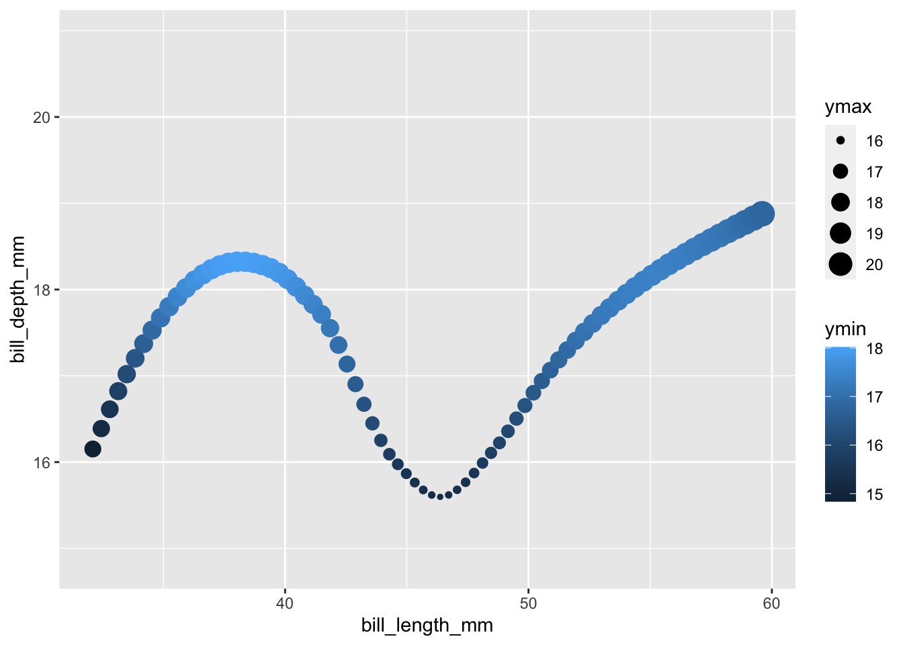


```r
penguins %>% 
  ggplot(aes(x = bill_length_mm, y = bill_depth_mm)) +
  layer(
    geom = "point",
    stat = "smooth",
    mapping = aes(color = after_stat(ymin)),
    position = "identity"
  )
```

```
## `geom_smooth()` using method = 'loess' and formula = 'y ~ x'
```

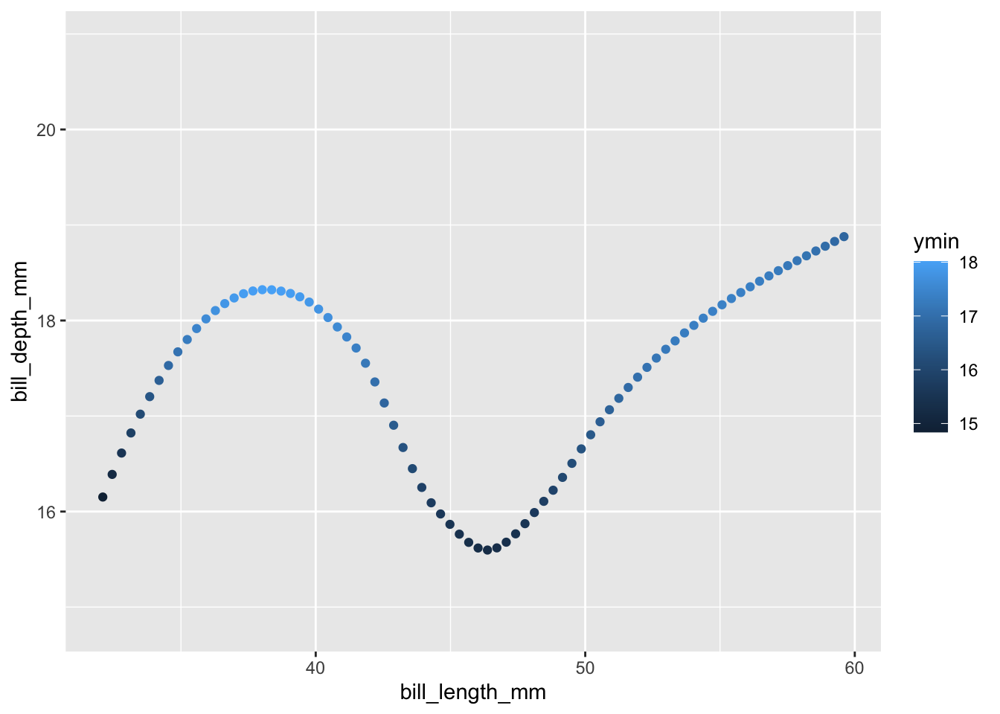


```r
penguins %>% 
  ggplot(aes(x = bill_length_mm, y = bill_depth_mm)) +
  layer(
    geom = "point",
    stat = "smooth",
    mapping = aes(color = stage(NULL, after_stat = ymin)),
    position = "identity"
  )
```

```
## `geom_smooth()` using method = 'loess' and formula = 'y ~ x'
```

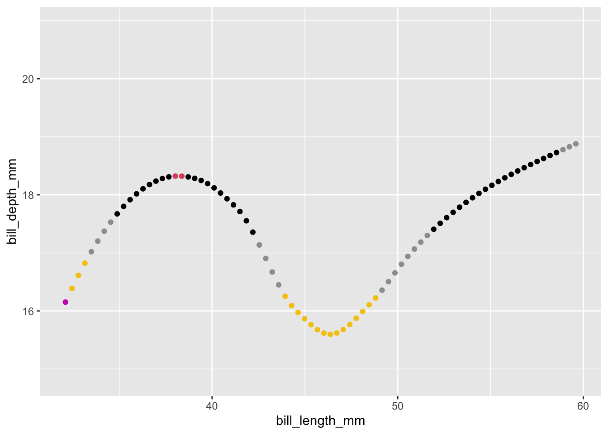


```r
penguins %>%
  ggplot(aes(x = bill_length_mm, y = bill_depth_mm)) +
  layer(
    geom = "line",
    stat = "smooth", 
    mapping = aes(color = after_stat(ymin)),    
    position = "identity"
  )
```

```
## `geom_smooth()` using method = 'loess' and formula = 'y ~ x'
```

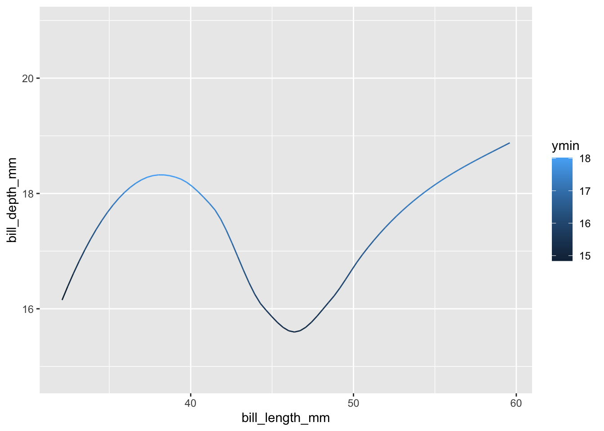


```r
penguins %>%
  ggplot(aes(x = bill_length_mm, y = bill_depth_mm)) +
  layer(
    geom = "pointrange",
    stat = "smooth", 
    mapping = aes(color = after_stat(se)),    
    position = "identity"
  )
```

```
## `geom_smooth()` using method = 'loess' and formula = 'y ~ x'
```

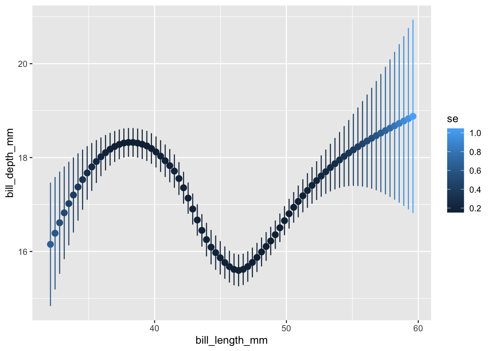


```r
penguins %>%
  ggplot(aes(x = bill_length_mm, y = bill_depth_mm)) +
  layer(
        stat = "smooth",
     mapping = aes(color = after_stat(y)),    
        geom = "point",
      params = list(method  = "lm", formula = y ~ splines::ns(x, 2)),    
    position = "identity"
  )
```

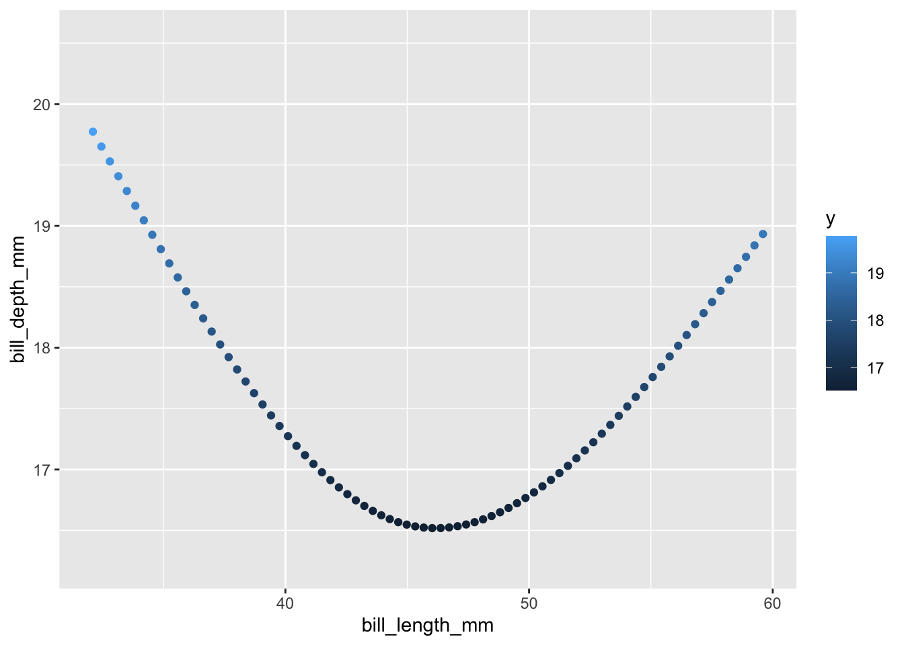


## stat_bin_2d() 

统计 落在x和y(长方形)区域上，点的个数


`Computed variables`

- count: number of points in bin
- density: density of points in bin, scaled to integrate to 1
- ncount: count, scaled to maximum of 1
- ndensity: density, scaled to maximum of 1


`默认几何形状`

- geom_tile() 


`适用几何形状`

- geom_tile() / geom_point()/ geom_bin2d()


```r
penguins %>% 
  ggplot(aes(x = bill_length_mm, y = bill_depth_mm)) +
  layer(
    geom = "tile",
    stat = "bin_2d",
    position = "identity"
  )
```


```r
penguins %>% 
  ggplot(aes(x = bill_length_mm, y = bill_depth_mm)) +
  layer(
    geom = "point",
    stat = "bin_2d",
    position = "identity"
  )
```


```r
penguins %>% 
  ggplot(aes(x = bill_length_mm, y = bill_depth_mm)) +
  stat_bin_2d(
    geom = "point"
  )
```


```r
penguins %>% 
  ggplot(aes(x = bill_length_mm, y = bill_depth_mm)) +
  geom_point(
    stat = "bin_2d"
  )
```


可以根据 `Computed variables` 画出更多的几何形状


```r
penguins %>% 
  ggplot(aes(x = bill_length_mm, y = bill_depth_mm)) +
  layer(
    geom = "point",
    stat = "bin_2d",
    mapping = aes(size = after_stat(count)),
    position = "identity"
  )
```


```r
penguins %>% 
  ggplot(aes(x = bill_length_mm, y = bill_depth_mm)) +
  layer(
    geom = "tile",
    stat = "bin_2d",
    mapping = aes(fill = after_stat(count)),
    position = "identity"
  )
```


## stat_bin_hex() 

stat_bin2d()的六边形版本


`Computed variables`

- count: number of points in bin
- density: density of points in bin, scaled to integrate to 1
- ncount: count, scaled to maximum of 1
- ndensity: density, scaled to maximum of 1


`默认几何形状`

- geom_hex() 
 
 

`适用几何形状`

- geom_hex()

 
 

```r
penguins %>% 
  ggplot(aes(x = bill_length_mm, y = bill_depth_mm)) +
  layer(
    geom = "hex",
    stat = "binhex",
    position = "identity"
  )
```


  


```r
penguins %>% 
  ggplot(aes(x = bill_length_mm, y = bill_depth_mm)) +
  stat_bin_hex(
    geom = "hex"
  )
```


```r
penguins %>% 
  ggplot(aes(x = bill_length_mm, y = bill_depth_mm)) +
  geom_hex(
    stat = "binhex"
  )
```


可以根据 `Computed variables` 画出更多的几何形状
 

```r
penguins %>% 
  ggplot(aes(x = bill_length_mm, y = bill_depth_mm)) +
  layer(
    geom = "text",
    stat = "binhex",
    mapping = aes(label = stage(NULL, after_stat = count)),
    position = "identity"
  )
```


## stat_density_2d() 

二维核密度估计，二维版本的stat_density()


- 不计算等高线 (`contour = FALSE`)
  - count:    number of points in bin                            	
  - density:   density of points in bin, scaled to integrate to 1 	
  - ncount:    count, scaled to maximum of 1                      
  - ndensity:  density, scaled to maximum of 1                    	


- 计算等高线 (`contour = TRUE`)
  - contour lines, for `stat_contour()` 等高线
  - contour bands, for `stat_contour_filled()` 等高带
  - Contours line types by contour_var = (`density`, `ndensity`, and `count`)


`适用几何形状`

-  geom_density_2d() / geom_raster() / goem_tile() / geom_path() / geom_point() / geom_polygon()


### 先看看有等高线的情形

```r
penguins %>%
  ggplot(aes(x = bill_length_mm, y = bill_depth_mm)) +
  layer(
    stat =  "density_2d",
    geom =  "path", 
    params = list(contour = TRUE),
    position = "identity"
  )
```


```r
penguins %>%
  ggplot(aes(x = bill_length_mm, y = bill_depth_mm)) +
  stat_density_2d(
    contour = TRUE
  )
```


```r
penguins %>%
  ggplot(aes(x = bill_length_mm, y = bill_depth_mm)) +
  geom_density_2d()
```


```r
penguins %>%
  ggplot(aes(x = bill_length_mm, y = bill_depth_mm)) +
  geom_path(
    stat = "density_2d",
    contour = TRUE
  )
```


可以根据 `Computed variables` 画出更多的几何形状


```r
penguins %>%
  ggplot(aes(x = bill_length_mm, y = bill_depth_mm)) +
  layer(
    stat =  "density_2d",
    geom =  "point", 
    params = list(contour = TRUE),
    position = "identity"
  )
```

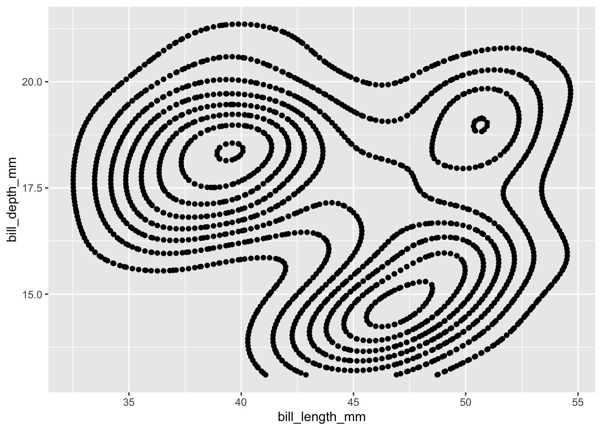


```r
penguins %>%
  ggplot(aes(x = bill_length_mm, y = bill_depth_mm)) +
  layer(
    stat = "density_2d",
    geom = "polygon",
    mapping = aes(fill = after_stat(level)),
    params = list(contour = TRUE),
    position = "identity"
  )
```


### 看看无等高线的情形


```r
penguins %>%
  ggplot(aes(x = bill_length_mm, y = bill_depth_mm)) +
  layer(
    stat = "density_2d",
    geom = "raster",
    mapping = aes(fill = after_stat(density)),
    params = list(contour = FALSE),
    position = "identity"
  )
```

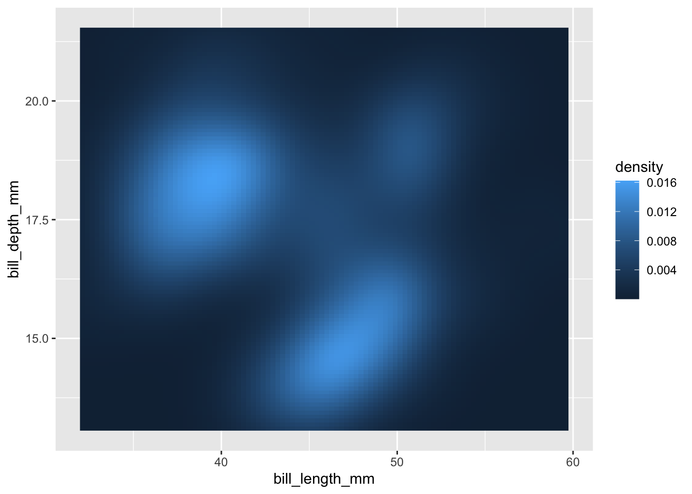


```r
penguins %>%
  ggplot(aes(x = bill_length_mm, y = bill_depth_mm)) +
  layer(
    stat = "density_2d",
    geom = "tile",
    mapping = aes(fill = after_stat(count)),
    params = list(contour = FALSE),
    position = "identity"
  )
```


```r
penguins %>%
  ggplot(aes(x = bill_length_mm, y = bill_depth_mm)) +
  stat_density_2d(
    geom = "tile",
    mapping = aes(fill = after_stat(density)),
    contour = FALSE
  )
```


```r
penguins %>%
  ggplot(aes(x = bill_length_mm, y = bill_depth_mm)) +
  geom_tile(
    stat = "density_2d",
    mapping = aes(fill = after_stat(density)),
    contour = FALSE
  )
```


可以根据 `Computed variables` 画出更多的几何形状


```r
penguins %>%
  ggplot(aes(x = bill_length_mm, y = bill_depth_mm)) +
  layer(
    stat = "density_2d",
    geom = "point",
    mapping = aes(size = after_stat(count)),
    params = list(n = 20, contour = FALSE),
    position = "identity"
  )
```

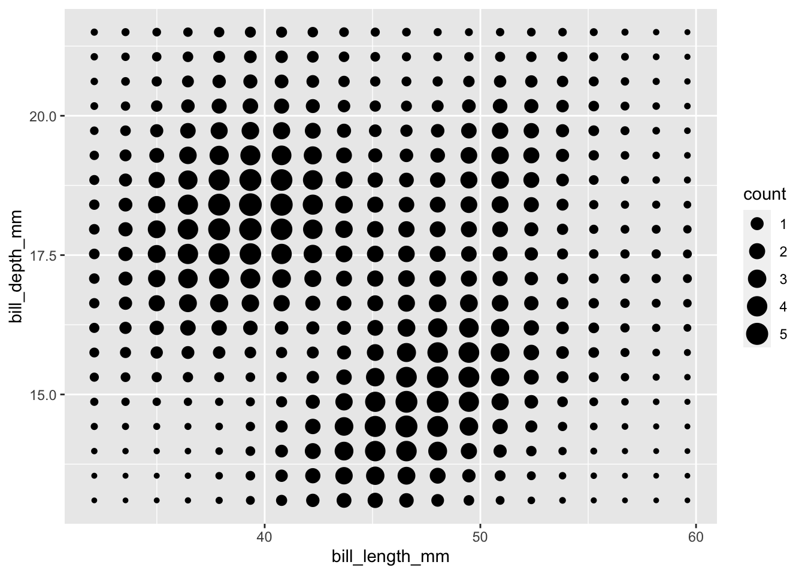


## stat_ellipse() 

假定数据服从多元分布，计算椭圆图形需要的参数


`Computed variables`

- x
- y


`默认几何形状`

- geom_path()


`适用几何形状`

-  geom_path() /geom_polygon()


```r
penguins %>%
  ggplot(aes(x = bill_length_mm, y = bill_depth_mm)) +
  geom_point() +
  layer(
    stat = "ellipse",
    geom = "path",
    params = list(type = "norm", linetype = 2),
    position = "identity"
  )
```


```r
penguins %>%
  ggplot(aes(x = bill_length_mm, y = bill_depth_mm)) +
  geom_point() +
  stat_ellipse(
    geom = "path",
    type = "norm", 
    linetype = 2
  )
```

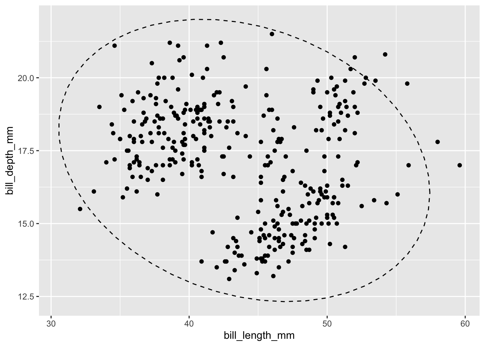


```r
penguins %>%
  ggplot(aes(x = bill_length_mm, y = bill_depth_mm, color = species)) +
  geom_point() +
  geom_path(
    stat = "ellipse",
    type = "norm", 
    linetype = 2
  )
```

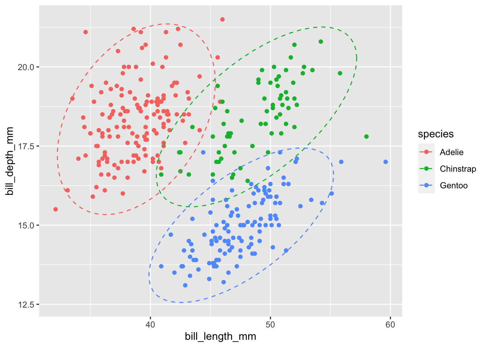


可以根据 `Computed variables` 画出更多的几何形状


```r
penguins %>%
  ggplot(aes(x = bill_length_mm, y = bill_depth_mm)) +
  geom_point() +
  layer(
    stat = "ellipse",
    geom = "path",
    mapping = aes(color = after_stat(y)),
    params = list(type = "norm"),
    position = "identity"
  )
```


## stat_summary 

每一个x位置上, summary on y

`说明`

- `stat_summary()` operates on unique x or y; 
- `stat_summary_bin()` operates on binned x or y. 


`Summary functions`

- fun.data :
Complete summary function. Should take numeric vector as input and return data frame as output

- fun.min :
min summary function (should take numeric vector and return single number)

- fun :
main summary function (should take numeric vector and return single number)

- fun.max :
max summary function (should take numeric vector and return single number)


`适用几何形状`

- geom_errorbar() / geom_pointrange() /geom_linerange() / geom_crossbar() /geom_point()


```r
penguins %>%
  ggplot(aes(x = species, y = bill_length_mm)) +
  layer(
    stat = "summary", 
    params = list(fun.data = "mean_cl_normal"),
    geom = "errorbar", 
    position = "identity"
  )
```

```
## Warning: Computation failed in `stat_summary()`
## Caused by error in `fun.data()`:
## ! The package "Hmisc" is required.
```

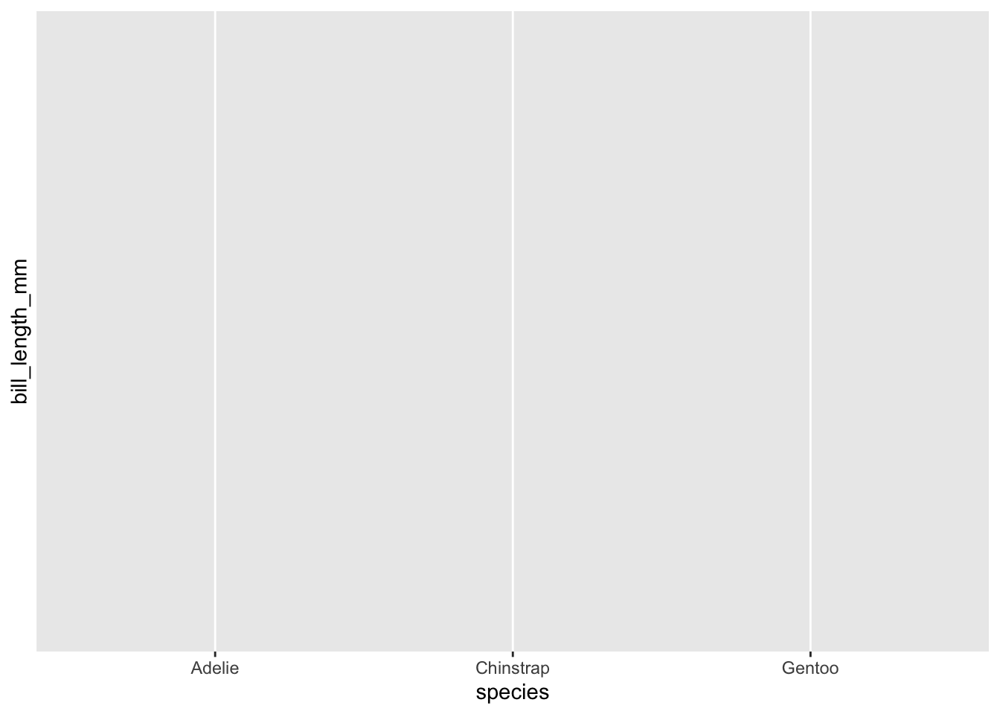


```r
penguins %>%
  ggplot(aes(x = species, y = bill_depth_mm)) +
  stat_summary(
    fun.data = mean_cl_normal, 
        geom = "errorbar"
  )
```

```
## Warning: Computation failed in `stat_summary()`
## Caused by error in `fun.data()`:
## ! The package "Hmisc" is required.
```


```r
penguins %>%
  ggplot(aes(x = sex, y = bill_length_mm)) +
  layer(
    stat     = "summary",
    geom     = "point",
    mapping  = aes(size = after_stat(ymin)),
    position = "identity"
  )
```

```
## No summary function supplied, defaulting to `mean_se()`
```

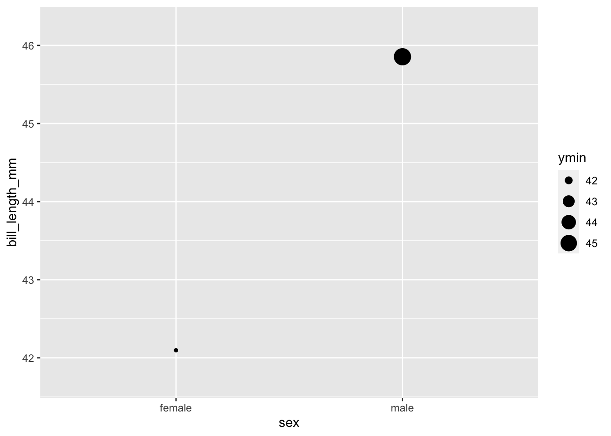


```r
penguins %>% 
  ggplot(aes(x = species, y = bill_length_mm)) +
  geom_point() +
  layer(
    geom     = "point",
    stat     = "summary",
    params   = list(fun = "mean", color = "red", size = 5),
    position = "identity"
  )
```


```r
penguins %>% 
  ggplot(aes(x = species, y = bill_length_mm)) +
  layer(
    geom = "point", 
    stat = "summary",
    params = list(fun = median), 
    mapping = aes(y = stage(start = bill_length_mm, after_stat = y)),
    position = "identity"
    )
```


```r
penguins %>%
  ggplot(aes(x = sex, y = bill_length_mm)) +
  geom_point() +
  layer(
    geom = "pointrange",   
    stat = "summary", 
    params = list(fun.data = ~mean_se(., mult = 5), color = "red", size = 2),
    position = "identity"
  )
```


```r
penguins %>% 
  ggplot(aes(x = species, y = bill_length_mm)) +
  geom_point() +
  stat_summary(
    geom  = "point",
    fun   = "mean",
    color = "red", 
    size  = 5
  )
```


```r
penguins %>%
  ggplot(aes( x = body_mass_g, y = species)) +
  geom_jitter() +
  stat_summary(
    fun = mean, 
    geom = "point", 
    size = 5, 
    color = "red",
    alpha = 1
  )
```

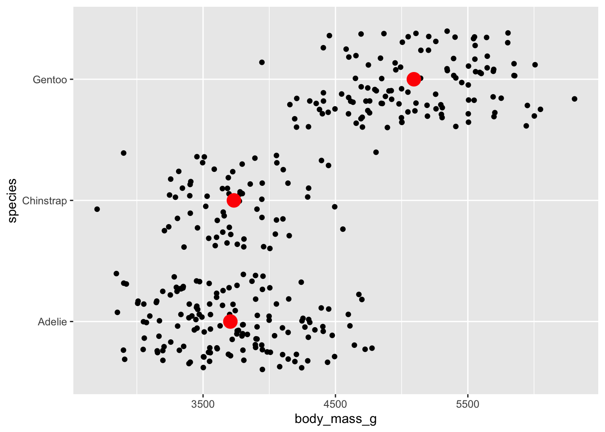


```r
penguins %>%
  ggplot(aes(x = sex, y = bill_length_mm)) +
  geom_point() +
  stat_summary(  
    fun.data = ~mean_se(., mult = 5),
    color = "red",
    geom = "pointrange",    
    size = 2
  )
```


```r
penguins %>%
  ggplot(aes(x = sex, y = bill_length_mm)) +
  geom_point() +
  geom_pointrange(
    stat = "summary", 
    fun.data = ~mean_se(., mult = 5),
    color = "red",
    size = 2
  )
```


```r
penguins %>%
  ggplot(aes(x = sex, y = bill_length_mm)) +
  geom_point() +
  stat_summary(
    fun.data = mean_cl_boot,
    color = "red",
    geom = "pointrange"
  )
```

```
## Warning: Computation failed in `stat_summary()`
## Caused by error in `fun.data()`:
## ! The package "Hmisc" is required.
```


```r
penguins %>%
  ggplot(aes(x = sex, y = bill_length_mm)) +
  geom_point() +
  stat_summary(
    fun = mean, 
    fun.min = min, 
    fun.max = max,      
    geom = "pointrange",  
    color = "red",
    size = 5
  )
```


```r
penguins %>%
  ggplot(aes(x = sex, y = bill_length_mm)) +
  geom_point() +
  stat_summary(
    fun.data = ~mean_se(., mult = 5),
    color = "red",
    geom = "pointrange"   
  )
```


```r
penguins %>%
  ggplot(aes(x = species, y = bill_length_mm, group = sex)) +
  geom_point() +
  stat_summary(
    fun.data = ~mean_se(., mult = 2),
    color = "red",
    geom = "pointrange"    
  )
```


```r
penguins %>%
  ggplot(aes(x = species, y = bill_length_mm, group = sex)) +
  stat_summary(fun = mean,
               fun.min = function(x) mean(x) - sd(x), 
               fun.max = function(x) mean(x) + sd(x), 
               geom = "pointrange") +
  stat_summary(fun = mean,
               geom = "line") +
  facet_wrap(~ sex)
```


### 自定义函数


```r
my_count <- function(x){
  tibble(
    y = length(x),
  )
}


penguins %>% 
  ggplot(aes(x = species, y = bill_length_mm)) +
  stat_summary(
    geom = "bar",
    fun.data = my_count
  )
```


```r
penguins %>% 
  ggplot(aes(x = species, y = bill_length_mm)) +
  geom_bar(
    stat = "summary",
    fun.data = my_count,
  )
```


```r
penguins %>% 
  ggplot(aes(x = species, y = bill_length_mm)) +
  layer(
    geom = "bar",
    stat = "summary",
    params = list(fun.data = my_count),
    position = "identity"
  )
```


### 添加文本


```r
penguins %>% 
  ggplot(aes(x = species, y = bill_length_mm)) +
  geom_point() +
  stat_summary(
    geom = "point",
    fun = "mean",
    color = "red", 
    size = 5
  ) +
  stat_summary(
    aes(label = after_stat(y)),
    geom = "text",
    fun.data = "mean_se",
    color = "red", 
    size = 5
  )
```

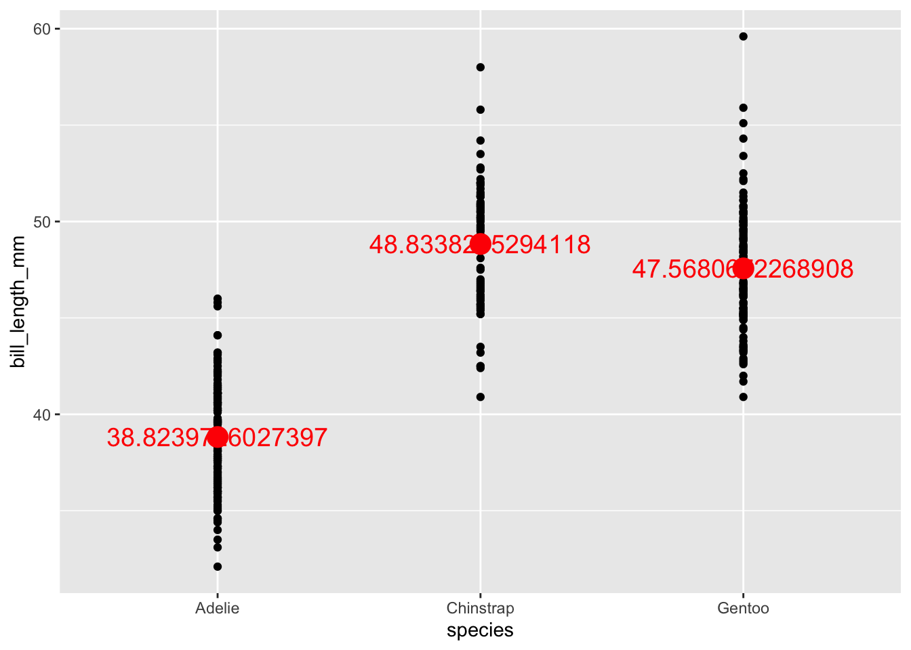


```r
n_fun <- function(x) {
  data.frame(y = 62,
            label = length(x),
            color = ifelse(length(x) > 100, "red", "blue")
            )
}


penguins %>% 
  ggplot(aes(x = species, y = bill_length_mm)) +
  geom_boxplot() +
  geom_jitter() +
  stat_summary(
    fun.data = n_fun,
    geom = "text"
  )
```

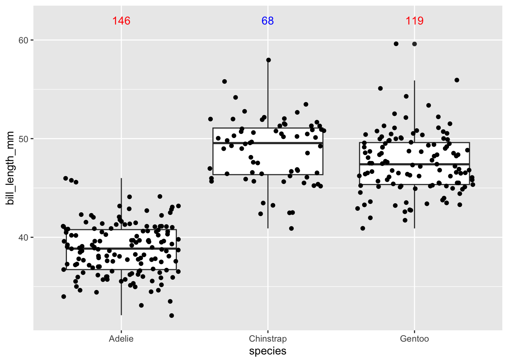


```r
penguins %>% 
  ggplot(aes(x = species, y = bill_length_mm)) +
  geom_point() +
  stat_summary(
    geom = "pointrange",
    fun.data = "mean_cl_boot",
    color = "red"
  )
```

```
## Warning: Computation failed in `stat_summary()`
## Caused by error in `fun.data()`:
## ! The package "Hmisc" is required.
```


```r
penguins %>% 
  ggplot(aes(x = species, y = bill_length_mm)) +
  geom_point() +
  stat_summary(
    geom = "pointrange",
    fun.data = ~ mean_se(., mult = 5),
    color = "red", 
    size = 1
  ) +
  stat_summary(
    fun = "mean",
    geom = "text",
    mapping = aes(y = stage(bill_length_mm, after_stat = 30), 
                  label = round(after_stat(y), 2)),
    color = "blue", 
    size = 5
  ) +
  stat_summary(
    fun = "length",
    geom = "text",
    mapping = aes(y = stage(bill_length_mm, after_stat = 62), 
                  label = after_stat(y)
                  ),
    color = "black", 
    size = 5
  )
```

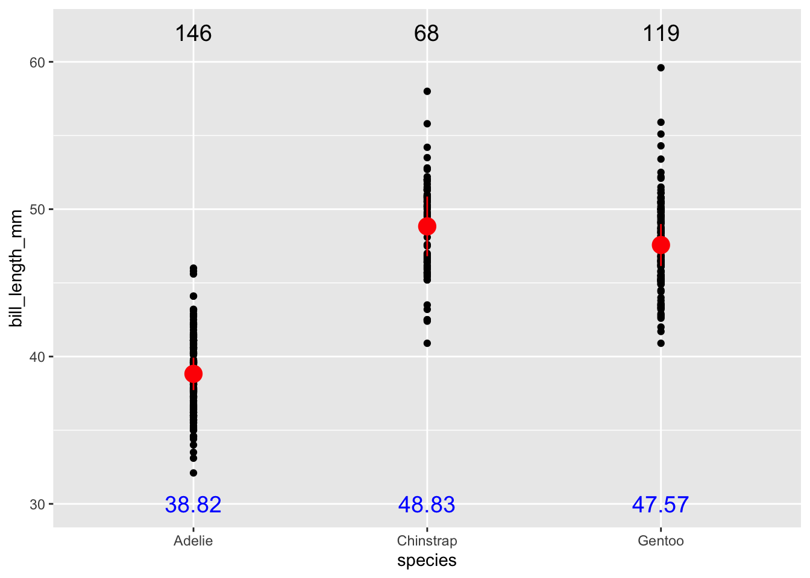


### 更多


```r
calc_median_and_fill <- function(x, threshold = 40) {
  tibble(
    y = median(x),
    fill = if_else(y < threshold, "red", "gray50")
  )
}

penguins %>%
  ggplot(aes(x = species, y = bill_length_mm)) +
  stat_summary(
    fun.data = calc_median_and_fill, 
    geom = "bar" 
  )
```


```r
calc_median_and_color <- function(x, threshold = 40) {
  tibble(
    y = median(x),
    color = if_else(y < threshold, "red", "gray50")
  )
}

penguins %>%
  ggplot(aes(x = species, y = bill_length_mm)) +
  stat_summary(
    fun.data = calc_median_and_color, 
    geom = "point",
    size = 5
  )
```


```r
penguins %>%
  ggplot(aes(species, bill_depth_mm)) +
  stat_summary(
    fun.data = function(x) {
      
      scaled_size <- length(x)/nrow(penguins)
      
      mean_se(x) %>% 
        mutate(size = scaled_size)
    }
  )
```


```r
penguins %>%
  ggplot(aes(species, bill_depth_mm)) +
  geom_point(position = position_jitter(width = .2), alpha = .3) +
  stat_summary(fun = mean, 
               na.rm = TRUE,
               geom = "point", 
               color = "dodgerblue", 
               size = 4, 
               shape = "diamond") +
  stat_summary(fun.data = mean_cl_normal,
               na.rm = TRUE, 
               geom = "errorbar",
               width = .2, 
               color = "dodgerblue") +
  stat_summary(fun = mean, 
               na.rm = TRUE, 
               aes(group = 1),
               geom = "line", 
               color = "dodgerblue", 
               size = .75) 
```

```
## Warning: Using `size` aesthetic for lines was deprecated in ggplot2 3.4.0.
## ℹ Please use `linewidth` instead.
## This warning is displayed once every 8 hours.
## Call `lifecycle::last_lifecycle_warnings()` to see where this warning was
## generated.
```

```
## Warning: Computation failed in `stat_summary()`
## Caused by error in `fun.data()`:
## ! The package "Hmisc" is required.
```

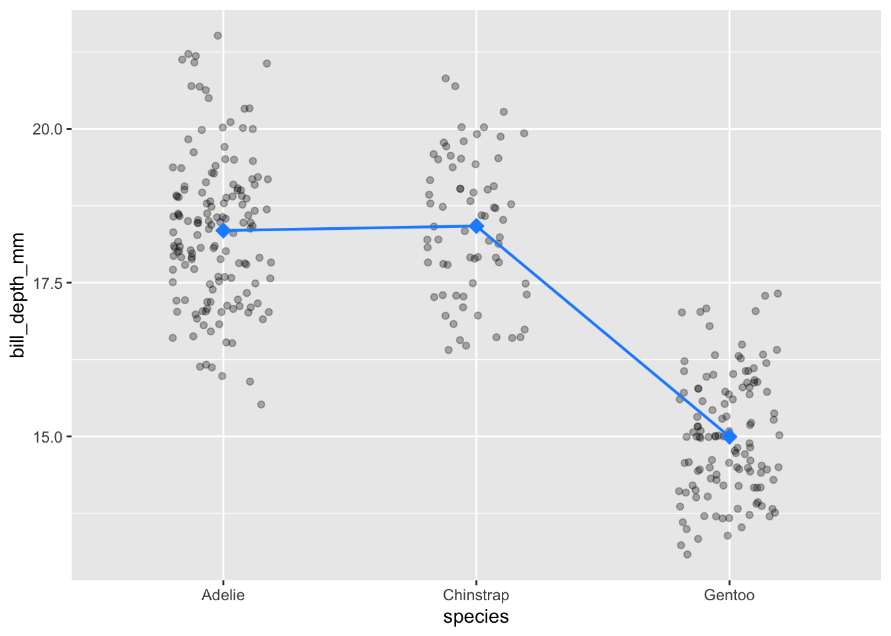


```r
penguins %>%
  ggplot(aes(species, bill_depth_mm, group = sex, color = sex)) +
  geom_point(
    position = position_jitterdodge(
      jitter.width = .2,
      dodge.width = .7
    ),
    alpha = .1
  ) +
  stat_summary(
    fun = mean,
    na.rm = TRUE,
    geom = "point",
    shape = "diamond",
    size = 4,
    color = "black",
    position = position_dodge(width = .7)
  ) +
  stat_summary(
    fun.data = mean_cl_normal,
    na.rm = TRUE,
    geom = "errorbar",
    width = .2,
    color = "black",
    position = position_dodge(width = .7)
  ) +
  scale_color_brewer(palette = "Set1")
```

```
## Warning: Computation failed in `stat_summary()`
## Caused by error in `fun.data()`:
## ! The package "Hmisc" is required.
```


```r
penguins %>%
  ggplot(aes(species, bill_depth_mm, group = sex, color = sex)) +
  geom_point(
    position = position_jitterdodge(
      jitter.width = .2,
      dodge.width = .7
    ),
    alpha = .1
  ) +
  stat_summary(
    fun = mean,
    na.rm = TRUE,
    geom = "point",
    shape = "diamond",
    size = 4,
    color = "black",
    position = position_dodge(width = .7)
  ) +
  stat_summary(
    fun.data = mean_cl_normal,
    na.rm = TRUE,
    geom = "errorbar",
    width = .2,
    color = "black",
    position = position_dodge(width = .7)
  ) +
  scale_color_brewer(palette = "Set1") +
  facet_wrap(~sex)
```

```
## Warning: Computation failed in `stat_summary()`
## Computation failed in `stat_summary()`
## Caused by error in `fun.data()`:
## ! The package "Hmisc" is required.
```

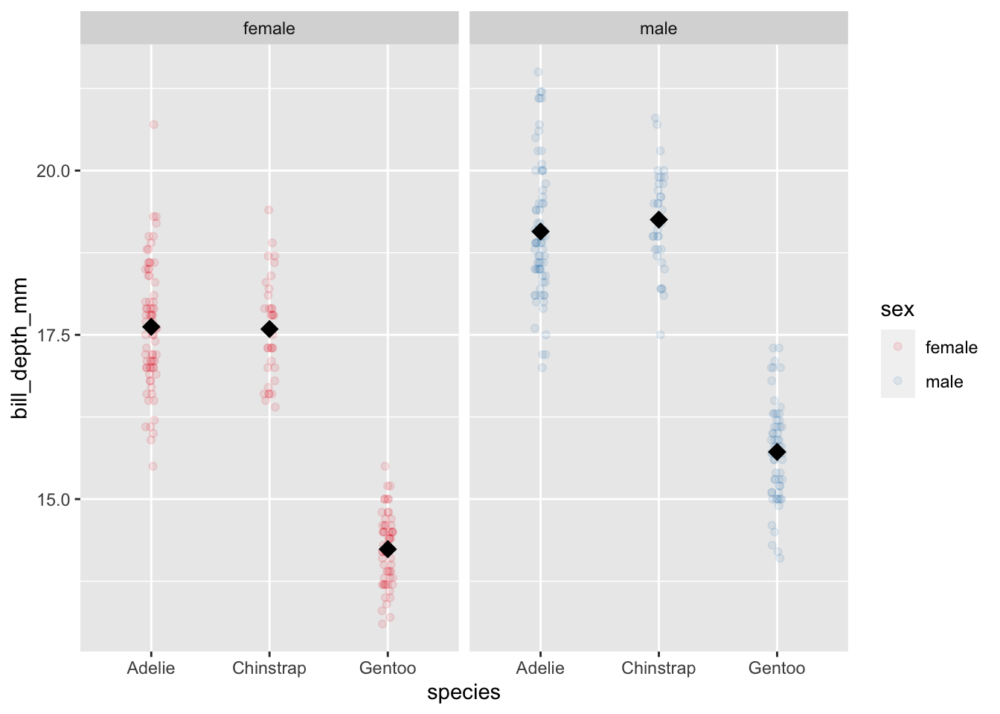


## stat_summary_bin

在落入x区间位置上的y，设定函数（也可以调整方向，对落入y区间位置的每个x，设定函数）


```r
penguins %>%
  ggplot(aes(x = bill_depth_mm, y = bill_length_mm)) +
  layer(
    stat = "summary_bin",
    geom = "bar",
    params = list(fun = mean, color = "red", orientation = 'x'),
    position = "identity"
  )
```


```r
penguins %>%
  ggplot(aes(x = bill_depth_mm, y = bill_length_mm)) +
  stat_summary_bin(   
    fun = mean,
    color = "red",
    geom = "bar",
    orientation = 'x'     # bin on x axis, summary mean on y
  )
```


```r
penguins %>%
  ggplot(aes(x = bill_depth_mm, y = bill_length_mm)) +
  stat_summary_bin( 
    fun = mean,
    color = "red",
    geom = "bar",
    orientation = 'y'  
  )
```


```r
penguins %>%
  ggplot(aes(x = bill_depth_mm, y = bill_length_mm)) +
  geom_bar(
    stat = "summary_bin",
    fun = mean,
    color = "red"
  )
```


```r
penguins %>%
  ggplot(aes(x = bill_depth_mm, y = bill_length_mm)) +
  stat_summary_bin( 
    fun = mean,
    color = "red",
    geom = "bar",
    orientation = 'y'  # bin on y axis, summary mean on x
  )
```

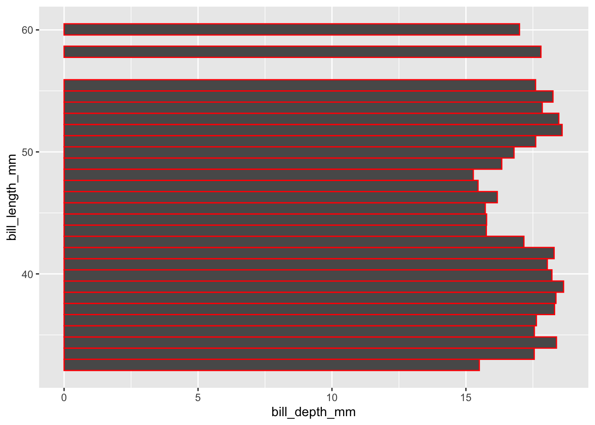


##  stat_function() 

函数曲线

`Computed variables`

- x: x values along a grid
- y: value of the function evaluated at corresponding x


`默认几何形状`

- geom_line()


`适用几何形状`

- geom_line() / geom_point() /geom_function() 


```r
tibble(x = runif(n = 100, min = -5, max = 5)) %>% 
  ggplot() +
  layer(
    stat = "function",
    geom = "point",
    params = list(fun = dnorm, args = list(mean = 0, sd = 0.5)),
    position = "identity"
  ) + 
  xlim(-2, 2)
```

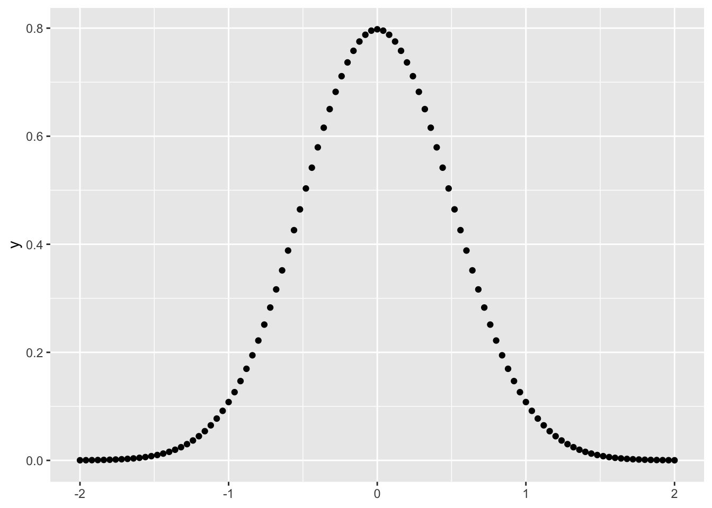


```r
tibble(x = runif(n = 100, min = -5, max = 5)) %>% 
  ggplot() +
  layer(
    stat = "function",
    geom = "point",
    params = list(fun =  ~ 0.5*exp(-abs(.x))),
    position = "identity"
  ) + 
  xlim(-2, 2)
```

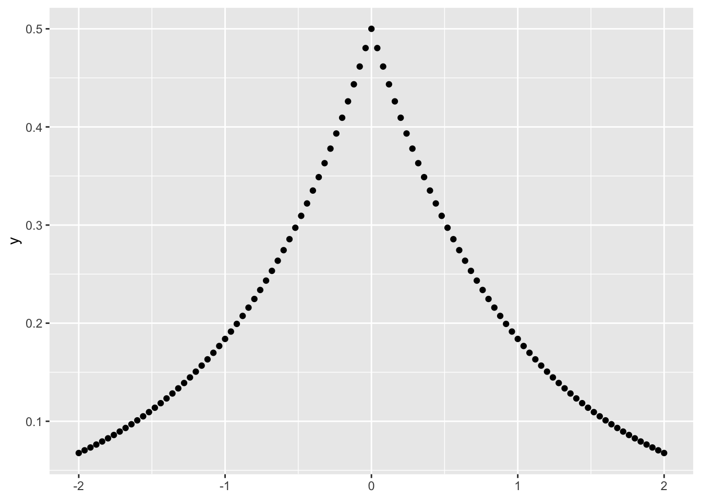


## stat_spoke()


将角度和半径转换为xend和yend，可以看作是`geom_segment()`另外一种形式


```r
penguins %>%
  mutate(angle = flipper_length_mm / (2*pi) ) %>% 
  ggplot(aes(x = bill_length_mm, y = bill_depth_mm)) +
  layer(
    stat = "identity",
    geom = "spoke",
    mapping = aes(angle = angle),
    params = list(radius = 0.5),
    position = "identity"
  )
```


```r
penguins %>%
  mutate(angle = flipper_length_mm / (2*pi) ) %>% 
  
  ggplot(aes(x = bill_length_mm, y = bill_depth_mm)) +
  geom_spoke(
    mapping = aes(angle = angle),
    radius = 0.5
  )
```


## stat_quantile()

分位数回归


```r
quantreg::rq(bill_depth_mm ~ bill_length_mm, 
             data = penguins,
             tau = c(0.25, 0.5, 0.75)
             )
```


`Computed variables`

- quantile: quantile of distribution


`默认几何形状`

-  geom_quantile() 


`适用几何形状`

- geom_line() / geom_point() / geom_quantile() 


```r
penguins %>% 
  ggplot(aes(x = bill_length_mm, y = bill_depth_mm)) +
  layer(
    stat = "quantile",
    geom = "quantile",
    params = list(quantiles = c(0.25, 0.5, 0.75)),
    position = "identity"
)
```

```
## Smoothing formula not specified. Using: y ~ x
```


```r
penguins %>% 
  ggplot(aes(x = bill_length_mm, y = bill_depth_mm)) +
  layer(
    stat = "quantile",
    geom = "point",
    mapping = aes(color = after_stat(quantile)),
    params = list(quantiles = c(0.25, 0.5, 0.75)),
    position = "identity"
)
```

```
## Smoothing formula not specified. Using: y ~ x
```

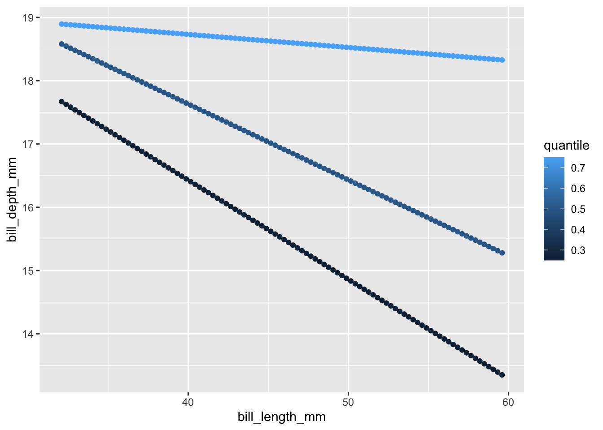


## stat_summary_2d()

落在x和y(长方形)区域上, summary on z


文档说`stat_summary_2d() is a 2d variation of stat_summary().` 个人觉得不完全准确


- 看参数stat_summary() 是对每一个`x`统计汇总summary，**有多少个唯一的x, 就有多少个value**.

- 而stat_summary_2d() 有 bin的参数，它是对落在(x，y)构成的具有一定binwidth的长方形区域内的`z`统计汇总. **有多少个长方形，就有多少个value**.


离散变量是正确的，但对应连续变量不准确。


`Aesthetics`

- x: horizontal position
- y: vertical position
- z: value passed to the summary function


`Computed variables`

- `x, y`  : Location
- `value` : Value of summary statistic.  


`默认几何形状`

- `geom_tile()` for stat_summary_2d()    
- `geom_hex()`  for stat_summary_hex()


```r
penguins %>% 
  ggplot(aes(x = bill_length_mm, y = bill_depth_mm, z = body_mass_g)) +
  layer(
    stat = "summary_2d",
    geom = "tile",
    params = list(fun = ~ sum(.x^2)),
    position = "identity"
  ) 
```


```r
penguins %>% 
  ggplot(aes(x = bill_length_mm, y = bill_depth_mm, z = body_mass_g)) +
  stat_summary_2d(
    geom = "point",
    fun = ~ sum(.x^2),  # summary statistic for z
    mapping = aes(size = after_stat(value))
  ) 
```

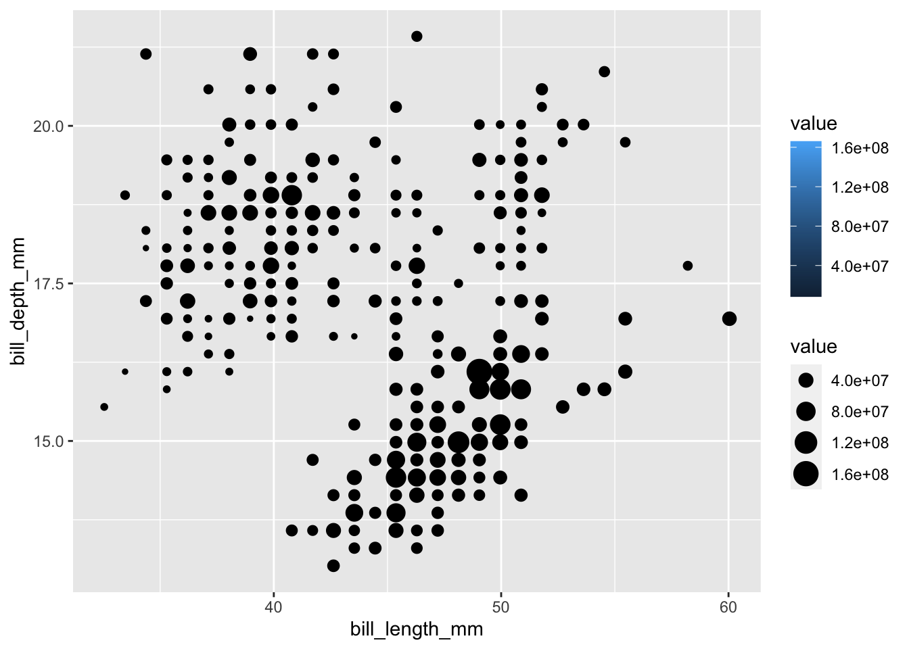


### 测试


```r
penguins %>% 
  distinct(bill_length_mm, bill_depth_mm)
```

```
## # A tibble: 329 × 2
##    bill_length_mm bill_depth_mm
##             <dbl>         <dbl>
##  1           39.1          18.7
##  2           39.5          17.4
##  3           40.3          18  
##  4           36.7          19.3
##  5           39.3          20.6
##  6           38.9          17.8
##  7           39.2          19.6
##  8           41.1          17.6
##  9           38.6          21.2
## 10           34.6          21.1
## # ℹ 319 more rows
```

说明有4个重叠的点。


`sum`是一个点一个位置


```r
penguins %>% 
  ggplot(aes(x = bill_length_mm, y = bill_depth_mm)) +
  layer(
    geom = "text",
    stat = "sum",
    mapping = aes(label = after_stat(n), color = as.factor(after_stat(n)) ),
    params = list(size = 4),
    position = "identity"
  )
```


`bin_2d`是一个bin一个统计


```r
penguins %>% 
  ggplot(aes(x = bill_length_mm, y = bill_depth_mm)) +
  layer(
    geom = "text",
    stat = "bin_2d",
    mapping = aes(label = stage(NULL, after_stat = count)),
    position = "identity"
  )
```


`stat_summary_2d`也是**一个bin**一个位置


```r
n_fun <- function(z) {
      length(z)
  }

penguins %>% 
  ggplot(aes(x = bill_length_mm, y = bill_depth_mm, z = body_mass_g)) +
  stat_summary_2d(
    fun = n_fun,
    geom = "text",
    mapping = aes(label = after_stat(value))
  )
```


##  stat_summary_hex()

落在x和y(六边形)区域上, summary on z


```r
penguins %>% 
  ggplot(aes(x = bill_length_mm, y = bill_depth_mm, z = body_mass_g)) +
  layer(
    stat = "summary_hex",
    geom = "tile",
    params = list(fun = ~ sum(.x^2), binwidth = c(0.5, 0.2)),
    position = "identity"
  ) 
```

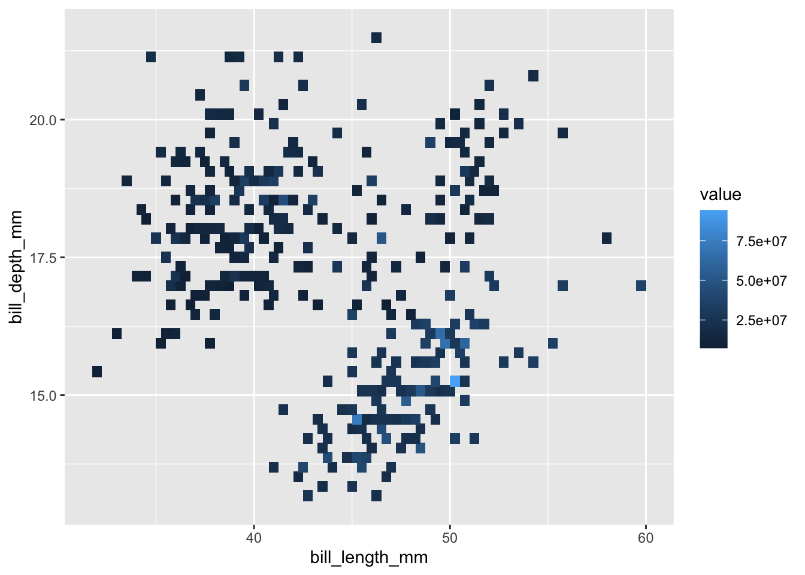


```r
penguins %>% 
  ggplot(aes(x = bill_length_mm, y = bill_depth_mm, z = body_mass_g)) +
  stat_summary_hex(
    geom = "tile",
    fun = ~ sum(.x^2),         # summary statistic for z
    binwidth = c(0.5, 0.2)     # Numeric vector giving bin width in both vertical and horizontal directions
  ) 
```


##  stat_contour() and stat_contour_filled()

等高线、等高面，需要提供x,y,z映射

`Computed variables`

- level: Height of contour. For contour lines, this is numeric vector that represents bin boundaries. For contour bands, this is an ordered factor that represents bin ranges.
- level_low: level_high, level_mid (contour bands only) Lower and upper bin boundaries for each band, as well the mid point between the boundaries.
- nlevel: Height of contour, scaled to maximum of 1.
- piece: Contour piece (an integer).


`默认几何形状`

- geom_contour()  / geom_contour_filled()


`适用几何形状`

-  geom_contour() / geom_contour_filled() 


```r
penguins %>% 
  mutate(
    flipper_length_mm = flipper_length_mm %/% 10,
    body_mass_g = body_mass_g %/% 10
  ) %>% 
  ggplot(aes(x = flipper_length_mm, y = body_mass_g, z = bill_length_mm)) +
  layer(
    stat = "contour",
    geom = "path",
    mapping = aes(colour = after_stat(level)),
    position = "identity"
  )
```


```r
penguins %>% 
  mutate(
    flipper_length_mm = flipper_length_mm %/% 10,
    body_mass_g = body_mass_g %/% 10
  ) %>% 
  ggplot(aes(x = flipper_length_mm, y = body_mass_g, z = bill_length_mm)) +
  stat_contour(
    geom = "path",
    mapping = aes(colour = after_stat(level))
  )
```

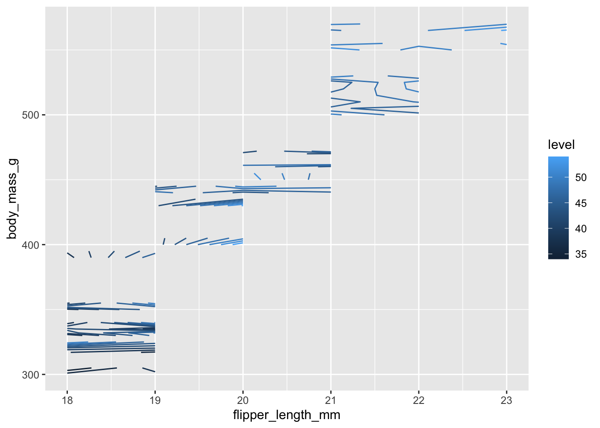


```r
penguins %>% 
  mutate(
    flipper_length_mm = flipper_length_mm %/% 10,
    body_mass_g = body_mass_g %/% 10
  ) %>% 
  ggplot(aes(x = flipper_length_mm, y = body_mass_g, z = bill_length_mm)) +
  geom_contour(
    aes(colour = after_stat(level))
  )
```


## 课后作业

- 写成对应的`stat_***()` 版本和`geom_***()`版本

```r
library(tidyverse)
library(palmerpenguins)

penguins <- penguins %>% drop_na()

ggplot() +
  layer(
      data       = penguins,
      mapping    = aes(x = species, y = bill_length_mm, color = fct_rev(sex)),
      stat       = "summary", 
      params     = list(fun = "mean"),
      geom       = "point",
      position   = position_dodge(width = 0.5)
  )
```

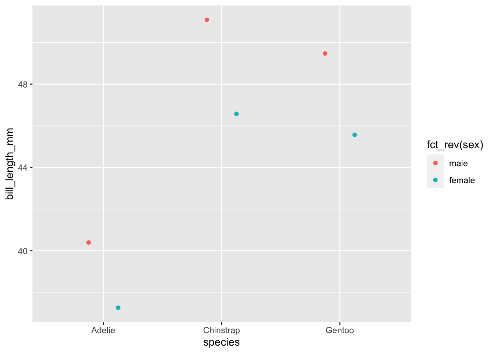


- 写出对应的`stat_***()` 版本和`layer()`版本

```r
penguins %>% 
  ggplot(aes(species, island)) +
  geom_count(aes(size = after_stat(n)), show.legend = FALSE) 
```


- 上题用layer写，但要求不用`stat = "sum"`, 而用`stat = "summary"`


