# ggplot2之几何形状 {#tidyverse-ggplot2-geom}

> 采菊东篱下，悠然见南山。
>


根据大家投票，觉得`ggplot2`是最想掌握的技能，我想这就是R语言中最有**质感**的部分吧。所以，这里专门拿出一节课讲`ggplot2`，也算是补上之前第 \@ref(tidyverse-ggplot2-aes) 章数据可视化没讲的内容。


```r
library(tidyverse)
```


## 一个有趣的案例

先看一组数据


```r
df <- read_csv("./demo_data/datasaurus.csv")
```

```
## Rows: 1846 Columns: 3
## ── Column specification ────────────────────────────────────────────────────────
## Delimiter: ","
## chr (1): dataset
## dbl (2): x, y
## 
## ℹ Use `spec()` to retrieve the full column specification for this data.
## ℹ Specify the column types or set `show_col_types = FALSE` to quiet this message.
```

```r
df
```

```
## # A tibble: 1,846 × 3
##    dataset     x     y
##    <chr>   <dbl> <dbl>
##  1 dino     55.4  97.2
##  2 dino     51.5  96.0
##  3 dino     46.2  94.5
##  4 dino     42.8  91.4
##  5 dino     40.8  88.3
##  6 dino     38.7  84.9
##  7 dino     35.6  79.9
##  8 dino     33.1  77.6
##  9 dino     29.0  74.5
## 10 dino     26.2  71.4
## # ℹ 1,836 more rows
```

先用`dataset`分组后，然后计算每组下`x`的均值和方差，`y`的均值和方差，以及`x，y`两者的相关系数。

```r
df %>%
  group_by(dataset) %>%
  summarize(
    mean_x = mean(x),
    mean_y = mean(y),
    std_dev_x = sd(x),
    std_dev_y = sd(y),
    corr_x_y = cor(x, y)
  )
```

```
## # A tibble: 13 × 6
##    dataset    mean_x mean_y std_dev_x std_dev_y corr_x_y
##    <chr>       <dbl>  <dbl>     <dbl>     <dbl>    <dbl>
##  1 away         54.3   47.8      16.8      26.9  -0.0641
##  2 bullseye     54.3   47.8      16.8      26.9  -0.0686
##  3 circle       54.3   47.8      16.8      26.9  -0.0683
##  4 dino         54.3   47.8      16.8      26.9  -0.0645
##  5 dots         54.3   47.8      16.8      26.9  -0.0603
##  6 h_lines      54.3   47.8      16.8      26.9  -0.0617
##  7 high_lines   54.3   47.8      16.8      26.9  -0.0685
##  8 slant_down   54.3   47.8      16.8      26.9  -0.0690
##  9 slant_up     54.3   47.8      16.8      26.9  -0.0686
## 10 star         54.3   47.8      16.8      26.9  -0.0630
## 11 v_lines      54.3   47.8      16.8      26.9  -0.0694
## 12 wide_lines   54.3   47.8      16.8      26.9  -0.0666
## 13 x_shape      54.3   47.8      16.8      26.9  -0.0656
```

可视化是数据探索中非常重要的部分。本章的目的就是带领大家学习ggplot2基本的绘图技能。


## 学习目标

### 图形语法

图形语法 “grammar of graphics” ("ggplot2" 中的`gg` 就来源于此) 使用图层(layer)去描述和构建图形，下图是ggplot2图层概念的示意图


### 图形部件

一张统计图形就是从**数据**到几何形状(geometric object，缩写geom)所包含的**图形属性**(aesthetic attribute，缩写aes)的一种映射。


1. `data`: 数据框data.frame (注意，不支持向量vector和列表list类型）

2. `aes`: 数据框中的数据变量**映射**到图形属性。什么叫图形属性？就是图中点的位置、形状，大小，颜色等眼睛能看到的东西。什么叫映射？就是一种对应关系，比如数学中的函数`b = f(a)`就是`a`和`b`之间的一种映射关系, `a`的值决定或者控制了`b`的值，在ggplot2语法里，`a`就是我们输入的数据变量，`b`就是图形属性， 这些图形属性包括：
    + x（x轴方向的位置）
    + y（y轴方向的位置）
    + color（点或者线等元素的颜色）
    + size（点或者线等元素的大小）
    + shape（点或者线等元素的形状）
    + alpha（点或者线等元素的透明度）
    
3. `geoms`: 几何形状，确定我们想画什么样的图，一个`geom_***`确定一种形状。更多几何形状推荐阅读[这里](https://ggplot2.tidyverse.org/reference/)

    + `geom_bar()`
    + `geom_density()`
    + `geom_freqpoly()`
    + `geom_histogram()`
    + `geom_violin()`
    + `geom_boxplot()`
    + `geom_col()`
    + `geom_point()`
    + `geom_smooth()`
    + `geom_tile()`
    + `geom_density2d()`
    + `geom_bin2d()`
    + `geom_hex()`
    + `geom_count()`
    + `geom_text()`
    + `geom_sf()`
    
<div class="figure">
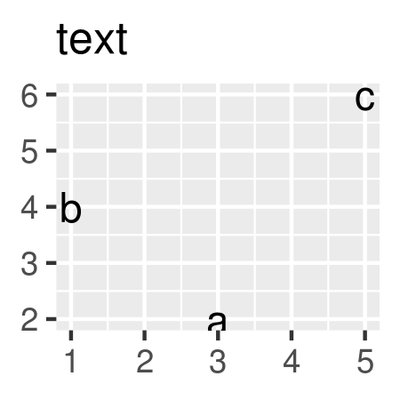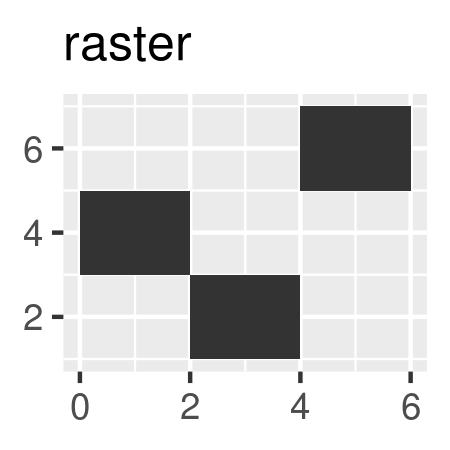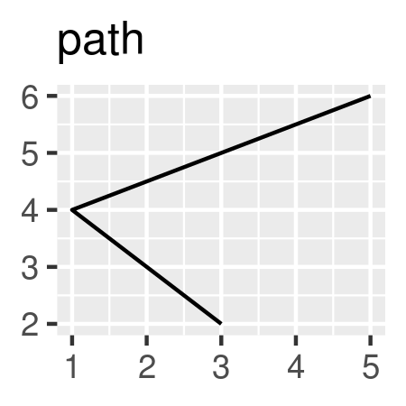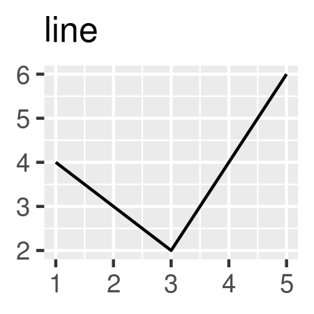
<p class="caption">(\#fig:unnamed-chunk-1)Source: <a href="https://ggplot2-book.org/individual-geoms.html">ggplot2 book</a></p>
</div>


4. `stats`:   统计变换
5. `scales`:  标度
6. `coord`:   坐标系统
7. `facet`:   分面
8. `layer`：  增加图层
9. `theme`:   主题风格
10. `save`:   保存图片


<div class="figure">

<p class="caption">(\#fig:unnamed-chunk-2)ggplot2语法</p>
</div>


## 开始

<div class="try">
<p>R语言数据类型，有字符串型、数值型、因子型、逻辑型、日期型等。
ggplot2会将字符串型、因子型、逻辑型默认为<strong>离散变量</strong>，而数值型默认为<strong>连续变量</strong>，将日期时间为<strong>日期变量</strong>：</p>
<ul>
<li><p><strong>离散变量</strong>: 字符串型<chr>, 因子型<fct>,
逻辑型<lgl></p></li>
<li><p><strong>连续变量</strong>: 双精度数值<dbl>,
整数数值<int></p></li>
<li><p><strong>日期变量</strong>: 日期<date>, 时间<time>,
日期时间<dttm></p></li>
</ul>
<p>我们在呈现数据的时候，可能会同时用到多种类型的数据，比如</p>
<ul>
<li><p>一个离散</p></li>
<li><p>一个连续</p></li>
<li><p>两个离散</p></li>
<li><p>两个连续</p></li>
<li><p>一个离散, 一个连续</p></li>
<li><p>三个连续</p></li>
</ul>
</div>


### 导入数据


```r
gapdata <- read_csv("./demo_data/gapminder.csv")
```

```
## Rows: 1704 Columns: 6
## ── Column specification ────────────────────────────────────────────────────────
## Delimiter: ","
## chr (2): country, continent
## dbl (4): year, lifeExp, pop, gdpPercap
## 
## ℹ Use `spec()` to retrieve the full column specification for this data.
## ℹ Specify the column types or set `show_col_types = FALSE` to quiet this message.
```

```r
gapdata
```

```
## # A tibble: 1,704 × 6
##    country     continent  year lifeExp      pop gdpPercap
##    <chr>       <chr>     <dbl>   <dbl>    <dbl>     <dbl>
##  1 Afghanistan Asia       1952    28.8  8425333      779.
##  2 Afghanistan Asia       1957    30.3  9240934      821.
##  3 Afghanistan Asia       1962    32.0 10267083      853.
##  4 Afghanistan Asia       1967    34.0 11537966      836.
##  5 Afghanistan Asia       1972    36.1 13079460      740.
##  6 Afghanistan Asia       1977    38.4 14880372      786.
##  7 Afghanistan Asia       1982    39.9 12881816      978.
##  8 Afghanistan Asia       1987    40.8 13867957      852.
##  9 Afghanistan Asia       1992    41.7 16317921      649.
## 10 Afghanistan Asia       1997    41.8 22227415      635.
## # ℹ 1,694 more rows
```

### 检查数据

是否有缺失值


```r
gapdata %>%
  summarise(
    across(everything(), ~ sum(is.na(.)))
  )
```

```
## # A tibble: 1 × 6
##   country continent  year lifeExp   pop gdpPercap
##     <int>     <int> <int>   <int> <int>     <int>
## 1       0         0     0       0     0         0
```


* `country`   代表国家
* `countinet` 表示所在的洲
* `year`      时间
* `lifeExp`   平均寿命
* `pop`       人口数量
* `gdpPercap` 人均GDP


<div class="try">
<p>接下来，我们需要思考我们应该选择什么样的图，呈现这些不同类型的数据，探索数据背后的故事</p>
</div>


## 基本绘图

### 柱状图
常用于一个离散变量


```r
gapdata %>%
  ggplot(aes(x = continent)) +
  geom_bar()
```


```r
gapdata %>%
  ggplot(aes(x = reorder(continent, continent, length))) +
  geom_bar()
```


```r
gapdata %>%
  ggplot(aes(x = reorder(continent, continent, length))) +
  geom_bar() +
  coord_flip()
```

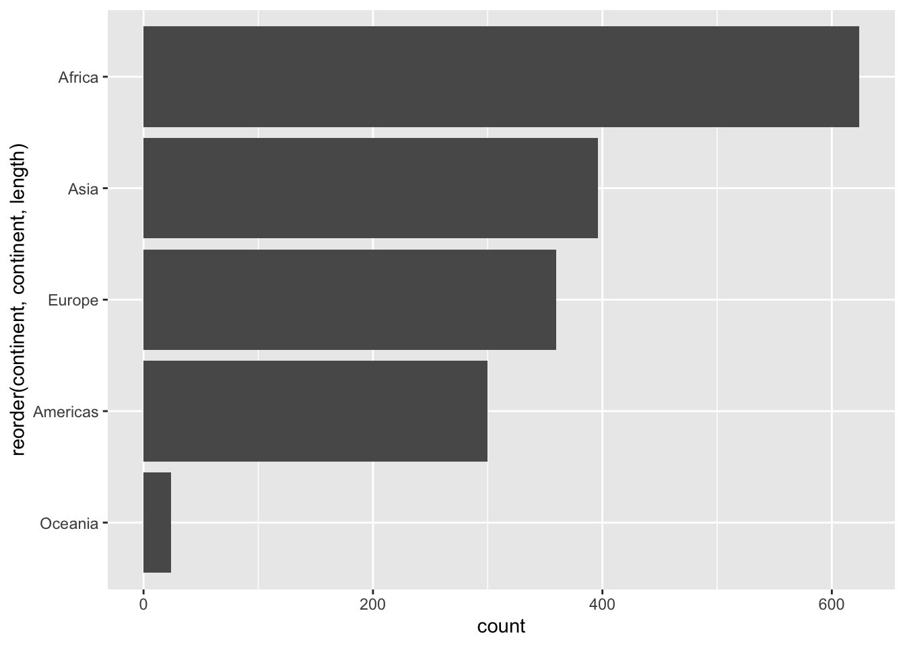


```r
# geom_bar vs stat_count
gapdata %>%
  ggplot(aes(x = continent)) +
  stat_count()
```

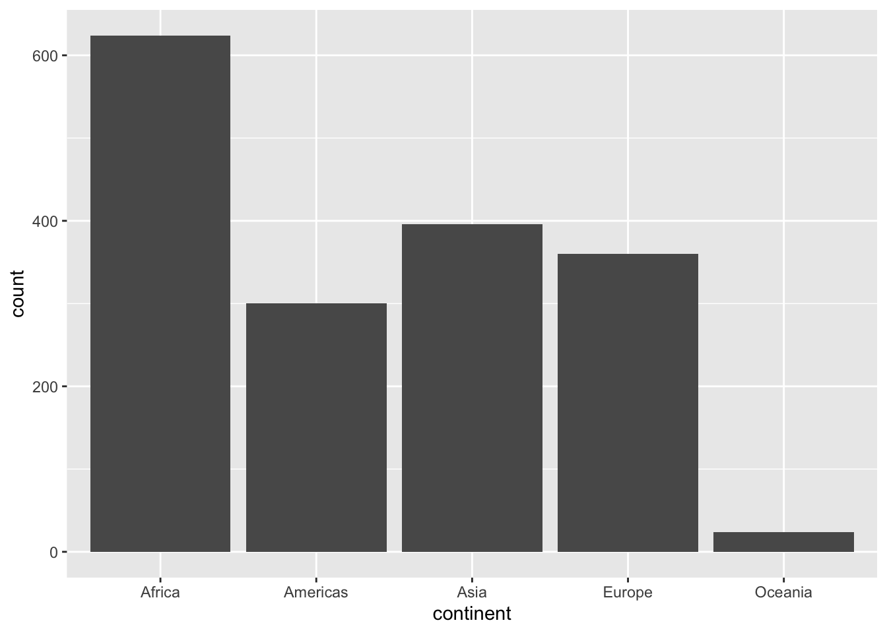


```r
gapdata %>% count(continent)
```

```
## # A tibble: 5 × 2
##   continent     n
##   <chr>     <int>
## 1 Africa      624
## 2 Americas    300
## 3 Asia        396
## 4 Europe      360
## 5 Oceania      24
```
可见，geom_bar() 自动完成了这个统计，更多geom与stat对应关系见[这里](https://ggplot2.tidyverse.org/reference/index.html#section-layer-stats)


```r
gapdata %>%
  distinct(continent, country) %>%
  ggplot(aes(x = continent)) +
  geom_bar()
```


我个人比较喜欢先统计，然后画图

```r
gapdata %>%
  distinct(continent, country) %>%
  group_by(continent) %>%
  summarise(num = n()) %>%
  ggplot(aes(x = continent, y = num)) +
  geom_col()
```


### 直方图
常用于一个连续变量

```r
gapdata %>%
  ggplot(aes(x = lifeExp)) +
  geom_histogram() # corresponding to stat_bin()
```

```
## `stat_bin()` using `bins = 30`. Pick better value with `binwidth`.
```


```r
gapdata %>%
  ggplot(aes(x = lifeExp)) +
  geom_histogram(binwidth = 1)
```


`geom_histograms()`, 默认使用 `position = "stack"`


```r
gapdata %>%
  ggplot(aes(x = lifeExp, fill = continent)) +
  geom_histogram()
```

```
## `stat_bin()` using `bins = 30`. Pick better value with `binwidth`.
```


也可以指定 `position = "identity"`

```r
gapdata %>%
  ggplot(aes(x = lifeExp, fill = continent)) +
  geom_histogram(position = "identity")
```

```
## `stat_bin()` using `bins = 30`. Pick better value with `binwidth`.
```

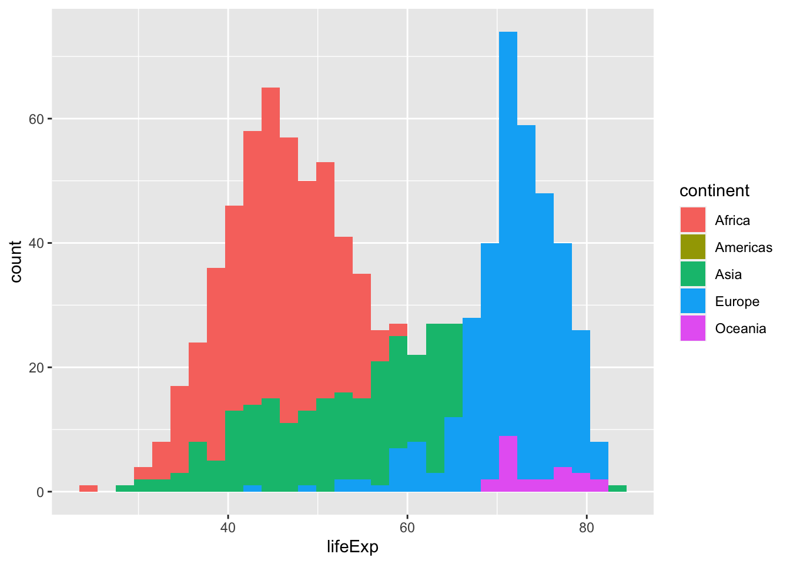

### 频次图


```r
gapdata %>%
  ggplot(aes(x = lifeExp, color = continent)) +
  geom_freqpoly()
```

```
## `stat_bin()` using `bins = 30`. Pick better value with `binwidth`.
```


### 密度图

```r
#' smooth histogram = density plot
gapdata %>%
  ggplot(aes(x = lifeExp)) +
  geom_density()
```

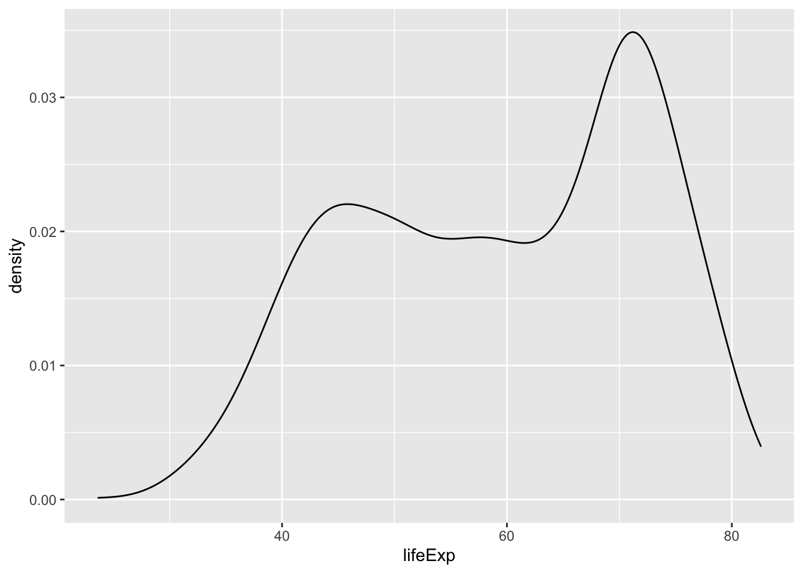

如果不喜欢下面那条线，可以这样

```r
gapdata %>%
  ggplot(aes(x = lifeExp)) +
  geom_line(stat = "density")
```


`geom_density()` 中adjust 用于调节bandwidth, adjust = 1/2 means use half of the default bandwidth.


```r
gapdata %>%
  ggplot(aes(x = lifeExp)) +
  geom_density(adjust = 1)
```


```r
gapdata %>%
  ggplot(aes(x = lifeExp)) +
  geom_density(adjust = 0.2)
```

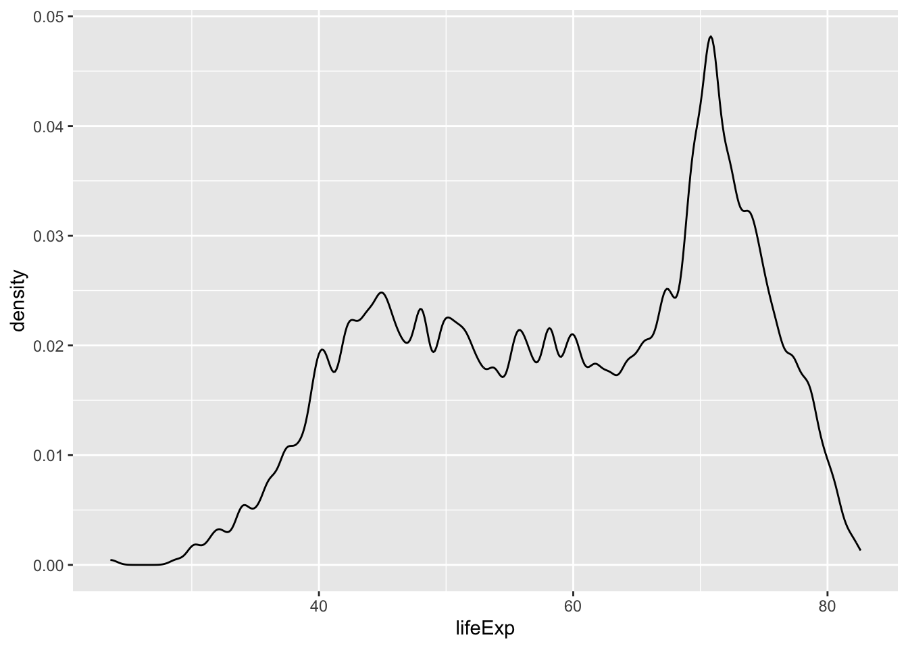


```r
gapdata %>%
  ggplot(aes(x = lifeExp, color = continent)) +
  geom_density()
```


```r
gapdata %>%
  ggplot(aes(x = lifeExp, fill = continent)) +
  geom_density(alpha = 0.2)
```

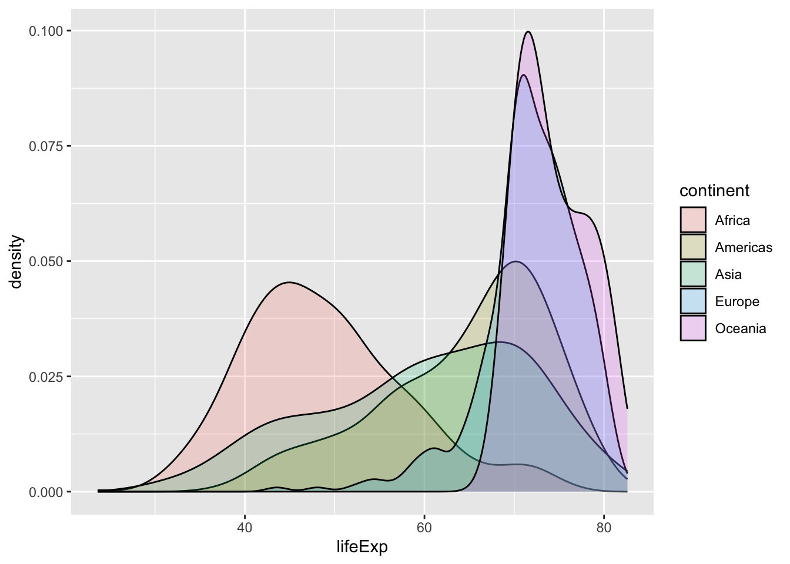


```r
gapdata %>%
  filter(continent != "Oceania") %>%
  ggplot(aes(x = lifeExp, fill = continent)) +
  geom_density(alpha = 0.2)
```

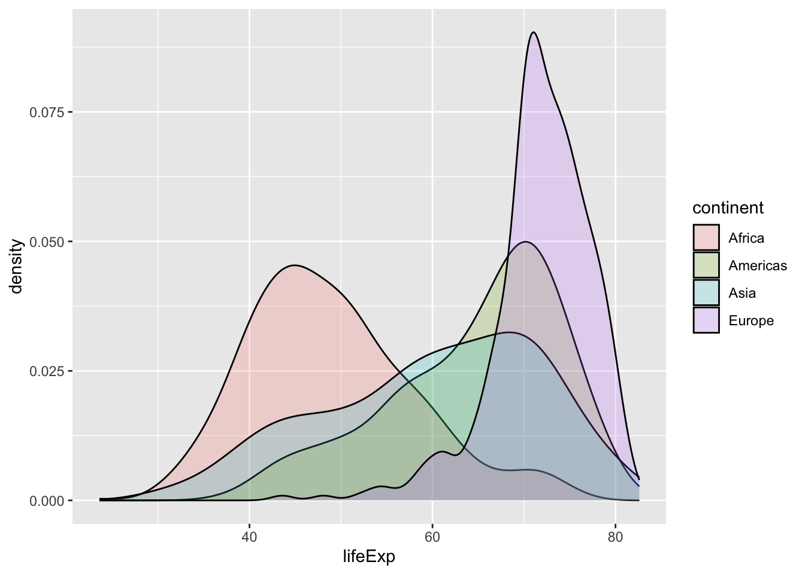


直方图和密度图画在一起。注意`y = stat(density) `表示y是由x新生成的变量，这是一种固定写法，类似的还有`stat(count)`, `stat(level)`


```r
gapdata %>%
  filter(continent != "Oceania") %>%
  ggplot(aes(x = lifeExp, y = stat(density))) +
  geom_histogram(aes(fill = continent)) +
  geom_density() 
```

```
## Warning: `stat(density)` was deprecated in ggplot2 3.4.0.
## ℹ Please use `after_stat(density)` instead.
## This warning is displayed once every 8 hours.
## Call `lifecycle::last_lifecycle_warnings()` to see where this warning was
## generated.
```

```
## `stat_bin()` using `bins = 30`. Pick better value with `binwidth`.
```

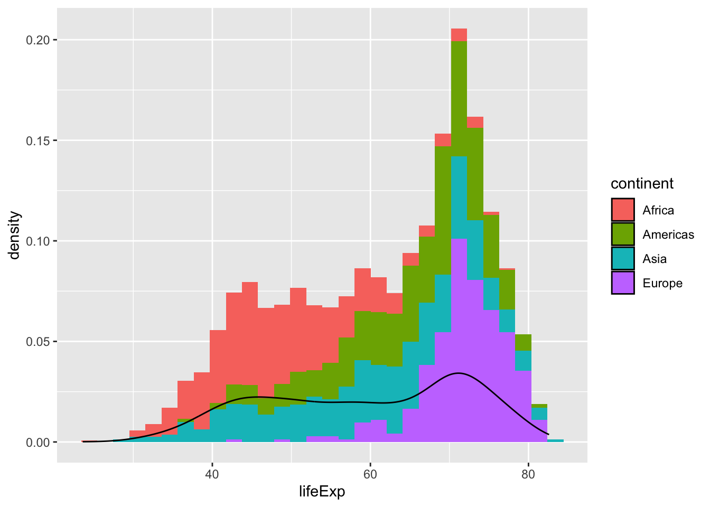


### 箱线图

一个离散变量 + 一个连续变量，思考下结果为什么是这样？

```r
gapdata %>%
  ggplot(aes(x = year, y = lifeExp)) +
  geom_boxplot()
```

```
## Warning: Continuous x aesthetic
## ℹ did you forget `aes(group = ...)`?
```


数据框中的year变量是数值型，需要先转换成因子型，弄成离散型变量


```r
gapdata %>%
  ggplot(aes(x = as.factor(year), y = lifeExp)) +
  geom_boxplot()
```

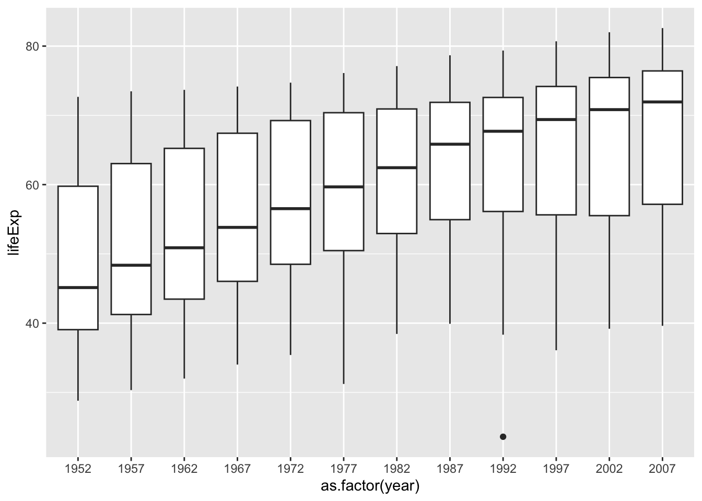


明确指定分组变量

```r
gapdata %>%
  ggplot(aes(x = year, y = lifeExp)) +
  geom_boxplot(aes(group = year))
```

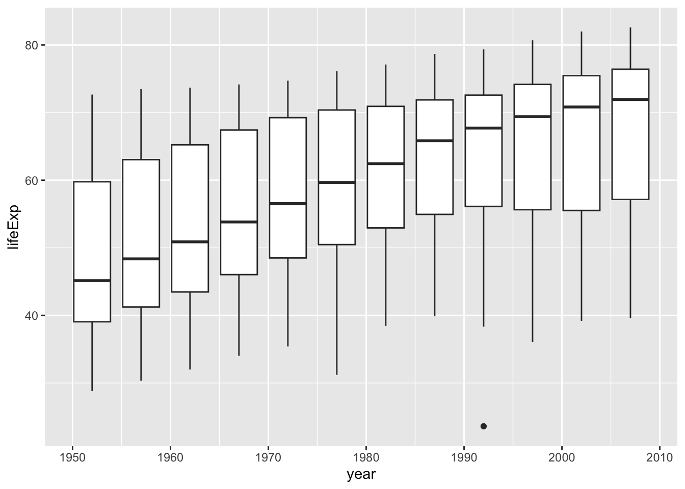


```r
gapdata %>%
  ggplot(aes(x = year, y = lifeExp)) +
  geom_violin(aes(group = year)) +
  geom_jitter(alpha = 1 / 4) +
  geom_smooth(se = FALSE)
```

```
## `geom_smooth()` using method = 'gam' and formula = 'y ~ s(x, bs = "cs")'
```


### 抖散图

点重叠的处理方案


```r
gapdata %>% 
  ggplot(aes(x = continent, y = lifeExp)) +
  geom_point()
```


```r
gapdata %>% 
  ggplot(aes(x = continent, y = lifeExp)) +
  geom_jitter()
```

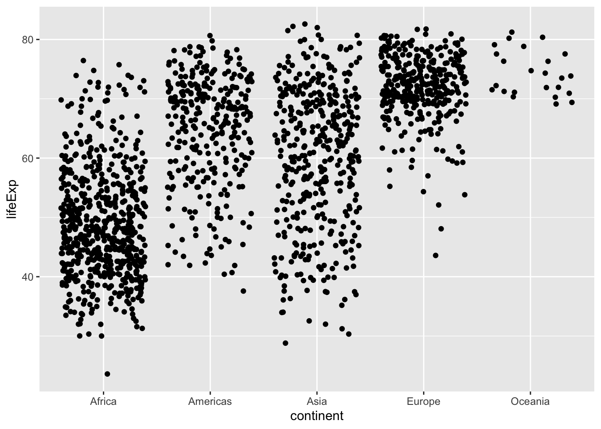


```r
gapdata %>% 
  ggplot(aes(x = continent, y = lifeExp)) +
  geom_boxplot()
```


```r
gapdata %>% 
  ggplot(aes(x = continent, y = lifeExp)) +
  geom_boxplot() +
  geom_jitter()
```


```r
gapdata %>%
  ggplot(aes(x = continent, y = lifeExp)) +
  geom_jitter() +
  stat_summary(fun.y = median, colour = "red", geom = "point", size = 5)
```

```
## Warning: The `fun.y` argument of `stat_summary()` is deprecated as of ggplot2 3.3.0.
## ℹ Please use the `fun` argument instead.
## This warning is displayed once every 8 hours.
## Call `lifecycle::last_lifecycle_warnings()` to see where this warning was
## generated.
```


```r
gapdata %>%
  ggplot(aes(reorder(x = continent, lifeExp), y = lifeExp)) +
  geom_jitter() +
  stat_summary(fun.y = median, colour = "red", geom = "point", size = 5)
```

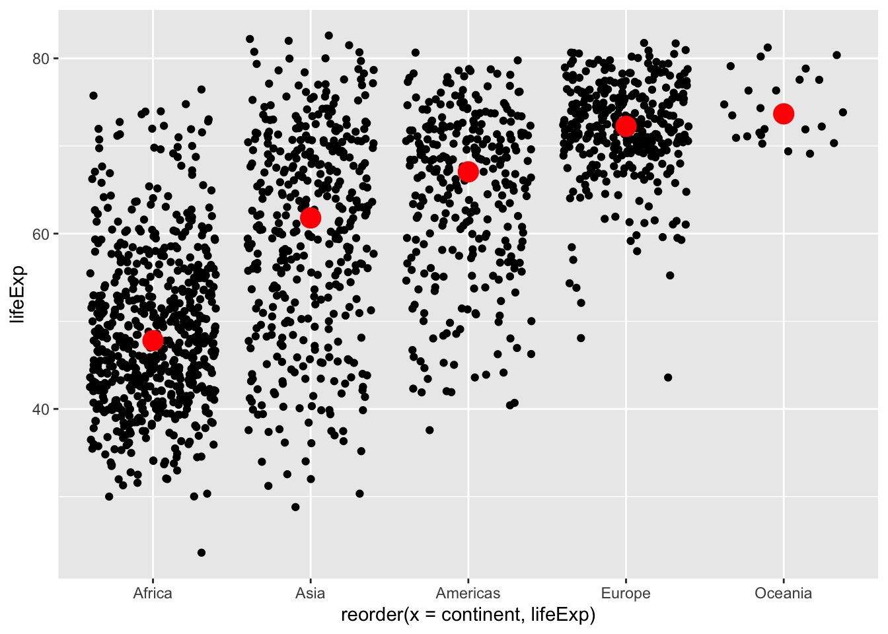

注意到我们已经提到过 **stat_count / stat_bin / stat_summary **


```r
gapdata %>%
  ggplot(aes(x = continent, y = lifeExp)) +
  geom_violin(
    trim = FALSE,
    alpha = 0.5
  ) +
  stat_summary(
    fun.y = mean,
    fun.ymax = function(x) {
      mean(x) + sd(x)
    },
    fun.ymin = function(x) {
      mean(x) - sd(x)
    },
    geom = "pointrange"
  )
```

```
## Warning: The `fun.ymin` argument of `stat_summary()` is deprecated as of ggplot2 3.3.0.
## ℹ Please use the `fun.min` argument instead.
## This warning is displayed once every 8 hours.
## Call `lifecycle::last_lifecycle_warnings()` to see where this warning was
## generated.
```

```
## Warning: The `fun.ymax` argument of `stat_summary()` is deprecated as of ggplot2 3.3.0.
## ℹ Please use the `fun.max` argument instead.
## This warning is displayed once every 8 hours.
## Call `lifecycle::last_lifecycle_warnings()` to see where this warning was
## generated.
```

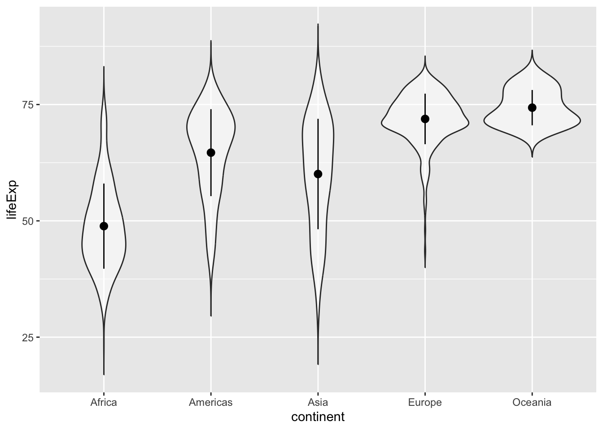


### 山峦图

常用于一个离散变量 + 一个连续变量

```r
gapdata %>%
  ggplot(aes(
    x = lifeExp,
    y = continent,
    fill = continent
  )) +
  ggridges::geom_density_ridges()
```

```
## Picking joint bandwidth of 2.23
```


```r
# https://learnui.design/tools/data-color-picker.html#palette
gapdata %>%
  ggplot(aes(
    x = lifeExp,
    y = continent,
    fill = continent
  )) +
  ggridges::geom_density_ridges() +
  scale_fill_manual(
    values = c("#003f5c", "#58508d", "#bc5090", "#ff6361", "#ffa600")
  )
```

```
## Picking joint bandwidth of 2.23
```

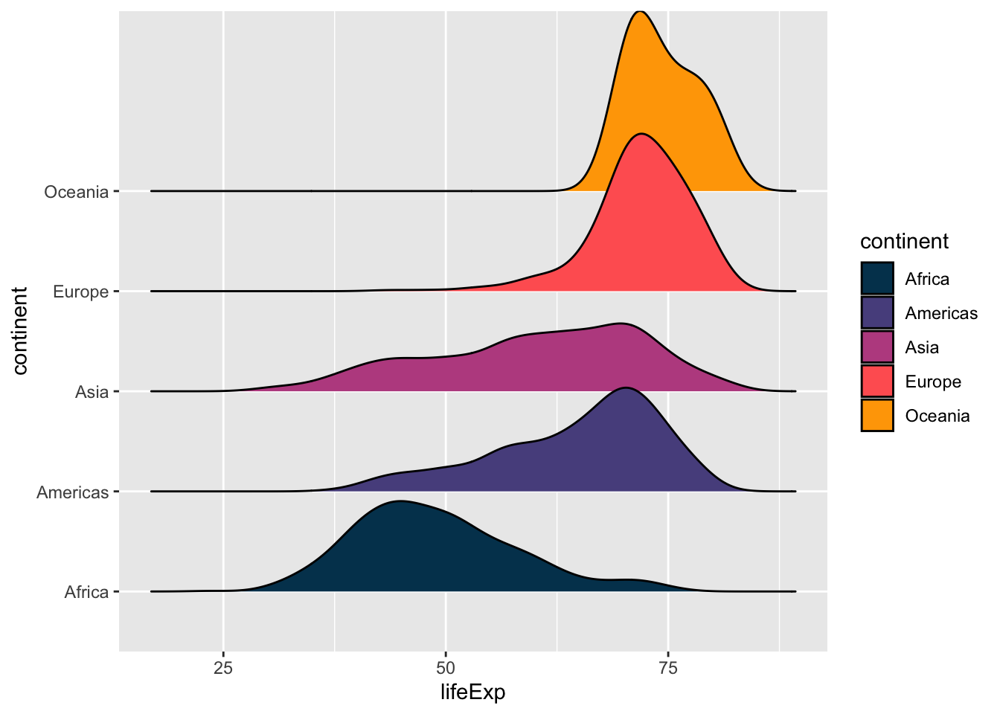


```r
gapdata %>%
  ggplot(aes(
    x = lifeExp,
    y = continent,
    fill = continent
  )) +
  ggridges::geom_density_ridges() +
  scale_fill_manual(
    values = colorspace::sequential_hcl(5, palette = "Peach")
  )
```

```
## Picking joint bandwidth of 2.23
```

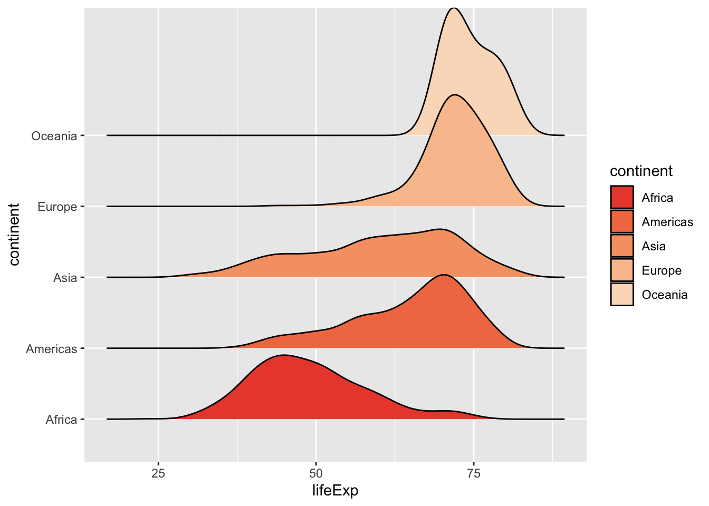


### 散点图
常用于两个连续变量


```r
gapdata %>%
  ggplot(aes(x = gdpPercap, y = lifeExp)) +
  geom_point()
```


```r
gapdata %>%
  ggplot(aes(x = log(gdpPercap), y = lifeExp)) +
  geom_point()
```


```r
gapdata %>%
  ggplot(aes(x = gdpPercap, y = lifeExp)) +
  geom_point() +
  scale_x_log10() # A better way to log transform
```


```r
gapdata %>%
  ggplot(aes(x = gdpPercap, y = lifeExp)) +
  geom_point(aes(color = continent))
```


```r
gapdata %>%
  ggplot(aes(x = gdpPercap, y = lifeExp)) +
  geom_point(alpha = (1 / 3), size = 2)
```

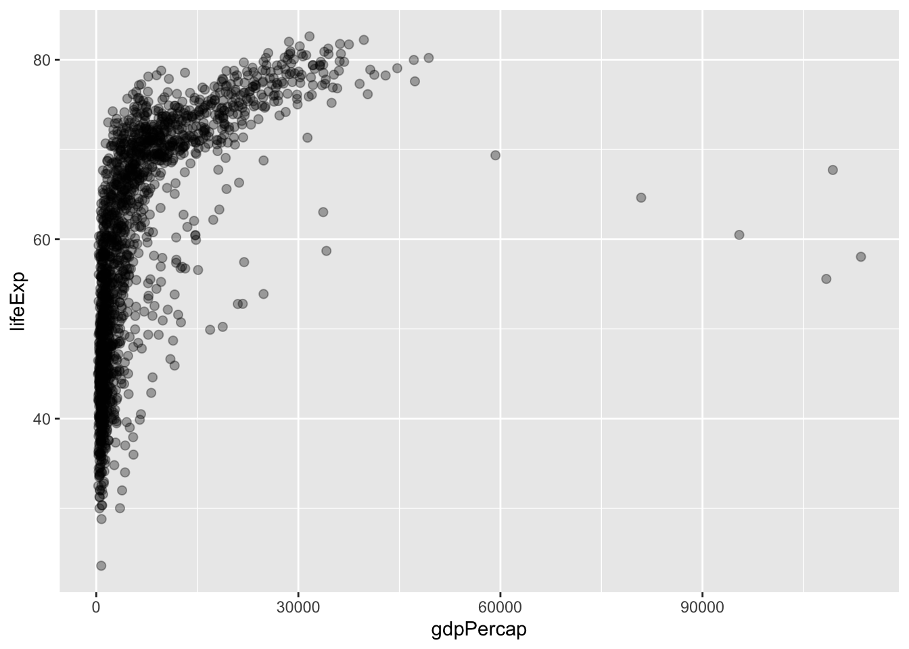


```r
gapdata %>%
  ggplot(aes(x = gdpPercap, y = lifeExp)) +
  geom_point() +
  geom_smooth()
```

```
## `geom_smooth()` using method = 'gam' and formula = 'y ~ s(x, bs = "cs")'
```


```r
gapdata %>%
  ggplot(aes(x = gdpPercap, y = lifeExp)) +
  geom_point() +
  geom_smooth(lwd = 3, se = FALSE)
```

```
## `geom_smooth()` using method = 'gam' and formula = 'y ~ s(x, bs = "cs")'
```


```r
gapdata %>%
  ggplot(aes(x = gdpPercap, y = lifeExp)) +
  geom_point() +
  geom_smooth(lwd = 3, se = FALSE, method = "lm")
```

```
## `geom_smooth()` using formula = 'y ~ x'
```

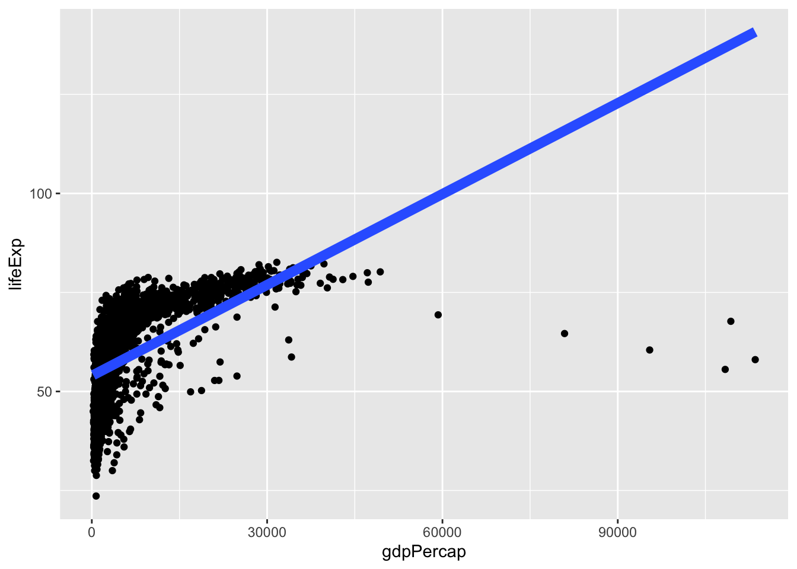


```r
gapdata %>%
  ggplot(aes(x = gdpPercap, y = lifeExp, color = continent)) +
  geom_point() +
  geom_smooth(lwd = 3, se = FALSE, method = "lm")
```

```
## `geom_smooth()` using formula = 'y ~ x'
```


```r
jCountries <- c("Canada", "Rwanda", "Cambodia", "Mexico")

gapdata %>%
  filter(country %in% jCountries) %>%
  ggplot(aes(x = year, y = lifeExp, color = country)) +
  geom_line() +
  geom_point()
```


```r
gapdata %>%
  filter(country %in% jCountries) %>%
  ggplot(aes(
    x = year, y = lifeExp,
    color = reorder(country, -1 * lifeExp, max)
  )) +
  geom_line() +
  geom_point()
```

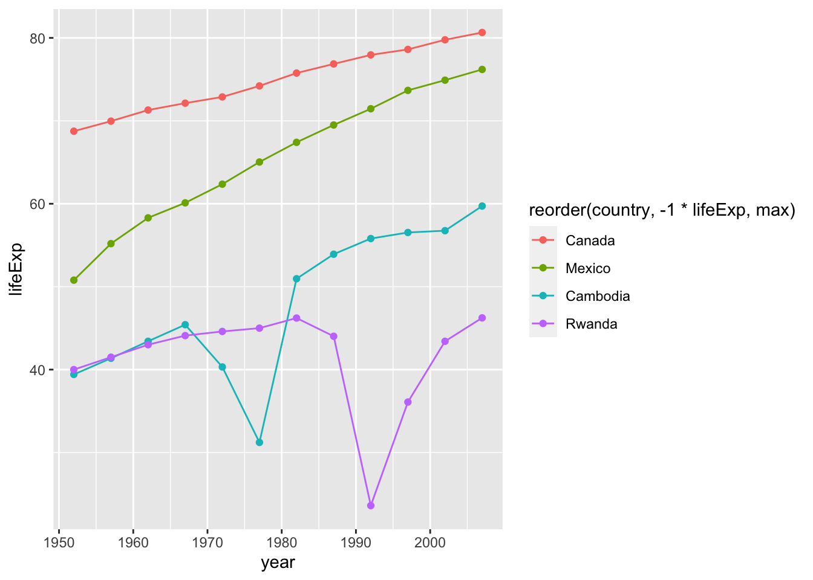


这是一种技巧，但我更推荐以下方法


```r
d1 <- gapdata %>%
  filter(country %in% jCountries) %>%
  group_by(country) %>%
  mutate(end_label = if_else(year == max(year), country, NA_character_))

d1
```

```
## # A tibble: 48 × 7
## # Groups:   country [4]
##    country  continent  year lifeExp      pop gdpPercap end_label
##    <chr>    <chr>     <dbl>   <dbl>    <dbl>     <dbl> <chr>    
##  1 Cambodia Asia       1952    39.4  4693836      368. <NA>     
##  2 Cambodia Asia       1957    41.4  5322536      434. <NA>     
##  3 Cambodia Asia       1962    43.4  6083619      497. <NA>     
##  4 Cambodia Asia       1967    45.4  6960067      523. <NA>     
##  5 Cambodia Asia       1972    40.3  7450606      422. <NA>     
##  6 Cambodia Asia       1977    31.2  6978607      525. <NA>     
##  7 Cambodia Asia       1982    51.0  7272485      624. <NA>     
##  8 Cambodia Asia       1987    53.9  8371791      684. <NA>     
##  9 Cambodia Asia       1992    55.8 10150094      682. <NA>     
## 10 Cambodia Asia       1997    56.5 11782962      734. <NA>     
## # ℹ 38 more rows
```


```r
d1 %>% ggplot(aes(
  x = year, y = lifeExp, color = country
)) +
  geom_line() +
  geom_point() +
  geom_label(aes(label = end_label)) +
  theme(legend.position = "none")
```

```
## Warning: Removed 44 rows containing missing values (`geom_label()`).
```

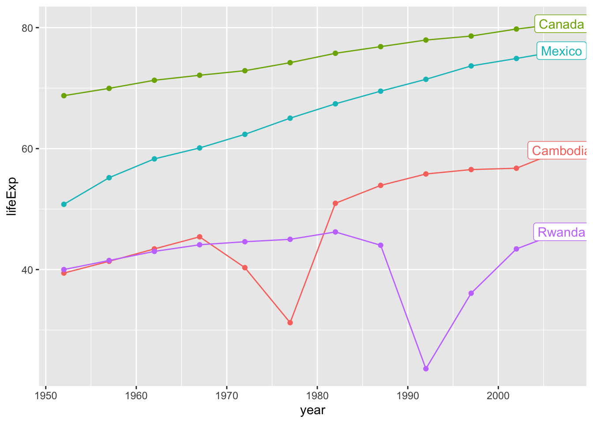


如果觉得麻烦，就用`gghighlight`宏包吧


```r
gapdata %>%
  filter(country %in% jCountries) %>%
  ggplot(aes(
    x = year, y = lifeExp, color = country
  )) +
  geom_line() +
  geom_point() +
  gghighlight::gghighlight()
```

```
## label_key: country
```

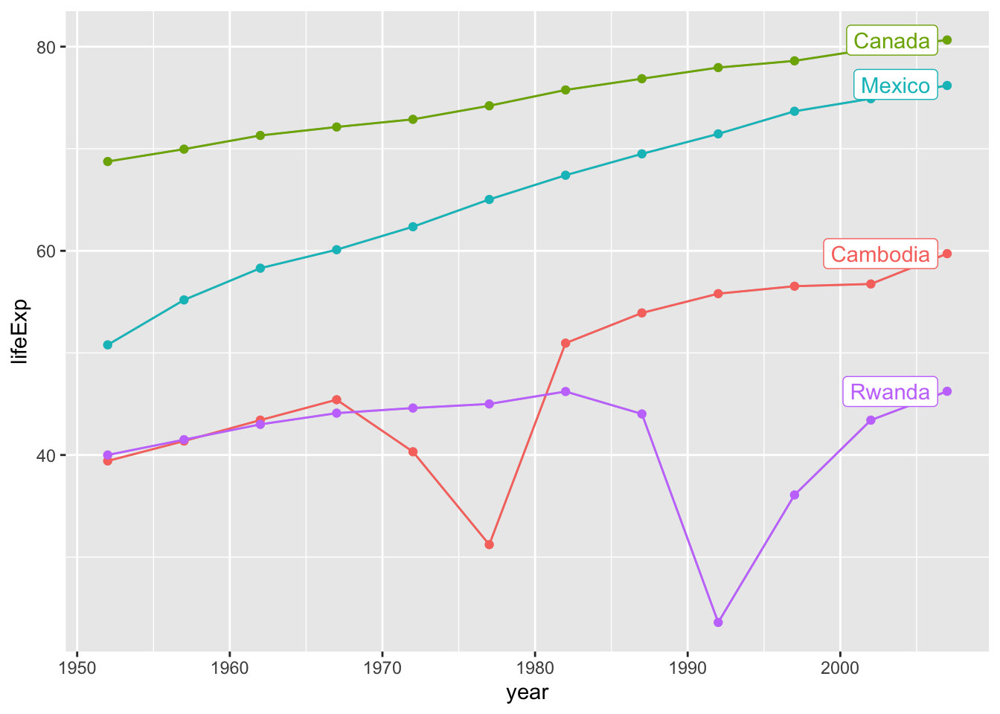

### 点线图

```r
gapdata %>%
  filter(continent == "Asia" & year == 2007) %>%
  ggplot(aes(x = lifeExp, y = country)) +
  geom_point()
```


```r
gapdata %>%
  filter(continent == "Asia" & year == 2007) %>%
  ggplot(aes(
    x = lifeExp,
    y = reorder(country, lifeExp)
  )) +
  geom_point(color = "blue", size = 2) +
  geom_segment(aes(
    x = 40,
    xend = lifeExp,
    y = reorder(country, lifeExp),
    yend = reorder(country, lifeExp)
  ),
  color = "lightgrey"
  ) +
  labs(
    x = "Life Expectancy (years)",
    y = "",
    title = "Life Expectancy by Country",
    subtitle = "GapMinder data for Asia - 2007"
  ) +
  theme_minimal() +
  theme(
    panel.grid.major = element_blank(),
    panel.grid.minor = element_blank()
  )
```


### 分面

如果想分别画出每个洲的寿命分布图，我们想到的是这样


```r
gapdata %>% 
  filter(continent == "Africa") %>% 
  ggplot(aes(x = lifeExp)) +
  geom_density()

gapdata %>% 
  filter(continent == "Americas") %>% 
  ggplot(aes(x = lifeExp)) +
  geom_density()

gapdata %>% 
  filter(continent == "Asia") %>% 
  ggplot(aes(x = lifeExp)) +
  geom_density()

gapdata %>% 
  filter(continent == "Europe") %>% 
  ggplot(aes(x = lifeExp)) +
  geom_density()

gapdata %>% 
  filter(continent == "Oceania") %>% 
  ggplot(aes(x = lifeExp)) +
  geom_density()
```


事实上，ggplot2的分面，可以很快捷的完成。分面有两个
- `facet_grid()`
- `facet_wrap()`


#### `facet_grid()`

- create a grid of graphs, by rows and columns 
- use `vars()` to call on the variables 
- adjust scales with `scales = "free"`


```r
gapdata %>%
  ggplot(aes(x = lifeExp)) +
  geom_density() +
  facet_grid(. ~ continent)
```

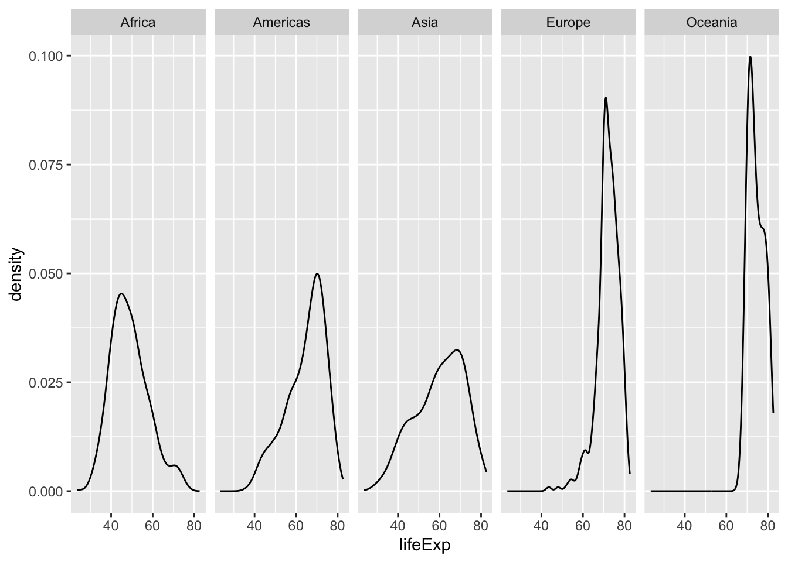


```r
gapdata %>%
  filter(continent != "Oceania") %>%
  ggplot(aes(x = lifeExp, fill = continent)) +
  geom_histogram() +
  facet_grid(continent ~ .)
```

```
## `stat_bin()` using `bins = 30`. Pick better value with `binwidth`.
```

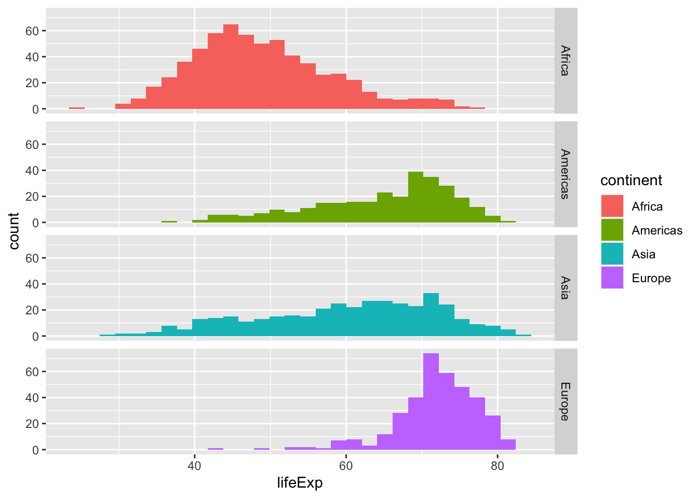


```r
gapdata %>%
  filter(continent != "Oceania") %>%
  ggplot(aes(x = lifeExp, y = stat(density))) +
  geom_histogram(aes(fill = continent)) +
  geom_density() +
  facet_grid(continent ~ .)
```

```
## `stat_bin()` using `bins = 30`. Pick better value with `binwidth`.
```


#### `facet_wrap()`

- create small multiples by "wrapping" a series of plots
- use `vars()` to call on the variables 
- `nrow` and `ncol` arguments for dictating shape of grid 


```r
gapdata %>%
  ggplot(aes(x = gdpPercap, y = lifeExp, color = continent)) +
  geom_point(show.legend = FALSE) +
  facet_wrap(~continent)
```


### 文本标注


```r
gapdata %>%
  ggplot(aes(x = gdpPercap, y = lifeExp)) +
  geom_point() +
  ggforce::geom_mark_ellipse(aes(
    filter = gdpPercap > 70000,
    label = "Rich country",
    description = "What country are they?"
  ))
```


```r
ten_countries <- gapdata %>%
  distinct(country) %>%
  pull() %>%
  sample(10)
```


```r
library(ggrepel)
gapdata %>%
  filter(year == 2007) %>%
  mutate(
    label = ifelse(country %in% ten_countries, as.character(country), "")
  ) %>%
  ggplot(aes(log(gdpPercap), lifeExp)) +
  geom_point(
    size = 3.5,
    alpha = .9,
    shape = 21,
    col = "white",
    fill = "#0162B2"
  ) +
  geom_text_repel(
    aes(label = label),
    size = 4.5,
    point.padding = .2,
    box.padding = .3,
    force = 1,
    min.segment.length = 0
  ) +
  theme_minimal(14) +
  theme(
    legend.position = "none",
    panel.grid.minor = element_blank()
  ) +
  labs(
    x = "log(GDP per capita)",
    y = "life expectancy"
  )
```

```
## Warning: ggrepel: 2 unlabeled data points (too many overlaps). Consider
## increasing max.overlaps
```

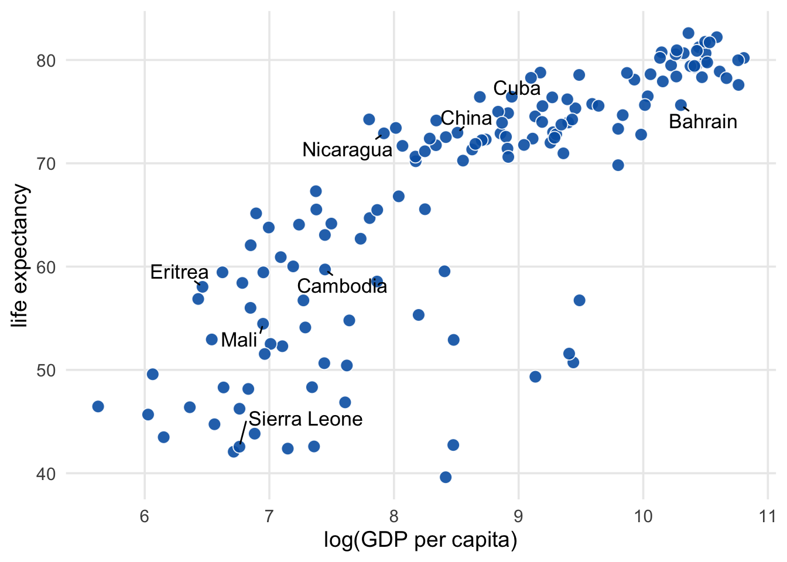


### errorbar图


```r
avg_gapdata <- gapdata %>%
  group_by(continent) %>%
  summarise(
    mean = mean(lifeExp),
    sd = sd(lifeExp)
  )
avg_gapdata
```

```
## # A tibble: 5 × 3
##   continent  mean    sd
##   <chr>     <dbl> <dbl>
## 1 Africa     48.9  9.15
## 2 Americas   64.7  9.35
## 3 Asia       60.1 11.9 
## 4 Europe     71.9  5.43
## 5 Oceania    74.3  3.80
```


```r
avg_gapdata %>%
  ggplot(aes(continent, mean, fill = continent)) +
  # geom_col(alpha = 0.5) +
  geom_point() +
  geom_errorbar(aes(ymin = mean - sd, ymax = mean + sd), width = 0.25)
```


### 椭圆图


```r
gapdata %>%
  ggplot(aes(x = log(gdpPercap), y = lifeExp)) +
  geom_point() +
  stat_ellipse(type = "norm", level = 0.95)
```


### 2D 密度图

与一维的情形`geom_density()`类似，
`geom_density_2d()`, `geom_bin2d()`, `geom_hex()`常用于刻画两个变量构成的二维区间的密度


```r
gapdata %>%
  ggplot(aes(x = gdpPercap, y = lifeExp)) +
  geom_bin2d()
```


```r
gapdata %>%
  ggplot(aes(x = gdpPercap, y = lifeExp)) +
  geom_hex()
```

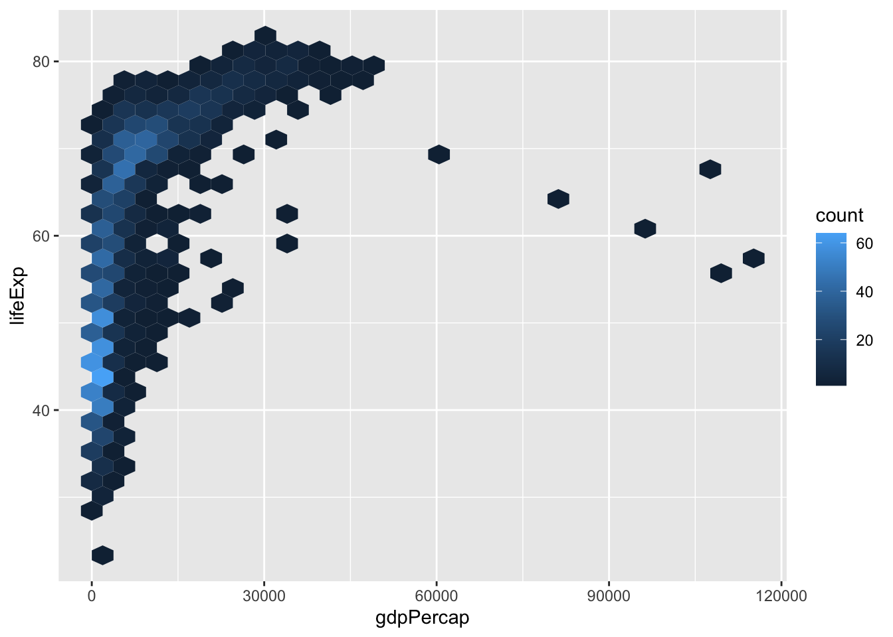


### 马赛克图

`geom_tile()`， `geom_contour()`， `geom_raster()`常用于3个变量


```r
gapdata %>%
  group_by(continent, year) %>%
  summarise(mean_lifeExp = mean(lifeExp)) %>%
  ggplot(aes(x = year, y = continent, fill = mean_lifeExp)) +
  geom_tile() +
  scale_fill_viridis_c()
```

```
## `summarise()` has grouped output by 'continent'. You can override using the
## `.groups` argument.
```

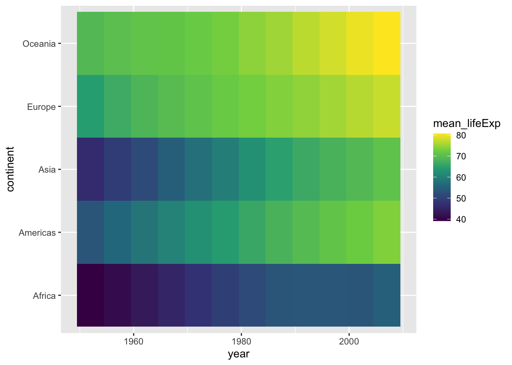

事实上可以有更好的呈现方式


```r
gapdata %>%
  group_by(continent, year) %>%
  summarise(mean_lifeExp = mean(lifeExp)) %>%
  ggplot(aes(x = year, y = continent, size = mean_lifeExp)) +
  geom_point()
```

```
## `summarise()` has grouped output by 'continent'. You can override using the
## `.groups` argument.
```

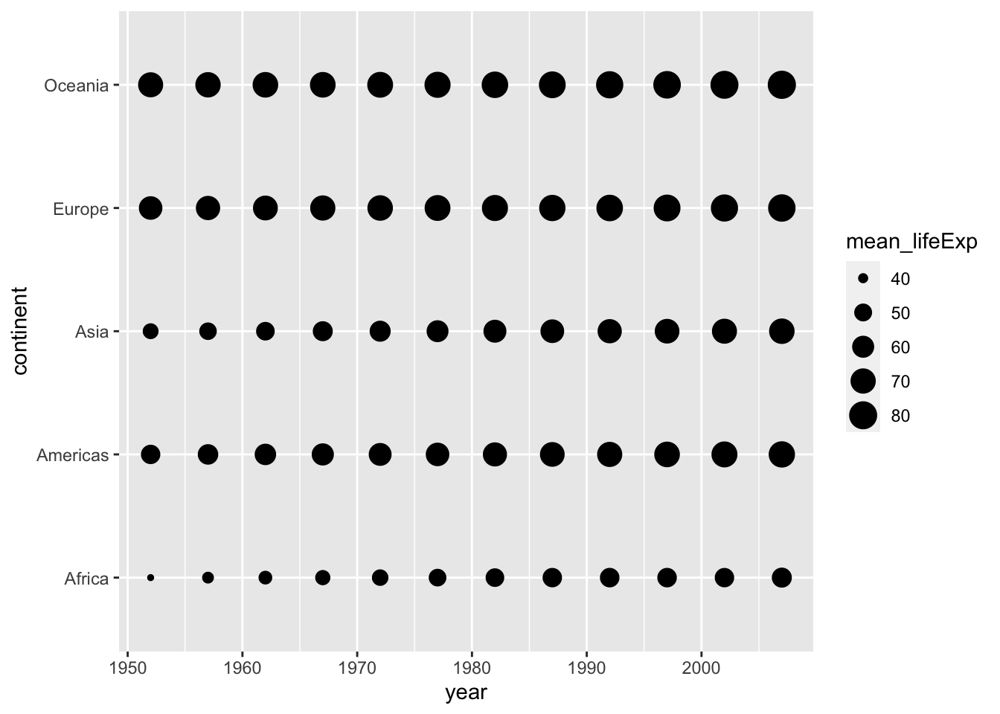


```r
gapdata %>%
  group_by(continent, year) %>%
  summarise(mean_lifeExp = mean(lifeExp)) %>%
  ggplot(aes(x = year, y = continent, size = mean_lifeExp)) +
  geom_point(shape = 21, color = "red", fill = "white") +
  scale_size_continuous(range = c(7, 15)) +
  geom_text(aes(label = round(mean_lifeExp, 2)), size = 3, color = "black") +
  theme(legend.position = "none")
```

```
## `summarise()` has grouped output by 'continent'. You can override using the
## `.groups` argument.
```


## 课后思考题

哪画图的代码中，哪两张图的结果是一样？为什么？


```r
library(tidyverse)
tbl <-
  tibble(
    x = rep(c(1, 2, 3), times = 2),
    y = 1:6,
    group = rep(c("group1", "group2"), each = 3)
  )
ggplot(tbl, aes(x, y)) + geom_line()
ggplot(tbl, aes(x, y, group = group)) + geom_line()
ggplot(tbl, aes(x, y, fill = group)) + geom_line()
ggplot(tbl, aes(x, y, color = group)) + geom_line()
```


## 参考资料

* [Look at Data](http://socviz.co/look-at-data.html) from [Data Vizualization for Social Science](http://socviz.co/)
* [Chapter 3: Data Visualisation](http://r4ds.had.co.nz/data-visualisation.html) of *R for Data Science*
* [Chapter 28: Graphics for communication](http://r4ds.had.co.nz/graphics-for-communication.html) of *R for Data Science*
* [Graphs](https://r-graphics.org/) in *R Graphics Cookbook*
* [ggplot2 cheat sheet](https://github.com/rstudio/cheatsheets/raw/master/data-visualization-2.1.pdf)
* [ggplot2 documentation](https://ggplot2.tidyverse.org/reference/)
* [The R Graph Gallery](http://www.r-graph-gallery.com/) (this is really useful)
* [Top 50 ggplot2 Visualizations](http://r-statistics.co/Top50-Ggplot2-Visualizations-MasterList-R-Code.html)
* [R Graphics Cookbook](http://www.cookbook-r.com/Graphs/) by Winston Chang
* [ggplot extensions](https://www.ggplot2-exts.org/)
* [plotly](https://plot.ly/ggplot2/) for creating interactive graphs


