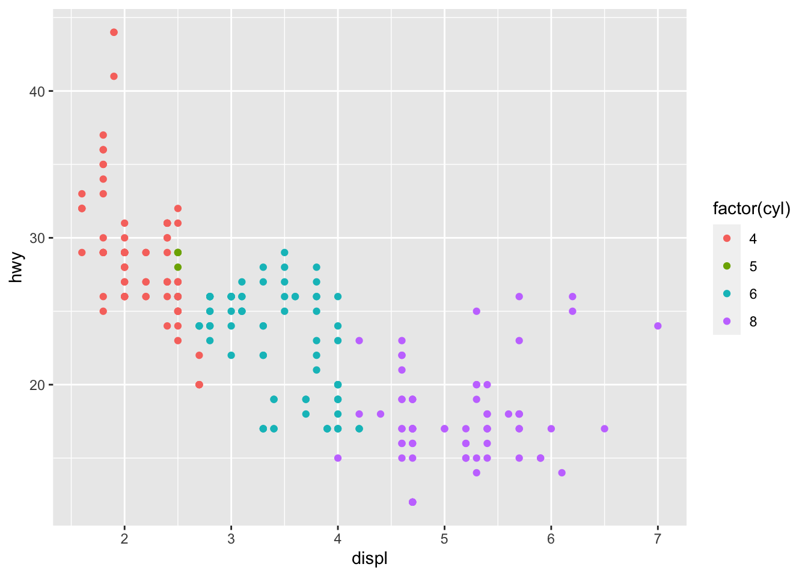
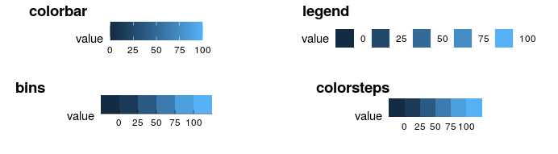
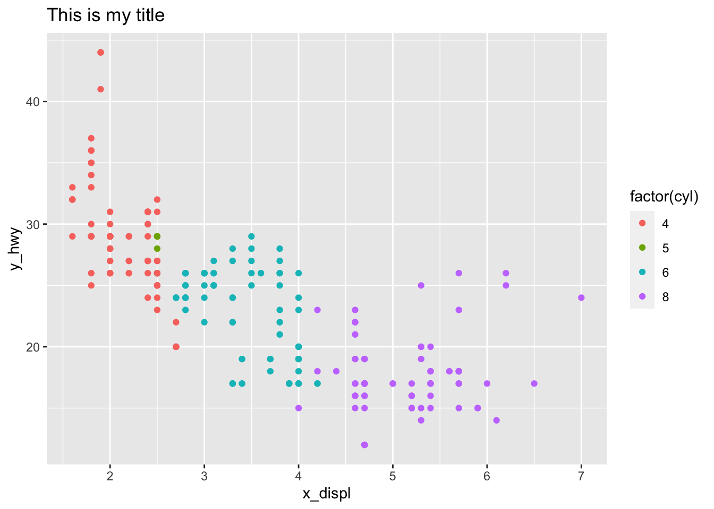
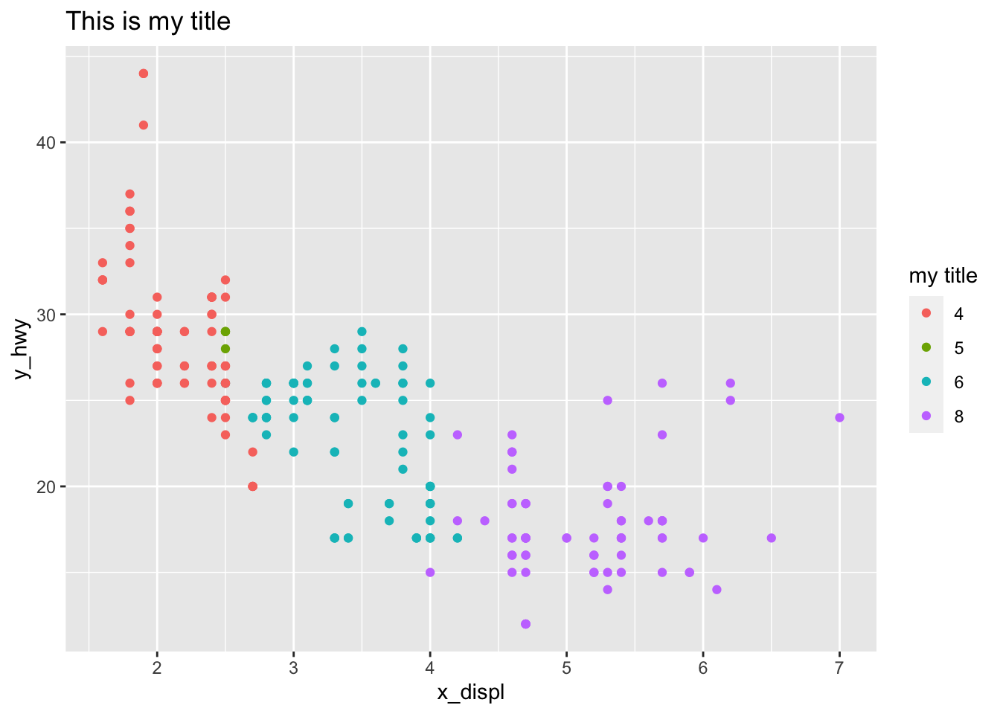
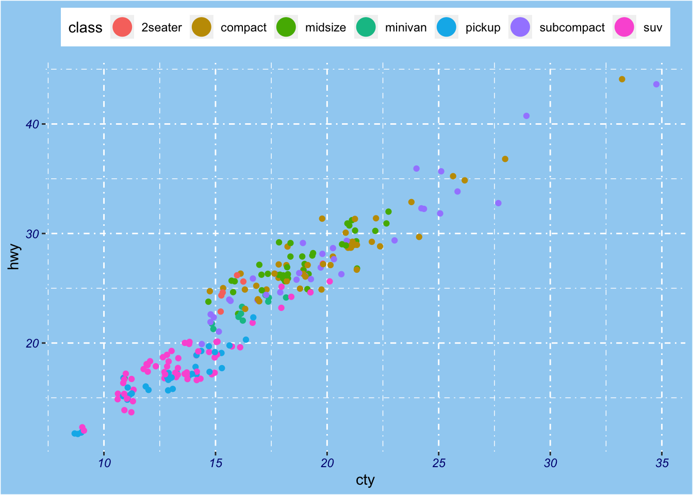
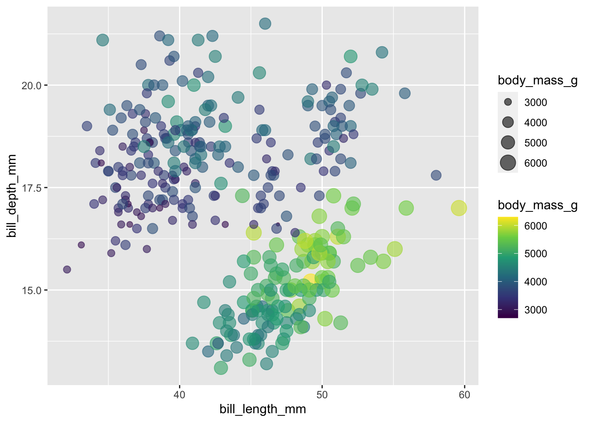
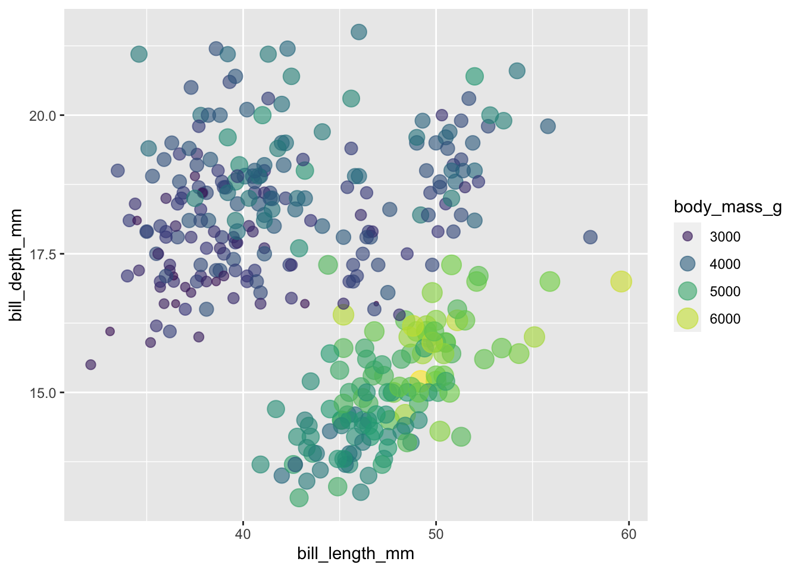
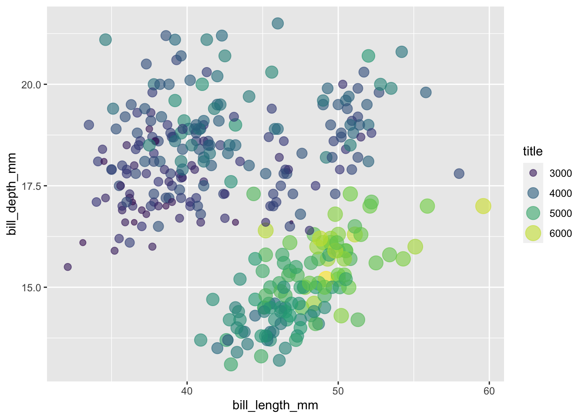

# ggplot2之图例系统 {#tidyverse-ggplot2-guides}

这一章，我们一起学习ggplot2中的图例系统，内容相对简单，但还是推荐大家阅读[ggplot2官方文档](https://cran.r-project.org/web/packages/ggplot2/index.html)


## 图例系统

为了方便演示，我们还是用熟悉的配方`ggplot2::mpg`


```r
library(tidyverse)
```

```
## ── Attaching core tidyverse packages ──────────────────────── tidyverse 2.0.0 ──
## ✔ dplyr     1.1.3     ✔ readr     2.1.4
## ✔ forcats   1.0.0     ✔ stringr   1.5.0
## ✔ ggplot2   3.4.3     ✔ tibble    3.2.1
## ✔ lubridate 1.9.2     ✔ tidyr     1.3.0
## ✔ purrr     1.0.2     
## ── Conflicts ────────────────────────────────────────── tidyverse_conflicts() ──
## ✖ dplyr::filter() masks stats::filter()
## ✖ dplyr::lag()    masks stats::lag()
## ℹ Use the conflicted package (<http://conflicted.r-lib.org/>) to force all conflicts to become errors
```

```r
mpg %>%
  ggplot(aes(x = displ, y = hwy, color = factor(cyl))) +
  geom_point()  
```



如果想调整图例的样式，可以使用`guides()`函数，用法类似上节课中的`theme`函数, 具体参数为：

- 要么是`字符串` (i.e. `"color = colorbar"` or `"color = legend"`), 
- 要么是`特定的函数` (i.e. `color = guide_colourbar()` or `color = guide_legend()`) 


以下 `guides()` 函数族用于控制图例的外观

- `guide_colorbar()`: continuous colors
- `guide_legend()`: discrete values (shapes, colors)
- `guide_axis()`: control axis text/spacing, add a secondary axis 
- `guide_bins()`: creates "bins" of values in the legend
- `guide_colorsteps()`: makes colorbar discrete 


```r

```


## 案例详解

```r
mpg %>%
  ggplot(aes(x = displ, y = hwy, color = factor(cyl))) +
  geom_point() +
  ggtitle("This is my title") +
  labs(x = "x_displ", y = "y_hwy") +
  guides(color = "legend")
```




```r
mpg %>%
  ggplot(aes(x = displ, y = hwy, color = factor(cyl))) +
  geom_point() +
  ggtitle("This is my title") +
  labs(x = "x_displ", y = "y_hwy") +
  guides(color = guide_legend(
                 title = "my title",
                 label.hjust = 1
                 )
  )
```




```r
mpg %>%
  ggplot(aes(x = displ, y = hwy, color = factor(cyl))) +
  geom_point() +
  ggtitle("This is my title")  +
  labs(x = "x_displ", y = "y_hwy") +
  guides(color = guide_legend(
                   ncol = 4
                 )
  )
```


```r
mpg %>%
  ggplot() + 
  geom_jitter(aes(x = cty, y = hwy, color = class), key_glyph = draw_key_pointrange) + #<<
  guides(color = guide_legend(nrow = 1)) +
  theme(legend.position =  "top", 
        axis.text = element_text(face = "italic", color = "navy"), 
        plot.background = element_rect(fill = "#a0d1f2"), 
        panel.background = element_blank(), 
        panel.grid = element_line(linetype = "dotdash"))
```




```r
mpg %>%
  ggplot(aes(x = displ, y = hwy, color = factor(cyl))) +
  geom_point() +
  ggtitle("This is my title")  +
  labs(x = "x_displ", y = "y_hwy") +
  guides(color = guide_legend(
    title = "title is too high",
    title.position = "top",
    title.vjust = 5,
    label.position = "left",
    label.hjust = 1,
    label.theme = element_text(size = 15,
                               face = "italic",
                               colour = "red",
                               angle = 0),
    keywidth = 5,
    reverse = TRUE
   )
  )
```


## 删除其中一个图例


```r
mpg %>%
  ggplot(aes(x = displ, y = hwy, color = class, size = cyl)) +
  geom_point()
```


比如，我们想删除size这个图例，那么需要这样做


```r
mpg %>%
  ggplot(aes(x = displ, y = hwy, color = class, size = cyl)) +
  geom_point() +
  guides(
    color = guide_legend("type"),      # keep
    size = "none"                      # remove
  )
```


或者

```r
mpg %>%
  ggplot(aes(x = displ, y = hwy, color = class, size = cyl)) +
  geom_point() +
  guides(
    color = guide_legend("type"),      # keep
    size = guide_none()                # remove
  )
```


## 合并图例

```r
library(tidyverse)
library(palmerpenguins)

penguins %>% 
  ggplot(
    aes(x = bill_length_mm, y = bill_depth_mm, 
      color = body_mass_g, size = body_mass_g)
  ) +
  geom_point(alpha = 0.6) +
  scale_color_viridis_c()
```

```
## Warning: Removed 2 rows containing missing values (`geom_point()`).
```



这里color 和 size 都使用了body_mass_g映射，我们可以将两者合并

```r
# merge similar guides
penguins %>% 
  ggplot(
    aes(x = bill_length_mm, y = bill_depth_mm, 
      color = body_mass_g,size = body_mass_g)
  ) +
  geom_point(alpha = 0.6) +
  scale_color_viridis_c() +
  guides(color = guide_legend())
```

```
## Warning: Removed 2 rows containing missing values (`geom_point()`).
```



更直观的方法

```r
penguins %>% 
  ggplot(
    aes(x = bill_length_mm, y = bill_depth_mm, 
      color = body_mass_g, size = body_mass_g)
  ) +
  geom_point(alpha = 0.6) +
  scale_color_viridis_c() +
  guides(
    color = guide_legend(), 
    size = guide_legend()
  )
```

```
## Warning: Removed 2 rows containing missing values (`geom_point()`).
```


或者

```r
penguins %>% 
  ggplot(
    aes(x = bill_length_mm, y = bill_depth_mm, 
      color = body_mass_g, size = body_mass_g)
  ) +
  geom_point(alpha = 0.6) +
  scale_color_viridis_c() +
  guides(
    colour = guide_legend("title"),
    size = guide_legend("title")
  )
```

```
## Warning: Removed 2 rows containing missing values (`geom_point()`).
```



最省力的是

```r
penguins %>% 
  ggplot(
    aes(x = bill_length_mm, y = bill_depth_mm, 
      color = body_mass_g, size = body_mass_g)
  ) +
  geom_point(alpha = 0.6) +
  scale_color_viridis_c(guide = "legend") 
```

```
## Warning: Removed 2 rows containing missing values (`geom_point()`).
```


## 小结

到了这里，ggplot2内容的差不多介绍完了，最后做下自我测试，能读懂下面代码(来源 Emi Tanaka)的意思？


```r
mtcars %>%
  as_tibble() %>%
  ggplot(aes(x = wt, y = mpg, shape = factor(vs), color = hp)) +
  geom_point(size = 3) +
  colorspace::scale_color_continuous_sequential(palette = "Dark Mint") +
  scale_shape_discrete(labels = c("V-shaped", "Straight")) +
  labs(
    x = "Weight (1000 lbs)", y = "Miles per gallon",
    title = "Motor Trend Car Road Tests",
    shape = "Engine", color = "Horsepower"
  ) +
  theme(
    text = element_text(size = 18, color = "white"),
    rect = element_rect(fill = "black"),
    panel.background = element_rect(fill = "black"),
    legend.key = element_rect(fill = "black"),
    axis.text = element_text(color = "white"),
    plot.title.position = "plot",
    plot.margin = margin(10, 10, 10, 10)
  ) +
  guides(
    shape =
      guide_legend(override.aes = list(color = "white"))
  )
```


