# ggplot2中传递函数作为参数值 {#tidyverse-ggplot2-pass-function-as-parameters}

本章汇总ggplot2中常见的**参数值是一个函数**的情形。


```r
library(tidyverse)
library(palmerpenguins)

penguins <- penguins %>% drop_na()

penguins %>% 
  ggplot(aes(x = bill_length_mm, y = bill_depth_mm)) +
  geom_point()
```


## data可以是一个函数

图层中的data可以是一个函数，它继承全局声明中的data作为函数的参数

```r
data.frame(
  x = rnorm(100),
  y = rnorm(100)
) %>%
  ggplot(aes(x, y)) +
  geom_point() +
  geom_label(
    data = function(d) d %>% summarise(cor = cor(x, y)),
    aes(x = 1, y = 1.5, label = paste0("cor:", signif(cor, 3)))
  )
```


```r
penguins %>% 
  ggplot(aes(x = bill_length_mm, y = bill_depth_mm)) +
  geom_point(data = ~ select(., -species), color = "gray80") +
  geom_point(aes(color = species)) +
  facet_wrap(vars(species))
```

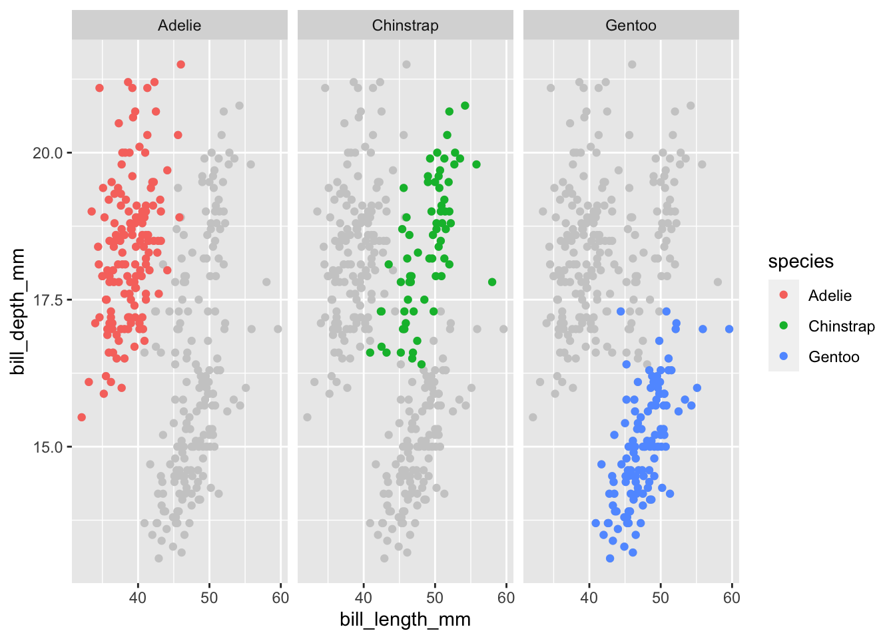


```r
summary_df <- function(df) {
  df %>%
    group_by(sex) %>%
    summarise(
      mean = mean(body_mass_g)
    )
}


penguins %>%
  ggplot(aes(x = sex, y = body_mass_g)) +
  geom_jitter() +
  geom_point(
    data = summary_df,
    aes(y = mean), color = "red", size = 5
  )
```

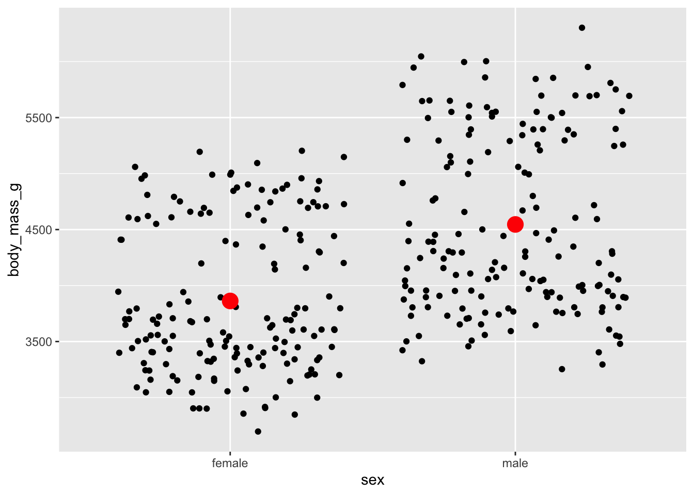


## 标度 scale_**() 中的参数可以接受函数作为参数值


```md
- breaks
- minor_breaks
- labels
- limits
- oob
 
```

### limits

one of:

- `limits = NULL` 使用默认的范围

- `limits = c(a, b)` 可以是一个长度为2 的数值型向量。如果是NA，比如`c(a, NA)`，表示设定下限为a，但是上限不做调整，维持当前值。

- 可以是一个函数，函数将坐标轴的界限（长度为2
的数值型向量）作为参数，返回一个新的2元向量，作为界限。函数可以写成lambda函数形式。但注意的是，给位置标度设置新的界限，界限之外的数据会被删除。


::: {.rmdnote}

如果我们的目的是想局部放大，不应该使用
`scale_x_continuous(limits = c(a, b))`里用，而是应该在坐标系统`coord_cartersian()`函数里面使用`limit`参数。


```r
coord_cartersian(limit = c(4, 9))
```

:::


下面看一些案例

```r
penguins %>% 
  ggplot(aes(x = bill_length_mm, y = bill_depth_mm)) +
  geom_point() + 
  scale_x_continuous(limits = range(penguins$bill_length_mm))
```


```r
penguins %>% 
  ggplot(aes(x = bill_length_mm, y = bill_depth_mm)) +
  geom_point() +
  scale_x_continuous(
    limits =  function(x) c( x[1] - 10, x[2] + 10 )
  )
```


```r
penguins %>% 
  ggplot(aes(x = bill_length_mm, y = bill_depth_mm)) +
  geom_point() +
  scale_x_continuous(
    limits =  ~ c(min(.) - 10, max(.) + 10)
  )
```


```r
penguins %>% 
  ggplot(aes(x = bill_length_mm, y = bill_depth_mm)) +
  geom_point() + 
  scale_x_continuous(limits = ~ range(.x))
```


```r
penguins %>% 
  ggplot(aes(x = bill_length_mm, y = bill_depth_mm)) +
  geom_point() + 
  scale_x_continuous(limits = function(x) {  
    if (x[1] < 20) {
      x
    } else {
      x[1] <- 20
      return(x)
    }
  })
```


```r
make_scale_expander <- function(...) {
  function(x) {
    range(c(x, ...))
  }
}
penguins %>% 
  ggplot(aes(x = bill_length_mm, y = bill_depth_mm)) +
  geom_point() +   
  scale_x_continuous(limits = make_scale_expander(80))
```

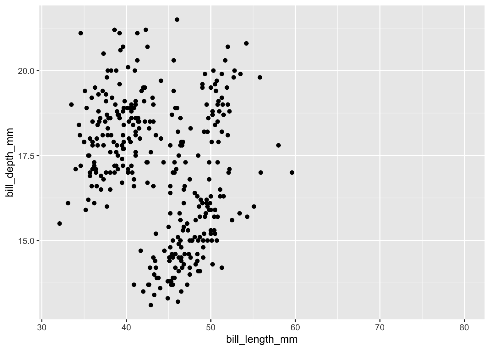


```r
penguins %>% 
  ggplot(aes(x = bill_length_mm, y = bill_depth_mm)) +
  geom_point() +  
  scale_x_continuous(limits = ~ range(c(.x, 80)))
```


### breaks

breaks 表示坐标轴或者图例中刻度位置（take a break，一条连线的坐标轴被打断了地方）
 
-  一般情况下，内置函数会自动完成

- `breaks = NULL`，就是去掉刻度

- 用户可提供一个数值类型的向量，代表刻度显示的位置

- 也可以是函数，该函数接受坐标范围（包含最小值和最大值的长度为2的向量）作为**参数**，返回一个数值类型的向量。比如常用的 `scales::extended_breaks()` 函数，函数也可以写成 lambda 函数的形式。


下面看具体案例
 

```r
penguins %>% 
  ggplot(aes(x = bill_length_mm, y = bill_depth_mm)) +
  geom_point() +
  scale_x_continuous(
    breaks = function(y) seq(floor(y[1]), ceiling(y[2]), by = 2) 
  )
```

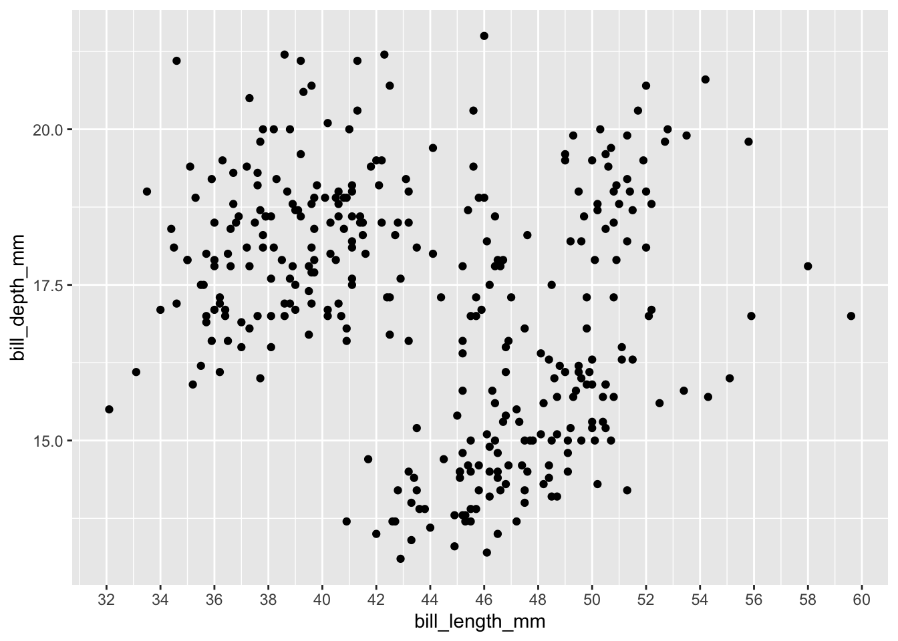


```r
penguins %>% 
  ggplot(aes(x = bill_length_mm, y = bill_depth_mm)) +
  geom_point() +
  scale_x_continuous(
    breaks = function(y) seq(floor(min(y)), ceiling(max(y)), by = 2) 
  )
```


```r
penguins %>% 
  ggplot(aes(x = bill_length_mm, y = bill_depth_mm)) +
  geom_point() +
  scale_x_continuous(
    breaks = function(y) seq(floor(min(y)), ceiling(max(y)), by = 5) 
  )
```


```r
penguins %>% 
  ggplot(aes(x = bill_length_mm, y = bill_depth_mm)) +
  geom_point() +
  scale_x_continuous(
    expand = expansion(mult = 0, add = 0), 
    breaks = function(x) seq(min(x), max(x), 5)
  )
```

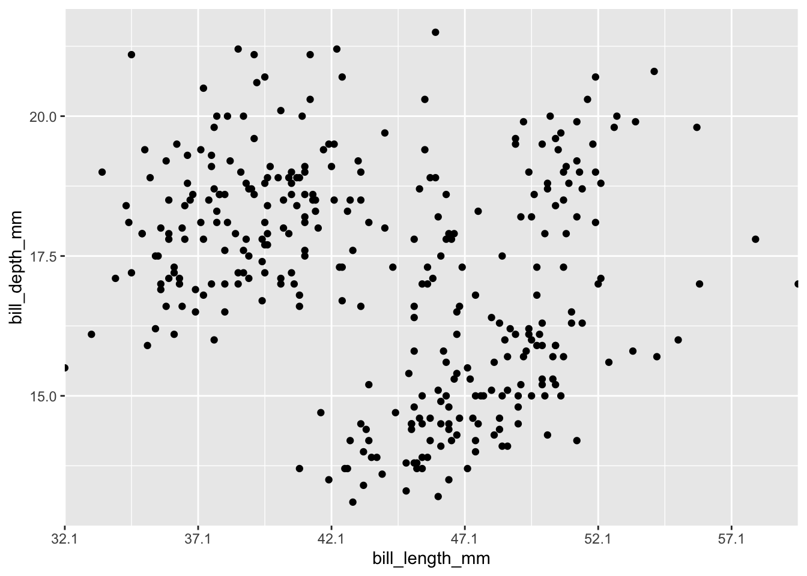


```r
penguins %>% 
  ggplot(aes(x = bill_length_mm, y = bill_depth_mm)) +
  geom_point() +
  scale_x_continuous(
    limits = c(30, 60),
    breaks = scales::breaks_pretty(12)
  )
```

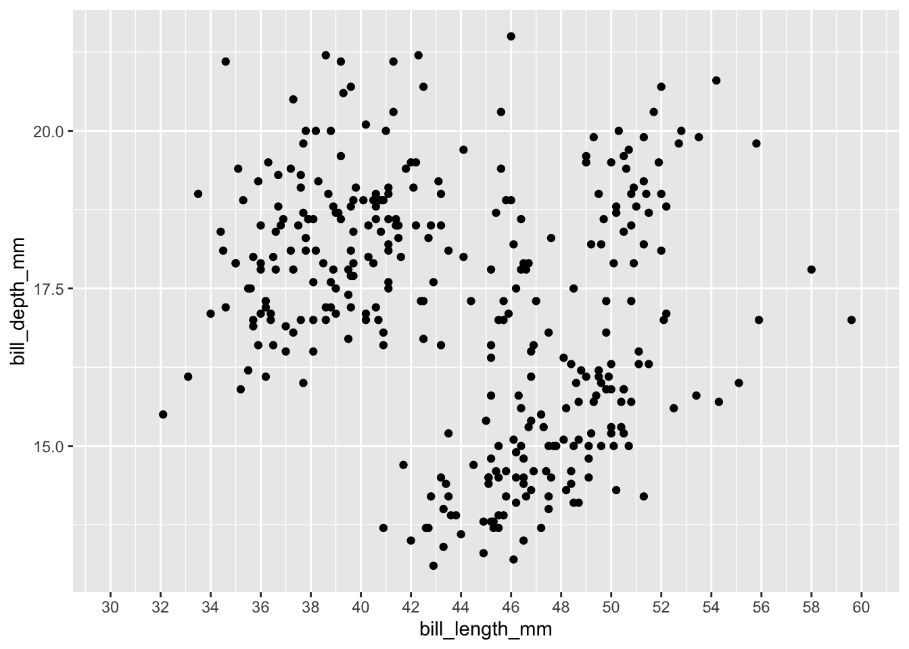


### labels

参数`labels`, 坐标和图例的间隔标签

- 一般情况下，内置函数会自动完成
- 也可人工指定一个字符型向量，与`breaks`提供的字符型向量一一对应
- 也可以是**函数**，把`breaks`提供的字符型向量当做函数的输入**参数**
- `labels = NULL`，就是去掉标签


```r
penguins %>% 
  ggplot(aes(x = species, y = bill_depth_mm)) +
  geom_jitter() +
  scale_x_discrete(labels = function(x) str_sub(x, 1, 1)) 
```

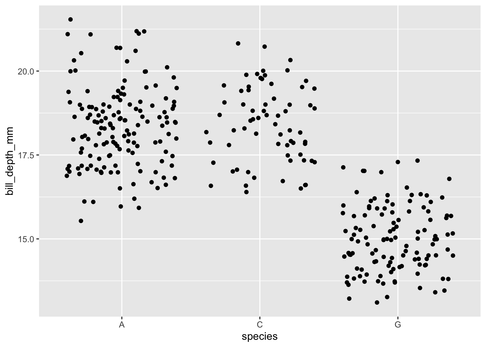

  

```r
pairs56 <- tibble::tribble(
      ~species, ~new_name,
      "Adelie",       "A",
   "Chinstrap",       "C",
      "Gentoo",       "G"
   ) %>% 
  tibble::deframe()


penguins %>% 
  ggplot(aes(x = species, y = bill_depth_mm)) +
  geom_point() +
  scale_x_discrete(labels = function(x) str_replace_all(x, pattern = pairs56)) 
```


```r
penguins %>% 
  count(species) %>% 
  mutate(species = paste0("this is long long long ", species)) %>% 
  ggplot(aes(x = species, y = n)) +
  geom_col(width = 0.6) +
  scale_x_discrete(
    labels = function(x) stringr::str_wrap(x, width = 10)
  )
```

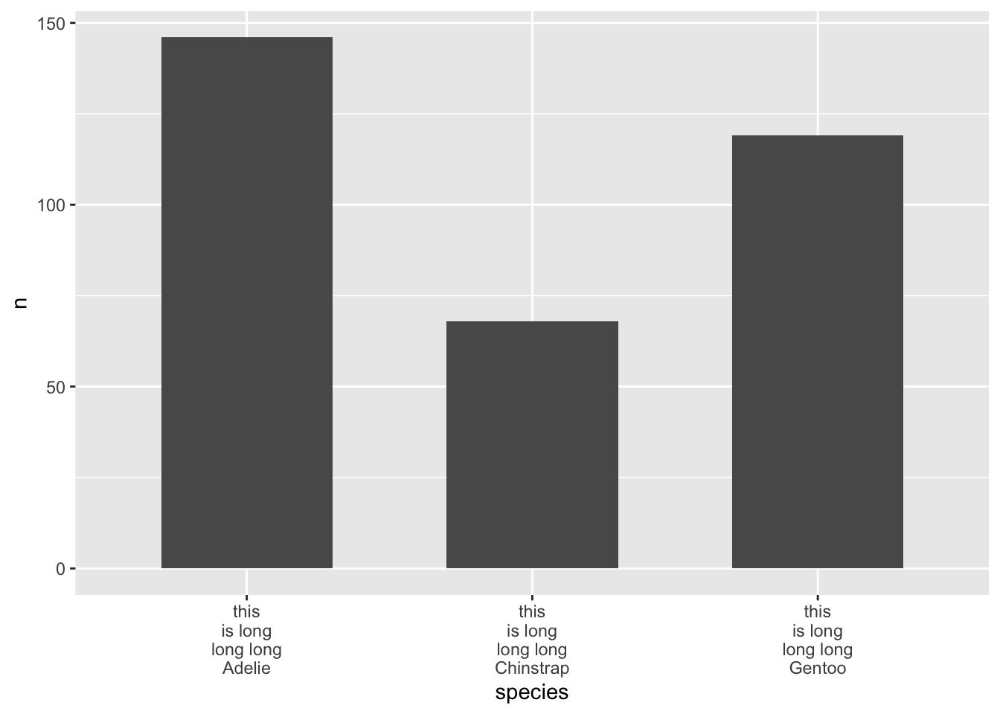


```r
penguins %>% 
  ggplot(aes(x = bill_length_mm, y = bill_depth_mm)) +
  geom_point() +
  scale_x_continuous(
    labels = function(x) paste0(x, "_mm")
  )
```


```r
penguins %>% 
  ggplot(aes(x = bill_length_mm, y = bill_depth_mm)) +
  geom_point() +
  scale_x_continuous(
    labels = ~ paste0(.x, "_mm")
  )
```


```r
penguins %>% 
  ggplot(aes(x = bill_length_mm, y = bill_depth_mm)) +
  geom_point(aes(colour = species)) +
  scale_x_continuous(
    limits = c(30, 60),
    breaks = scales::breaks_width(width = 5),
    labels = scales::unit_format(unit = "mm", sep = "")
  )
```

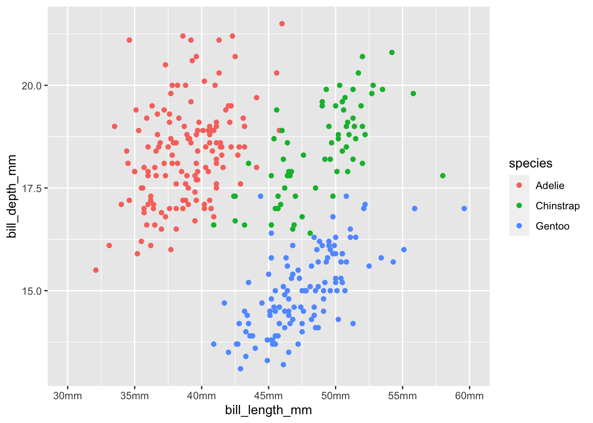


```r
penguins %>% 
  ggplot(aes(x = bill_length_mm, y = bill_depth_mm)) +
  geom_point() +
  scale_x_continuous(
    labels = scales::dollar
  )
```


```r
penguins %>% 
  ggplot(aes(x = bill_length_mm, y = bill_depth_mm)) +
  geom_point(aes(colour = species)) +
  scale_x_continuous(
    limits = c(30, 60),
    labels = scales::label_number(prefix = "CNY", sep = "")
  )
```


```r
penguins %>% 
  ggplot(aes(x = bill_length_mm, y = bill_depth_mm)) +
  geom_point(aes(colour = species)) +
  scale_x_continuous(
    limits = c(30, 60),
    labels = scales::label_percent()
  ) 
```

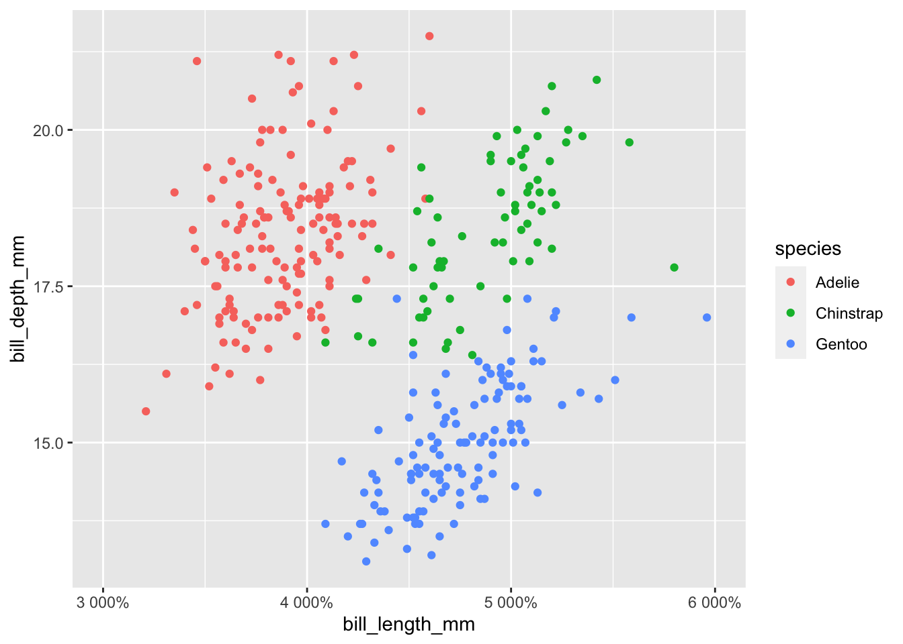


### oob

oob函数用于处理超出范围的数据，`scales`宏包可以满足用户需求，当然用户也可以自己定义

- 默认(`scales::censor()`) 把超出界限的值替换成NA
- `scales::squish()` 用于将越界值挤压到范围内。
- `scales::squish_infinite()` 用于将无限值挤压到范围内。
- 用户自定义函数，该函数接受limits和映射数据作为参数，返回修改后的映射数据

下面看具体案例


```r
penguins %>%
  ggplot(aes(x = bill_length_mm, y = bill_depth_mm)) +
  geom_point(aes(fill = body_mass_g), shape = 21) +
  scale_fill_gradient(
    low = "red", high = "green", na.value = "grey",
    limits = c(4000, NA),
    oob = scales::censor
  )
```

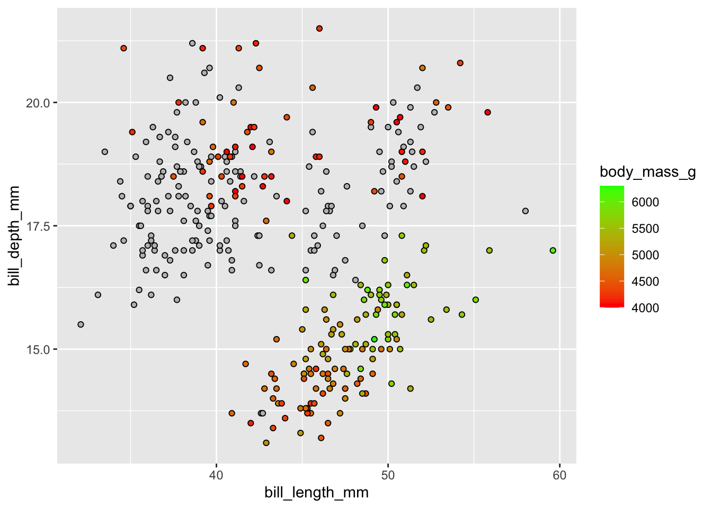


```r
penguins %>%
  ggplot(aes(x = bill_length_mm, y = bill_depth_mm)) +
  geom_point(aes(fill = body_mass_g), shape = 21) +
  scale_fill_gradient(
    low = "red", high = "green", na.value = "grey",
    limits = c(4000, NA),
    oob = scales::squish
  )
```


```r
penguins %>%
  ggplot(aes(x = bill_length_mm, y = bill_depth_mm)) +
  geom_point(aes(fill = body_mass_g), shape = 21) +
  scale_fill_gradient(
    low = "red", high = "green", na.value = "grey",
    limits = c(4000, NA),
    oob = function(x, ...) x # do nothing
  )
```


```r
penguins %>%
  ggplot(aes(x = bill_length_mm, y = bill_depth_mm)) +
  geom_point(aes(fill = body_mass_g), shape = 21) +
  scale_fill_gradient(
    low = "red", high = "green", na.value = "grey",
    limits = c(4000, NA),
    oob = scales::rescale_none # do nothing
  )
```


```r
# modify data values outside a given range 
# 
my_oob_fun <- function(x, range) {
  x[x < min(range)] <- NA
  x[x > max(range)] <- NA
  return(x)
}

my_oob_fun(1:10, c(2, 6))
```

```
##  [1] NA  2  3  4  5  6 NA NA NA NA
```


```r
penguins %>%
  ggplot(aes(x = bill_length_mm, y = bill_depth_mm)) +
  geom_point(aes(fill = body_mass_g), shape = 21) +
  scale_fill_gradient(
    low = "red", high = "green", na.value = "grey",
    limits = c(4000, NA),
    oob = my_oob_fun    # using limits and fill-aes as argument
  )
```


## geom_histogram()中的binwidth

```r
penguins %>% 
  ggplot(aes(x = body_mass_g)) +
  geom_histogram(color = "white")
```

```
## `stat_bin()` using `bins = 30`. Pick better value with `binwidth`.
```

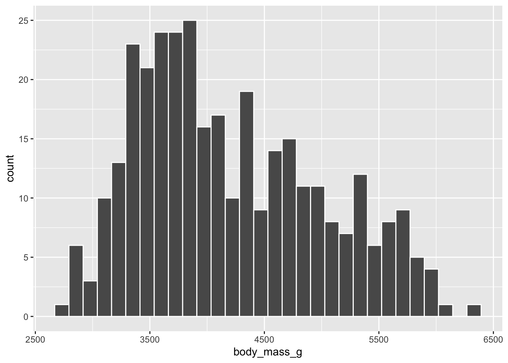


```r
myfun <- function(x) {
  n <- length(x)
  r <- IQR(x, na.rm = TRUE)
  2*r/n^(1/3)
}


penguins %>% 
  ggplot(aes(x = body_mass_g)) +
  geom_histogram(
    binwidth = myfun,
    color = "white"
  )
```


##  geom_text()中的 hjust

图中柱子上的字体没有显示完整

```r
d <- tibble::tribble(
     ~name, ~value,
   "Alice",    2.12,
     "Bob",   68.45,
  "Carlie",   15.84,
    "Dave",    7.38,
     "Eve",    0.56
  )

d %>% 
  ggplot(aes(x = value, y = fct_reorder(name, value)) ) +
  geom_col(width = 0.6, fill = "gray60") +
  geom_text(aes(label = value, hjust = 1))  +
  theme_classic() +
  scale_x_continuous(expand = c(0, 0)) +
  labs(x = NULL, y = NULL)
```

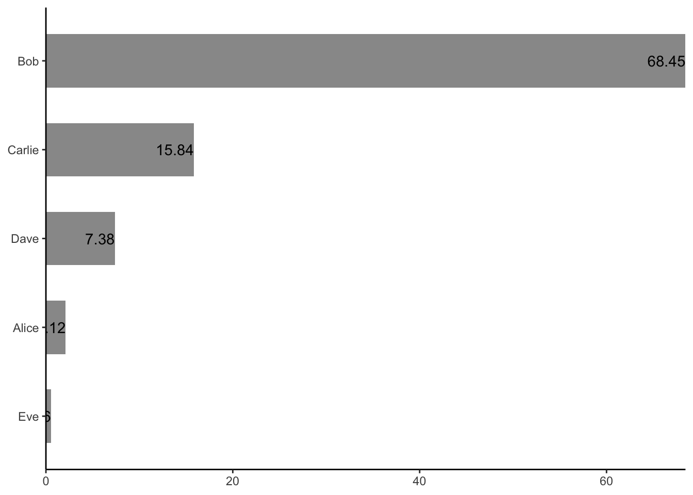


```r
d %>% 
  ggplot(aes(x = value, y = fct_reorder(name, value)) ) +
  geom_col(width = 0.6, fill = "gray60") +
  geom_text(aes(label = value, hjust = ifelse(value > 50, 1, -.1)) ) +
  theme_classic() +
  scale_x_continuous(expand = c(0, 0)) +
  labs(x = NULL, y = NULL)
```


```r
d %>% 
  ggplot(aes(x = value, y = fct_reorder(name, value)) ) +
  geom_col(width = 0.6, fill = "darkorange") +
  geom_text(
     aes(
      label = if_else(value < 1, "<1%", paste0(round(value, digits = 1), "%")),
      hjust = if_else(value > 50, 1, -.1)
      )) +
  theme_classic() +
  scale_x_continuous(expand = c(0, 1)) +
  labs(x = NULL, y = NULL)
```


## stat_summary()中的fun和fun.data


```r
penguins %>% 
  ggplot(aes(x = species, y = bill_length_mm)) +
  geom_point() +
  stat_summary(fun = mean,
               geom = "point", colour = "red", size = 5 )
```


```r
penguins %>% 
  ggplot(aes(x = species, y = bill_length_mm)) +
  geom_point() +
  stat_summary(fun = function(x) max(x) - min(x),
               geom = "point", colour = "red", size = 5 )
```

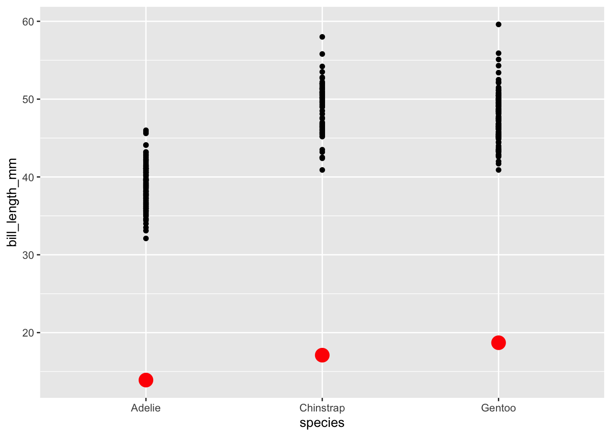


```r
myfun <- function(x) {
  tibble(
    y = sum(x > mean(x))
   )
}

penguins %>% 
  ggplot(aes(species, body_mass_g)) +
  stat_summary(
    fun.data = myfun, 
    geom = "bar",
  )
```

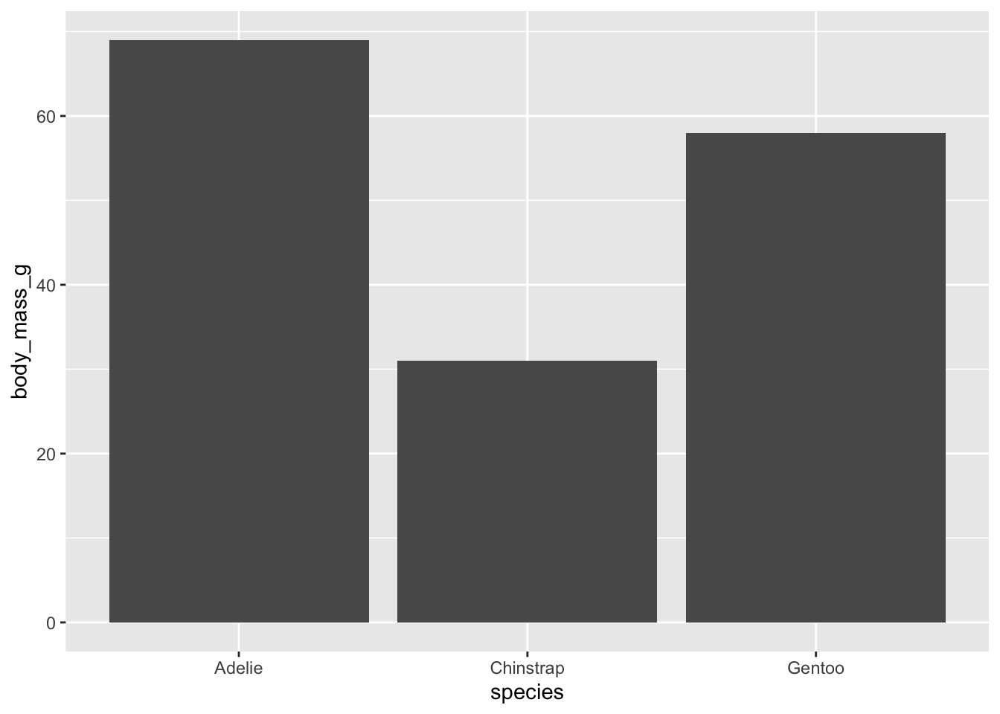


```r
calc_median_and_color <- function(x, threshold = 40) {
  tibble(y = median(x)) %>% 
    mutate(fill = ifelse(y < threshold, "pink", "grey35"))
}

penguins %>% 
  ggplot(aes(species, bill_length_mm)) +
  stat_summary(
    fun.data = calc_median_and_color,
    geom = "bar"
  )
```

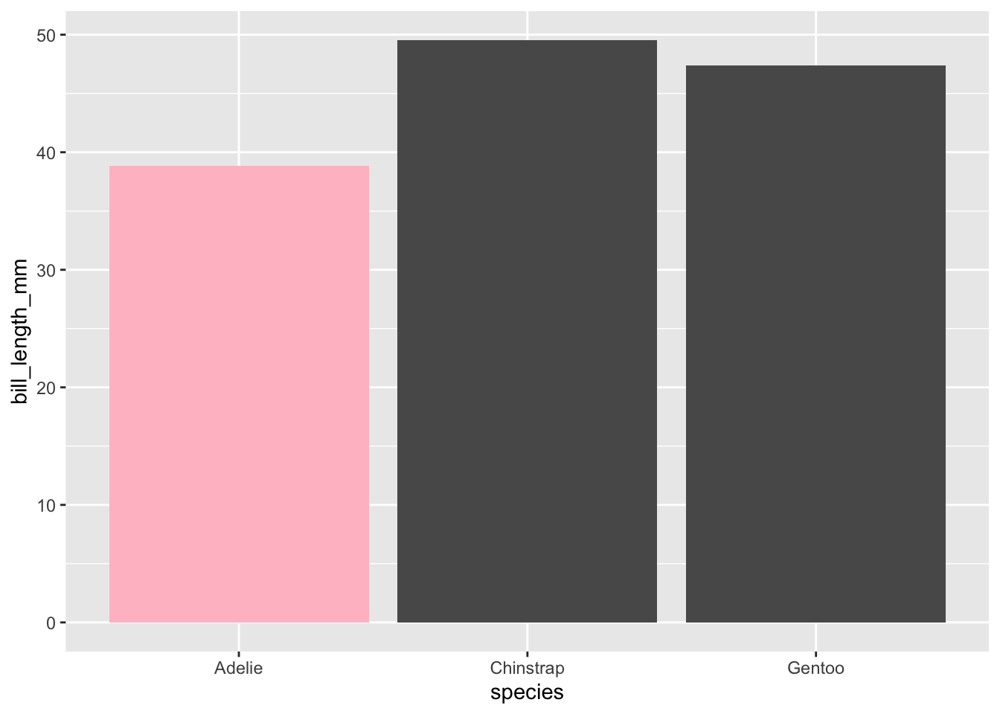


```r
n_fun <- function(x) {
  data.frame(y = 62,
            label = length(x),
            color = ifelse(length(x) > 100, "red", "blue")
            )
}


penguins %>% 
  ggplot(aes(x = species, y = bill_length_mm)) +
  geom_boxplot() +
  geom_jitter() +
  stat_summary(
    fun.data = n_fun,
    geom = "text"
  )
```

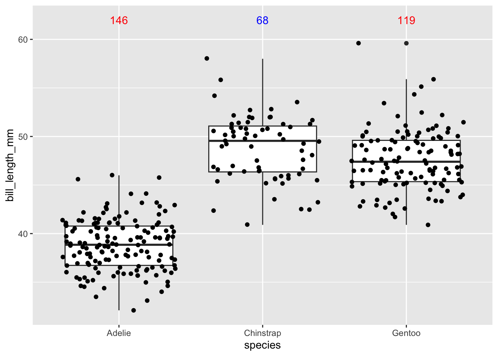


## theme()中element_text()


```r
penguins_df <- penguins %>% 
  group_by(species) %>% 
  summarize(mean = mean(bill_length_mm)) 

penguins_df %>% 
  ggplot(aes(x = mean, y = species)) +
  geom_col(width = 0.5) +
  theme(
    axis.text.y = element_text(
      color = c("black", "red", "black"), 
      face = c("plain", "bold", "plain"), 
      size = 20
      )
  )
```

```
## Warning: Vectorized input to `element_text()` is not officially supported.
## ℹ Results may be unexpected or may change in future versions of ggplot2.
```


```r
penguins_df %>% 
  ggplot(aes(x = mean, y = species)) +
  geom_col(width = 0.5) +
  theme(
    axis.text.y = element_text(
      color = if_else(penguins_df$mean > 48, "red", "black"), 
      face = if_else(penguins_df$mean  > 48, "bold", "plain"), 
      size = 20
    )
  )
```

```
## Warning: Vectorized input to `element_text()` is not officially supported.
## ℹ Results may be unexpected or may change in future versions of ggplot2.
```


## facet_wrap()中的labeller

`labeller = `可以是函数。函数的参数是一个**数据框**，分组变量的若干层级是数据框的一列（多个分组就对应数据框的多列）。函数返回列表或者字符串类型的数据框。


```r
penguins %>% 
  distinct(species) %>% 
  as.data.frame()
```

```
##     species
## 1    Adelie
## 2    Gentoo
## 3 Chinstrap
```

```r
penguins %>% 
  ggplot(aes(x = bill_length_mm, y = bill_depth_mm)) +
  geom_point() +
  facet_wrap(vars(species),  # dataframe of the names are passed to labeller
    labeller = function(df) {
      ls <- str_sub(df[, 1], 1, 1) # df[, 1] is character vector
      list(ls)                     # return list
    }
  )
```


相当于

```r
penguins %>%
  ggplot(aes(x = bill_length_mm, y = bill_depth_mm)) +
  geom_point() +
  facet_wrap(vars(species),
    labeller = function(df) {
      list(c(
        Adelie    = "A",
        Chinstrap = "C",
        Gentoo    = "G"
      ))
    }
  )
```


```r
species_names <- list(
 "Adelie"    = "Adelie, n = 146",  
 "Chinstrap" = "Chinstrap, n = 68", 
 "Gentoo"    = "Gentoo, n = 119"
)


plot_labeller <- function(variable, value) { # does not use dataframe of labels
   return(species_names[value])              # just return list
 }


penguins %>% 
  ggplot(aes(x = bill_length_mm, y = bill_depth_mm)) +
  geom_point() +
  facet_wrap(vars(species), labeller = plot_labeller)
```

```
## Warning: The `labeller` API has been updated. Labellers taking `variable` and `value`
## arguments are now deprecated.
## ℹ See labellers documentation.
```


```r
mylabel <- function(value) { 
  return(lapply(value, function(x) species_names[x])) 
  }

penguins %>% 
  ggplot(aes(x = bill_length_mm, y = bill_depth_mm)) +
  geom_point() +
  facet_wrap(vars(species), labeller = mylabel)
```


### 使用as_labeller()

使用配套的`as_labeller()`，更加简单清晰。因为只需要把命名向量传给`as_labeller()`，`as_labeller()`将其视为查询表一样，一一对应完成替换即可。如果传给`as_labeller()`不是向量，而是函数，就让这个函数作用到原来的标签上，返回新的字符串向量。


**把处理列表的问题，变成了我们熟悉的向量的问题**


```r
species_names <- c(
 "Adelie"    = "Adelie, n =146",  
 "Chinstrap" = "Chinstrap, n =68", 
 "Gentoo"    = "Gentoo, n =119"
)

penguins %>% 
  ggplot(aes(x = bill_length_mm, y = bill_depth_mm)) +
  geom_point() +
  facet_wrap(vars(species), labeller = as_labeller(species_names))
```


```r
new_label <- penguins %>% 
  count(species) %>% 
  mutate(n = paste0(species, ", n =", n)) %>% 
  tibble::deframe()

penguins %>% 
  ggplot(aes(x = bill_length_mm, y = bill_depth_mm)) +
  geom_point() +
  facet_wrap(vars(species), labeller = as_labeller(new_label))
```


```r
appender <- function(string, suffix = "-foo") paste0(string, suffix)

penguins %>% 
  ggplot(aes(x = bill_length_mm, y = bill_depth_mm)) +
  geom_point() +
  facet_wrap(vars(species), labeller = as_labeller(appender))
```


```r
fun <- function(string) str_sub(string, 1, 1)

penguins %>% 
  ggplot(aes(x = bill_length_mm, y = bill_depth_mm)) +
  geom_point() +
  facet_wrap(vars(species), labeller = as_labeller(fun))
```

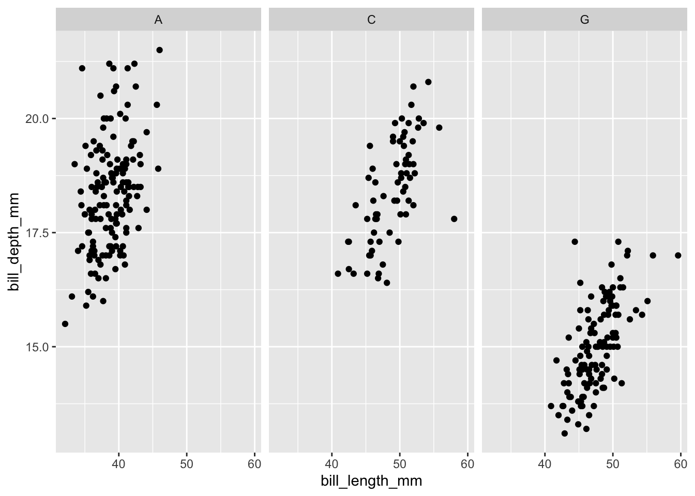


### 多个分组变量


```r
penguins %>%
  ggplot(aes(x = bill_length_mm, y = bill_depth_mm)) +
  geom_point() +
  facet_wrap(vars(species, island))
```


```r
penguins %>% 
  distinct(species, island) %>% 
  arrange(species, island)
```

```
## # A tibble: 5 × 2
##   species   island   
##   <fct>     <fct>    
## 1 Adelie    Biscoe   
## 2 Adelie    Dream    
## 3 Adelie    Torgersen
## 4 Chinstrap Dream    
## 5 Gentoo    Biscoe
```

```r
penguins %>% 
  ggplot(aes(x = bill_length_mm, y = bill_depth_mm)) +
  geom_point() +
  facet_wrap(~ species + island,   # or vars(species, island),
  labeller = function(df) {
    ls <- as.character(df[, 2])
    ls[1] <- paste0("n = ", ls[1])
    list(ls)
  }
)
```

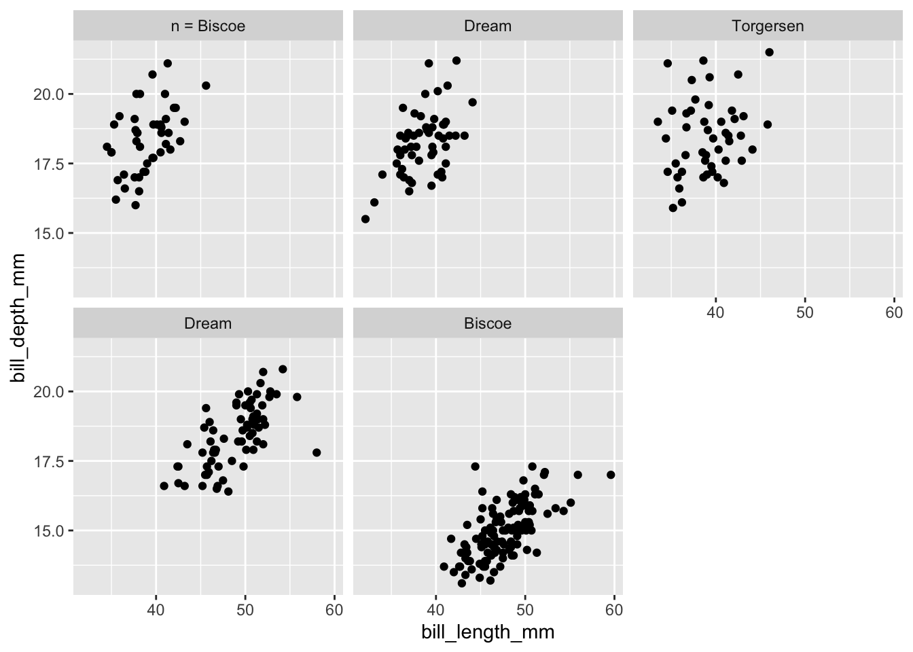


```r
species_names <- list(
 "Adelie"    = "Adelie, n =146",  
 "Chinstrap" = "Chinstrap, n =68", 
 "Gentoo"    = "Gentoo, n =119"
)

island_names <- list(
 "Biscoe"    = "B",  
 "Dream"     = "D", 
 "Torgersen" = "T"
)

plot_labeller <- function(variable,value){
  if (variable == 'species') {
    return(species_names[value])
  } else if (variable == 'island') {
    return(island_names[value])
  } else {
    return(as.character(value))
  }
}


penguins %>% 
  ggplot(aes(x = bill_length_mm, y = bill_depth_mm)) +
  geom_point() +
  facet_wrap(~ species + island,  
  labeller = plot_labeller
)
```

```
## Warning: The `labeller` API has been updated. Labellers taking `variable` and `value`
## arguments are now deprecated.
## ℹ See labellers documentation.
```

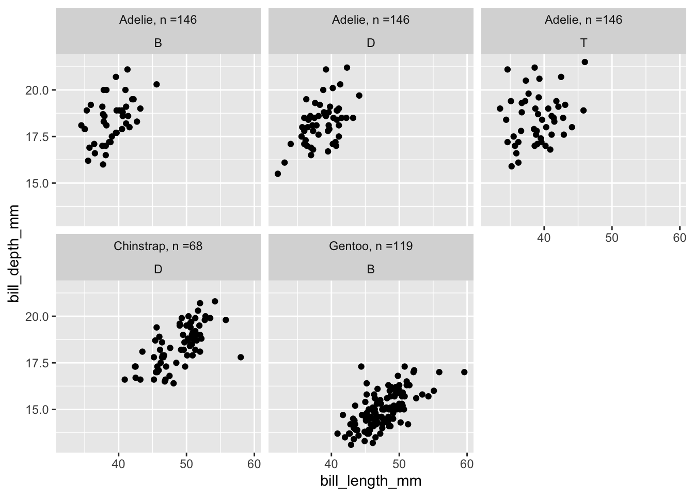


使用`as_labeller()`


```r
species_names <- c(
  "Adelie"    = "Adelie, n = 146",
  "Chinstrap" = "Chinstrap, n = 68",
  "Gentoo"    = "Gentoo, n = 119"
)

fun <- function(string) stringr::str_sub(string, 1, 1)

penguins %>%
  ggplot(aes(x = bill_length_mm, y = bill_depth_mm)) +
  geom_point() +
  facet_wrap(vars(species, island),
    labeller = labeller(
          species = as_labeller(species_names),
          island  = as_labeller(fun)
         )
  )
```


## stat_function


```r
df <- data.frame(x = 1:10, y = (1:10)^2)
ggplot(df, aes(x, y)) + 
  geom_point() +
  stat_function(fun = ~ .x^2)
```

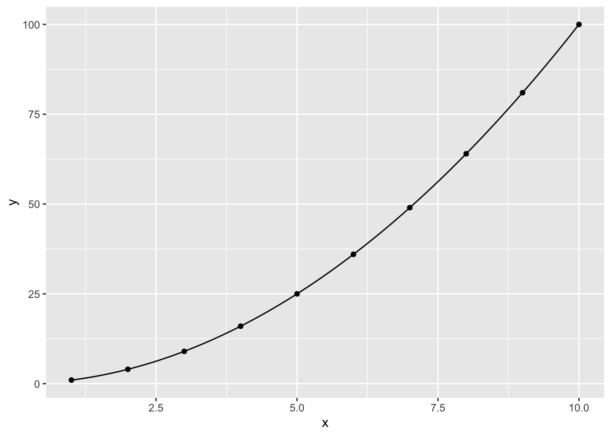


```r
logisic <- function(x) {
  exp(1)^x / (1 + exp(1) ^ x)
}

ggplot() +
  xlim(-5, 5) +
  geom_function(fun = logisic, color = "orange") +
  theme_minimal()
```

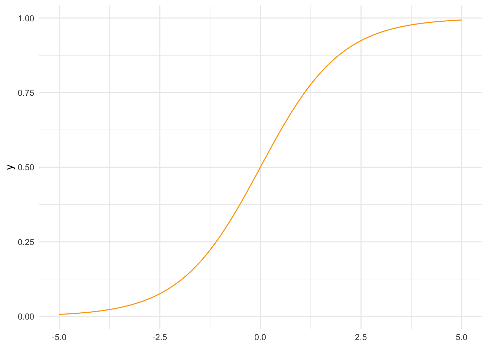


## stat layer


```r
penguins %>%
  ggplot(aes(x = bill_length_mm, y = bill_depth_mm)) +
  geom_point() +
  purrr::map(
    .x = seq(0.1, 0.9, by  = 0.1),
    .f = function(level) {
      stat_ellipse(
        geom = "polygon", type = "norm",
        size = 0, alpha = 0.1, fill = "gray10",
        level = level
      )
    }
  )
```

```
## Warning: Using `size` aesthetic for lines was deprecated in ggplot2 3.4.0.
## ℹ Please use `linewidth` instead.
## This warning is displayed once every 8 hours.
## Call `lifecycle::last_lifecycle_warnings()` to see where this warning was
## generated.
```

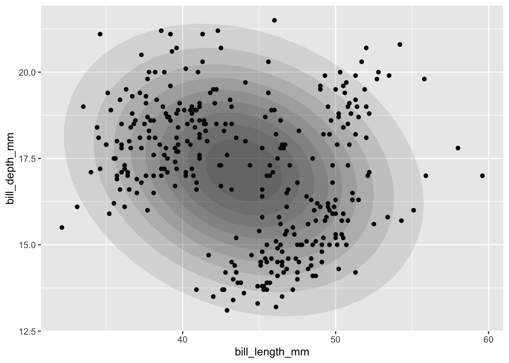


```r
layers <- penguins %>%
  group_split(species) %>%
  map(function(df) {
    geom_point(
      aes(x = bill_length_mm, y = bill_depth_mm),
      alpha = 0.5,
      data = df
    )
  })

ggplot() +
  layers
```


## 未完待续


