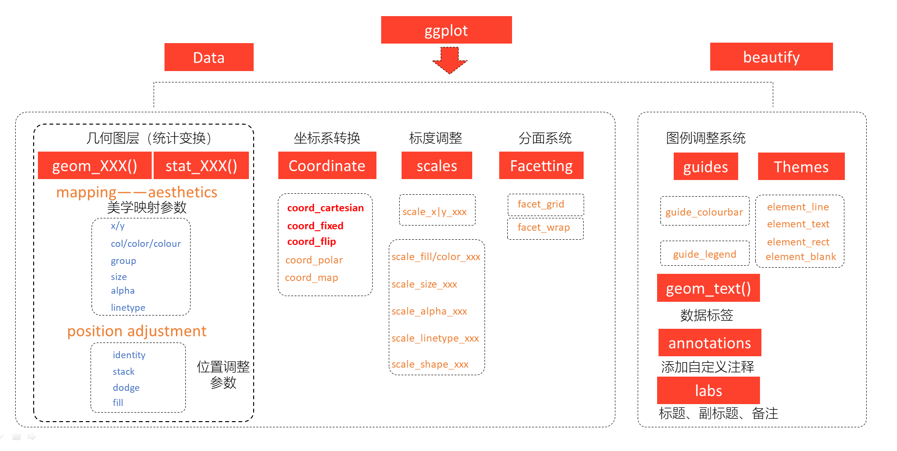
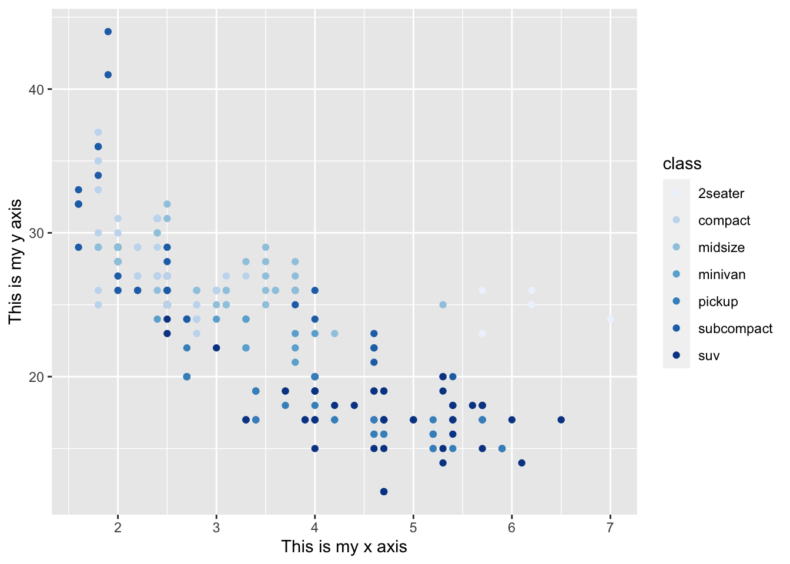
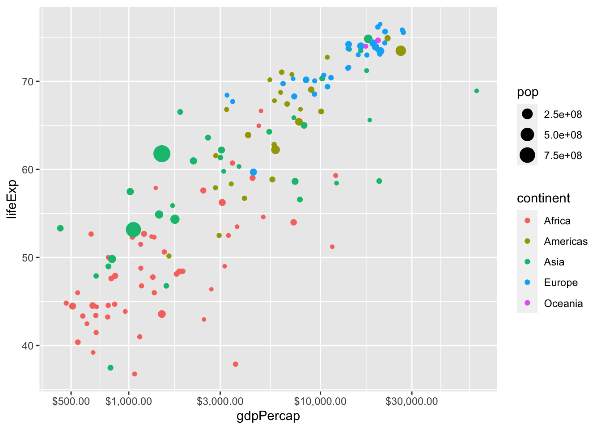
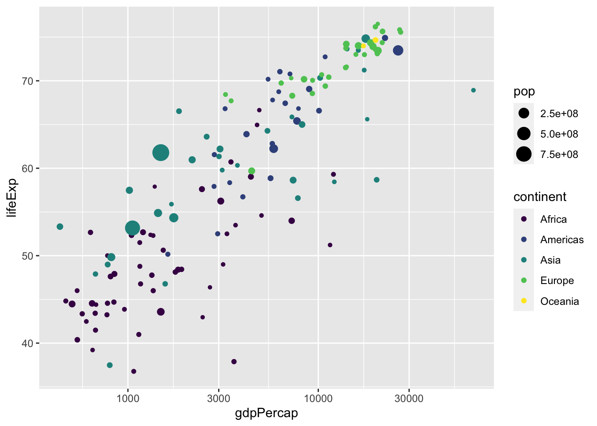
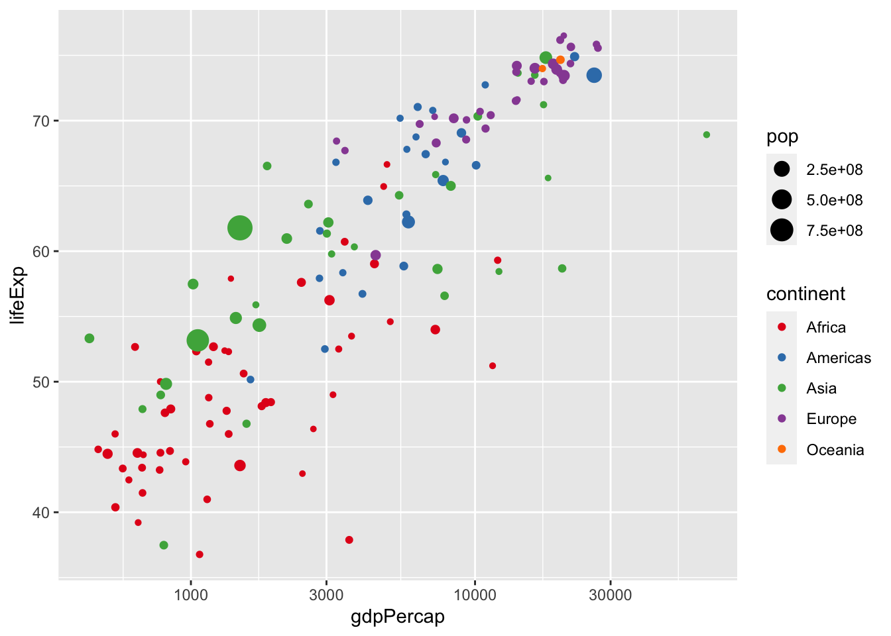
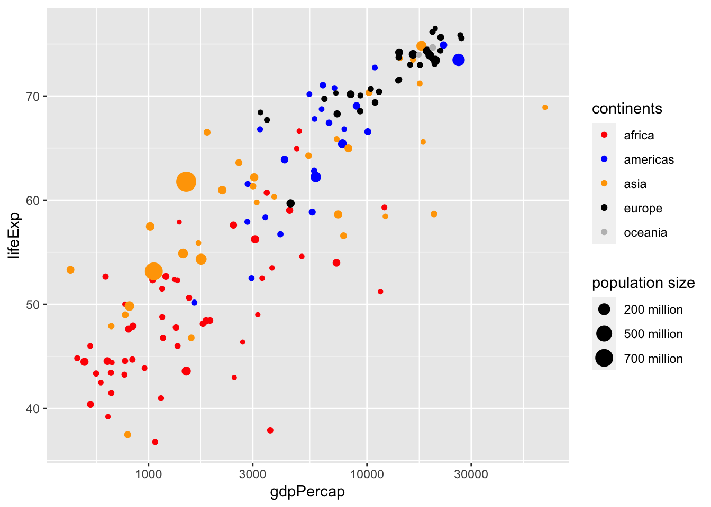
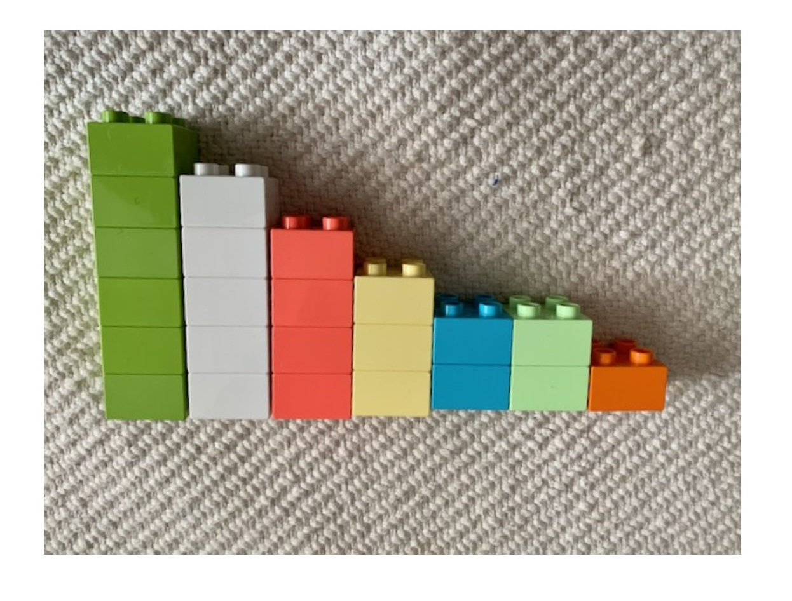

# ggplot2之标度 {#tidyverse-ggplot2-scales}

> 用 ggplot2 画图，有种恋爱的感觉:
> “你懂我的图谋不轨，我懂你的故作矜持”


这一章我们一起学习ggplot2中的scales语法，推荐大家阅读Hadley Wickham最新版的[《ggplot2: Elegant Graphics for Data Analysis》](https://ggplot2-book.org/)，但如果需要详细了解**标度**参数体系，还是要看[ggplot2官方文档](https://cran.r-project.org/web/packages/ggplot2/index.html)


ggplot2图层语法框架

<div class="figure">

<p class="caption">(\#fig:unnamed-chunk-1)ggplot2图层语法框架</p>
</div>


## 标度
在 \@ref(tidyverse-ggplot2-geom)章，我们了解到ggplot2中，映射是数据转化到图形属性，这里的图形属性是指视觉可以感知的东西，比如大小，形状，颜色和位置等。我们今天讨论的标度（scale）是控制着数据到图形属性映射的函数，每一种标度都是从数据空间的某个区域（标度的定义域）到图形属性空间的某个区域（标度的值域）的一个函数。

简单点来说，**标度是用于调整数据映射的图形属性**。
在ggplot2中，每一种图形属性都拥有一个默认的标度，也许你对这个默认的标度不满意，可以就需要学习如何修改默认的标度。比如，
系统默认`"a"`对应红色，`"b"`对应蓝色，我们想让`"a"`对应紫色，`"b"`对应橙色。


## 图形属性和变量类型

还是用我们熟悉的`ggplot2::mpg`，可能有同学说，我画图没接触到`scale`啊，比如

```r
library(tidyverse)
```

```
## ── Attaching core tidyverse packages ──────────────────────── tidyverse 2.0.0 ──
## ✔ dplyr     1.1.3     ✔ readr     2.1.4
## ✔ forcats   1.0.0     ✔ stringr   1.5.0
## ✔ ggplot2   3.4.3     ✔ tibble    3.2.1
## ✔ lubridate 1.9.2     ✔ tidyr     1.3.0
## ✔ purrr     1.0.2     
## ── Conflicts ────────────────────────────────────────── tidyverse_conflicts() ──
## ✖ dplyr::filter() masks stats::filter()
## ✖ dplyr::lag()    masks stats::lag()
## ℹ Use the conflicted package (<http://conflicted.r-lib.org/>) to force all conflicts to become errors
```

```r
mpg %>% 
  ggplot(aes(x = displ, y = hwy)) + 
  geom_point(aes(colour = class)) 
```


能画个很漂亮的图，那是因为ggplot2默认缺省条件下，已经很美观了。（据说Hadley Wickham很后悔使用了这么漂亮的缺省值，因为很漂亮了大家都不认真学画图了。马云好像也说后悔创立了阿里巴巴？）

事实上，根据映射关系和变量名，我们将标度写完整，应该是这样的

```r
ggplot(mpg, aes(x = displ, y = hwy)) + 
  geom_point(aes(colour = class)) +
  
  scale_x_continuous() + 
  scale_y_continuous() + 
  scale_colour_discrete()
```


如果每次都要手动设置一次标度函数，那将是比较繁琐的事情。因此ggplot2使用了默认了设置，如果不满意ggplot2的默认值，可以手动调整或者改写标度，比如


```r
ggplot(mpg, aes(x = displ, y = hwy)) + 
  geom_point(aes(colour = class)) +
  
  scale_x_continuous(name = "This is my x axis") + 
  scale_y_continuous(name = "This is my y axis") + 
  scale_colour_brewer()
```



## 坐标轴和图例是同样的东西


## 丰富的标度体系

注意到，标度函数是由"_"分割的三个部分构成的
- scale
- 视觉属性名 (e.g., colour, shape or x)
- 标度名 (e.g., continuous, discrete, brewer).


每个标度函数内部都有丰富的参数系统

```r
scale_colour_manual(
  palette = function(), 
  limits = NULL,
  name = waiver(),
  labels = waiver(),
  breaks = waiver(),
  minor_breaks = waiver(),
  values = waiver(),
  ...
)
```

- 参数`name`，坐标和图例的名字，如果不想要图例的名字，就可以 `name = NULL`

- 参数`limits`, 坐标或图例的范围区间。连续性`c(n, m)`，离散型`c("a", "b", "c")`

- 参数`breaks`, 控制显示在坐标轴或者图例上的值（元素）

- 参数`labels`, 坐标和图例的间隔标签
  - 一般情况下，内置函数会自动完成
  - 也可人工指定一个字符型向量，与`breaks`提供的字符型向量一一对应
  - 也可以是函数，把`breaks`提供的字符型向量当做函数的输入
  - `NULL`，就是去掉标签

- 参数`values` 指的是（颜色、形状等）视觉属性值, 
  - 要么，与数值的顺序一致；
  - 要么，与`breaks`提供的字符型向量长度一致
  - 要么，用命名向量`c("数据标签" = "视觉属性")`提供

- 参数`expand`, 控制参数溢出量

- 参数`range`, 设置尺寸大小范围，比如针对点的相对大小


<!-- 把scale理解make, scale_x_continuous() == 使得x坐标连续型的 -->

下面，我们通过具体的案例讲解如何使用参数，把图形变成我们想要的模样。


## 案例详解

先导入一个数据

```r
gapdata <- read_csv("./demo_data/gapminder.csv")
```

```
## Rows: 1704 Columns: 6
## ── Column specification ────────────────────────────────────────────────────────
## Delimiter: ","
## chr (2): country, continent
## dbl (4): year, lifeExp, pop, gdpPercap
## 
## ℹ Use `spec()` to retrieve the full column specification for this data.
## ℹ Specify the column types or set `show_col_types = FALSE` to quiet this message.
```


```r
newgapdata <- gapdata %>% 
  group_by(continent, country) %>% 
  summarise(
    across(c(lifeExp, gdpPercap, pop), mean)
  )
```

```
## `summarise()` has grouped output by 'continent'. You can override using the
## `.groups` argument.
```

```r
newgapdata
```

```
## # A tibble: 142 × 5
## # Groups:   continent [5]
##    continent country                  lifeExp gdpPercap       pop
##    <chr>     <chr>                      <dbl>     <dbl>     <dbl>
##  1 Africa    Algeria                     59.0     4426. 19875406.
##  2 Africa    Angola                      37.9     3607.  7309390.
##  3 Africa    Benin                       48.8     1155.  4017497.
##  4 Africa    Botswana                    54.6     5032.   971186.
##  5 Africa    Burkina Faso                44.7      844.  7548677.
##  6 Africa    Burundi                     44.8      472.  4651608.
##  7 Africa    Cameroon                    48.1     1775.  9816648.
##  8 Africa    Central African Republic    43.9      959.  2560963 
##  9 Africa    Chad                        46.8     1165.  5329256.
## 10 Africa    Comoros                     52.4     1314.   361684.
## # ℹ 132 more rows
```


```r
newgapdata %>% 
  ggplot(aes(x = gdpPercap, y = lifeExp)) +
    geom_point(aes(color = continent, size = pop)) +
    scale_x_continuous()
```


```r
newgapdata %>% 
  ggplot(aes(x = gdpPercap, y = lifeExp)) +
    geom_point(aes(color = continent, size = pop)) +
    scale_x_log10()
```


```r
newgapdata %>% 
  ggplot(aes(x = gdpPercap, y = lifeExp)) +
    geom_point(aes(color = continent, size = pop)) +
    scale_x_log10(breaks = c(500, 1000, 3000, 10000, 30000),
                  labels = scales::dollar)
```




```r
newgapdata %>% 
  ggplot(aes(x = gdpPercap, y = lifeExp)) +
    geom_point(aes(color = continent, size = pop)) +
    scale_x_log10(
      name = "GDP per capita",
      breaks = c(500, 1000, 3000, 10000, 30000),
      labels = scales::unit_format(unit = "dollar"))
```


```r
newgapdata %>% 
  ggplot(aes(x = gdpPercap, y = lifeExp)) +
    geom_point(aes(color = continent, size = pop)) +
    scale_x_log10() +
    scale_color_viridis_d()
```




离散变量映射到色彩的情形，可以使用[ColorBrewer](https://colorbrewer2.org)色彩。


```r
newgapdata %>% 
  ggplot(aes(x = gdpPercap, y = lifeExp)) +
    geom_point(aes(color = continent, size = pop)) +
    scale_x_log10() +
    scale_color_brewer(type = "qual", palette = "Set1")
```




```r
newgapdata %>% 
  ggplot(aes(x = gdpPercap, y = lifeExp)) +
    geom_point(aes(color = continent, size = pop)) +
    scale_x_log10() +
    scale_color_manual(
      name = "continents",
      values = c("Africa" = "red", "Americas" = "blue", "Asia" = "orange",
                 "Europe" = "black", "Oceania" = "gray"),
      breaks = c("Africa", "Americas", "Asia", "Europe", "Oceania"),
      labels = c("africa", "americas", "asia", "europe", "oceania")
    ) +
   scale_size(
     name = "population size",
     breaks = c(2e8, 5e8, 7e8),
     labels = c("200 million", "500 million", "700 million")
   )
```




## 用标度还是主题？

那什么时候用标度，什么时候用主题？这里有个原则：主题风格不会增加标签，也不会改变变量的范围，主题只会改变字体、大小、颜色等等。


## 作业

用 ggplot2 重复这张lego图




## 参考资料

- <https://ggplot2tor.com/scales/>


