# ggplot2之主题设置 {#tidyverse-ggplot2-theme}

这一章我们一起学习ggplot2中的theme elements
语法，感谢[Henry Wang](https://henrywang.nl/ggplot2-theme-elements-demonstration/)提供了很好的思路。如果需要详细了解，可以参考Hadley Wickham最新版的[《ggplot2: Elegant Graphics for Data Analysis》](https://ggplot2-book.org/)，最推荐的是[ggplot2官方文档](https://cran.r-project.org/web/packages/ggplot2/index.html)


```r
theme(element_name = element_function())
```

这里`element_function()`有四个


```r
element_text()
element_line()
element_rect()
element_blank()
```

望文生义吧，内置元素函数有四个基础类型：

- `element_text()`,  文本，一般用于控制标签和标题的字体风格
- `element_line()`, 线条，一般用于控制线条或线段的颜色或线条类型
- `element_rect()`, 矩形区域，一般用于控制背景矩形的颜色或者边界线条类型
- `element_blank()` , 空白，就是不分配相应的绘图空间，即删去这个地方的绘图元素。


每个元素函数都有一系列控制外观的参数，下面我们通过具体的案例来一一介绍吧。


```r
library(tidyverse)
```

```
## ── Attaching core tidyverse packages ──────────────────────── tidyverse 2.0.0 ──
## ✔ dplyr     1.1.3     ✔ readr     2.1.4
## ✔ forcats   1.0.0     ✔ stringr   1.5.0
## ✔ ggplot2   3.4.3     ✔ tibble    3.2.1
## ✔ lubridate 1.9.2     ✔ tidyr     1.3.0
## ✔ purrr     1.0.2     
## ── Conflicts ────────────────────────────────────────── tidyverse_conflicts() ──
## ✖ dplyr::filter() masks stats::filter()
## ✖ dplyr::lag()    masks stats::lag()
## ℹ Use the conflicted package (<http://conflicted.r-lib.org/>) to force all conflicts to become errors
```

还是用让人生厌的`ggplot2::mpg`数据包吧，具体介绍请见\@ref(tidyverse-ggplot2-aes) 章。


```r
glimpse(mpg)
```

```
## Rows: 234
## Columns: 11
## $ manufacturer <chr> "audi", "audi", "audi", "audi", "audi", "audi", "audi", "…
## $ model        <chr> "a4", "a4", "a4", "a4", "a4", "a4", "a4", "a4 quattro", "…
## $ displ        <dbl> 1.8, 1.8, 2.0, 2.0, 2.8, 2.8, 3.1, 1.8, 1.8, 2.0, 2.0, 2.…
## $ year         <int> 1999, 1999, 2008, 2008, 1999, 1999, 2008, 1999, 1999, 200…
## $ cyl          <int> 4, 4, 4, 4, 6, 6, 6, 4, 4, 4, 4, 6, 6, 6, 6, 6, 6, 8, 8, …
## $ trans        <chr> "auto(l5)", "manual(m5)", "manual(m6)", "auto(av)", "auto…
## $ drv          <chr> "f", "f", "f", "f", "f", "f", "f", "4", "4", "4", "4", "4…
## $ cty          <int> 18, 21, 20, 21, 16, 18, 18, 18, 16, 20, 19, 15, 17, 17, 1…
## $ hwy          <int> 29, 29, 31, 30, 26, 26, 27, 26, 25, 28, 27, 25, 25, 25, 2…
## $ fl           <chr> "p", "p", "p", "p", "p", "p", "p", "p", "p", "p", "p", "p…
## $ class        <chr> "compact", "compact", "compact", "compact", "compact", "c…
```


稍微做点数据整理

```r
df <- mpg %>% 
  as_tibble() %>% 
  filter(class != "2seater", manufacturer %in% c("toyota", "volkswagen"))
df
```

```
## # A tibble: 61 × 11
##    manufacturer model      displ  year   cyl trans drv     cty   hwy fl    class
##    <chr>        <chr>      <dbl> <int> <int> <chr> <chr> <int> <int> <chr> <chr>
##  1 toyota       4runner 4…   2.7  1999     4 manu… 4        15    20 r     suv  
##  2 toyota       4runner 4…   2.7  1999     4 auto… 4        16    20 r     suv  
##  3 toyota       4runner 4…   3.4  1999     6 auto… 4        15    19 r     suv  
##  4 toyota       4runner 4…   3.4  1999     6 manu… 4        15    17 r     suv  
##  5 toyota       4runner 4…   4    2008     6 auto… 4        16    20 r     suv  
##  6 toyota       4runner 4…   4.7  2008     8 auto… 4        14    17 r     suv  
##  7 toyota       camry        2.2  1999     4 manu… f        21    29 r     mids…
##  8 toyota       camry        2.2  1999     4 auto… f        21    27 r     mids…
##  9 toyota       camry        2.4  2008     4 manu… f        21    31 r     mids…
## 10 toyota       camry        2.4  2008     4 auto… f        21    31 r     mids…
## # ℹ 51 more rows
```

我相信这种图你们已经会画了吧

```r
df %>%
  ggplot(aes(x = displ, y = hwy, color = factor(cyl))) +
  geom_point() +
  facet_grid(vars(manufacturer), vars(class)) +
  ggtitle("This is my title") +
  labs(x = "x_displ", y = "y_hwy")
```

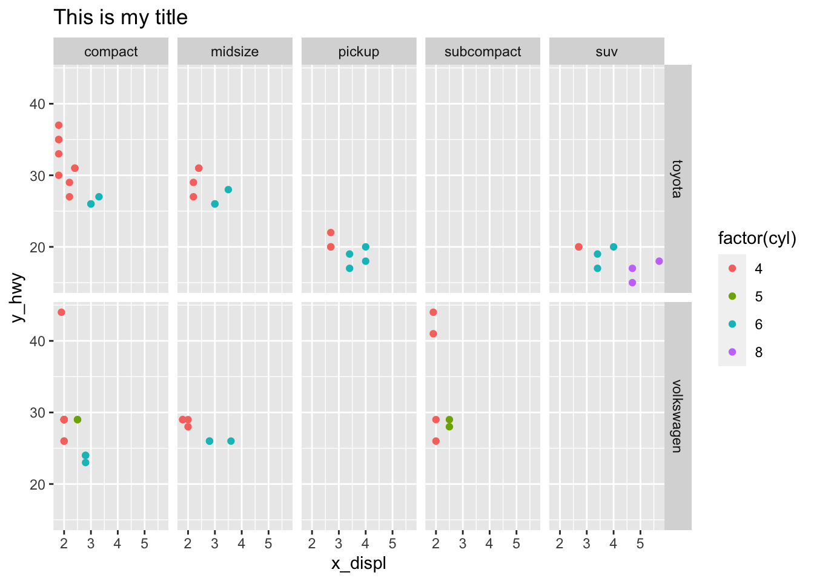

想让这张图，符合你的想法？如何**控制**呢？come on

## 图表整体元素

图表整体元素包括:

| 描述         | 主题元素         | 类型           |
|--------------|------------------|----------------|
|整个图形背景  | plot.background  |  element_rect()|
|图形标题      | plot.title       |  element_text()|
|图形边距      | plot.margin      |        margin()|


```r
df %>%
  ggplot(aes(x = displ, y = hwy, color = factor(cyl))) +
  geom_point() +
  facet_grid(vars(manufacturer), vars(class)) +
  ggtitle("This is my title") +
  labs(x = "x_displ", y = "y_hwy") +
  theme(
    plot.background = element_rect(fill = "orange", color = "black", size = 10),
    plot.title = element_text(hjust = 1, color = "red", face = "italic"),
    plot.margin = margin(t = 20, r = 20, b = 20, l = 20, unit = "pt")
  )
```

```
## Warning: The `size` argument of `element_rect()` is deprecated as of ggplot2 3.4.0.
## ℹ Please use the `linewidth` argument instead.
## This warning is displayed once every 8 hours.
## Call `lifecycle::last_lifecycle_warnings()` to see where this warning was
## generated.
```

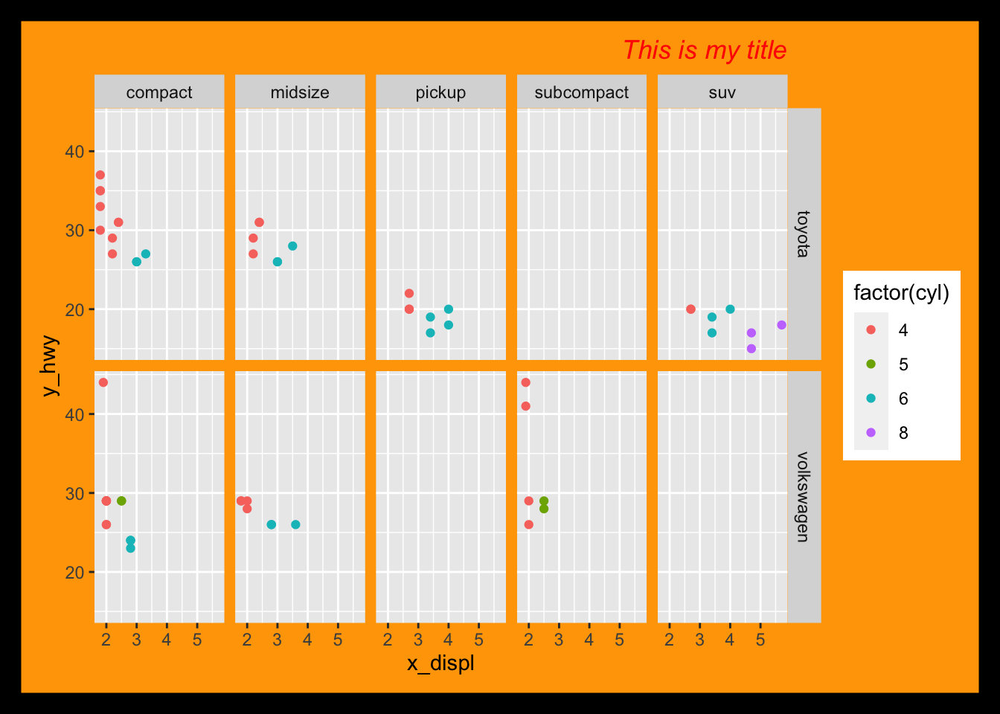

## 坐标轴元素

坐标轴元素包括:

| 描述         | 主题元素         | 类型           |
|--------------|------------------|----------------|
|坐标轴刻度    | axis.ticks       |  element_line()|
|坐标轴标题    | axis.title       |  element_text()|
|坐标轴标签    | axis.text        |  element_text()|
|直线和坐标轴  | axis.line        |  element_line()|


```r
df %>%
  ggplot(aes(x = displ, y = hwy, color = factor(cyl))) +
  geom_point() +
  facet_grid(vars(manufacturer), vars(class)) +
  ggtitle("This is my title") +
  labs(x = "x_displ", y = "y_hwy") +
  theme(
    axis.line = element_line(color = "orange", size = 2),
    axis.title = element_text(color = "red", face = "italic"),
    axis.ticks = element_line(color = "purple", size = 3),
    axis.text = element_text(color = "blue"),
    axis.text.x = element_text(angle = 45, hjust = 1)
  )
```

```
## Warning: The `size` argument of `element_line()` is deprecated as of ggplot2 3.4.0.
## ℹ Please use the `linewidth` argument instead.
## This warning is displayed once every 8 hours.
## Call `lifecycle::last_lifecycle_warnings()` to see where this warning was
## generated.
```

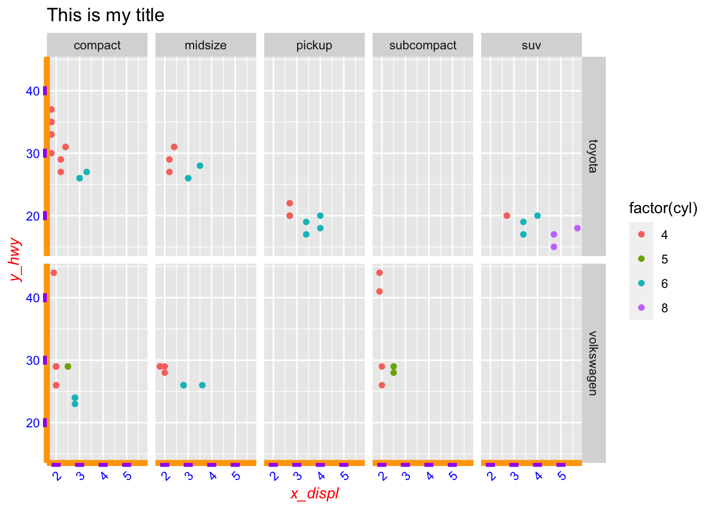


## 面板元素

面板元素包括:

| 描述         | 主题元素         | 类型           |
|--------------|------------------|----------------|
|面板背景      | panel.background | element_rect() |
|面板网格线    | panel.grid       | element_line() |
|面板边界      | panel.border     | element_rect() |


```r
df %>%
  ggplot(aes(x = displ, y = hwy, color = factor(cyl))) +
  geom_point() +
  facet_grid(vars(manufacturer), vars(class)) +
  ggtitle("This is my title") +
  labs(x = "x_displ", y = "y_hwy") +
  theme(
    panel.background = element_rect(fill = "orange", color = "red"),
    panel.grid = element_line(color = "grey80", size = 0.5)
  )
```

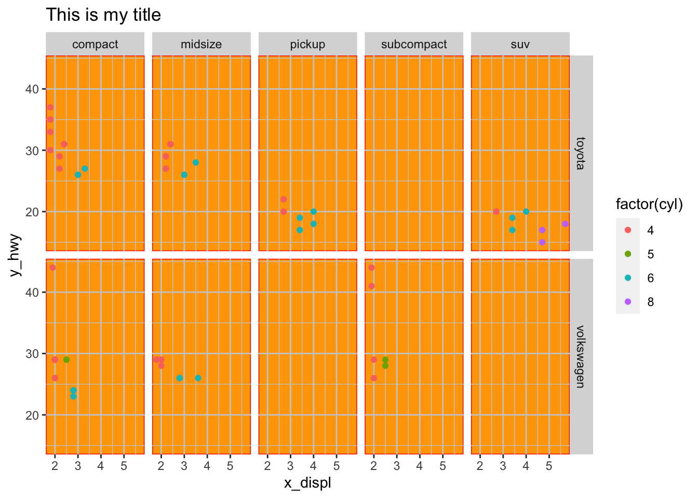

或者

```r
df %>%
  ggplot(aes(x = displ, y = hwy, color = factor(cyl))) +
  geom_point() +
  facet_grid(vars(manufacturer), vars(class)) +
  ggtitle("This is my title") +
  labs(x = "x_displ", y = "y_hwy") +
  theme(
    panel.background = element_rect(fill = "orange"),
    panel.grid = element_line(color = "grey80", size = 0.5),
    panel.border = element_rect(color = "red", fill = NA)
  )
```


## 图例元素

图例元素包括:

| 描述         | 主题元素         | 类型           |
|--------------|------------------|----------------|
|图例背景      | legend.background|  element_rect() |
|图例符号      | legend.key       |  element_rect() |
|图例标签      | legend.text      |  element_text() |
|图例标题      | legend.title     |  element_text() |
|图例边距      | legend.margin    |       margin    |
|图例位置      | legend.postion   |"top", "bottom", "left", "right"|


```r
df %>%
  ggplot(aes(x = displ, y = hwy, color = factor(cyl))) +
  geom_point() +
  facet_grid(vars(manufacturer), vars(class)) +
  ggtitle("This is my title") +
  labs(x = "x_displ", y = "y_hwy") +
  theme(
    legend.background = element_rect(fill = "orange"),
    legend.title = element_text(color = "blue", size = 10),
    legend.key = element_rect(fill = "grey80"),
    legend.text = element_text(color = "red"),
    legend.margin = margin(t = 20, r = 20, b = 20, l = 20, unit = "pt"),
    legend.position = "bottom"
  )
```

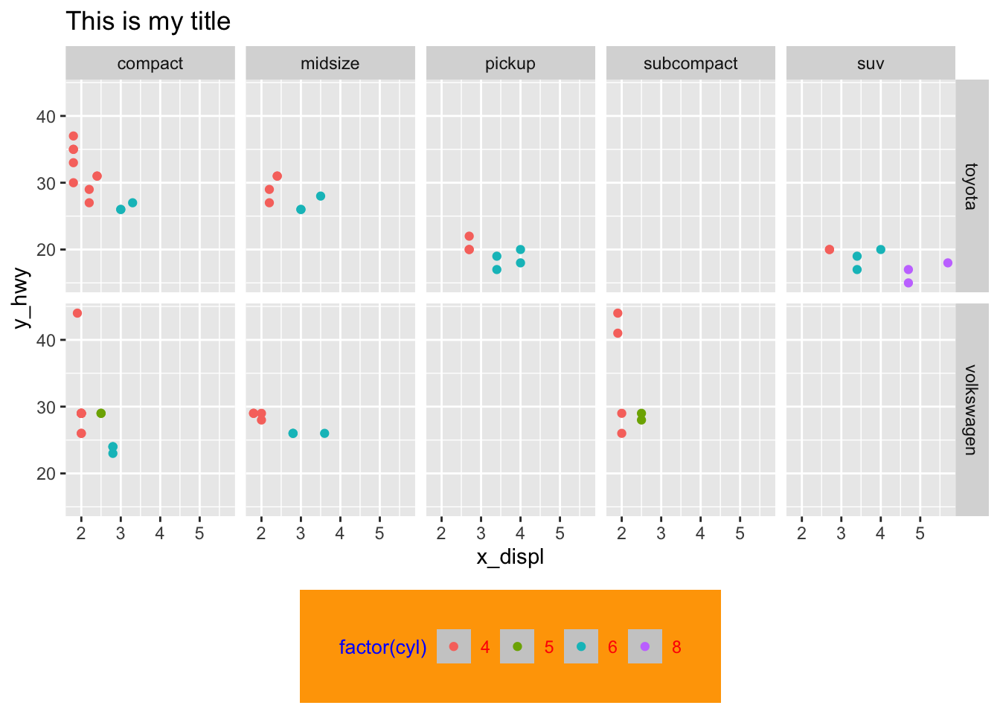


## 分面元素

分面元素包括:

| 描述         | 主题元素         | 类型           |
|--------------|------------------|----------------|
| 分面标签背景 | strip.background | element_rect() |
| 条状文本     | strip.text       | element_text() |
| 分面间隔     | panel.spacing    | unit           |


```r
df %>%
  ggplot(aes(x = displ, y = hwy, color = factor(cyl))) +
  geom_point() +
  facet_grid(vars(manufacturer), vars(class)) +
  ggtitle("This is my title") +
  labs(x = "x_displ", y = "y_hwy") +
  theme(
    strip.background = element_rect(fill = "orange"),
    strip.text = element_text(color = "red"),
    panel.spacing = unit(0.3, "inch") 
    # strip.switch.pad.grid =
  )
```

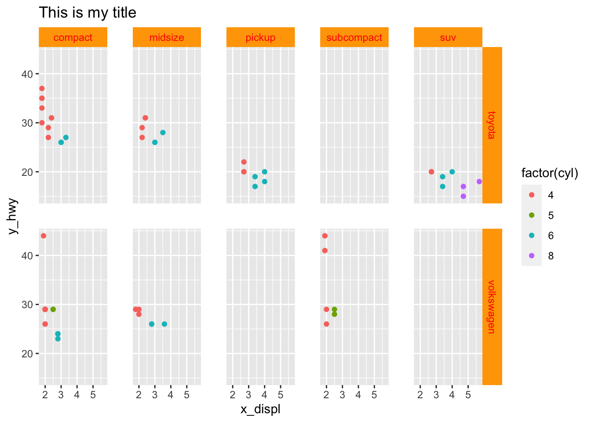

## 案例

```r
diamonds %>%
  ggplot(aes(carat, price)) +
  geom_hex() +
  labs(title = "Diamond") +
  theme(
    axis.title.x = element_text(
      size = 30,
      color = "red",
      face = "bold",
      angle = 10
    ),
    legend.title = element_text(
      size = 25,
      color = "#ff6361",
      margin = margin(b = 5)
    ),
    plot.title = element_text(
      size = 35,
      face = "bold",
      color = "blue"
    )
  )
```

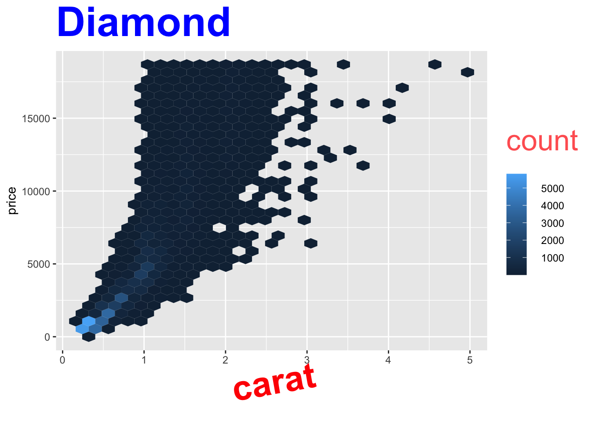

你肯定不会觉得这图好看。


```r
library(palmerpenguins)
penguins %>%
  ggplot(aes(bill_length_mm, bill_depth_mm)) +
  geom_point() +
  theme(
    axis.line.y = element_line(
      color = "black",
      size = 1.2,
      arrow = grid::arrow()
    ),
    axis.line.x = element_line(
      linetype = "dashed",
      color = "brown",
      size = 1.2
    ),
    axis.ticks = element_line(color = "red", size = 1.1),
    axis.ticks.length = unit(3, "mm"),
    panel.grid.major = element_line(
      color = "blue",
      size = 1.2
    ),
    panel.grid.minor = element_line(
      color = "#58508d",
      size = 1.2,
      linetype = "dotted"
    )
  )
```

```
## Warning: Removed 2 rows containing missing values (`geom_point()`).
```

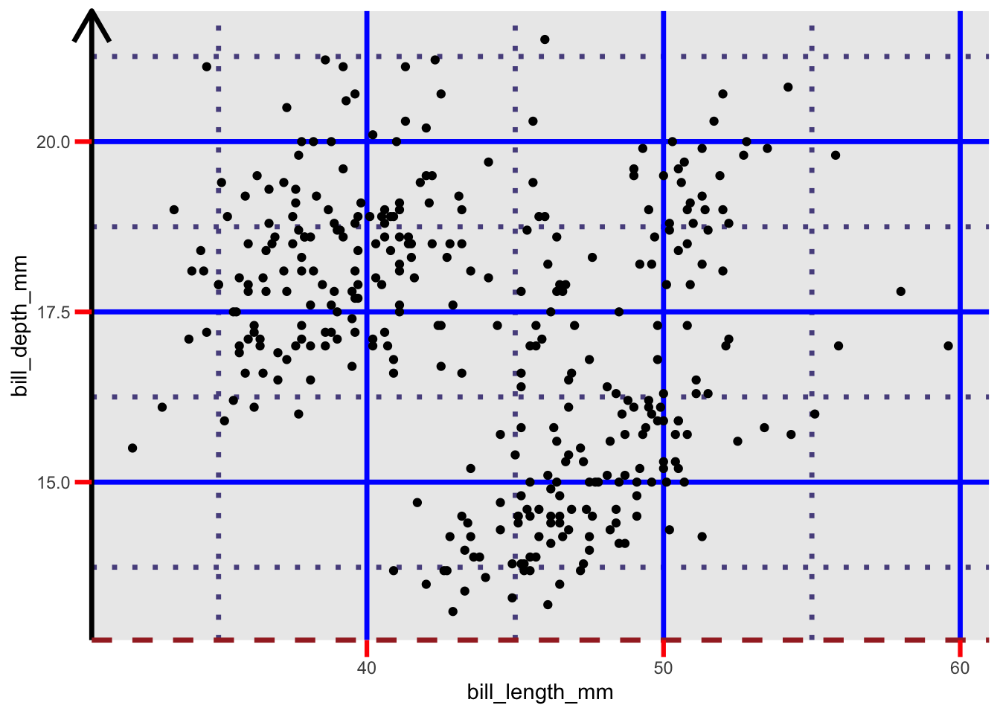


```r
penguins %>%
  ggplot(aes(bill_length_mm, bill_depth_mm)) +
  geom_point(aes(color = species)) +
  theme(
    legend.background = element_rect(
      fill = "#fff6c2",
      color = "black",
      linetype = "dashed"
    ),
    legend.key = element_rect(fill = "grey", color = "brown"),
    panel.background = element_rect(
      fill = "#005F59",
      color = "red", size = 3
    ),
    panel.border = element_rect(
      color = "black",
      fill = "transparent",
      linetype = "dashed", size = 3
    ),
    plot.background = element_rect(
      fill = "#a1dce9",
      color = "black",
      size = 1.3
    ),
    legend.position = "bottom"
  )
```

```
## Warning: Removed 2 rows containing missing values (`geom_point()`).
```

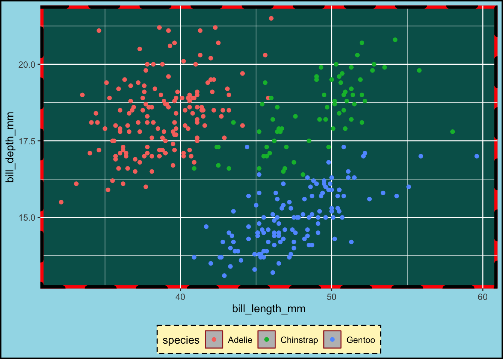

## 小结


## 主题风格
当然可以使用自带的主题风格


```r
thms <- list.files(path = "images/img", pattern = "built-in",full.names = T)
knitr::include_graphics(thms)
```

<div class="figure">
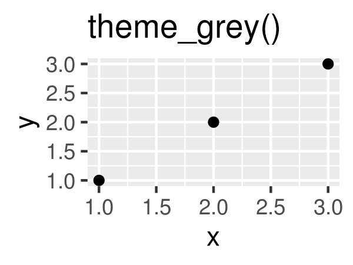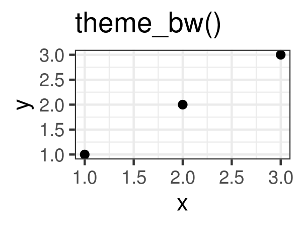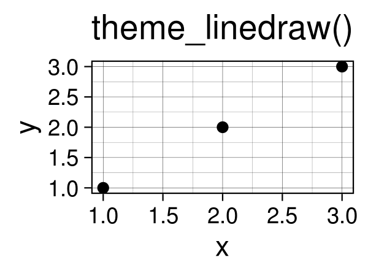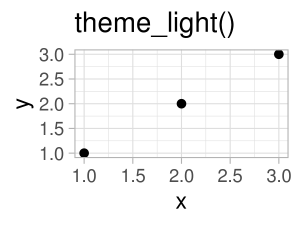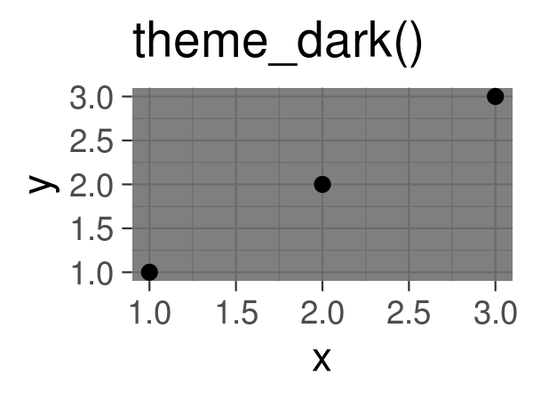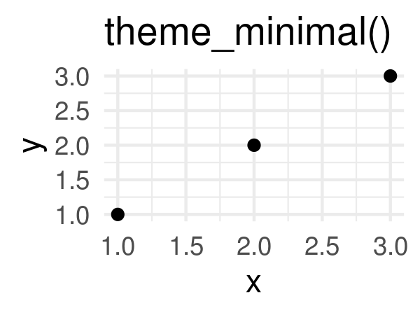
<p class="caption">(\#fig:unnamed-chunk-1)Source: <a href="https://ggplot2-book.org/polishing.html">ggplot2 book</a></p>
</div>


```r
penguins %>% 
    ggplot(aes(x = bill_depth_mm, y = bill_length_mm)) +
    geom_point() +
    theme_minimal()
```

```
## Warning: Removed 2 rows containing missing values (`geom_point()`).
```

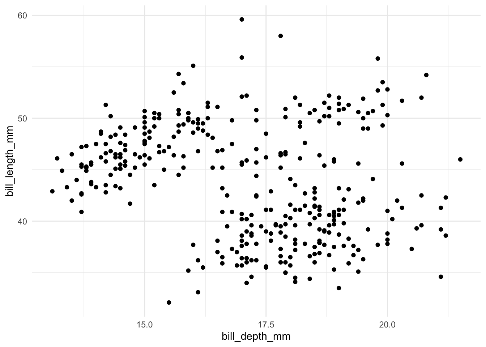


```r
penguins %>% 
  ggplot(aes(x = bill_depth_mm, y = bill_length_mm)) +
  geom_point() +
  theme_bw() +
  theme(text = element_text(family = "serif", size = 20),
        panel.grid = element_blank()
        )
```

```
## Warning: Removed 2 rows containing missing values (`geom_point()`).
```

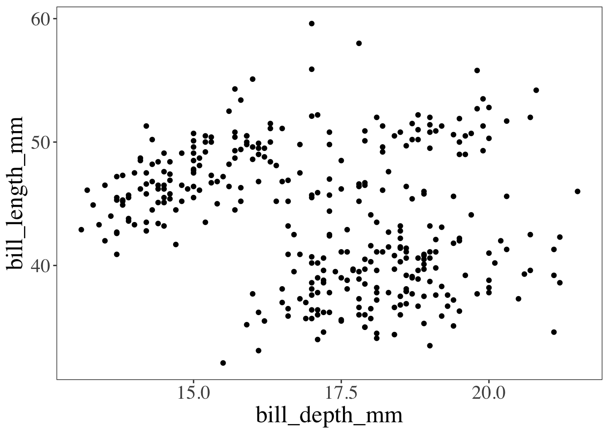


当然，`ggthemes`宏包也提供了很多优秀的主题风格


```r
library(ggthemes)
penguins %>% 
    ggplot(aes(x = bill_depth_mm, y = bill_length_mm)) +
    geom_point() +
    ggthemes::theme_economist()
```

```
## Warning: Removed 2 rows containing missing values (`geom_point()`).
```


```r
gapdata <- read_csv("./demo_data/gapminder.csv")
```

```
## Rows: 1704 Columns: 6
## ── Column specification ────────────────────────────────────────────────────────
## Delimiter: ","
## chr (2): country, continent
## dbl (4): year, lifeExp, pop, gdpPercap
## 
## ℹ Use `spec()` to retrieve the full column specification for this data.
## ℹ Specify the column types or set `show_col_types = FALSE` to quiet this message.
```

```r
gapdata %>%
  ggplot(aes(x = gdpPercap, y = lifeExp, color = continent)) +
  geom_point() +
  geom_smooth(lwd = 3, se = FALSE, method = "lm") +
  theme_grey() # the default
```

```
## `geom_smooth()` using formula = 'y ~ x'
```

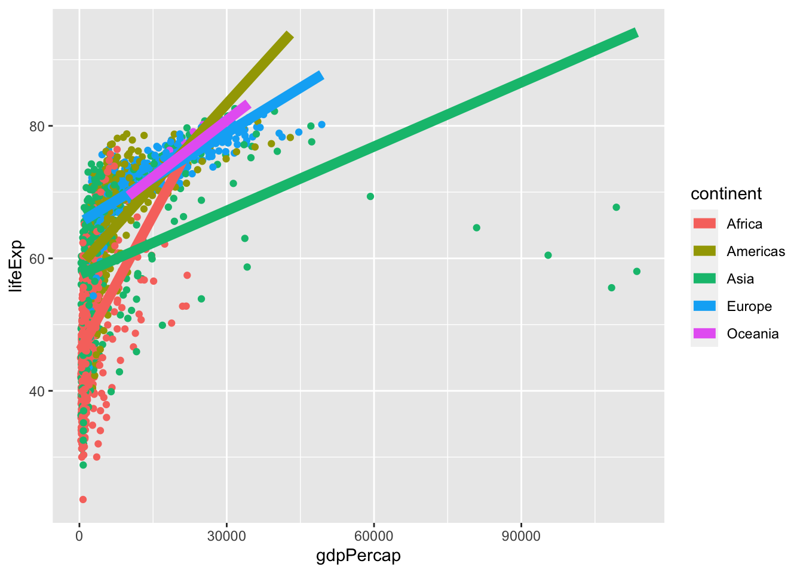


```r
gapdata %>%
  ggplot(aes(x = gdpPercap, y = lifeExp, color = continent)) +
  geom_point() +
  geom_smooth(lwd = 3, se = FALSE, method = "lm") +
  theme_bw()
```

```
## `geom_smooth()` using formula = 'y ~ x'
```


```r
gapdata %>%
  ggplot(aes(x = gdpPercap, y = lifeExp, color = continent)) +
  geom_point() +
  geom_smooth(lwd = 3, se = FALSE, method = "lm") +
  ggthemes::theme_calc() +
  ggtitle("ggthemes::theme_calc()")
```

```
## `geom_smooth()` using formula = 'y ~ x'
```

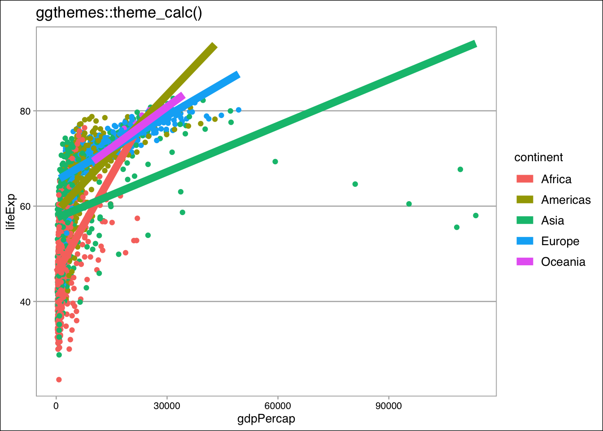


```r
gapdata %>%
  ggplot(aes(x = gdpPercap, y = lifeExp, color = continent)) +
  geom_point() +
  geom_smooth(lwd = 3, se = FALSE, method = "lm") +
  ggthemes::theme_economist() +
  ggtitle("ggthemes::theme_economist()")
```

```
## `geom_smooth()` using formula = 'y ~ x'
```

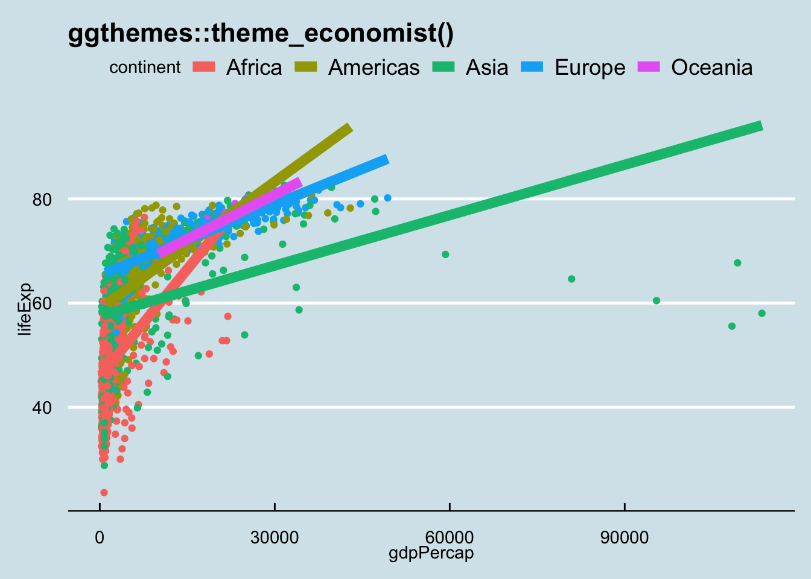


```r
gapdata %>%
  ggplot(aes(x = gdpPercap, y = lifeExp, color = continent)) +
  geom_point() +
  geom_smooth(lwd = 3, se = FALSE, method = "lm") +
  ggthemes::theme_economist_white() +
  ggtitle("ggthemes::theme_economist_white()")
```

```
## `geom_smooth()` using formula = 'y ~ x'
```

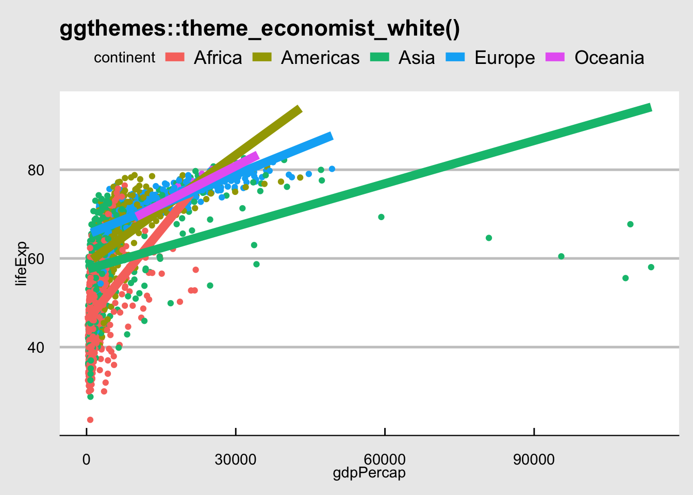


```r
gapdata %>%
  ggplot(aes(x = gdpPercap, y = lifeExp, color = continent)) +
  geom_point() +
  geom_smooth(lwd = 3, se = FALSE, method = "lm") +
  ggthemes::theme_few() +
  ggtitle("ggthemes::theme_few()")
```

```
## `geom_smooth()` using formula = 'y ~ x'
```

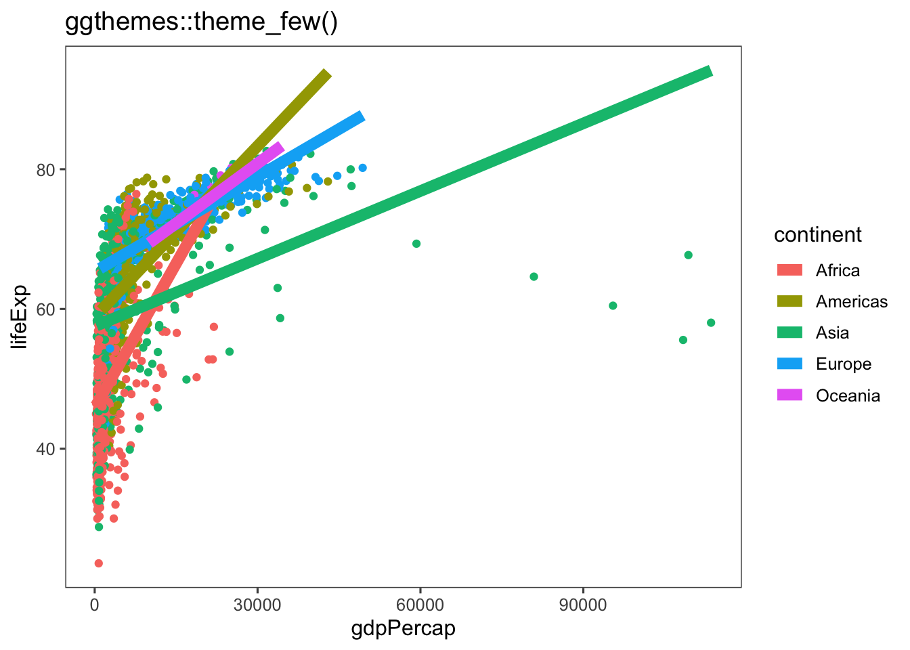


```r
gapdata %>%
  ggplot(aes(x = gdpPercap, y = lifeExp, color = continent)) +
  geom_point() +
  geom_smooth(lwd = 3, se = FALSE, method = "lm") +
  ggthemes::theme_gdocs() +
  ggtitle("ggthemes::theme_gdocs()")
```

```
## `geom_smooth()` using formula = 'y ~ x'
```

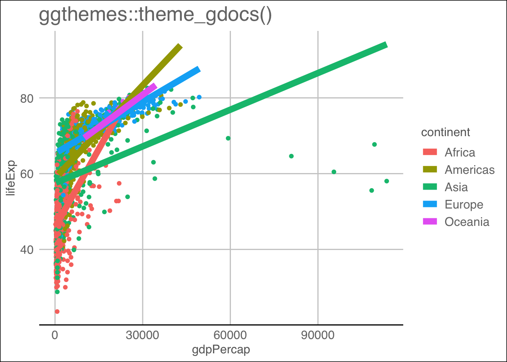


```r
gapdata %>%
  ggplot(aes(x = gdpPercap, y = lifeExp, color = continent)) +
  geom_point() +
  geom_smooth(lwd = 3, se = FALSE, method = "lm") +
  ggthemes::theme_tufte() +
  ggtitle("ggthemes::theme_tufte()")
```

```
## `geom_smooth()` using formula = 'y ~ x'
```

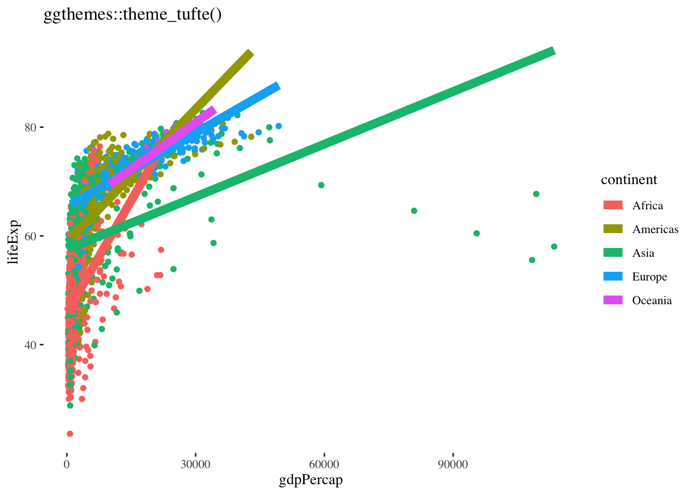


```r
gapdata %>%
  ggplot(aes(x = gdpPercap, y = lifeExp, color = continent)) +
  geom_point() +
  geom_smooth(lwd = 3, se = FALSE, method = "lm") +
  ggthemes::theme_wsj() +
  ggtitle("ggthemes::theme_wsj()")
```

```
## `geom_smooth()` using formula = 'y ~ x'
```

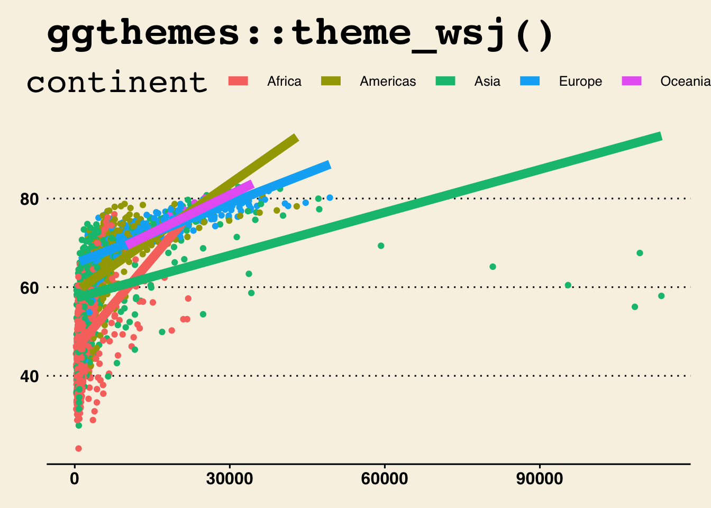


## 提问

- ggplot2中 plot 与 panel 有区别？

- 假定数据是这样


```r
library(tidyverse)
set.seed(12)

d1 <- data.frame(x = rnorm(50, 10, 2), type = "Island #1")
d2 <- data.frame(x = rnorm(50, 18, 1.2), type = "Island #2")

dd <- bind_rows(d1, d2) %>%
  set_names(c("Height", "Location"))

head(dd)
```

```
##      Height  Location
## 1  7.038865 Island #1
## 2 13.154339 Island #1
## 3  8.086511 Island #1
## 4  8.159990 Island #1
## 5  6.004716 Island #1
## 6  9.455408 Island #1
```

你画图后，交给老板看

```r
dd %>%
  ggplot(aes(x = Height, fill = Location)) +
  geom_histogram(binwidth = 1, color = "white") +
  scale_fill_manual(values = c("green3", "turquoise3"))
```

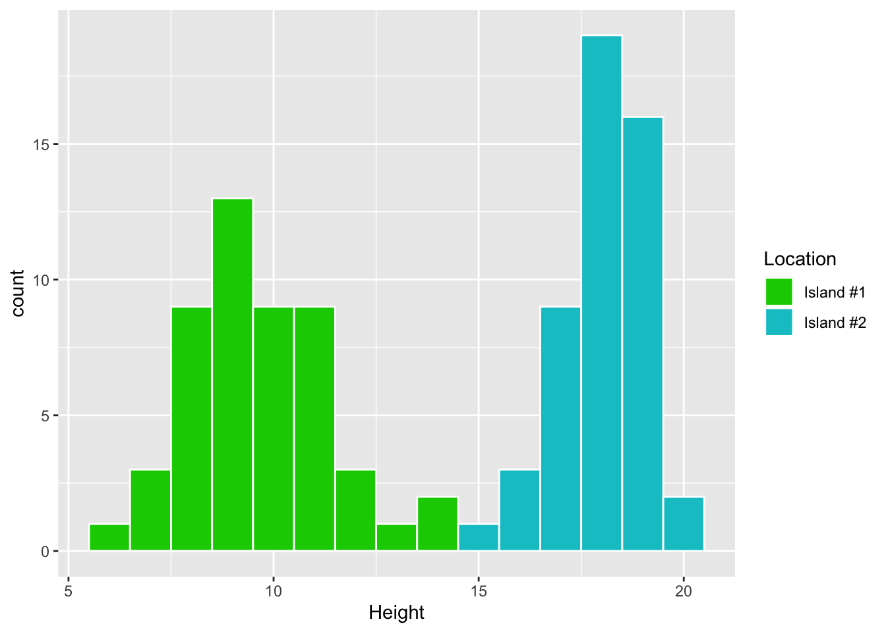

然而，老板有点不满意，希望你要这样改
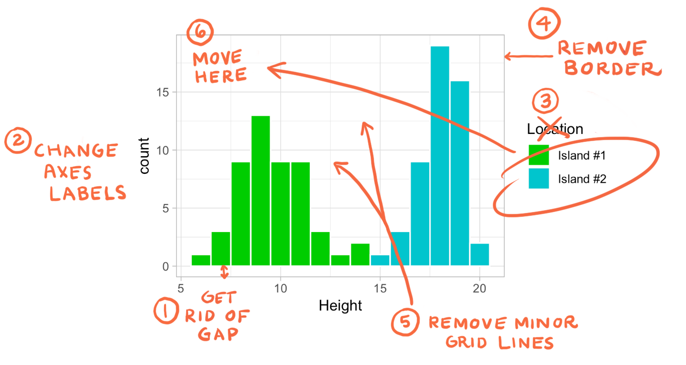

请用前后两章学到的内容让老板满意吧


