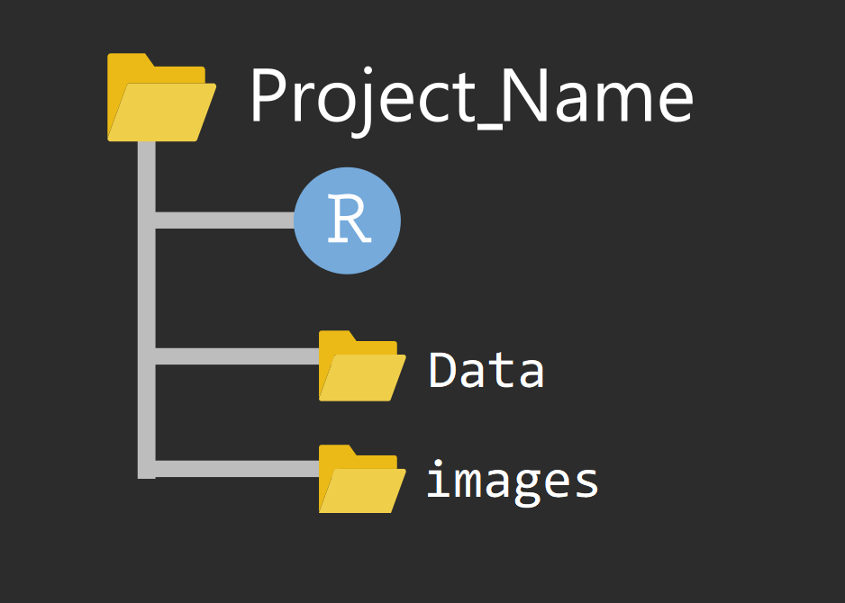

# (PART) 数据读入与处理 {-}

# 读取数据 {#tidyverse-readr}

在学习R语言过程中，除了使用内置的数据集外，我们更多的需要导入外部数据，
比如实验观察数据、社会调研的数据等等。
在讲如何读取数据到 **R**之前，先介绍下数据科学中的项目管理。

## 数据科学中的文件管理

把项目所需的文件（代码、数据、图片等），放在一个文件夹里

### 文件夹命名

**推荐**的文件夹命名习惯 (项目名+日期)，注意这里不要有**中文和空格**, 比如下面风格的就比较好 

- `project20201014`
- `Emotional_experiment20201014` 


### 项目文件结构




## 读取文件

事实上，R语言提供了很多读取数据的函数。下表列出了常见文件格式的读取方法


文件格式                       |       **R** 函数 
:---------------------------   |       :----------------------
.txt                           |       `read.table()`（空格、制表符(tab)分割的文件）
.csv                           |       `read.csv()` and `readr::read_csv()` （逗号(,)分割）
.xls and .xlsx                 |       `readxl::read_excel()` and `openxlsx::read.xlsx()`
.Rdata or rda                  |       `load()`
.rds                           |       `readRDS()` and `readr::read_rds()` 

::: {.rmdnote}

tidyverse家族中的readr包中`read_table()`、`read_csv()`、`read_tsv()`、`read_delim()`都可以读取文件，但返回的是tibble. 而默认的`read.table()`等返回的是常规的dataframe。

:::

## 文件路径

在读取文件时，路径的写法有如下方式（以图像文件"a.jpg"为例）

- 如果以当前项目文件为中心，图片在当前目录，它的路径
"./a.jpg"

- 如果以当前项目文件为中心，图片在下一层目录的images文件夹
"./images/a.jpg"

- 如果以当前项目文件为中心，图片在上一层目录下，它的路径
"../a.jpg"

- 如果以当前项目文件为中心，图片在上一层目录的images文件夹，它的路径
"../images/a.jpg"

- 从根目录出发，访问D盘的images文件"b.jpg"图片，它的路径
"D:/images/b.jpg"


## `here` 宏包

推荐使用强大的`here`宏包，`here()`会告诉我们当前所在的目录

```r
here::here()
```

```
## [1] "/Users/suoqinjin/Documents/my_project2023/R_for_Beginners"
```

以及指向某个文件的路径信息

```r
here::here("demo_data", "kidiq.RDS")
```

```
## [1] "/Users/suoqinjin/Documents/my_project2023/R_for_Beginners/demo_data/kidiq.RDS"
```
这样就会很方便的读取文件

```r
readr::read_rds(here::here("demo_data", "kidiq.RDS"))
```

`here`宏包的好处还在于，在不同的电脑和文件结构下，代码都能运行，尤其当与合作者共同完成一个项目时，这个方法非常有用。


## 范例


```r
d <- read.table(file= "./data/txt_file.txt", header = TRUE)
d <- read.table(here::here("data", "txt_file.txt"), header = TRUE)
```


```r
load(file = "./data/rda_file.rda")
load(here::here("data", "rda_file.rda"))
```


```r
d <- readRDS("./data/rds_file.rds")
d <- readRDS(here::here("data", "rda_file.rds"))
```


```r
library(readr)
d <- read_csv(file = "./data/csv_file.csv") 
d <- read_csv(here::here("data", "csv_file.csv")) 
```
csv = "comma-separated values"


```r
url <- "https://raw.githubusercontent.com/perlatex/R_for_Data_Science/master/demo_data/wages.csv"
d <- read_csv(url)
```


```r
library(readxl)
d <- read_excel("./data/vowel_data.xlsx") 
d <- read_excel(here::here("data", "vowel_data.xlsx")) 
```


## 乱码情形

<div class="danger">
<p>遇到乱码的情况，这里有个小小的提示：</p>
<ul>
<li>可以先用记事本转换成”UTF-8”编码，</li>
<li>或者指定编码格式，比如<code>read.table(..., fileEncoding = "UTF-8")</code>，再试试。</li>
</ul>
</div>
