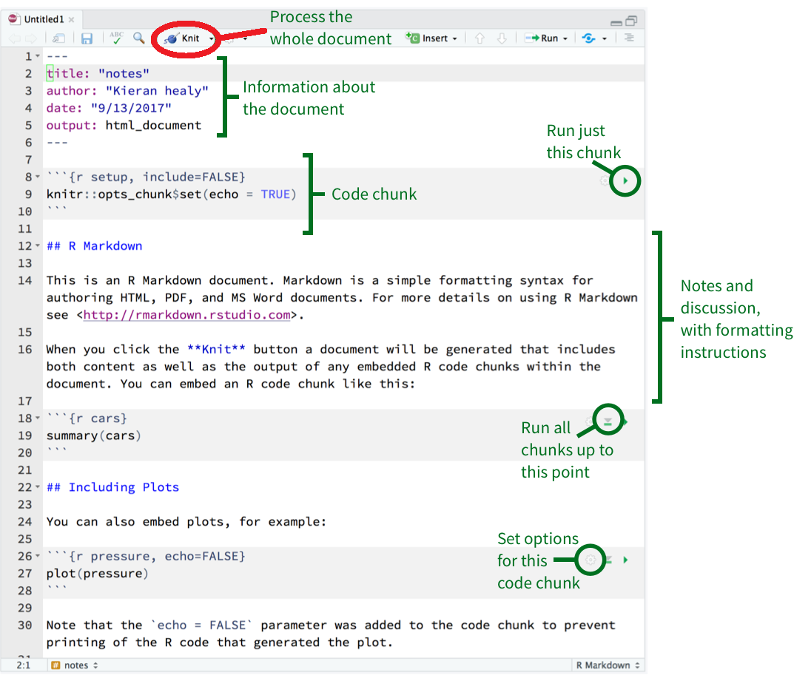
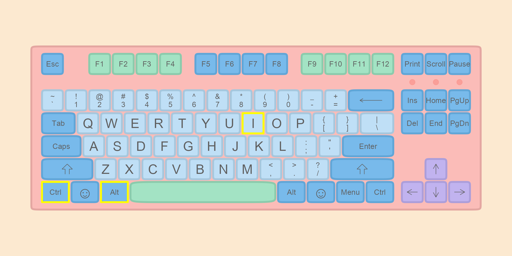
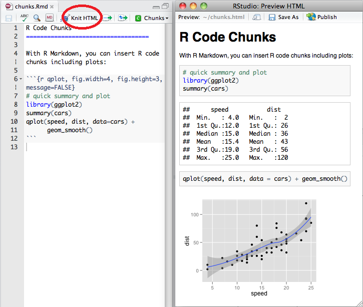
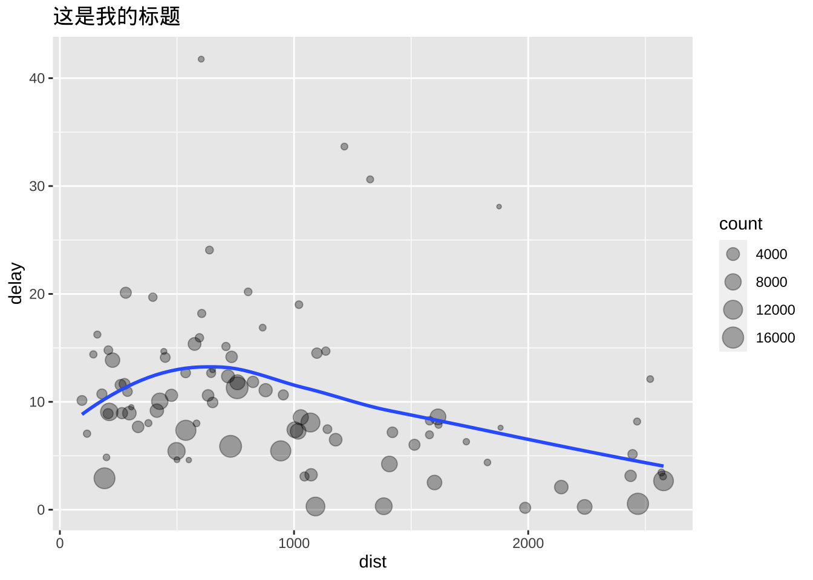

# (PART) 可重复性文档Rmarkdown以及练习 {-}

# 可重复性文档 {#tidyverse-rmarkdown}

有时候，我们需要**展示和分享**我们的数据分析结果给同行、老板或者老师。 那么，为了让老板能快速地的理解我们的分析思路和方法，
最好的方法，就是将分析背景、分析过程、分析结果以及图表等形成**报告**，让读者能重复和验证我们的结果，确保结论的真实可信。
因此，本章就将介绍如何生成分析报告（可重复性报告）。


## 什么是Rmarkdown


## markdown 基本语法

```markdown
# This is a title

#  第一章   （注意   "#" 与 "第一章"之间有空格）
##  第一节  （同上，"##" 与 "第一节"之间有空格）

This is a sentence.

Now a list begins:
  
- no importance
- again
- repeat
  
A numbered list:
  
1. first
2. second

__bold__, _italic_, ~~strike through~~
```

常用的[Markdown](https://bookdown.org/yihui/rmarkdown/markdown-syntax.html) 语法:

<div style="width:400px">
Type this...             | ...to get this
-------------------------|------------------------------------
`normal text`            | normal text
`*italic text*`          | *italic text*
`**bold text**`          |**bold text**
`***bold italic text***` | ***bold italic text***
`superscript^2^`         | superscript^2^
`~~strikethrough~~`      | ~~strikethrough~~
`` `code text` ``        | `code text`
</div>


对于章节， 使用 `#` 符号:


```r
# Header 1
## Header 2
### Header 3
#### Header 4
##### Header 5
###### Header 6
```


如果需要制作**列表**，可以使用`-`符号


```r
- first item
- second item
- third item
```

- first item
- second item
- third item


如果希望列表带有数字编号，可以加上编号


```r
1. first item
2. second item
3. third item
```

1. first item
2. second item
3. third item


如果想添加网页链接，可以用方括号和圆括号


```r
[Download R](http://www.r-project.org/)
```
[Download R](http://www.r-project.org/)


如果想制作简单表格，列与列之间用 `|` 分隔，表格的首行下面添加`--------` 


```r
Table Header  | Second Header
------------- | -------------
Cell 1, 1     | Cell 2, 1
Cell 1, 2     | Cell 2, 2
```

Table Header  | Second Header
------------- | -------------
Cell 1, 1     | Cell 2, 1
Cell 1, 2     | Cell 2, 2


这样作表格可能会比较麻烦，我经常在这个网站[在线表格转化器](http://www.tablesgenerator.com/markdown_tables)把表格弄好后，然后复制粘贴过来。


## Elements of RMarkdown

`Rstudio` 创建 Rmd 文件： `File -> New File -> R Markdown`.


Rmd 文件基本构成（图中绿色括号地方）

- metadata
- text
- code


   

   
   
   
## R Code chunks

在 Rmd 文档中写 R 代码，需要插入代码块(Code chunks)，具体以 ` ```{r} ` 开始，以 ` ``` `结尾。可以用快捷方式**`Ctrl + Alt + I`** (**OS X: `Cmd + Option + I`**)创建代码块。




点击knit（下图中红色地方），选择想要输出的文档格式即可。下图是Rmd文档与渲染效果效果，

<div class="figure">

<p class="caption">(\#fig:unnamed-chunk-12)Rmd文档与渲染效果对比</p>
</div>

我们也可以设置一些选项，控制代码块的运行方式(for more details see <http://yihui.name/knitr/>):


## 生成html文档

希望html文档有章节号、目录或者更好显示表格，可以修改yaml头文件（用下面的内容替换Rmarkdown的头文件）

```yaml
---
title: Habits
author: John Doe
date: "2023-11-22"
output: 
  html_document:
    df_print: paged
    toc: yes
    number_sections: yes
---
```

## 生成word文档

rmarkdown 生成的word功能不是很多，推荐使用[officedown](https://davidgohel.github.io/officedown/)
, [officer](https://davidgohel.github.io/officer/), [flextable](https://davidgohel.github.io/flextable/)宏包

## 生成pdf文档

pdf文档可以插入漂亮的矢量图和优雅的数学公式，所以备受同学们的喜欢。但往往我们写中文的时候，编译不成功。这里就来讲讲如何解决这些问题，推荐阅读[这里](https://bookdown.org/yihui/rmarkdown/)，或者看这个[视频](https://www.bilibili.com/video/BV1Gf4y1R7md)。

*Instructions*

1. 安装最新版本 [R](https://cran.r-project.org/mirrors.html) (>3.5) 和 [RStudio Desktop](https://rstudio.com/products/rstudio/) (>1.2).
2. 安装pdf查看器，[sumatrapdf网站](https://www.sumatrapdfreader.org/download-free-pdf-viewer.html)
3. 安装 [LaTeX](https://www.latex-project.org/get/). 然而这个软件会比较大
   (e.g. MacTeX is approximate 3.9G). 如果你之前没有安装过
   LaTeX，我推荐你安装轻量级的 [tinytex](https://yihui.org/tinytex/cn/). 安装方法如下，打开R，然后再命令行输入:


```r
install.packages("tinytex")
tinytex::install_tinytex(dir = "D:\\Tinytex", force = T)
```

中途会有两次警告，按 “ 确定 ” 就可以了。


::: {.rmdnote}

国内下载 TinyTeX 比较慢，可以用浏览器或其它下载工具直接下载：https://github.com/yihui/tinytex-releases/releases 然后把下载的文件路径传给安装函数，下面四步走：

- `install.packages("tinytex")`
- `tinytex::tlmgr_repo('http://mirrors.tuna.tsinghua.edu.cn/CTAN/')`
- `tinytex:::install_prebuilt('TinyTeX-v2022.05.zip', dir = "D:\\Tinytex")`
- 添加环境变量 `D:\Tinytex\bin\win32`

:::


4. 修改头文件，用下面的内容替换Rmarkdown的头文件, 不要修改缩进

```yaml
---
title: 'Going deeper with dplyr'
author: "王小二"
date: "`r Sys.Date()`"
output:
  pdf_document: 
    latex_engine: xelatex
    extra_dependencies:
      ctex: UTF8
    number_sections: yes
    df_print: kable
    toc: yes
classoptions: "hyperref, 12pt, a4paper"
---
```


## 使用方法

### 插入公式

我相信你已经熟悉了latex语法，那么我们在Rmarkdwon里输入
`$$\frac{\sum (\bar{x} - x_i)^2}{n-1}$$`，那么实际输出:

$$\frac{\sum (\bar{x} - x_i)^2}{n-1}$$

也可以使用latex的等式环境， 比如


```latex
$$\Theta = \begin{pmatrix}\alpha & \beta\\
\gamma & \delta
\end{pmatrix}$$
```
输出

$$
\Theta = \begin{pmatrix}\alpha & \beta\\
\gamma & \delta
\end{pmatrix}
$$


### 插入图片


````default

```{r out.width = '35%', fig.align='left', fig.cap='this is caption', echo = F}
knitr::include_graphics("images/R_logo.png")
```
````


<div class="figure" style="text-align: left">

<p class="caption">(\#fig:unnamed-chunk-16)this is caption</p>
</div>


### 运行代码


```r
summary(cars)
```

```
##      speed           dist       
##  Min.   : 4.0   Min.   :  2.00  
##  1st Qu.:12.0   1st Qu.: 26.00  
##  Median :15.0   Median : 36.00  
##  Mean   :15.4   Mean   : 42.98  
##  3rd Qu.:19.0   3rd Qu.: 56.00  
##  Max.   :25.0   Max.   :120.00
```


### 表格


````default

```{r tables-mtcars,  echo = F}
knitr::kable(iris[1:5, ], caption = "A caption")
```

````


Table: (\#tab:tables-mtcars)A caption

| Sepal.Length| Sepal.Width| Petal.Length| Petal.Width|Species |
|------------:|-----------:|------------:|-----------:|:-------|
|          5.1|         3.5|          1.4|         0.2|setosa  |
|          4.9|         3.0|          1.4|         0.2|setosa  |
|          4.7|         3.2|          1.3|         0.2|setosa  |
|          4.6|         3.1|          1.5|         0.2|setosa  |
|          5.0|         3.6|          1.4|         0.2|setosa  |

需要更优美的表格，可参考[这里](https://haozhu233.github.io/kableExtra/)


### 生成图片

````default

```{r}
plot(pressure)
```

````


或者


````default

```{r, out.width = '85%', fig.showtext = TRUE}
library(tidyverse)
library(nycflights13)
library(showtext)
showtext_auto()

flights %>%
  group_by(dest) %>%
  summarize(
    count = n(),
    dist = mean(distance, na.rm = TRUE),
    delay = mean(arr_delay, na.rm = TRUE)
  ) %>%
  dplyr::filter(delay > 0, count > 20, dest != "HNL") %>%
  ggplot(mapping = aes(x = dist, y = delay)) +
  geom_point(aes(size = count), alpha = 1 / 3) +
  geom_smooth(se = FALSE) +
  ggtitle("这是我的标题")
```

````


```
## 
## Attaching package: 'dplyr'
```

```
## The following objects are masked from 'package:stats':
## 
##     filter, lag
```

```
## The following objects are masked from 'package:base':
## 
##     intersect, setdiff, setequal, union
```

```
## Loading required package: sysfonts
```

```
## Loading required package: showtextdb
```

```
## `geom_smooth()` using method = 'loess' and formula = 'y ~ x'
```




### 文本内计算


```default
The content can contain inline code like `r pi * 5^2`, too.
```

The content can contain inline code like 78.5398163, too.


## 案例代码

```{=html}
<a href="data:text/x-markdown;base64,LS0tCnRpdGxlOiAi5ZyoUm1hcmtkb3du6YeM5aaC5L2V55Sf5oiQcGRm5paH5qGjIgphdXRob3I6ICLnjovmlY/mnbAiCmRhdGU6ICJgciBTeXMuRGF0ZSgpYCIKb3V0cHV0OgogIHBkZl9kb2N1bWVudDogCiAgICBsYXRleF9lbmdpbmU6IHhlbGF0ZXgKICAgIGV4dHJhX2RlcGVuZGVuY2llczoKICAgICAgY3RleDogVVRGOAogICAgbnVtYmVyX3NlY3Rpb25zOiB5ZXMKICAgIGRmX3ByaW50OiBrYWJsZQogICAgdG9jOiB5ZXMKY2xhc3NvcHRpb25zOiAiaHlwZXJyZWYsIDEycHQsIGE0cGFwZXIiCi0tLQoKCgpgYGB7ciBzZXR1cCwgaW5jbHVkZT1GQUxTRX0Ka25pdHI6Om9wdHNfY2h1bmskc2V0KGVjaG8gPSBUUlVFLCAKICAgICAgICAgICAgICAgICAgICAgIHdhcm5pbmcgPSBGQUxTRSwgCiAgICAgICAgICAgICAgICAgICAgICBtZXNzYWdlID0gRkFMU0UsCiAgICAgICAgICAgICAgICAgICAgICBmaWcud2lkdGggPSA2LCAKICAgICAgICAgICAgICAgICAgICAgIGZpZy5oZWlnaHQgPSA0LAogICAgICAgICAgICAgICAgICAgICAgZmlnLnNob3d0ZXh0ID0gVFJVRQogICAgICAgICAgICAgICAgICAgICAgKQpgYGAKCgoKCiMg5b+F6KaB55qE6YWN572uCgoqIOehruS/neW3sue7j+WuieijhWBybWFya2Rvd25g5a6P5YyFCiAgKyBgaW5zdGFsbC5wYWNrYWdlcygicm1hcmtkb3duIilgCiAgKyBgUnN0dWRpb2Ag6I+c5Y2V77yaIGBGaWxlIC0+IE5ldyBGaWxlIC0+IFIgTWFya2Rvd25gCiAgCiAgCiAgCiog5a6J6KOFcGRm5p+l55yL5ZmoCiAgKyAgW3N1bWF0cmFwZGbnvZHnq5ldKGh0dHBzOi8vd3d3LnN1bWF0cmFwZGZyZWFkZXIub3JnL2Rvd25sb2FkLWZyZWUtcGRmLXZpZXdlci5odG1sKQogCiAKIAoqIOaWh+aho+S4reS9v+eUqCBsYXRleCDlhazlvI/lkozkuK3mlocKICArICBgaW5zdGFsbC5wYWNrYWdlcygidGlueXRleCIpYAogICsgIGB0aW55dGV4OjppbnN0YWxsX3Rpbnl0ZXgoKWAKCgoKCiMg5L2/55So5pa55rOVCiMjIOaPkuWFpeWFrOW8jwoK5oiR55u45L+h5L2g5bey57uP54af5oKJ5LqGbGF0ZXjor63ms5XvvIzpgqPkuYjmiJHku6zlnKhybWTph4zovpPlhaUKYCQkXGZyYWN7XHN1bSAoXGJhcnt4fSAtIHhfaSleMn17bi0xfSQkYO+8jOmCo+S5iOWunumZhei+k+WHujoKCiQkXGZyYWN7XHN1bSAoXGJhcnt4fSAtIHhfaSleMn17bi0xfSQkCgrkuZ/lj6/ku6Xkvb/nlKhsYXRleOeahOetieW8j+eOr+Wig++8jCAKJCRcVGhldGEgPSBcYmVnaW57cG1hdHJpeH1cYWxwaGEgJiBcYmV0YVxcClxnYW1tYSAmIFxkZWx0YQpcZW5ke3BtYXRyaXh9JCQKCgoKCgoKCiMjIOaPkuWFpeihqOagvAoKYGBge3IgdGFibGVzLW10Y2Fyc30Ka25pdHI6OmthYmxlKGlyaXNbMTo1LCBdLCBjYXB0aW9uID0gJ0EgY2FwdGlvbicpCmBgYAoKCiMjIOaPkuWFpeWbvueJhwoKCmBgYHtyLCBvdXQud2lkdGg9JzIwJScsIGZpZy5hbGlnbj0nY2VudGVyJywgZmlnLmNhcD0ndGhpcyBpcyBjYXB0aW9uJywgZWNobyA9IEZ9CmtuaXRyOjppbmNsdWRlX2dyYXBoaWNzKCJpbWFnZXMvZ2lybC5qcGciKQpgYGAKCgoKIyMg6L+Q6KGM5Luj56CBCgpgYGB7ciBjYXJzfQpzdW1tYXJ5KGNhcnMpCmBgYAoKCiMjIOeUn+aIkOWbvueJhwoKYGBge3J9CmxpYnJhcnkodGlkeXZlcnNlKQpsaWJyYXJ5KG55Y2ZsaWdodHMxMykKbGlicmFyeShzaG93dGV4dCkKc2hvd3RleHRfYXV0bygpCgpmbGlnaHRzICU+JQogIGdyb3VwX2J5KGRlc3QpICU+JQogIHN1bW1hcml6ZSgKICAgIGNvdW50ID0gbigpLAogICAgZGlzdCA9IG1lYW4oZGlzdGFuY2UsIG5hLnJtID0gVFJVRSksCiAgICBkZWxheSA9IG1lYW4oYXJyX2RlbGF5LCBuYS5ybSA9IFRSVUUpCiAgKSAlPiUKICBmaWx0ZXIoZGVsYXksIGNvdW50ID4gMjAsIGRlc3QgIT0gIkhOTCIpICU+JQogIGdncGxvdChtYXBwaW5nID0gYWVzKHggPSBkaXN0LCB5ID0gZGVsYXkpKSArCiAgZ2VvbV9wb2ludChhZXMoc2l6ZSA9IGNvdW50KSwgYWxwaGEgPSAxIC8gMykgKwogIGdlb21fc21vb3RoKHNlID0gRkFMU0UpICsKICBnZ3RpdGxlKCLov5nmmK/miJHnmoTmoIfpopgiKQpgYGAKCgoKCg==" download="my_pdf_document.Rmd">Download my_pdf_document.Rmd</a>
```


## 延伸阅读

* Markdown tutorial https://www.markdowntutorial.com (10分钟学完)
* LaTeX tutorial https://www.latex-tutorial.com/quick-start/
* Rmarkdown 介绍 https://bookdown.org/yihui/rmarkdown/
* Rmarkdown 手册 https://bookdown.org/yihui/rmarkdown-cookbook/


