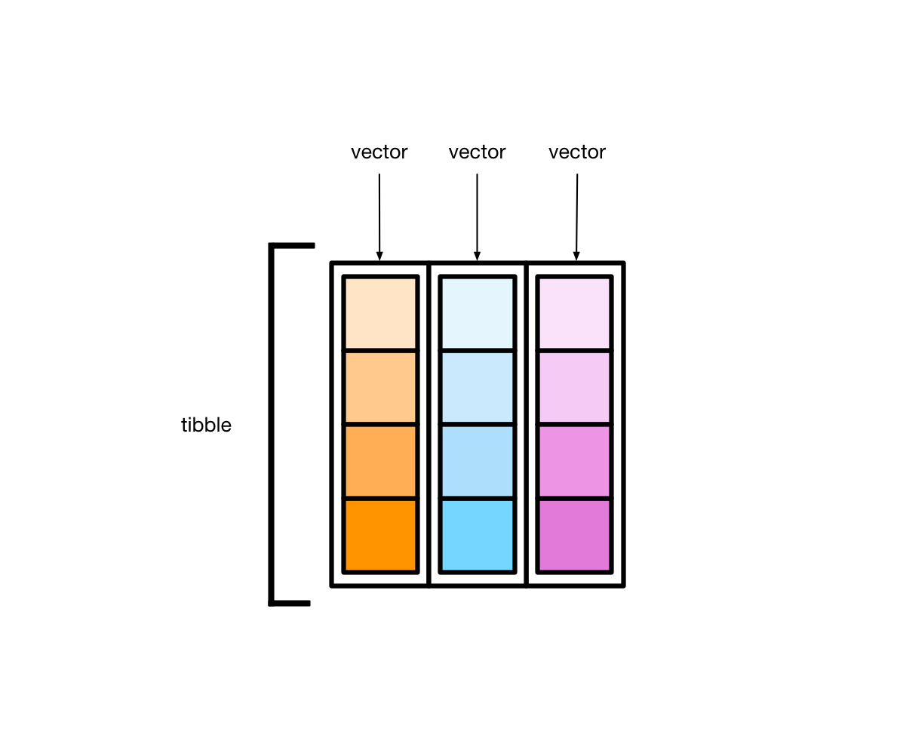

# 简单数据框 {#tidyverse-tibble}


```r
library(tidyverse)
library(tibble) 
```

事实上，library(tidyverse)已经加装了library(tibble)


## tidyverse 家族

前面陆续介绍了tidyverse家族，家庭主要成员包括


| 功能 | 宏包        |
|:-----|:------------|
有颜值担当 | ggplot2 |
数据处理王者 | dplyr |
数据转换专家  | tidyr |
数据载入利器 | readr |
循环加速器 | purrr |
强化数据框 | tibble |
字符串处理 | stringr |
因子处理   | forcats |


## 人性化的tibble



- tibble是用来替换data.frame类型的扩展的数据框
- tibble继承了data.frame，是弱类型的。换句话说，tibble是data.frame的子类型
- tibble与data.frame有相同的语法，使用起来更方便
- tibble更早的检查数据，方便写出更干净、更多富有表现力的代码


tibble对data.frame做了重新的设定：

* tibble，不关心输入类型，可存储任意类型，包括list类型
* tibble，没有行名设置 row.names
* tibble，支持任意的列名
* tibble，会自动添加列名
* tibble，类型只能回收长度为1的输入
* tibble，会懒加载参数，并按顺序运行
* tibble，是tbl_df类型


## tibble 与 data.frame


传统创建数据框


```r
data.frame(
  a = 1:5,
  b = letters[1:5]
)
```

```
##   a b
## 1 1 a
## 2 2 b
## 3 3 c
## 4 4 d
## 5 5 e
```

发现，`data.frame()`会自动将**字符串型**的变量转换成**因子型**，如果想保持原来的字符串型，就得


```r
data.frame(
  a = 1:5,
  b = letters[1:5],
  stringsAsFactors = FALSE
)
```

```
##   a b
## 1 1 a
## 2 2 b
## 3 3 c
## 4 4 d
## 5 5 e
```


<div class="danger">
<p>Note： - 在R 4.0 后，<code>data.frame()</code>
不会将<strong>字符串型</strong>变量自动转换成<strong>因子型</strong></p>
</div>


用tibble创建数据框，不会这么麻烦，输出的就是原来的字符串类型

```r
tibble(
  a = 1:5,
  b = letters[1:5]
)
```

```
## # A tibble: 5 × 2
##       a b    
##   <int> <chr>
## 1     1 a    
## 2     2 b    
## 3     3 c    
## 4     4 d    
## 5     5 e
```


我们有时候喜欢这样，构建两个有关联的变量， 比如

```r
tb <- tibble(
  x = 1:3,
  y = x + 2
)
tb
```

```
## # A tibble: 3 × 2
##       x     y
##   <int> <dbl>
## 1     1     3
## 2     2     4
## 3     3     5
```


但是，如果用传统的`data.frame()`来构建，会报错


```r
df <- data.frame(
  x = 1:3,
  y = x + 2
)
```

```
## Error in eval(expr, envir, enclos): object 'x' not found
```

```r
df
```

```
## function (x, df1, df2, ncp, log = FALSE) 
## {
##     if (missing(ncp)) 
##         .Call(C_df, x, df1, df2, log)
##     else .Call(C_dnf, x, df1, df2, ncp, log)
## }
## <bytecode: 0x127f3b340>
## <environment: namespace:stats>
```

因此，在这一点上`tibble()`做的比较人性化。

大家还可以发现tibble另一个优势：tibble输出时，会显示多一行，用来指定每一列的类型。

tibble用缩写定义了7种类型：


| 类型 | 含义                      |
|------|---------------------------|
| int  | 代表integer               |
| dbl  | 代表double                |
| chr  | 代表character向量或字符串 |
| dttm | 代表日期+时间(date+time)  |
| lgl  | 代表逻辑判断TRUE或者FALSE |
| fctr | 代表因子类型factor        |
| date | 代表日期dates             |


## tibble数据操作

### 创建tibble

`tibble()`创建一个tibble类型的data.frame:


```r
tibble(a = 1:5, b = letters[1:5])
```

```
## # A tibble: 5 × 2
##       a b    
##   <int> <chr>
## 1     1 a    
## 2     2 b    
## 3     3 c    
## 4     4 d    
## 5     5 e
```

刚才提到了，可以这样，

```r
tibble(
  a = 1:5,
  b = 10:14,
  c = a + b
)
```

```
## # A tibble: 5 × 3
##       a     b     c
##   <int> <int> <int>
## 1     1    10    11
## 2     2    11    13
## 3     3    12    15
## 4     4    13    17
## 5     5    14    19
```

- 为了让每列更加直观，也可以`tribble()`创建，数据量不大的时候，挺方便的


```r
tribble(
  ~x, ~y, ~z,
  "a", 2, 3.6,
  "b", 1, 8.5
)
```

```
## # A tibble: 2 × 3
##   x         y     z
##   <chr> <dbl> <dbl>
## 1 a         2   3.6
## 2 b         1   8.5
```


### 转换成tibble类型


转换成tibble类型意思就是说，刚开始不是tibble, 现在转换成tibble， 包括

- data.frame转换成tibble
- vector转换成tibble
- list转换成tibble
- matrix转换成tibble


#### data.frame转换成tibble

```r
t1 <- iris[1:6, 1:4] # data.frame
class(t1)
```

```
## [1] "data.frame"
```


```r
as_tibble(t1)
```

```
## # A tibble: 6 × 4
##   Sepal.Length Sepal.Width Petal.Length Petal.Width
##          <dbl>       <dbl>        <dbl>       <dbl>
## 1          5.1         3.5          1.4         0.2
## 2          4.9         3            1.4         0.2
## 3          4.7         3.2          1.3         0.2
## 4          4.6         3.1          1.5         0.2
## 5          5           3.6          1.4         0.2
## 6          5.4         3.9          1.7         0.4
```


#### vector转型到tibble

```r
x <- as_tibble(1:5) # Use `tibble::enframe()
x
```

```
## # A tibble: 5 × 1
##   value
##   <int>
## 1     1
## 2     2
## 3     3
## 4     4
## 5     5
```

#### 把list转型为tibble

```r
df <- as_tibble(list(x = 1:6, y = runif(6), z = 6:1))
df
```

```
## # A tibble: 6 × 3
##       x     y     z
##   <int> <dbl> <int>
## 1     1 0.762     6
## 2     2 0.609     5
## 3     3 0.449     4
## 4     4 0.905     3
## 5     5 0.378     2
## 6     6 0.682     1
```

把tibble再转为list? `as.list(df)`


#### 把matrix转型为tibble


```r
m <- matrix(rnorm(15), ncol = 5)
as_tibble(m)
```

```
## Warning: The `x` argument of `as_tibble.matrix()` must have unique column names if
## `.name_repair` is omitted as of tibble 2.0.0.
## ℹ Using compatibility `.name_repair`.
## This warning is displayed once every 8 hours.
## Call `lifecycle::last_lifecycle_warnings()` to see where this warning was
## generated.
```

```
## # A tibble: 3 × 5
##       V1     V2     V3      V4     V5
##    <dbl>  <dbl>  <dbl>   <dbl>  <dbl>
## 1 -0.255 -0.105  2.23   0.0852  1.16 
## 2  0.626  0.638  2.04  -0.762  -0.562
## 3 -0.325  1.51  -0.830 -0.197  -1.06
```

tibble转回matrix? `as.matrix(df)`


### tibble简单操作

构建一个简单的数据框

```r
df <- tibble(
  x = 1:2,
  y = 2:1
)

df
```

```
## # A tibble: 2 × 2
##       x     y
##   <int> <int>
## 1     1     2
## 2     2     1
```


增加一列


```r
add_column(df, z = 0:1, w = 0)
```

```
## # A tibble: 2 × 4
##       x     y     z     w
##   <int> <int> <int> <dbl>
## 1     1     2     0     0
## 2     2     1     1     0
```


增加一行

```r
add_row(df, x = 99, y = 9)
```

```
## # A tibble: 3 × 2
##       x     y
##   <dbl> <dbl>
## 1     1     2
## 2     2     1
## 3    99     9
```

在第二行，增加一行


```r
add_row(df, x = 99, y = 9, .before = 2)
```

```
## # A tibble: 3 × 2
##       x     y
##   <dbl> <dbl>
## 1     1     2
## 2    99     9
## 3     2     1
```


### 有用的函数`lst`

lst，创建一个list，具有tibble特性的list。

```r
lst(n = 5, x = runif(n), y = TRUE)
```

```
## $n
## [1] 5
## 
## $x
## [1] 0.70030508 0.12103882 0.00577521 0.32726819 0.52189998
## 
## $y
## [1] TRUE
```

### 有用的函数`enframe`

`enframe()`将矢量快速创建tibble，，创建的tibble只有2列: name和value

```r
enframe(1:3)
```

```
## # A tibble: 3 × 2
##    name value
##   <int> <int>
## 1     1     1
## 2     2     2
## 3     3     3
```


```r
enframe(c(a = 5, b = 7, c = 9))
```

```
## # A tibble: 3 × 2
##   name  value
##   <chr> <dbl>
## 1 a         5
## 2 b         7
## 3 c         9
```


### 有用的函数`deframe`

`deframe() `可以看做是`enframe()` 的反操作，把tibble反向转成向量

```r
df <- enframe(c(a = 5, b = 7))
df
```

```
## # A tibble: 2 × 2
##   name  value
##   <chr> <dbl>
## 1 a         5
## 2 b         7
```


```r
# change to vector
deframe(df)
```

```
## a b 
## 5 7
```


### 读取文件

read_csv()读取文件时，生成的直接就是tibble

```r
read_csv("./demo_data/wages.csv")
```

```
## Rows: 1379 Columns: 6
## ── Column specification ────────────────────────────────────────────────────────
## Delimiter: ","
## chr (2): sex, race
## dbl (4): earn, height, ed, age
## 
## ℹ Use `spec()` to retrieve the full column specification for this data.
## ℹ Specify the column types or set `show_col_types = FALSE` to quiet this message.
```

```
## # A tibble: 1,379 × 6
##      earn height sex    race        ed   age
##     <dbl>  <dbl> <chr>  <chr>    <dbl> <dbl>
##  1 79571.   73.9 male   white       16    49
##  2 96397.   66.2 female white       16    62
##  3 48711.   63.8 female white       16    33
##  4 80478.   63.2 female other       16    95
##  5 82089.   63.1 female white       17    43
##  6 15313.   64.5 female white       15    30
##  7 47104.   61.5 female white       12    53
##  8 50960.   73.3 male   white       17    50
##  9  3213.   72.2 male   hispanic    15    25
## 10 42997.   72.4 male   white       12    30
## # ℹ 1,369 more rows
```


## 关于行名

data.frame是支持行名的，但tibble不支持行名，**这也是两者不同的地方**


```r
#  create data.frame
df <- data.frame(x = 1:3, y = 3:1)

# add row name
row.names(df) <- LETTERS[1:3]
df
```

```
##   x y
## A 1 3
## B 2 2
## C 3 1
```


判断是否有行名

```r
has_rownames(df)
```

```
## [1] TRUE
```


但是对于tibble


```r
tb <- tibble(x = 1:3, y = 3:1)

row.names(tb) <- LETTERS[1:3]
```

```
## Warning: Setting row names on a tibble is deprecated.
```


::: {.rmdnote}
需要注意的：

- 有时候遇到含有行名的data.frame，转换成tibble后，行名会被丢弃
- 如果想保留行名，就需要把行名转换成单独的一列

:::


举个例子

```r
df <- mtcars[1:3, 1:3]
df
```

```
##                mpg cyl disp
## Mazda RX4     21.0   6  160
## Mazda RX4 Wag 21.0   6  160
## Datsun 710    22.8   4  108
```


把行名转换为单独的一列

```r
rownames_to_column(df, var = "rowname")
```

```
##         rowname  mpg cyl disp
## 1     Mazda RX4 21.0   6  160
## 2 Mazda RX4 Wag 21.0   6  160
## 3    Datsun 710 22.8   4  108
```


把行索引转换为单独的一列

```r
rowid_to_column(df, var = "rowid")
```

```
##   rowid  mpg cyl disp
## 1     1 21.0   6  160
## 2     2 21.0   6  160
## 3     3 22.8   4  108
```


## 修复列名

规范的来说，数据框的列名应该是唯一。但现实中代码是人写的，因此可能会稀奇古怪的，所幸的是tibble也提供了**人性化的解决方案**


```r
tibble(x = 1, x = 2)
```

```
## Error in `tibble()`:
## ! Column name `x` must not be duplicated.
## Use `.name_repair` to specify repair.
## Caused by error in `repaired_names()`:
## ! Names must be unique.
## ✖ These names are duplicated:
##   * "x" at locations 1 and 2.
```

- `.name_repair = "check_unique"` 检查列名唯一性，但不做修复（默认）

- `.name_repair = "minimal"`， 不检查也不修复，维持现状
 
- `.name_repair = "unique"` 修复列名，使得列名唯一且不为空
 
- `.name_repair = "universal"` 修复列名，使得列名唯一且语法可读


具体使用方法：

```r
tibble(x = 1, x = 2, .name_repair = "minimal")
```

```
## # A tibble: 1 × 2
##       x     x
##   <dbl> <dbl>
## 1     1     2
```


```r
tibble(x = 1, x = 2, .name_repair = "unique")
```

```
## New names:
## • `x` -> `x...1`
## • `x` -> `x...2`
```

```
## # A tibble: 1 × 2
##   x...1 x...2
##   <dbl> <dbl>
## 1     1     2
```


```r
tibble(x = 1, x = 2, .name_repair = "universal")
```

```
## New names:
## • `x` -> `x...1`
## • `x` -> `x...2`
```

```
## # A tibble: 1 × 2
##   x...1 x...2
##   <dbl> <dbl>
## 1     1     2
```


```r
tibble(`a 1` = 1, `a 2` = 2, .name_repair = "universal")
```

```
## New names:
## • `a 1` -> `a.1`
## • `a 2` -> `a.2`
```

```
## # A tibble: 1 × 2
##     a.1   a.2
##   <dbl> <dbl>
## 1     1     2
```


如果认为`x...1`, `x...2` 不符合自己的审美，可以指定修复函数


```r
tibble(x = 1, x = 2, .name_repair = make.unique)
```

```
## # A tibble: 1 × 2
##       x   x.1
##   <dbl> <dbl>
## 1     1     2
```


```r
tibble(x = 1, x = 2, .name_repair = ~ make.unique(.x, sep = "_"))
```

```
## # A tibble: 1 × 2
##       x   x_1
##   <dbl> <dbl>
## 1     1     2
```


```r
tibble(x = 1, x = 2, .name_repair = ~ make.names(., unique = TRUE))
```

```
## # A tibble: 1 × 2
##       x   x.1
##   <dbl> <dbl>
## 1     1     2
```


注意`make.unique(names, sep = ".")`和`make.names(names, unique = FALSE, allow_ = TRUE)` 是基础包的函数，可通过`?make.unique()`或者`make.names()`获取说明文档。


当然也可以自定义函数


```r
fix_names <- function(x) gsub("\\s+", "_", x)

tibble(`year 1` = 1, `year 2` = 2, .name_repair = fix_names)
```

```
## # A tibble: 1 × 2
##   year_1 year_2
##    <dbl>  <dbl>
## 1      1      2
```


::: {.rmdnote}
- 感觉越说越复杂了，事实上，我们写数据框的时候，完全可以避免上述问题，只要做到规范列名。
- 如果真正遇到比较乱的列名，推荐使用`janitor::clean_names()`一步到位。

:::


```r
library(janitor)
```

```
## 
## Attaching package: 'janitor'
```

```
## The following objects are masked from 'package:stats':
## 
##     chisq.test, fisher.test
```

```r
tibble(`year 1` = 1, `year 2` = 2) %>%
  clean_names()
```

```
## # A tibble: 1 × 2
##   year_1 year_2
##    <dbl>  <dbl>
## 1      1      2
```


## `List-columns` (列表列) 

tibble 本质上是向量构成的列表。如下图所示


大多情况下，我们接触到的向量是原子型向量(atomic vectors)，所谓原子型向量就是向量元素为单个值，比如 `"a"` 或者 `1`


tibble还有可以允许某一列为列表(list)，那么列表构成的列，称之为列表列（list columns）


这样一来，**列表列**非常灵活，因为列表元素可以是原子型向量、列表、矩阵或者小的tibble


## nested tibble

tibble的列表列装载数据的能力很强大，也很灵活。下面，我们将介绍如何创建和操控有列表列的tibble。

### creating 
假定我们这里有一个tibble， 我们有三种方法可以创建列表列

* `nest()`
* `summarize()` and `list()`
* `mutate()` and `map()`


#### tidyr::nest()
使用tidyr::nest()函数，创建有列表列的tibble。 


```r
library(tidyverse)
library(palmerpenguins)
df <- penguins %>% 
  drop_na() %>% 
  select(species, bill_length_mm, bill_depth_mm, body_mass_g)
df
```

```
## # A tibble: 333 × 4
##    species bill_length_mm bill_depth_mm body_mass_g
##    <fct>            <dbl>         <dbl>       <int>
##  1 Adelie            39.1          18.7        3750
##  2 Adelie            39.5          17.4        3800
##  3 Adelie            40.3          18          3250
##  4 Adelie            36.7          19.3        3450
##  5 Adelie            39.3          20.6        3650
##  6 Adelie            38.9          17.8        3625
##  7 Adelie            39.2          19.6        4675
##  8 Adelie            41.1          17.6        3200
##  9 Adelie            38.6          21.2        3800
## 10 Adelie            34.6          21.1        4400
## # ℹ 323 more rows
```


```r
tb <- df %>% 
  nest(data = c(bill_length_mm, bill_depth_mm, body_mass_g))

tb
```

```
## # A tibble: 3 × 2
##   species   data              
##   <fct>     <list>            
## 1 Adelie    <tibble [146 × 3]>
## 2 Gentoo    <tibble [119 × 3]>
## 3 Chinstrap <tibble [68 × 3]>
```

`nest()` 为每种species创建了一个小的tibble， 每个小的tibble对应一个species

```r
tb$data[[1]]
```

```
## # A tibble: 146 × 3
##    bill_length_mm bill_depth_mm body_mass_g
##             <dbl>         <dbl>       <int>
##  1           39.1          18.7        3750
##  2           39.5          17.4        3800
##  3           40.3          18          3250
##  4           36.7          19.3        3450
##  5           39.3          20.6        3650
##  6           38.9          17.8        3625
##  7           39.2          19.6        4675
##  8           41.1          17.6        3200
##  9           38.6          21.2        3800
## 10           34.6          21.1        4400
## # ℹ 136 more rows
```

可以看到，`tb`的整个`data`列是一个list

```r
tb$data %>% typeof()
```

```
## [1] "list"
```

如果想偷懒，也可以用`select()`的语法

```r
df %>% 
  nest(data = !species)
```

```
## # A tibble: 3 × 2
##   species   data              
##   <fct>     <list>            
## 1 Adelie    <tibble [146 × 3]>
## 2 Gentoo    <tibble [119 × 3]>
## 3 Chinstrap <tibble [68 × 3]>
```
 
可以同时创建多个列表列


```r
df %>% 
  nest(data1 = c(bill_length_mm, bill_depth_mm), data2 = body_mass_g)
```

```
## # A tibble: 3 × 3
##   species   data1              data2             
##   <fct>     <list>             <list>            
## 1 Adelie    <tibble [146 × 2]> <tibble [146 × 1]>
## 2 Gentoo    <tibble [119 × 2]> <tibble [119 × 1]>
## 3 Chinstrap <tibble [68 × 2]>  <tibble [68 × 1]>
```


#### tidyr::summarise()
第 \@ref(tidyverse-dplyr) 章介绍数据处理， `group_by()` 和 `summarize()`组合可以将向量分组后分别压缩成单个值，事实上，`summarize()`还可以创建列表列。


```r
df_collapsed <- df %>% 
  group_by(species) %>% 
  summarise(
    data = list(bill_length_mm)
  )

df_collapsed
```

```
## # A tibble: 3 × 2
##   species   data       
##   <fct>     <list>     
## 1 Adelie    <dbl [146]>
## 2 Chinstrap <dbl [68]> 
## 3 Gentoo    <dbl [119]>
```

data就是构建的列表列，它的每个元素都是一个向量，对应一个species。这种方法和`nest()`方法很相似，不同在于，`summarise() + list()` 构建的列表列其元素是原子型向量，而`nest()`构建的是tibble.


```r
df_collapsed$data[[1]] %>% typeof()
```

```
## [1] "double"
```

`summarise() + list()`的方法还可以在创建列表列之前，对数据简单处理，比如排序

```r
df %>% 
  group_by(species) %>% 
  summarise(
    data = list(sort(bill_length_mm))
  )
```

```
## # A tibble: 3 × 2
##   species   data       
##   <fct>     <list>     
## 1 Adelie    <dbl [146]>
## 2 Chinstrap <dbl [68]> 
## 3 Gentoo    <dbl [119]>
```

或者做筛选

```r
df %>% 
  group_by(species) %>% 
  summarise(
    data = list(bill_length_mm[bill_length_mm > 45])
  )
```

```
## # A tibble: 3 × 2
##   species   data      
##   <fct>     <list>    
## 1 Adelie    <dbl [3]> 
## 2 Chinstrap <dbl [62]>
## 3 Gentoo    <dbl [98]>
```


#### dplyr::mutate()

第三种方法是用`rowwise() + mutate()`，比如，下面为每个岛屿(island) 创建一个与该岛企鹅数量等长的随机数向量，简单点说，这个岛屿上企鹅有多少只，那么随机数的个数就有多少个。

```r
penguins %>% 
  drop_na() %>% 
  group_by(island) %>% 
  summarise(
    n_num = n()
  ) %>% 
  
  rowwise() %>% 
  mutate(random = list(rnorm(n = n_num))) %>% 
  ungroup()
```

```
## # A tibble: 3 × 3
##   island    n_num random     
##   <fct>     <int> <list>     
## 1 Biscoe      163 <dbl [163]>
## 2 Dream       123 <dbl [123]>
## 3 Torgersen    47 <dbl [47]>
```

### Unnesting

用`unnest()`函数可以把**列表列**转换成**常规列**的形式，比如上节中的tb


```r
tb
```

```
## # A tibble: 3 × 2
##   species   data              
##   <fct>     <list>            
## 1 Adelie    <tibble [146 × 3]>
## 2 Gentoo    <tibble [119 × 3]>
## 3 Chinstrap <tibble [68 × 3]>
```

这里把想要打开的列`data`，作为参数提供给`unnest(cols = )` 

```r
tb %>% 
  unnest(cols = data)
```

```
## # A tibble: 333 × 4
##    species bill_length_mm bill_depth_mm body_mass_g
##    <fct>            <dbl>         <dbl>       <int>
##  1 Adelie            39.1          18.7        3750
##  2 Adelie            39.5          17.4        3800
##  3 Adelie            40.3          18          3250
##  4 Adelie            36.7          19.3        3450
##  5 Adelie            39.3          20.6        3650
##  6 Adelie            38.9          17.8        3625
##  7 Adelie            39.2          19.6        4675
##  8 Adelie            41.1          17.6        3200
##  9 Adelie            38.6          21.2        3800
## 10 Adelie            34.6          21.1        4400
## # ℹ 323 more rows
```

### Manipulating

操控列表列是一件有趣的事情，我们常常会借助于行方向的操作(rowwise), 请看第 \@ref(tidyverse-colwise) 章。比如找出每个岛屿企鹅的数量，我们需要对data列表列的元素依次迭代，

```r
tb %>% 
  rowwise() %>% 
  mutate(num_species = nrow(data))
```

```
## # A tibble: 3 × 3
## # Rowwise: 
##   species   data               num_species
##   <fct>     <list>                   <int>
## 1 Adelie    <tibble [146 × 3]>         146
## 2 Gentoo    <tibble [119 × 3]>         119
## 3 Chinstrap <tibble [68 × 3]>           68
```

再比如，求每组下企鹅嘴峰长度与嘴峰厚度的相关系数

```r
tb %>% 
  rowwise() %>% 
  mutate(corr_coef = cor(data$bill_length_mm, data$bill_depth_mm))
```

```
## # A tibble: 3 × 3
## # Rowwise: 
##   species   data               corr_coef
##   <fct>     <list>                 <dbl>
## 1 Adelie    <tibble [146 × 3]>     0.386
## 2 Gentoo    <tibble [119 × 3]>     0.654
## 3 Chinstrap <tibble [68 × 3]>      0.654
```


## 延伸阅读

1、阅读Hadley Wickham的[r4ds](https://r4ds.had.co.nz/)这本书[第10章](https://r4ds.had.co.nz/tibbles.html)。


2、 tibble的官方主页：[https://tibble.tidyverse.org/](https://tibble.tidyverse.org/)

3、创建**列表列**的方法，可以参考[nested tibble](https://tidyr.tidyverse.org/reference/nest.html)和
[list-columns](https://r4ds.had.co.nz/many-models.html)

4、本章借鉴了[https://dcl-prog.stanford.edu/](https://dcl-prog.stanford.edu/)的图片，特此感谢。


