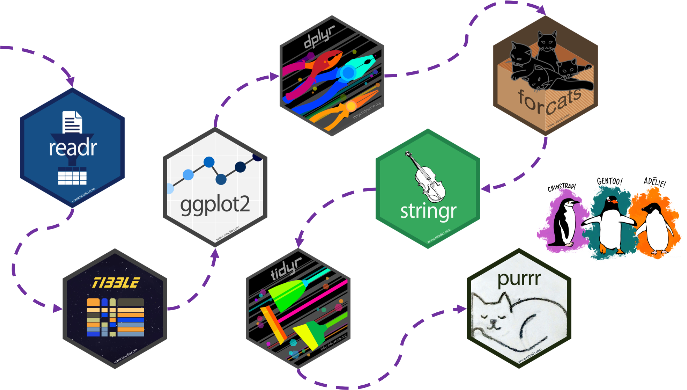
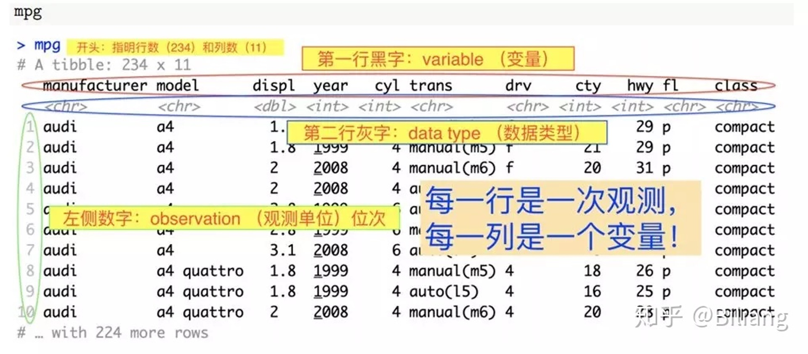
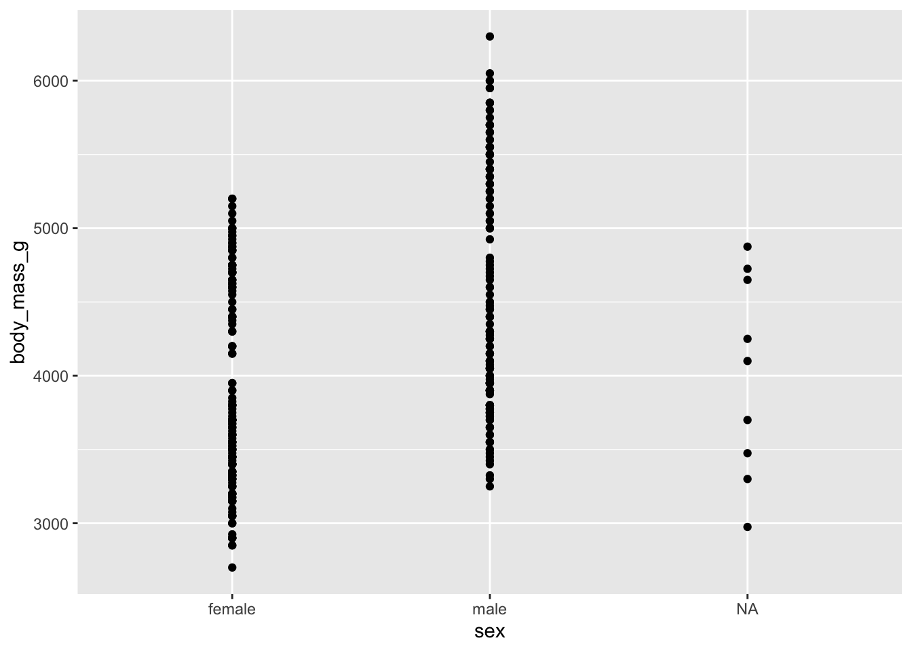
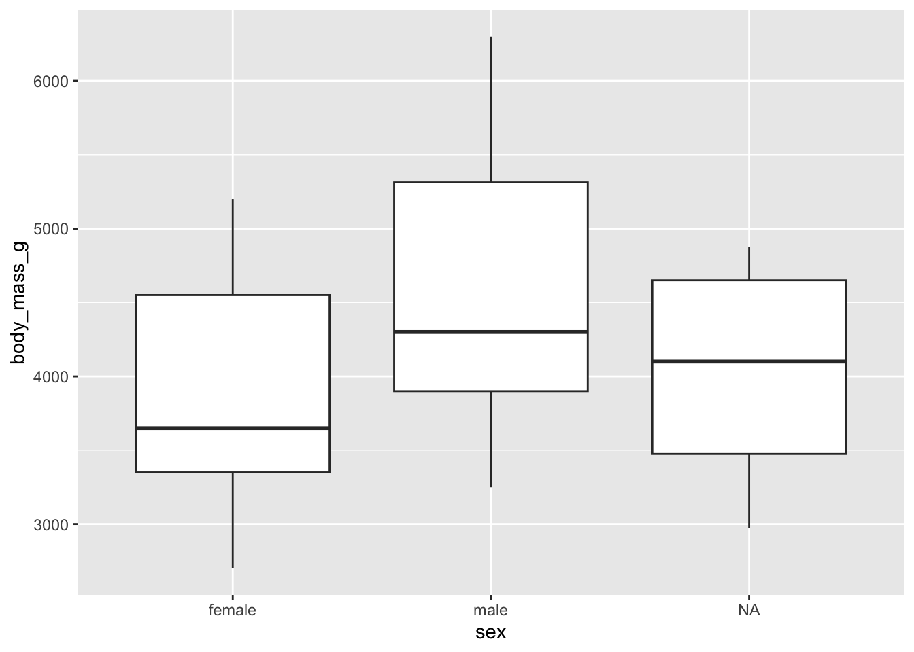
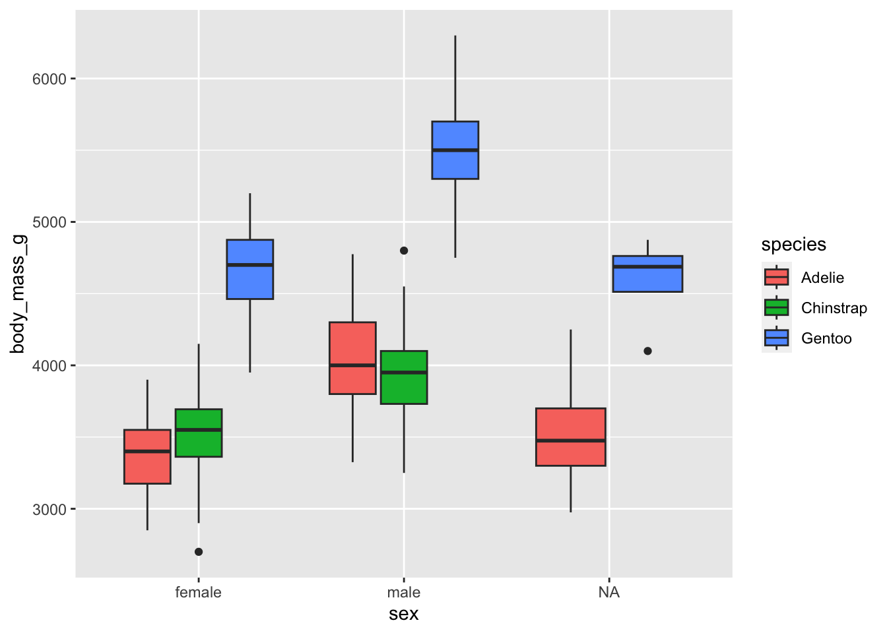

# 回望tidyverse之旅 {#tidyverse-workflow}


```r
library(tidyverse)
```

```
## ── Attaching core tidyverse packages ──────────────────────── tidyverse 2.0.0 ──
## ✔ dplyr     1.1.3     ✔ readr     2.1.4
## ✔ forcats   1.0.0     ✔ stringr   1.5.0
## ✔ ggplot2   3.4.3     ✔ tibble    3.2.1
## ✔ lubridate 1.9.2     ✔ tidyr     1.3.0
## ✔ purrr     1.0.2     
## ── Conflicts ────────────────────────────────────────── tidyverse_conflicts() ──
## ✖ dplyr::filter() masks stats::filter()
## ✖ dplyr::lag()    masks stats::lag()
## ℹ Use the conflicted package (<http://conflicted.r-lib.org/>) to force all conflicts to become errors
```


本章做个小结，通过案例**复习和串讲**下tidyverse中常用的核心部件（事实上，tidyverse套餐比我们列出的要丰富）。


<div class="figure">

<p class="caption">(\#fig:tidyverse-workflow-2)图片来源Silvia Canelón在R-Ladies Chicago的报告</p>
</div>


## readr 宏包


读入数据是第一步，我们可以用`readr`导入数据

<div class="danger">
<p>提示：</p>
<ul>
<li>逗号(<code>,</code>)分割的文件 <code>read_csv()</code></li>
<li>制表符(<code>tab</code>)分割的文件 <code>read_tsv()</code></li>
<li>任意的分割符 <code>read_delim()</code></li>
<li>固定宽度的文件 <code>read_fwf()</code></li>
<li>空格分割的文件 <code>read_table()</code></li>
<li>网页log文件 <code>read_log()</code></li>
</ul>
</div>


读取外部数据

```r
penguins <- read_csv("./demo_data/penguins.csv") 
```

```
## Rows: 344 Columns: 8
## ── Column specification ────────────────────────────────────────────────────────
## Delimiter: ","
## chr (3): species, island, sex
## dbl (5): bill_length_mm, bill_depth_mm, flipper_length_mm, body_mass_g, year
## 
## ℹ Use `spec()` to retrieve the full column specification for this data.
## ℹ Specify the column types or set `show_col_types = FALSE` to quiet this message.
```


保存到外部文件

```r
penguins %>% write_csv("newdata.csv")
```


## tibble 宏包

R中的对多变量数据的标准保存形式是 dataframe，而tibble是dataframe的进化版，它有如下优点： 1. 生成的数据框数据每列可以保持原来的数据格式，不会被强制性改变,即字符串，不会莫名其妙的变成因子格式； 2. 查看数据时，不再会一行显示不下，多行显示得非常丑； 3. **数据操作速度会更快**

如下图，直接查看tibble格式的数据，可以一目了然的看清数据的大小和每列的格式




有两种方式来创建tibble格式的数据 

- 1. 用`tibble`函数直接创建
- 2. 其他格式转化, 例如用read.csv读取的数据默认是dataframe格式，就可以使用as_tibble转换为tibble格式

下面你可以看到两者的区别：


```r
as_tibble(penguins)
```

```
## # A tibble: 344 × 8
##    species island    bill_length_mm bill_depth_mm flipper_length_mm body_mass_g
##    <chr>   <chr>              <dbl>         <dbl>             <dbl>       <dbl>
##  1 Adelie  Torgersen           39.1          18.7               181        3750
##  2 Adelie  Torgersen           39.5          17.4               186        3800
##  3 Adelie  Torgersen           40.3          18                 195        3250
##  4 Adelie  Torgersen           NA            NA                  NA          NA
##  5 Adelie  Torgersen           36.7          19.3               193        3450
##  6 Adelie  Torgersen           39.3          20.6               190        3650
##  7 Adelie  Torgersen           38.9          17.8               181        3625
##  8 Adelie  Torgersen           39.2          19.6               195        4675
##  9 Adelie  Torgersen           34.1          18.1               193        3475
## 10 Adelie  Torgersen           42            20.2               190        4250
## # ℹ 334 more rows
## # ℹ 2 more variables: sex <chr>, year <dbl>
```

```r
as.data.frame(penguins) %>% head()
```

```
##   species    island bill_length_mm bill_depth_mm flipper_length_mm body_mass_g
## 1  Adelie Torgersen           39.1          18.7               181        3750
## 2  Adelie Torgersen           39.5          17.4               186        3800
## 3  Adelie Torgersen           40.3          18.0               195        3250
## 4  Adelie Torgersen             NA            NA                NA          NA
## 5  Adelie Torgersen           36.7          19.3               193        3450
## 6  Adelie Torgersen           39.3          20.6               190        3650
##      sex year
## 1   male 2007
## 2 female 2007
## 3 female 2007
## 4   <NA> 2007
## 5 female 2007
## 6   male 2007
```

在R Markdown里两者区别不大，但在console中，区别很明显的。比如`tibble`不一样的地方有：

- 列出了变量的类型(这个很不错)
- 只列出10行
- 只列出有限的列数（与屏幕适应的）
- 高亮 `NAs`


## ggplot2 宏包


### 查看数据

我们先查看下数据

```r
glimpse(penguins)
```

```
## Rows: 344
## Columns: 8
## $ species           <chr> "Adelie", "Adelie", "Adelie", "Adelie", "Adelie", "A…
## $ island            <chr> "Torgersen", "Torgersen", "Torgersen", "Torgersen", …
## $ bill_length_mm    <dbl> 39.1, 39.5, 40.3, NA, 36.7, 39.3, 38.9, 39.2, 34.1, …
## $ bill_depth_mm     <dbl> 18.7, 17.4, 18.0, NA, 19.3, 20.6, 17.8, 19.6, 18.1, …
## $ flipper_length_mm <dbl> 181, 186, 195, NA, 193, 190, 181, 195, 193, 190, 186…
## $ body_mass_g       <dbl> 3750, 3800, 3250, NA, 3450, 3650, 3625, 4675, 3475, …
## $ sex               <chr> "male", "female", "female", NA, "female", "male", "f…
## $ year              <dbl> 2007, 2007, 2007, 2007, 2007, 2007, 2007, 2007, 2007…
```

### 散点图

体重在性别上有很大区别？

```r
ggplot(data = penguins, aes(x = sex, y = body_mass_g)) +
  geom_point()
```

```
## Warning: Removed 2 rows containing missing values (`geom_point()`).
```




### 箱线图


```r
ggplot(data = penguins, aes(x = sex, y = body_mass_g)) +
  geom_boxplot()
```

```
## Warning: Removed 2 rows containing non-finite values (`stat_boxplot()`).
```




```r
ggplot(data = penguins, aes(x = sex, y = body_mass_g)) +
  geom_boxplot(aes(fill = species))
```

```
## Warning: Removed 2 rows containing non-finite values (`stat_boxplot()`).
```




我们可能看到：

- Gentoo 类的企鹅 比 Adelie 和 Chinstrap 类的企鹅体重更重
- Gentoo 类型中，雄性企鹅比雌性企鹅体重更重
- Adelie 和 Chinstrap 两种类型的企鹅，区别不是很明显
- sex 这个变量有缺失值，主要集中在 Gentoo 和 Chinstrap 两种类型


那么每种类型的企鹅，数据中有多少是`NA`呢？ 上`dplyr`吧！


## dplyr 宏包


dplyr 宏包可以:

- 创建新变量 `mutate()`
- 分组统计 `summarize() + group_by()`
- 筛选 `filter()`
- 重命名变量 `rename()`
- 排序 `arrange()`
- 更多


### 选取列

下面两个有什么区别？


```r
select(penguins, species, sex, body_mass_g)
```

```
## # A tibble: 344 × 3
##    species sex    body_mass_g
##    <chr>   <chr>        <dbl>
##  1 Adelie  male          3750
##  2 Adelie  female        3800
##  3 Adelie  female        3250
##  4 Adelie  <NA>            NA
##  5 Adelie  female        3450
##  6 Adelie  male          3650
##  7 Adelie  female        3625
##  8 Adelie  male          4675
##  9 Adelie  <NA>          3475
## 10 Adelie  <NA>          4250
## # ℹ 334 more rows
```


```r
penguins %>%
  select(species, sex, body_mass_g)
```

```
## # A tibble: 344 × 3
##    species sex    body_mass_g
##    <chr>   <chr>        <dbl>
##  1 Adelie  male          3750
##  2 Adelie  female        3800
##  3 Adelie  female        3250
##  4 Adelie  <NA>            NA
##  5 Adelie  female        3450
##  6 Adelie  male          3650
##  7 Adelie  female        3625
##  8 Adelie  male          4675
##  9 Adelie  <NA>          3475
## 10 Adelie  <NA>          4250
## # ℹ 334 more rows
```


### 行方向排序


```r
glimpse(penguins)
```

```
## Rows: 344
## Columns: 8
## $ species           <chr> "Adelie", "Adelie", "Adelie", "Adelie", "Adelie", "A…
## $ island            <chr> "Torgersen", "Torgersen", "Torgersen", "Torgersen", …
## $ bill_length_mm    <dbl> 39.1, 39.5, 40.3, NA, 36.7, 39.3, 38.9, 39.2, 34.1, …
## $ bill_depth_mm     <dbl> 18.7, 17.4, 18.0, NA, 19.3, 20.6, 17.8, 19.6, 18.1, …
## $ flipper_length_mm <dbl> 181, 186, 195, NA, 193, 190, 181, 195, 193, 190, 186…
## $ body_mass_g       <dbl> 3750, 3800, 3250, NA, 3450, 3650, 3625, 4675, 3475, …
## $ sex               <chr> "male", "female", "female", NA, "female", "male", "f…
## $ year              <dbl> 2007, 2007, 2007, 2007, 2007, 2007, 2007, 2007, 2007…
```


```r
penguins %>%
  select(species, sex, body_mass_g) %>%
  arrange(desc(body_mass_g))
```

```
## # A tibble: 344 × 3
##    species sex   body_mass_g
##    <chr>   <chr>       <dbl>
##  1 Gentoo  male         6300
##  2 Gentoo  male         6050
##  3 Gentoo  male         6000
##  4 Gentoo  male         6000
##  5 Gentoo  male         5950
##  6 Gentoo  male         5950
##  7 Gentoo  male         5850
##  8 Gentoo  male         5850
##  9 Gentoo  male         5850
## 10 Gentoo  male         5800
## # ℹ 334 more rows
```


### 分组统计


```r
penguins %>% 
  group_by(species, sex) %>%
  summarize(count = n())
```

```
## `summarise()` has grouped output by 'species'. You can override using the
## `.groups` argument.
```

```
## # A tibble: 8 × 3
## # Groups:   species [3]
##   species   sex    count
##   <chr>     <chr>  <int>
## 1 Adelie    female    73
## 2 Adelie    male      73
## 3 Adelie    <NA>       6
## 4 Chinstrap female    34
## 5 Chinstrap male      34
## 6 Gentoo    female    58
## 7 Gentoo    male      61
## 8 Gentoo    <NA>       5
```


### 增加列


```r
penguins %>% 
  group_by(species) %>%
  mutate(count_species = n()) %>%
  ungroup() %>%
  group_by(species, sex, count_species) %>%
  summarize(count = n()) %>%
  mutate(prop = count/count_species*100)
```

```
## `summarise()` has grouped output by 'species', 'sex'. You can override using
## the `.groups` argument.
```

```
## # A tibble: 8 × 5
## # Groups:   species, sex [8]
##   species   sex    count_species count  prop
##   <chr>     <chr>          <int> <int> <dbl>
## 1 Adelie    female           152    73 48.0 
## 2 Adelie    male             152    73 48.0 
## 3 Adelie    <NA>             152     6  3.95
## 4 Chinstrap female            68    34 50   
## 5 Chinstrap male              68    34 50   
## 6 Gentoo    female           124    58 46.8 
## 7 Gentoo    male             124    61 49.2 
## 8 Gentoo    <NA>             124     5  4.03
```


### 筛选


```r
penguins %>% 
  group_by(species) %>%
  mutate(count_species = n()) %>%
  ungroup() %>%
  group_by(species, sex, count_species) %>%
  summarize(count = n()) %>%
  mutate(percentage = count/count_species*100) %>%
  filter(species == "Chinstrap")
```

```
## `summarise()` has grouped output by 'species', 'sex'. You can override using
## the `.groups` argument.
```

```
## # A tibble: 2 × 5
## # Groups:   species, sex [2]
##   species   sex    count_species count percentage
##   <chr>     <chr>          <int> <int>      <dbl>
## 1 Chinstrap female            68    34         50
## 2 Chinstrap male              68    34         50
```


## forcats 宏包


`forcats` 宏包主要用于分类变量和因子型变量，比如这里的 `species, island, sex`.


对于不是因子型的变量，比如这里 `year` 是数值型变量，我们也可以通过 `factor()` 函数 将它转换成因子型变量。


```r
penguins %>%
  mutate(year_factor = factor(year, levels = unique(year)))
```

```
## # A tibble: 344 × 9
##    species island    bill_length_mm bill_depth_mm flipper_length_mm body_mass_g
##    <chr>   <chr>              <dbl>         <dbl>             <dbl>       <dbl>
##  1 Adelie  Torgersen           39.1          18.7               181        3750
##  2 Adelie  Torgersen           39.5          17.4               186        3800
##  3 Adelie  Torgersen           40.3          18                 195        3250
##  4 Adelie  Torgersen           NA            NA                  NA          NA
##  5 Adelie  Torgersen           36.7          19.3               193        3450
##  6 Adelie  Torgersen           39.3          20.6               190        3650
##  7 Adelie  Torgersen           38.9          17.8               181        3625
##  8 Adelie  Torgersen           39.2          19.6               195        4675
##  9 Adelie  Torgersen           34.1          18.1               193        3475
## 10 Adelie  Torgersen           42            20.2               190        4250
## # ℹ 334 more rows
## # ℹ 3 more variables: sex <chr>, year <dbl>, year_factor <fct>
```


我们保存到新的数据集中，再看看有什么变化


```r
penguins_new <-
  penguins %>%
  mutate(year_factor = factor(year, levels = unique(year)))
penguins_new
```

```
## # A tibble: 344 × 9
##    species island    bill_length_mm bill_depth_mm flipper_length_mm body_mass_g
##    <chr>   <chr>              <dbl>         <dbl>             <dbl>       <dbl>
##  1 Adelie  Torgersen           39.1          18.7               181        3750
##  2 Adelie  Torgersen           39.5          17.4               186        3800
##  3 Adelie  Torgersen           40.3          18                 195        3250
##  4 Adelie  Torgersen           NA            NA                  NA          NA
##  5 Adelie  Torgersen           36.7          19.3               193        3450
##  6 Adelie  Torgersen           39.3          20.6               190        3650
##  7 Adelie  Torgersen           38.9          17.8               181        3625
##  8 Adelie  Torgersen           39.2          19.6               195        4675
##  9 Adelie  Torgersen           34.1          18.1               193        3475
## 10 Adelie  Torgersen           42            20.2               190        4250
## # ℹ 334 more rows
## # ℹ 3 more variables: sex <chr>, year <dbl>, year_factor <fct>
```


```r
class(penguins_new$year_factor)
```

```
## [1] "factor"
```

```r
levels(penguins_new$year_factor)
```

```
## [1] "2007" "2008" "2009"
```

大家回想下，弄成因子型变量有什么好处呢？


## stringr 宏包


`stringr`宏包包含了非常丰富的**处理字符串**的函数，比如

- 匹配
- 字符串子集
- 字符串长度
- 字符串合并
- 字符串分割
- 更多

### 字符串转换


```r
penguins %>%
  select(species, island) %>%
  mutate(ISLAND = str_to_upper(island))
```

```
## # A tibble: 344 × 3
##    species island    ISLAND   
##    <chr>   <chr>     <chr>    
##  1 Adelie  Torgersen TORGERSEN
##  2 Adelie  Torgersen TORGERSEN
##  3 Adelie  Torgersen TORGERSEN
##  4 Adelie  Torgersen TORGERSEN
##  5 Adelie  Torgersen TORGERSEN
##  6 Adelie  Torgersen TORGERSEN
##  7 Adelie  Torgersen TORGERSEN
##  8 Adelie  Torgersen TORGERSEN
##  9 Adelie  Torgersen TORGERSEN
## 10 Adelie  Torgersen TORGERSEN
## # ℹ 334 more rows
```

### 字符串合并


```r
penguins %>%
  select(species, island) %>%
  mutate(ISLAND = str_to_upper(island)) %>%
  mutate(species_island = str_c(species, ISLAND, sep = "_"))
```

```
## # A tibble: 344 × 4
##    species island    ISLAND    species_island  
##    <chr>   <chr>     <chr>     <chr>           
##  1 Adelie  Torgersen TORGERSEN Adelie_TORGERSEN
##  2 Adelie  Torgersen TORGERSEN Adelie_TORGERSEN
##  3 Adelie  Torgersen TORGERSEN Adelie_TORGERSEN
##  4 Adelie  Torgersen TORGERSEN Adelie_TORGERSEN
##  5 Adelie  Torgersen TORGERSEN Adelie_TORGERSEN
##  6 Adelie  Torgersen TORGERSEN Adelie_TORGERSEN
##  7 Adelie  Torgersen TORGERSEN Adelie_TORGERSEN
##  8 Adelie  Torgersen TORGERSEN Adelie_TORGERSEN
##  9 Adelie  Torgersen TORGERSEN Adelie_TORGERSEN
## 10 Adelie  Torgersen TORGERSEN Adelie_TORGERSEN
## # ℹ 334 more rows
```


## tidyr 宏包


想想什么叫tidy data？


### 长表格变宽表格


```r
untidy_penguins <-
  penguins %>%
    pivot_wider(names_from = sex,
                values_from = body_mass_g)
untidy_penguins
```

```
## # A tibble: 344 × 9
##    species island    bill_length_mm bill_depth_mm flipper_length_mm  year  male
##    <chr>   <chr>              <dbl>         <dbl>             <dbl> <dbl> <dbl>
##  1 Adelie  Torgersen           39.1          18.7               181  2007  3750
##  2 Adelie  Torgersen           39.5          17.4               186  2007    NA
##  3 Adelie  Torgersen           40.3          18                 195  2007    NA
##  4 Adelie  Torgersen           NA            NA                  NA  2007    NA
##  5 Adelie  Torgersen           36.7          19.3               193  2007    NA
##  6 Adelie  Torgersen           39.3          20.6               190  2007  3650
##  7 Adelie  Torgersen           38.9          17.8               181  2007    NA
##  8 Adelie  Torgersen           39.2          19.6               195  2007  4675
##  9 Adelie  Torgersen           34.1          18.1               193  2007    NA
## 10 Adelie  Torgersen           42            20.2               190  2007    NA
## # ℹ 334 more rows
## # ℹ 2 more variables: female <dbl>, `NA` <dbl>
```


### 宽表格变长表格


```r
untidy_penguins %>%
  pivot_longer(cols = male:`NA`, 
               names_to = "sex",
               values_to = "body_mass_g")
```

```
## # A tibble: 1,032 × 8
##    species island    bill_length_mm bill_depth_mm flipper_length_mm  year sex   
##    <chr>   <chr>              <dbl>         <dbl>             <dbl> <dbl> <chr> 
##  1 Adelie  Torgersen           39.1          18.7               181  2007 male  
##  2 Adelie  Torgersen           39.1          18.7               181  2007 female
##  3 Adelie  Torgersen           39.1          18.7               181  2007 NA    
##  4 Adelie  Torgersen           39.5          17.4               186  2007 male  
##  5 Adelie  Torgersen           39.5          17.4               186  2007 female
##  6 Adelie  Torgersen           39.5          17.4               186  2007 NA    
##  7 Adelie  Torgersen           40.3          18                 195  2007 male  
##  8 Adelie  Torgersen           40.3          18                 195  2007 female
##  9 Adelie  Torgersen           40.3          18                 195  2007 NA    
## 10 Adelie  Torgersen           NA            NA                  NA  2007 male  
## # ℹ 1,022 more rows
## # ℹ 1 more variable: body_mass_g <dbl>
```


## purrr 宏包


`purrr` 宏包提供了`map()`等一系列函数，取代 `for` 和 `while`循环方式，实现高效迭代，保持语法一致性，同时增强了代码的可读性。


```r
penguins %>% map(~sum(is.na(.)))
```

```
## $species
## [1] 0
## 
## $island
## [1] 0
## 
## $bill_length_mm
## [1] 2
## 
## $bill_depth_mm
## [1] 2
## 
## $flipper_length_mm
## [1] 2
## 
## $body_mass_g
## [1] 2
## 
## $sex
## [1] 11
## 
## $year
## [1] 0
```


```r
penguins %>%
  group_nest(species) %>%
  mutate(model = purrr::map(data, ~ lm(bill_depth_mm ~ bill_length_mm, data = .))) %>%
  mutate(result = purrr::map(model, ~ broom::tidy(.))) %>%
  tidyr::unnest(result)
```

```
## # A tibble: 6 × 8
##   species                 data model term  estimate std.error statistic  p.value
##   <chr>     <list<tibble[,7]>> <lis> <chr>    <dbl>     <dbl>     <dbl>    <dbl>
## 1 Adelie             [152 × 7] <lm>  (Int…   11.4      1.34        8.52 1.61e-14
## 2 Adelie             [152 × 7] <lm>  bill…    0.179    0.0344      5.19 6.67e- 7
## 3 Chinstrap           [68 × 7] <lm>  (Int…    7.57     1.55        4.88 6.99e- 6
## 4 Chinstrap           [68 × 7] <lm>  bill…    0.222    0.0317      7.01 1.53e- 9
## 5 Gentoo             [124 × 7] <lm>  (Int…    5.25     1.05        4.98 2.15e- 6
## 6 Gentoo             [124 × 7] <lm>  bill…    0.205    0.0222      9.24 1.02e-15
```


