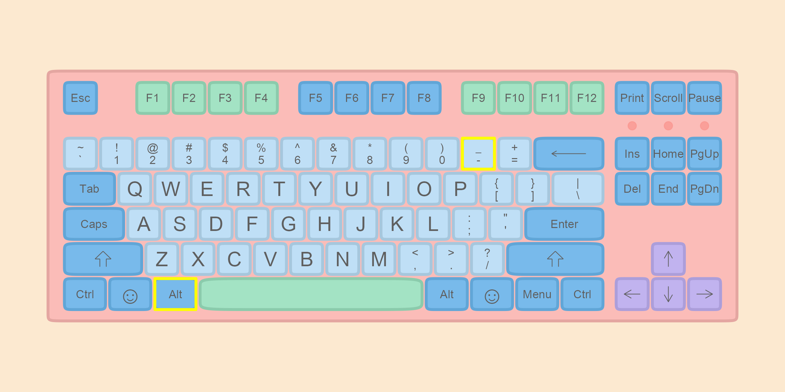

# 对象 {#baseR-objects}

## 对象的创建与使用

创建一个R对象，首先确定一个名称，然后使用赋值操作符 `<-`，将数据赋值给它。

```{r, out.width = "65%", echo=FALSE}
knitr::include_graphics("images/rsyntax1.png")
```

我们给这个盒子取名 `x`，然后把5这个数放入**盒子**，用计算机语言描述就是，给变量 x 赋值为 5，在命令行中可以这样写 `x <- 5` ，然后回车.

```{r}
x <- 5
```

::: {.rmdnote}

快速产生赋值符号`<-`，在Rstudio中同时按下

- `alt` 和 `-`（windows系统）
- `option` 和 `-`（苹果系统）


```{r, echo=FALSE, include=FALSE, eval=FALSE}
library(magrittr)
library(ggkeyboard)

ggkeyboard(tkl) %>%
  highlight_keys(c("Alt Left", "_-"))
```

```{r, out.width = "100%", echo=FALSE}

```

:::

当键入 `x` 然后回车，就打印出 `x` 的值。当然也可以使用命令`print(x)`，结果一样。
```{r}
x
```

## 变量命名规则

R变量名必须以字母、数字、下划线`_`和句点`.`组成。但是，变量名的第一个字符不能为数字或者特殊符号，比如 `+`, `-`, `*`, `/`, `^`, `!`, `@`,  `&`, 或者下划线`_`。变量名的第一个字符如果是句点`.`，那么句点后面不能紧跟数字。变量名是区分大小写的，`y`和`Y`是两个不同的变量名。在中文环境下，汉字也可以作为变量名的合法字符使用，但不推荐使用。

- 大小写敏感
- 不能有空格，可以用下划线代替空格，比如，`my_age <- 30`
- 开头不能是数字和一些特殊符号

为了让代码可读性更强，我们希望变量名能更清晰描述所赋值的对象，比如我们测量了男生的身高，并把测量结果存储为对象，那么这里有三种方案：

- 一般的变量名
```{r, eval=FALSE}
x <- 175
```

- 不错变量名
```{r, eval=FALSE}
height <- 175
```

- 更佳的变量名
```{r, eval=FALSE}
boy_height_cm <- 175
```

很显然，第三种方案是最佳的，它清晰告诉我们男生的身高是175，测量单位是cm

## 对象属性

所有R对象都有其属性，其中最重要的两个属性是**类型**和**长度**，我们可以用以下两个命令查看对象的类型和长度。


```{r}
typeof(x) 
length(x)
```
