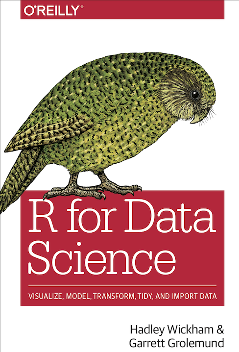

--- 
title: "R编程与作图"
author: "Suoqin Jin"
date: "`r Sys.Date()`"
site: bookdown::bookdown_site
knit: bookdown::render_book
output: bookdown::bs4_book
documentclass: book
bibliography: [references.bib]
biblio-style: apalike
link-citations: yes
#cover-image: images/cover.jpg
description: "This book is an overview of how practitioners can acquire, wrangle, visualize, and model data with the R."
---

```{r setup, include=FALSE}
options(digits = 4, 
        dplyr.print_min = 6, 
        dplyr.print_max = 6,
        htmltools.dir.version = FALSE, 
        formatR.indent = 2, 
        width = 55
        )

knitr::opts_chunk$set(
                      echo = TRUE, 
                      warning = FALSE, 
                      message = FALSE,
                      fig.width = 6, 
                      fig.height = 4,
                      fig.showtext = TRUE
                      )
```

# 前言 {.unnumbered}
本课程主要根据[《数据科学中的R语言》的课程内容](https://bookdown.org/wangminjie/R4DS/), 略作修改，重点介绍基本的R编程与作图内容。推荐大家阅读原课程内容以及Hadley Wickham的
[r4ds](https://r4ds.had.co.nz/)这本书 [@Wickham2017], [r4ds这本书的第二版](https://r4ds.hadley.nz/)已于2023年6月发行。

```{r index-2, echo = FALSE, out.width = "35%"}

```

## 关于课程 {-}

- R编程基础
   - 第 \@ref(baseR-intro-ds) 章介绍R语言及资料推荐
   - 第 \@ref(baseR-install) 章介绍安装与环境配置 
   - 第 \@ref(baseR-objects) 章介绍R语言中一切都是对象
   - 第 \@ref(baseR-vectors) 章介绍向量
   - 第 \@ref(baseR-data-structure) 章介绍R语言数据结构
   - 第 \@ref(baseR-operators) 章介绍运算符及向量运算
   - 第 \@ref(baseR-functions) 章介绍R语言中的函数
   - 第 \@ref(baseR-functions-adv) 章介绍函数的应用
   - 第 \@ref(baseR-subsetting) 章介绍R语言中的子集选取
   
- 数据读入与处理
   - 第 \@ref(tidyverse-readr) 章介绍数据读入
   - 第 \@ref(tidyverse-dplyr) 章介绍数据处理
   - 第 \@ref(tidyverse-dplyr-apply) 章介绍dplyr的应用
   - 第 \@ref(tidyverse-tidyr) 章介绍数据规整1
   - 第 \@ref(tidyverse-tidyr2) 章介绍数据规整2
   - 第 \@ref(tidyverse-stringr) 章介绍字符串处理
   - 第 \@ref(tidyverse-tibble) 章介绍简单数据框
   - 第 \@ref(tidyverse-workflow) 章回望Tidyverse之旅

- 画图
   - 第 \@ref(tidyverse-ggplot2-aes) 章介绍数据可视化
   - 第 \@ref(tidyverse-ggplot2-geom) 章ggplot2几何形状
   - 第 \@ref(tidyverse-ggplot2-scales) 章ggplot2的标度
   - 第 \@ref(tidyverse-ggplot2-theme) 章ggplot2的主题
   - 第 \@ref(tidyverse-ggplot2-guides) 章ggplot2的图例
   - 第 \@ref(tidyverse-ggplot2-customize) 章ggplot2扩展内容
   - 第 \@ref(tidyverse-ggplot2-stat-layer) 章ggplot2统计图层
   - 第 \@ref(tidyverse-ggplot2-from-layer-to-geom) 章ggplot2从图层到几何形状
   - 第 \@ref(tidyverse-ggplot2-colors) 章ggplot2数据可视化中的配色
   - 第 \@ref(tidyverse-ggplot2-override-aes) 章ggplot2如何控制图例的外观
   - 第 \@ref(tidyverse-ggplot2-aes-eval) 章ggplot2中的延迟映射 
   - 第 \@ref(tidyverse-ggplot2-academic) 章介绍科研数据可视化中的统计分布图
   - 第 \@ref(tidyverse-ggplot2-gganimate) 章让你的数据骚动起来
   - 第 \@ref(tidyverse-ggplot2-pass-function-as-parameters) 章ggplot2中传递函数作为参数值
   
- 可重复性文档Rmarkdown以及练习
   - 第 \@ref(tidyverse-rmarkdown) 章介绍可重复性文档  
   - 第 \@ref(eda-practice) 章一日一练
   
- GO/KEGG富集分析
   - 第 \@ref(GO-KEGG) 章介绍GO/KEGG功能富集分析  

