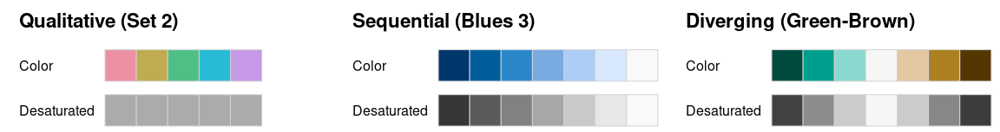

# ggplot2之数据可视化中的配色 {#tidyverse-ggplot2-colors}


```{r ggplot2-colors-1, message = FALSE, warning = FALSE}
library(tidyverse)
library(palmerpenguins)
```
## 可视化颜色
```{r }
library(scales)
show_col(viridis_pal()(10))
```

## 修改ggplot2中的颜色
ggplot2中默认的颜色就不错。但有时候为了让图更好看，需要在画图中使用配色。
### Change colors manually
A custom color palettes can be specified using the functions :
- scale_fill_manual() for box plot, bar plot, violin plot, etc
- scale_color_manual() for lines and points

### Use gray colors
scale_fill_grey() or scale_color_grey()

### Continuous colors
The graph can be colored according to the values of a continuous variable using the functions :

- scale_color_gradient(), scale_fill_gradient() for sequential gradients between two colors
- scale_color_gradient2(), scale_fill_gradient2() for diverging gradients
- scale_color_gradientn(), scale_fill_gradientn() for gradient between n colors


## ColorBrewer配色包
我个人比较喜欢[ColorBrewer](https://colorbrewer2.org/)中的配色！请参考[ggplot2 colors : How to change colors automatically and manually](http://www.sthda.com/english/wiki/ggplot2-colors-how-to-change-colors-automatically-and-manually). 以下是几个常用的函数：

### Use RColorBrewer palettes
scale_fill_brewer(palette="Dark2") or scale_color_brewer(palette="Dark2")

## 配色建议


这里有个小小的提示：

- 尽可能避免使用`"red"`, `"green"`, `"blue"`, `"cyan"`, `"magenta"`, `"yellow"`颜色
- 使用相对柔和的颜色`"firebrick"`, `"springgreen4"`, `"blue3"`, `"turquoise3"`, `"darkorchid2"`, `"gold2"`，会让人觉得舒服

可以对比下
```{r ggplot2-colors-18}
colorspace::swatchplot(c("red", "green", "blue", "cyan", "magenta", "yellow"))
colorspace::swatchplot(c("firebrick", "springgreen4", "blue3", "turquoise3", "darkorchid2", "gold2"))
```


## color-wheel

- [Adobe Color](https://color.adobe.com/zh/create/color-wheel)

- [scheme Color](https://schemecolor.com)


## colorspace配色包
下面是另外一个包[colorspace](http://colorspace.r-forge.r-project.org/articles/color_spaces.html)中的配色讲解！

```{r ggplot2-colors-2}
library(colorspace)    
```


`colorspace` 宏包提供了三种类型的配色模板:

```{r ggplot2-colors-3, out.width = '100%', echo = FALSE}

```

- Qualitative: 分类，用于呈现分类信息，比如不同种类用不同的颜色，颜色之间一般对比鲜明。
- Sequential: 序列，用于呈现有序/连续的数值信息，比如为了展示某地区黑人比例，比例越高颜色越深，比例越低颜色越浅。
- Diverging: 分歧，用于呈现有序/连续的数值信息，这些数值围绕着一个中心值，比中心值越大的方向用一种渐变色，比中心值越小用另一种渐变色。

三种类型对应着三个函数 `qualitative_hcl()`, `sequential_hcl()`, 和 `diverging_hcl()`. 


### 配色模板

根据你需要颜色的三大种类，先找适合的模板palettes

```{r ggplot2-colors-4, out.width = '100%'}
hcl_palettes(plot = TRUE)
```

或者指定某个种类，显示所有的模板
```{r, eval=FALSE}
hcl_palettes("qualitative", plot = TRUE)
hcl_palettes("sequential (single-hue)", n = 7, plot = TRUE)
hcl_palettes("sequential (multi-hue)", n = 7, plot = TRUE)
hcl_palettes("diverging", n = 7, plot = TRUE)
```

如果看中某个模板的颜色，可以获取它的值，比如sequential种类下的 "Peach"模板，

```{r ggplot2-colors-41}
#colorspace::diverging_hcl(n = 7, "Dark 2")
#colorspace::qualitative_hcl(4, palette = "myset")
colorspace::sequential_hcl(n = 7, palette = "Peach")
```
当然，在用之前，我们先检验下

```{r ggplot2-colors-42}
colorspace::sequential_hcl(n = 7, palette = "Peach") %>% 
  colorspace::swatchplot()
```

### 在ggplot2中使用

在ggplot2中可以免去手工操作，而直接使用。事实上，
**colorspace** 模板使用起来很方便，有统一格式`scale_<aesthetic>_<datatype>_<colorscale>()`, 

- 这里 `<aesthetic>` 是指定映射 (`fill`, `color`, `colour`),
- 这里 `<datatype>` 是表明数据变量的类型 (`discrete`, `continuous`, `binned`), 
- 这里 `colorscale` 是声明颜色标度类型 (`qualitative`, `sequential`, `diverging`, `divergingx`).


|Scale function                       | Aesthetic | Data type  | Palette type |
|:-----------                         | :--------  | :--------- | :------------|
|`scale_color_discrete_qualitative()` | `color`    | discrete   | qualitative |
|`scale_fill_continuous_sequential()` | `fill`     | continuous | sequential |
|`scale_colour_continous_divergingx()` | `colour`   | continuous | diverging |


### 使用案例1

ggplot2默认
```{r ggplot2-colors-5}
penguins %>% 
   ggplot(aes(bill_length_mm, fill = species)) +
   geom_density(alpha = 0.6)
```

手动修改
```{r ggplot2-colors-6}
penguins %>% 
   ggplot(aes(bill_length_mm, fill = species)) +
   geom_density(alpha = 0.6) +
   scale_fill_manual(
     breaks = c("Adelie", "Chinstrap", "Gentoo"), 
     values = c("darkorange", "purple", "cyan4")
  )
```


使用colorspace模板配色
```{r ggplot2-colors-7}
penguins %>% 
   ggplot(aes(bill_length_mm, fill = species)) +
   geom_density(alpha = 0.6) +
   scale_fill_discrete_qualitative(palette = "cold")
```


```{r ggplot2-colors-71}
penguins %>% 
   ggplot(aes(bill_length_mm, fill = species)) +
   geom_density(alpha = 0.6) +
   scale_fill_discrete_qualitative(palette = "cold", nmax = 4, order = 2:4)
```
```{r ggplot2-colors-72}
sequential_hcl(palette = "Purples 3", n = 6) %>% 
  swatchplot()

penguins %>% 
   ggplot(aes(bill_length_mm, fill = species)) +
   geom_density(alpha = 0.6) +
   scale_fill_discrete_sequential(palette = "Purples 3", 
                                  nmax = 6, 
                                  rev = FALSE, 
                                  order = 3:5)

```


### 使用案例2

```{r ggplot2-colors-8}
temps_months <- read_csv("./demo_data/tempnormals.csv") %>%
  group_by(location, month_name) %>%
  summarize(mean = mean(temperature)) %>%
  mutate(
    month = factor(
      month_name,
      levels = c("Jan", "Feb", "Mar", "Apr", "May", "Jun", "Jul", "Aug", "Sep", "Oct", "Nov", "Dec")
    ),
    location = factor(
      location, levels = c("Death Valley", "Houston", "San Diego", "Chicago")
    )
  ) %>%
  select(-month_name)

temps_months
```


```{r ggplot2-colors-9}
temps_months %>% 
  ggplot(aes(x = month, y = location, fill = mean)) +
  geom_tile(width = 0.95, height = 0.95) +
  coord_fixed(expand = FALSE) +
  theme_classic()
```


```{r ggplot2-colors-10}
temps_months %>% 
  ggplot(aes(x = month, y = location, fill = mean)) +
  geom_tile(width = 0.95, height = 0.95) +
  coord_fixed(expand = FALSE) +
  theme_classic() +
  scale_fill_gradient()
```


```{r ggplot2-colors-11}
temps_months %>% 
  ggplot(aes(x = month, y = location, fill = mean)) +
  geom_tile(width = 0.95, height = 0.95) +
  coord_fixed(expand = FALSE) +
  theme_classic() +
  scale_fill_viridis_c()
```


```{r ggplot2-colors-12}
temps_months %>% 
  ggplot(aes(x = month, y = location, fill = mean)) +
  geom_tile(width = 0.95, height = 0.95) +
  coord_fixed(expand = FALSE) +
  theme_classic() +
  scale_fill_viridis_c(option = "B", begin = 0.15)
```


```{r ggplot2-colors-13}
temps_months %>% 
  ggplot(aes(x = month, y = location, fill = mean)) +
  geom_tile(width = 0.95, height = 0.95) +
  coord_fixed(expand = FALSE) +
  theme_classic() +
  scale_fill_continuous_sequential(palette = "YlGnBu", rev = FALSE)
```


```{r ggplot2-colors-14}
temps_months %>% 
  ggplot(aes(x = month, y = location, fill = mean)) +
  geom_tile(width = 0.95, height = 0.95) +
  coord_fixed(expand = FALSE) +
  theme_classic() +
  scale_fill_continuous_sequential(palette = "Viridis", rev = FALSE)
```


```{r ggplot2-colors-15}
temps_months %>% 
  ggplot( aes(x = month, y = location, fill = mean)) +
  geom_tile(width = 0.95, height = 0.95) +
  coord_fixed(expand = FALSE) +
  theme_classic() +
  scale_fill_continuous_sequential(palette = "Inferno", begin = 0.15, rev = FALSE)
```


```{r ggplot2-colors-16}
temps_months %>% 
  ggplot(aes(x = month, y = location, fill = mean)) +
  geom_tile(width = 0.95, height = 0.95) +
  coord_fixed(expand = FALSE) +
  theme_classic() +
  scale_fill_continuous_sequential(palette = "Plasma", begin = 0.35, rev = FALSE)
```

